# BUSINESS POSTURE

Rook is a cloud-native storage orchestrator for Kubernetes, providing platform teams and application developers with a way to easily consume and manage storage within their Kubernetes environments. The primary business priority Rook addresses is simplifying and automating storage operations in Kubernetes, reducing operational overhead and enabling faster application deployments. By abstracting the complexities of underlying storage systems, Rook allows organizations to focus on application development rather than storage infrastructure management.

Key business goals for adopting Rook include:
- Streamlining storage provisioning and management for Kubernetes workloads.
- Improving storage utilization and efficiency within Kubernetes clusters.
- Reducing operational costs associated with storage management.
- Enabling self-service storage consumption for application teams.
- Providing a consistent storage experience across different Kubernetes environments.

Most important business risks that need to be addressed:
- Data loss due to misconfiguration, software bugs, or infrastructure failures.
- Unauthorized access to sensitive data stored and managed by Rook.
- Performance degradation of applications due to storage bottlenecks or misconfigurations.
- Operational disruption due to Rook component failures or upgrade issues.
- Vendor lock-in if Rook becomes tightly coupled with specific storage providers or Kubernetes distributions.

# SECURITY POSTURE

Existing security controls:
- security control: Kubernetes Role-Based Access Control (RBAC) is used to control access to Rook resources and operations within the Kubernetes cluster. Implemented and described in Kubernetes documentation.
- security control: Network policies in Kubernetes can be used to isolate Rook components and storage traffic within the cluster network. Implemented and described in Kubernetes documentation.
- security control: Encryption in transit using TLS for communication between Rook components and between Rook and storage backends. Potentially implemented and configurable within Rook.
- security control: Encryption at rest provided by underlying storage providers (e.g., Ceph encryption, cloud provider encryption). Dependent on the chosen storage backend and its configuration.
- security control: Container image scanning for vulnerabilities during the Rook build process. Likely implemented in Rook's CI/CD pipeline.

Accepted risks:
- accepted risk: Reliance on Kubernetes security primitives for cluster-level security.
- accepted risk: Security posture of underlying storage providers is assumed to be adequate.
- accepted risk: Potential vulnerabilities in third-party storage backend software (e.g., Ceph, NFS).

Recommended security controls:
- security control: Implement regular security audits and penetration testing of Rook deployments.
- security control: Integrate with centralized logging and monitoring systems for security event detection and incident response.
- security control: Implement image signing and verification for Rook container images to enhance supply chain security.
- security control: Enforce least privilege principles for Rook service accounts and RBAC roles.
- security control: Regularly update Rook and underlying storage backend components to patch security vulnerabilities.

Security requirements:
- Authentication:
    - Requirement: Rook components should authenticate to the Kubernetes API server using secure service accounts and RBAC.
    - Requirement: Access to Rook APIs and management interfaces should be authenticated and authorized.
- Authorization:
    - Requirement: Kubernetes RBAC should be used to authorize access to Rook resources and operations based on user roles and responsibilities.
    - Requirement: Rook should enforce fine-grained authorization policies to control access to storage resources and management functions.
- Input Validation:
    - Requirement: All inputs to Rook APIs and command-line tools should be validated to prevent injection attacks and other input-related vulnerabilities.
    - Requirement: Configuration parameters for storage backends and Rook components should be validated to ensure they are within acceptable ranges and formats.
- Cryptography:
    - Requirement: Sensitive data at rest should be encrypted using industry-standard encryption algorithms.
    - Requirement: Communication between Rook components and storage backends should be encrypted in transit using TLS.
    - Requirement: Secrets management should be implemented to securely store and manage cryptographic keys and other sensitive credentials.

# DESIGN

## C4 CONTEXT

```mermaid
flowchart LR
    subgraph Kubernetes Cluster
        direction TB
        Rook["Rook"]
    end
    Applications["Applications"]
    PlatformTeams["Platform Teams"]
    StorageBackend["Storage Backend"]

    PlatformTeams -->|Manages| Rook
    Applications -->|Uses Storage| Rook
    Rook -->|Orchestrates| StorageBackend
    Rook -->|Relies on| Kubernetes Cluster
    Applications -->|Runs on| Kubernetes Cluster
    PlatformTeams -->|Manages| Kubernetes Cluster
    StorageBackend -->|Provides Storage| Kubernetes Cluster
    StorageBackend -->|Provides Storage| Rook

    classDef context stroke:#333,stroke-width:2px;
    class Kubernetes Cluster,Rook,Applications,PlatformTeams,StorageBackend context
```

Context Diagram Elements:

- Name: Rook
    - Type: Software System
    - Description: Rook is a cloud-native storage orchestrator for Kubernetes. It turns distributed storage systems into self-managing, self-scaling, and self-healing storage services.
    - Responsibilities: Orchestrates storage provisioning, management, and monitoring within Kubernetes. Provides storage services to applications running in Kubernetes.
    - Security controls: Kubernetes RBAC, Network Policies, Encryption in transit, Encryption at rest (via storage backend), Image scanning.

- Name: Applications
    - Type: Software System
    - Description: Applications running within the Kubernetes cluster that require persistent storage.
    - Responsibilities: Consume storage provisioned and managed by Rook. Store and retrieve data.
    - Security controls: Application-level authentication and authorization, Data encryption at application level (if required), Input validation.

- Name: Platform Teams
    - Type: Person
    - Description: Teams responsible for managing the Kubernetes platform and storage infrastructure.
    - Responsibilities: Deploy, configure, and manage Rook. Monitor Rook and storage backend health. Manage Kubernetes cluster.
    - Security controls: Access control to Kubernetes cluster and Rook management interfaces, Multi-factor authentication for administrative access, Security training.

- Name: Storage Backend
    - Type: Software System / Infrastructure
    - Description: Underlying storage infrastructure that Rook orchestrates. Examples include Ceph, NFS, and cloud provider storage services.
    - Responsibilities: Provide raw storage capacity and performance. Implement data persistence and replication.
    - Security controls: Storage backend specific security controls (e.g., Ceph authentication, NFS exports, cloud provider IAM), Encryption at rest, Access control lists.

- Name: Kubernetes Cluster
    - Type: Infrastructure
    - Description: The Kubernetes cluster where Rook is deployed and operates. Provides the runtime environment and orchestration platform for Rook and applications.
    - Responsibilities: Provide container orchestration, networking, and compute resources. Enforce security policies and access controls.
    - Security controls: Kubernetes RBAC, Network Policies, Pod Security Policies/Admission Controllers, Audit logging, Container runtime security.

## C4 CONTAINER

```mermaid
flowchart LR
    subgraph Kubernetes Cluster
        direction TB
        subgraph Rook Operators Container
            RookOperator["Rook Operator"]
        end
        subgraph Rook Agents Container
            RookAgent["Rook Agent"]
        end
        subgraph Storage Cluster Container
            StorageCluster["Storage Cluster (e.g., Ceph)"]
        end
    end
    KubernetesAPI["Kubernetes API Server"]
    Applications["Applications"]

    RookOperator -->|Watches, Manages| KubernetesAPI
    RookAgent -->|Interacts with| KubernetesAPI
    RookOperator -->|Deploys, Configures| StorageCluster
    RookAgent -->|Provides Storage Access| StorageCluster
    Applications -->|Uses Storage| RookAgent

    style KubernetesAPI fill:#f9f,stroke:#333,stroke-width:2px
    style Applications fill:#f9f,stroke:#333,stroke-width:2px
    classDef container stroke:#333,stroke-width:2px;
    class Rook Operators Container,Rook Agents Container,Storage Cluster Container container
```

Container Diagram Elements:

- Name: Rook Operator
    - Type: Container
    - Description: Kubernetes Operator responsible for managing the lifecycle of storage clusters and Rook components. Watches Kubernetes API for custom resource definitions (CRDs) and reconciles the desired state.
    - Responsibilities: Deploying and configuring storage clusters (e.g., Ceph). Managing Rook Agents. Handling storage provisioning requests. Monitoring storage cluster health.
    - Security controls: Kubernetes RBAC for API access, Service account with limited permissions, Image scanning, Input validation for CRD configurations.

- Name: Rook Agent
    - Type: Container
    - Description: Agents running on Kubernetes nodes that provide storage access to applications and interact with the storage cluster.  May include components for block, file, and object storage access.
    - Responsibilities: Exposing storage interfaces to applications (e.g., block devices, file systems, object storage APIs). Communicating with the storage cluster backend. Performing storage operations on behalf of applications.
    - Security controls: Kubernetes RBAC for API access, Service account with limited permissions, Network policies to restrict access, Input validation for storage requests, Encryption in transit to storage cluster.

- Name: Storage Cluster (e.g., Ceph)
    - Type: Container / Set of Containers
    - Description: The underlying distributed storage system managed by Rook. Examples include Ceph, NFS, or other storage backends. Consists of multiple containers or pods working together to provide storage services.
    - Responsibilities: Storing data persistently. Replicating data for redundancy and availability. Providing storage performance and capacity. Implementing storage backend specific features.
    - Security controls: Storage backend specific security controls (e.g., Ceph authentication and authorization), Encryption at rest, Network policies to isolate storage traffic, Access control lists, Hardening of storage backend containers.

- Name: Kubernetes API Server
    - Type: Infrastructure Component
    - Description: The central component of the Kubernetes control plane that exposes the Kubernetes API. Rook Operators and Agents interact with the API server to manage Kubernetes resources and observe cluster state.
    - Responsibilities: Providing API access for managing Kubernetes resources. Authenticating and authorizing API requests. Storing cluster state.
    - Security controls: Kubernetes RBAC, API authentication and authorization, Audit logging, TLS encryption for API communication.

- Name: Applications
    - Type: Container
    - Description: Applications running in Kubernetes that consume storage provided by Rook.
    - Responsibilities: Using storage volumes and services provided by Rook. Accessing and storing data.
    - Security controls: Application-level security controls, Input validation, Data encryption at application level (if required), Least privilege principles.

## DEPLOYMENT

Deployment Architecture: Kubernetes Deployment

Rook is deployed within a Kubernetes cluster. The deployment typically involves deploying Rook Operators and Agents as Kubernetes Deployments and DaemonSets. The storage cluster (e.g., Ceph) is also deployed as a set of Kubernetes resources, often using StatefulSets for stateful components.

```mermaid
flowchart LR
    subgraph Kubernetes Cluster Node 1
        direction TB
        RookAgentNode1["Rook Agent"]
        PodApp1["Application Pod 1"]
    end
    subgraph Kubernetes Cluster Node 2
        direction TB
        RookAgentNode2["Rook Agent"]
        StorageDaemonNode2["Storage Daemon (e.g., Ceph OSD)"]
    end
    subgraph Kubernetes Cluster Node 3
        direction TB
        RookAgentNode3["Rook Agent"]
        StorageDaemonNode3["Storage Daemon (e.g., Ceph OSD)"]
        RookOperatorPod["Rook Operator Pod"]
    end
    KubernetesControlPlane["Kubernetes Control Plane"]
    StorageNetwork["Storage Network"]

    RookAgentNode1 -->|Provides Storage| PodApp1
    RookAgentNode2 -->|Provides Storage| PodApp1
    RookAgentNode3 -->|Provides Storage| PodApp1

    RookOperatorPod -->|Manages| RookAgentNode1
    RookOperatorPod -->|Manages| RookAgentNode2
    RookOperatorPod -->|Manages| RookAgentNode3
    RookOperatorPod -->|Manages| StorageDaemonNode2
    RookOperatorPod -->|Manages| StorageDaemonNode3

    RookAgentNode2 -->|Storage Traffic| StorageDaemonNode2
    RookAgentNode3 -->|Storage Traffic| StorageDaemonNode3
    StorageDaemonNode2 -- StorageNetwork --> StorageDaemonNode3

    RookOperatorPod -->|Interacts with| KubernetesControlPlane
    RookAgentNode1 -->|Interacts with| KubernetesControlPlane
    RookAgentNode2 -->|Interacts with| KubernetesControlPlane
    RookAgentNode3 -->|Interacts with| KubernetesControlPlane
    StorageDaemonNode2 -->|Interacts with| KubernetesControlPlane
    StorageDaemonNode3 -->|Interacts with| KubernetesControlPlane

    style KubernetesControlPlane fill:#f9f,stroke:#333,stroke-width:2px
    classDef deployment stroke:#333,stroke-width:2px;
    class Kubernetes Cluster Node 1,Kubernetes Cluster Node 2,Kubernetes Cluster Node 3 deployment
```

Deployment Diagram Elements:

- Name: Rook Operator Pod
    - Type: Pod
    - Description: Kubernetes Pod running the Rook Operator container. Typically deployed as a Deployment with a single replica.
    - Responsibilities: Managing Rook Agents and Storage Daemons. Orchestrating storage cluster deployment and configuration. Monitoring Rook components.
    - Security controls: Kubernetes RBAC for API access, Service account with limited permissions, Image scanning, Resource limits, Pod Security Policies/Admission Controllers.

- Name: Rook Agent (Node 1, Node 2, Node 3)
    - Type: DaemonSet Pod
    - Description: Kubernetes Pods running Rook Agents. Deployed as a DaemonSet to run on each Kubernetes node.
    - Responsibilities: Providing storage access to applications running on the same node. Interacting with storage daemons.
    - Security controls: Kubernetes RBAC for API access, Service account with limited permissions, Image scanning, Resource limits, Network policies, Pod Security Policies/Admission Controllers.

- Name: Storage Daemon (Node 2, Node 3) (e.g., Ceph OSD)
    - Type: StatefulSet Pod
    - Description: Kubernetes Pods running storage daemons (e.g., Ceph OSDs for Ceph storage). Deployed as StatefulSets to maintain persistent identity and storage.
    - Responsibilities: Storing data persistently. Participating in data replication and distribution. Providing storage performance and capacity.
    - Security controls: Storage backend specific security controls (e.g., Ceph authentication), Encryption at rest, Network policies to isolate storage traffic, Resource limits, Pod Security Policies/Admission Controllers, Secure storage configuration.

- Name: Application Pod 1
    - Type: Pod
    - Description: Example application pod consuming storage provided by Rook.
    - Responsibilities: Running application workload. Accessing and using storage volumes.
    - Security controls: Application-level security controls, Pod Security Policies/Admission Controllers, Resource limits, Network policies.

- Name: Kubernetes Control Plane
    - Type: Infrastructure Component
    - Description: The control plane of the Kubernetes cluster, managing and orchestrating Kubernetes resources.
    - Responsibilities: Scheduling pods, managing deployments, providing API access, storing cluster state.
    - Security controls: Kubernetes RBAC, API authentication and authorization, Audit logging, TLS encryption for API communication, Hardened control plane components.

- Name: Storage Network
    - Type: Network
    - Description: Network dedicated for storage traffic between storage daemons and Rook Agents (and potentially applications). Can be a separate VLAN or network segment for performance and security isolation.
    - Responsibilities: Providing network connectivity for storage traffic. Ensuring low latency and high bandwidth for storage operations.
    - Security controls: Network segmentation, Network policies, Firewall rules, Encryption in transit (if applicable at network level).

## BUILD

Build Process: GitHub Workflows and Container Image Registry

Rook project likely uses GitHub Workflows for CI/CD. The build process involves:

1. Developer commits code changes to the Rook GitHub repository.
2. GitHub Workflow is triggered on code push or pull request.
3. Build workflow performs:
    - Code linting and static analysis (SAST).
    - Unit and integration tests.
    - Container image building using Dockerfiles.
    - Container image scanning for vulnerabilities.
    - Container image signing (potentially).
4. Built container images are pushed to a container image registry (e.g., Docker Hub, Quay.io, or a private registry).
5. Release workflows publish Helm charts and other deployment artifacts.

```mermaid
flowchart LR
    Developer["Developer"] -->|Code Commit| GitHubRepo["GitHub Repository"]
    GitHubRepo -->|Trigger Workflow| GitHubActions["GitHub Actions"]
    subgraph GitHubActions
        direction TB
        LintingSAST["Linting & SAST"]
        Testing["Testing"]
        ImageBuild["Image Build"]
        ImageScan["Image Scan"]
        ImageSign["Image Sign (Optional)"]
    end
    GitHubActions -->|Build Artifacts| ContainerRegistry["Container Registry"]
    GitHubActions -->|Release Artifacts| ReleaseRepo["Release Repository (e.g., Helm Chart Repo)"]
    ContainerRegistry -->|Image Pull| KubernetesCluster["Kubernetes Cluster (Deployment)"]
    ReleaseRepo -->|Chart Install| KubernetesCluster

    style GitHubRepo fill:#f9f,stroke:#333,stroke-width:2px
    style ContainerRegistry fill:#f9f,stroke:#333,stroke-width:2px
    style ReleaseRepo fill:#f9f,stroke:#333,stroke-width:2px
    classDef build stroke:#333,stroke-width:2px;
    class GitHubActions,LintingSAST,Testing,ImageBuild,ImageScan,ImageSign build
```



Build Diagram Elements:

- Name: Developer
    - Type: Person
    - Description: Software developers contributing to the Rook project.
    - Responsibilities: Writing code, committing changes, creating pull requests.
    - Security controls: Secure development practices, Code review, Access control to GitHub repository, Multi-factor authentication for GitHub access.

- Name: GitHub Repository
    - Type: Code Repository
    - Description: The GitHub repository hosting the Rook project source code.
    - Responsibilities: Version control, Code storage, Collaboration platform.
    - Security controls: Access control management, Branch protection rules, Audit logging, Vulnerability scanning (GitHub Dependabot).

- Name: GitHub Actions
    - Type: CI/CD Platform
    - Description: GitHub's CI/CD service used for automating the Rook build and release process.
    - Responsibilities: Running build workflows, Performing automated tests, Building container images, Publishing artifacts.
    - Security controls: Workflow access control, Secrets management, Audit logging, Secure runner environment.

- Name: Linting & SAST
    - Type: Build Step
    - Description: Static code analysis and linting tools used to identify potential code quality and security issues.
    - Responsibilities: Code quality checks, Security vulnerability detection (SAST).
    - Security controls: Configuration of linters and SAST tools, Regular updates of tools.

- Name: Testing
    - Type: Build Step
    - Description: Automated unit and integration tests to verify code functionality and stability.
    - Responsibilities: Functional testing, Regression testing, Performance testing (potentially).
    - Security controls: Secure test environment, Test data management, Test code review.

- Name: Image Build
    - Type: Build Step
    - Description: Building container images using Dockerfiles defined in the Rook repository.
    - Responsibilities: Creating container images for Rook components. Ensuring reproducible builds.
    - Security controls: Secure Dockerfile practices, Base image selection, Minimizing image size, Multi-stage builds.

- Name: Image Scan
    - Type: Build Step
    - Description: Scanning container images for known vulnerabilities using vulnerability scanners.
    - Responsibilities: Identifying vulnerabilities in container images. Generating vulnerability reports.
    - Security controls: Integration with vulnerability scanners, Regular updates of vulnerability databases, Policy enforcement for vulnerability thresholds.

- Name: Image Sign (Optional)
    - Type: Build Step
    - Description: Signing container images cryptographically to ensure image integrity and authenticity.
    - Responsibilities: Image signing using container signing tools (e.g., cosign). Verifying image signatures during deployment.
    - Security controls: Key management for image signing, Secure signing process, Signature verification mechanisms.

- Name: Container Registry
    - Type: Artifact Repository
    - Description: Registry for storing and distributing Rook container images (e.g., Docker Hub, Quay.io, private registry).
    - Responsibilities: Storing container images, Providing image access control, Image distribution.
    - Security controls: Access control to registry, Vulnerability scanning of registry infrastructure, Image signing verification (if supported by registry), Audit logging.

- Name: Release Repository (e.g., Helm Chart Repo)
    - Type: Artifact Repository
    - Description: Repository for storing and distributing Rook release artifacts, such as Helm charts.
    - Responsibilities: Storing release artifacts, Versioning release artifacts, Providing access to release artifacts.
    - Security controls: Access control to repository, Integrity checks for release artifacts, Audit logging.

- Name: Kubernetes Cluster (Deployment)
    - Type: Infrastructure
    - Description: Target Kubernetes cluster where Rook is deployed using the built container images and release artifacts.
    - Responsibilities: Running Rook components, Providing runtime environment for Rook.
    - Security controls: Kubernetes cluster security controls (as described in Deployment section), Image verification during deployment, Admission controllers to enforce security policies.

# RISK ASSESSMENT

Critical business processes we are trying to protect:
- Application data storage and retrieval: Rook enables applications to store and access their data persistently. Disruption or compromise of this process can lead to application downtime and data loss.
- Storage provisioning and management: Rook automates storage operations, making it easier for platform teams and developers to manage storage. Failure of this process can lead to inability to provision new storage or manage existing storage effectively.
- Data availability and durability: Rook aims to provide highly available and durable storage. Failures in Rook or the underlying storage backend can compromise data availability and durability.

Data we are trying to protect and their sensitivity:
- Application data: This is the primary data Rook is designed to protect. Sensitivity depends on the applications using Rook. It can range from publicly accessible data to highly sensitive personal or financial information.
- Storage configuration data: Rook stores configuration data for storage clusters and components. This data is sensitive as it can be used to understand and potentially compromise the storage infrastructure.
- Secrets and credentials: Rook manages secrets for accessing storage backends and other components. These secrets are highly sensitive and must be protected to prevent unauthorized access to storage and Rook itself.
- Logs and audit trails: Rook generates logs and audit trails that can contain sensitive information about storage operations and user activities. These logs need to be protected to maintain confidentiality and integrity.

Data sensitivity levels will vary depending on the specific use case and organization. It's crucial to classify the data stored and managed by Rook based on its sensitivity and apply appropriate security controls accordingly.

# QUESTIONS & ASSUMPTIONS

Questions:
- What specific storage backends are intended to be used with Rook in the target environment? (e.g., Ceph, NFS, cloud provider storage)
- What are the specific security requirements and compliance needs for the applications using Rook? (e.g., HIPAA, PCI DSS, GDPR)
- What is the expected scale and performance requirements for the Rook deployment?
- What is the existing security infrastructure and tooling available in the target environment? (e.g., centralized logging, SIEM, vulnerability scanning)
- What is the process for managing secrets and credentials within the Kubernetes cluster and Rook?
- Are there any specific network security requirements or constraints in the target environment?

Assumptions:
- Assumption: Rook will be deployed in a Kubernetes environment that is already reasonably secure, with Kubernetes RBAC and network policies in place.
- Assumption: The underlying storage backend chosen for Rook will have its own security features and controls.
- Assumption: Security is a high priority for the Rook project and its users.
- Assumption: The organization deploying Rook has a basic understanding of Kubernetes and cloud-native security principles.
- Assumption: The build process described is a general representation of a typical cloud-native project's CI/CD pipeline and might need adjustments based on Rook's actual implementation.