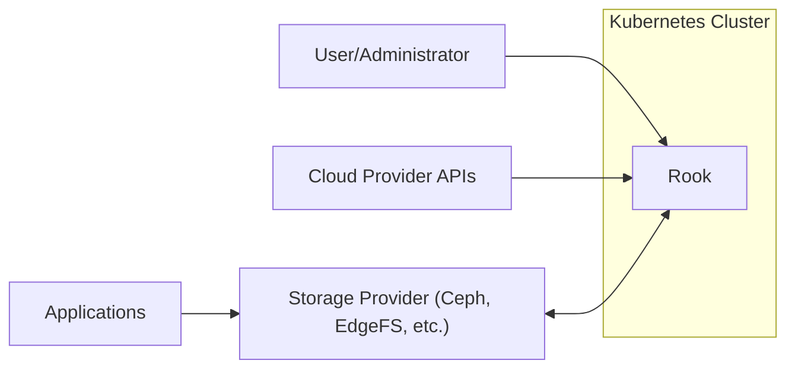
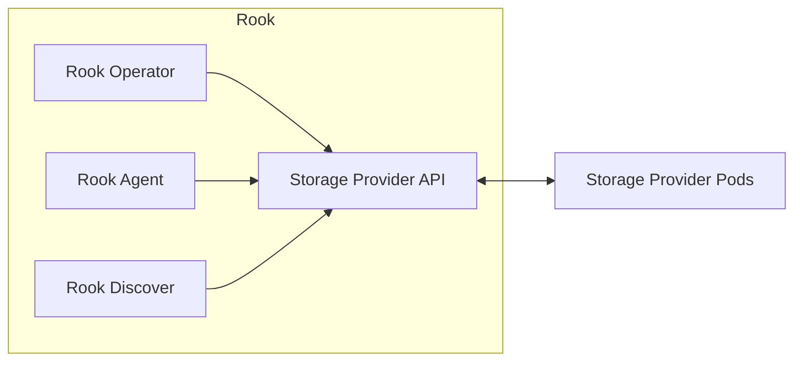
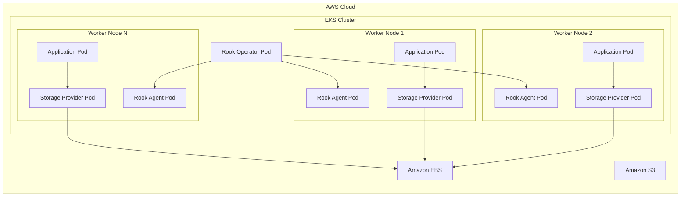
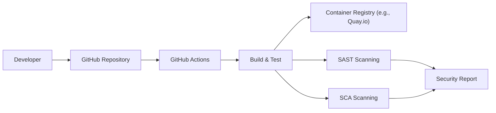

Okay, let's create a design document for the Rook project, focusing on aspects relevant for threat modeling.

# BUSINESS POSTURE

Rook is an open-source cloud-native storage orchestrator for Kubernetes, providing the platform, framework, and support for a diverse set of storage solutions to natively integrate with cloud-native environments.  It automates deployment, bootstrapping, configuring, provisioning, scaling, upgrading, migrating, disaster recovery, monitoring, and resource management of storage.  The primary business goals appear to be:

*   Simplify Storage Management: Reduce the operational complexity of deploying and managing persistent storage in Kubernetes environments.
*   Enable Cloud-Native Storage: Provide a consistent and reliable storage experience across different Kubernetes deployments (on-premise, cloud, hybrid).
*   Support Diverse Storage Backends: Offer flexibility by supporting multiple storage providers (Ceph, EdgeFS, Cassandra, NFS, etc.).
*   Promote Open Source Adoption: Foster a community-driven approach to storage management, encouraging contributions and widespread use.
*   Improve Developer Productivity: Allow developers to easily provision and manage storage for their applications without deep storage expertise.
*   Reduce Storage Costs: Optimize storage utilization and potentially reduce costs compared to traditional storage solutions.

Based on these goals, the most important business risks are:

*   Data Loss/Corruption: Failure of the underlying storage provider or Rook itself leading to data loss or corruption would be catastrophic.
*   Service Unavailability: Inability to access storage resources would disrupt applications relying on Rook.
*   Security Breaches: Unauthorized access to data stored through Rook could lead to data breaches and reputational damage.
*   Performance Bottlenecks: Poor storage performance could impact application performance and user experience.
*   Vendor Lock-in (Paradoxical): While Rook aims to *reduce* lock-in, dependence on a specific Rook-supported storage provider could still create a form of lock-in.
*   Operational Complexity (If Misconfigured): While Rook simplifies storage, misconfiguration or improper management could *increase* complexity.
*   Upgrade Failures: Issues during Rook or storage provider upgrades could lead to downtime or data loss.

# SECURITY POSTURE

Rook's security posture is heavily influenced by its role as an orchestrator. It delegates much of the actual data storage security to the underlying storage providers. However, Rook itself introduces security considerations.

Existing Security Controls (based on the GitHub repository and documentation):

*   security control: Role-Based Access Control (RBAC): Rook utilizes Kubernetes RBAC to control access to its resources and operations. This is evident in the numerous RBAC YAML files in the repository. Where: Kubernetes RBAC configuration files.
*   security control: Security Contexts: Rook operators and managed pods can be configured with security contexts to restrict their privileges. Where: Kubernetes pod and container specifications.
*   security control: Network Policies: Network policies can be used to restrict network access to Rook and the underlying storage providers. Where: Kubernetes NetworkPolicy resources.
*   security control: Storage Provider Security: Rook relies on the security features of the underlying storage providers (e.g., Ceph's encryption, authentication). Where: Configuration of the specific storage provider.
*   security control: Admission Controllers (Potentially): Kubernetes admission controllers (like Pod Security Admission or third-party solutions) can be used to enforce security policies on Rook deployments. Where: Kubernetes cluster configuration.
*   security control: Regular Updates: The Rook project is actively maintained, with regular releases that include security patches. Where: GitHub releases and project documentation.
*   security control: Community Scrutiny: As an open-source project, Rook benefits from community scrutiny, which can help identify and address security vulnerabilities. Where: GitHub issues and pull requests.

Accepted Risks:

*   accepted risk: Underlying Storage Provider Vulnerabilities: Rook is ultimately dependent on the security of the chosen storage provider. Vulnerabilities in the storage provider could impact Rook-managed storage.
*   accepted risk: Complexity of Configuration: The flexibility of Rook and its support for multiple storage providers introduces complexity, which can lead to misconfigurations and security vulnerabilities if not managed carefully.
*   accepted risk: Kubernetes Cluster Security: Rook's security is inherently tied to the security of the underlying Kubernetes cluster. A compromised cluster could compromise Rook.

Recommended Security Controls:

*   Implement robust monitoring and alerting for Rook and the underlying storage providers. This should include security-related events.
*   Regularly audit Rook configurations and deployments for security best practices.
*   Consider using a dedicated security scanning tool for container images used by Rook.
*   Implement network policies to isolate Rook and storage provider pods.
*   Use a secrets management solution (e.g., HashiCorp Vault) to securely store and manage sensitive information used by Rook.
*   Enforce principle of least privilege for all Rook components and managed pods.

Security Requirements:

*   Authentication:
    *   Rook operators should authenticate with the Kubernetes API using strong authentication mechanisms (e.g., service accounts with limited privileges).
    *   Access to the underlying storage provider should be authenticated using secure credentials.

*   Authorization:
    *   RBAC should be strictly enforced to limit access to Rook resources and operations based on the principle of least privilege.
    *   Access to storage resources should be controlled through appropriate authorization mechanisms provided by the storage provider.

*   Input Validation:
    *   Rook should validate all user inputs and configuration parameters to prevent injection attacks or other vulnerabilities. This is particularly important for custom resource definitions (CRDs).

*   Cryptography:
    *   Data at rest should be encrypted using strong encryption algorithms, as supported by the underlying storage provider.
    *   Data in transit should be encrypted using TLS/SSL.
    *   Secrets should be stored and managed securely.

# DESIGN

## C4 CONTEXT

Element Descriptions:

*   Element:
    *   Name: User/Administrator
    *   Type: Person
    *   Description: A user or administrator interacting with Rook to manage storage.
    *   Responsibilities: Deploying Rook, configuring storage providers, managing storage resources.
    *   Security controls: Authentication and authorization via Kubernetes RBAC.

*   Element:
    *   Name: Rook
    *   Type: Software System
    *   Description: The Rook storage orchestrator.
    *   Responsibilities: Automating storage management tasks, interacting with storage providers, providing an API for storage management.
    *   Security controls: RBAC, security contexts, input validation.

*   Element:
    *   Name: Cloud Provider APIs
    *   Type: Software System
    *   Description: APIs provided by cloud providers (e.g., AWS, GCP, Azure) for managing infrastructure resources.
    *   Responsibilities: Provisioning VMs, networks, and other resources needed by Rook and the storage provider.
    *   Security controls: Cloud provider's security mechanisms (IAM, network security, etc.).

*   Element:
    *   Name: Storage Provider (Ceph, EdgeFS, etc.)
    *   Type: Software System
    *   Description: The underlying storage provider managed by Rook.
    *   Responsibilities: Providing persistent storage, managing data replication and redundancy.
    *   Security controls: Storage provider's specific security features (encryption, authentication, etc.).

*   Element:
    *   Name: Applications
    *   Type: Software System
    *   Description: Applications running in the Kubernetes cluster that consume storage managed by Rook.
    *   Responsibilities: Using persistent storage for their data.
    *   Security controls: Application-level security controls, network policies.

*   Element:
    *   Name: Kubernetes Cluster
    *   Type: Container
    *   Description: Kubernetes cluster where Rook and applications are deployed.
    *   Responsibilities: Orchestrates containers, networking and storage.
    *   Security controls: Kubernetes RBAC, network policies, security contexts.

## C4 CONTAINER

Element Descriptions:

*   Element:
    *   Name: Rook Operator
    *   Type: Container
    *   Description: The main controller for Rook.
    *   Responsibilities: Watching for custom resources, managing storage provider deployments, handling configuration changes.
    *   Security controls: RBAC, security contexts, input validation.

*   Element:
    *   Name: Rook Agent
    *   Type: Container
    *   Description: Runs on each node in the Kubernetes cluster.
    *   Responsibilities: Managing storage devices, mounting volumes, handling node-specific tasks.
    *   Security controls: RBAC, security contexts, limited privileges.

*   Element:
    *   Name: Rook Discover
    *   Type: Container
    *   Description: Discovers available storage devices on nodes.
    *   Responsibilities: Identifying storage devices that can be used by Rook.
    *   Security controls: RBAC, security contexts, limited privileges.

*   Element:
    *   Name: Storage Provider API
    *   Type: API
    *   Description: An abstraction layer for interacting with different storage providers.
    *   Responsibilities: Providing a consistent interface for managing storage regardless of the underlying provider.
    *   Security controls: Authentication and authorization via Kubernetes RBAC and storage provider mechanisms.

*   Element:
    *   Name: Storage Provider Pods
    *   Type: Container
    *   Description: Pods belonging to the specific storage provider (e.g., Ceph monitor pods, OSD pods).
    *   Responsibilities: Providing the actual storage functionality.
    *   Security controls: Storage provider's specific security features.

## DEPLOYMENT

Rook is typically deployed within a Kubernetes cluster. There are several possible deployment architectures:

1.  **On-Premise Kubernetes:** Rook deployed on a Kubernetes cluster running on bare-metal servers or virtual machines in a private data center.
2.  **Cloud-Based Kubernetes:** Rook deployed on a managed Kubernetes service like Amazon EKS, Google Kubernetes Engine (GKE), or Azure Kubernetes Service (AKS).
3.  **Hybrid Cloud:** Rook deployed across multiple Kubernetes clusters, some on-premise and some in the cloud.

We'll describe the Cloud-Based Kubernetes deployment using AWS EKS as an example:

Element Descriptions:

*   Element:
    *   Name: EKS Cluster
    *   Type: Deployment Environment
    *   Description: A managed Kubernetes cluster provided by AWS.
    *   Responsibilities: Running Kubernetes control plane and worker nodes.
    *   Security controls: AWS IAM, network security groups, VPC configuration.

*   Element:
    *   Name: Worker Node 1, 2, N
    *   Type: Node
    *   Description: Virtual machines running the Kubernetes worker node components.
    *   Responsibilities: Running pods, managing networking and storage for pods.
    *   Security controls: AWS IAM, security groups, node-level security configurations.

*   Element:
    *   Name: Rook Operator Pod
    *   Type: Pod
    *   Description: The Rook operator pod running within the EKS cluster.
    *   Responsibilities: Managing Rook deployments and storage providers.
    *   Security controls: Kubernetes RBAC, security contexts, network policies.

*   Element:
    *   Name: Rook Agent Pod
    *   Type: Pod
    *   Description: Rook agent pods running on each worker node.
    *   Responsibilities: Managing storage devices and volumes on the node.
    *   Security controls: Kubernetes RBAC, security contexts, network policies, limited privileges.

*   Element:
    *   Name: Storage Provider Pod
    *   Type: Pod
    *   Description: Pods for the specific storage provider (e.g., Ceph) running on worker nodes.
    *   Responsibilities: Providing persistent storage.
    *   Security controls: Storage provider's security features, network policies.

*   Element:
    *   Name: Application Pod
    *   Type: Pod
    *   Description: Application pods consuming storage managed by Rook.
    *   Responsibilities: Running application workloads.
    *   Security controls: Application-level security, network policies.

*   Element:
    *   Name: Amazon EBS
    *   Type: External System
    *   Description: AWS block storage service used by the storage provider.
    *   Responsibilities: Providing persistent block storage volumes.
    *   Security controls: AWS IAM, encryption at rest and in transit.

*   Element:
    *   Name: Amazon S3
    *   Type: External System
    *   Description: AWS object storage service (potentially used by some storage providers).
    *   Responsibilities: Providing object storage.
    *   Security controls: AWS IAM, encryption at rest and in transit, bucket policies.

## BUILD

Rook's build process is automated using GitHub Actions. The repository contains numerous workflow files (YAML) that define the build, test, and release processes.

*   Developer pushes code to the GitHub repository.
*   GitHub Actions triggers workflows based on events (e.g., push, pull request).
*   Workflows perform various tasks:
    *   Build Rook binaries and container images.
    *   Run unit and integration tests.
    *   Perform static analysis (SAST) using tools like `gosec` (as seen in the workflows).
    *   Perform software composition analysis (SCA) to identify vulnerabilities in dependencies. This isn't explicitly shown in all workflows but is a recommended practice.
    *   Push container images to a container registry (e.g., Quay.io).
    *   Create GitHub releases.

Security Controls in Build Process:

*   Automated Builds: GitHub Actions ensures consistent and reproducible builds.
*   SAST Scanning: Static analysis tools help identify potential security vulnerabilities in the Rook codebase.
*   SCA Scanning: (Recommended) Scanning dependencies for known vulnerabilities.
*   Code Review: Pull requests are reviewed by other developers before being merged, providing an opportunity for security review.
*   Signed Commits: (Recommended) Enforcing signed commits helps ensure the integrity of the codebase.
*   Least Privilege: Build workflows should run with the minimum necessary privileges.

# RISK ASSESSMENT

*   Critical Business Processes:
    *   Provisioning and managing persistent storage for applications.
    *   Ensuring data availability and durability.
    *   Maintaining storage performance.
    *   Facilitating disaster recovery.

*   Data to Protect:
    *   Application data stored in persistent volumes managed by Rook. This could include databases, files, and other critical data.
    *   Rook configuration data (custom resources, secrets).
    *   Storage provider configuration data.

*   Data Sensitivity:
    *   The sensitivity of the data depends on the applications using Rook-managed storage. It could range from non-sensitive test data to highly sensitive customer data or financial information.

# QUESTIONS & ASSUMPTIONS

*   Questions:
    *   What specific storage providers are most commonly used with Rook in production environments? This will influence the threat model.
    *   What are the specific security requirements of the organizations using Rook (e.g., compliance requirements)?
    *   Are there any existing security audits or penetration testing reports for Rook?
    *   What is the process for reporting and addressing security vulnerabilities in Rook?
    *   What level of access do Rook operators typically have within the Kubernetes cluster?
    *   How are secrets (e.g., storage provider credentials) managed in Rook deployments?
    *   What are the disaster recovery plans for Rook-managed storage?

*   Assumptions:
    *   The underlying Kubernetes cluster is securely configured and maintained.
    *   The chosen storage provider is securely configured and maintained.
    *   Network policies are used to restrict network access to Rook and storage provider pods.
    *   RBAC is used to limit access to Rook resources and operations.
    *   Developers follow secure coding practices.
    *   Regular security updates are applied to Rook and the underlying storage provider.
    *   Monitoring and alerting are in place to detect security incidents.
    *   Users/Administrators are trained on how to securely use and manage Rook.
    *   The build process is secure and free from tampering.
    *   The container registry used to store Rook images is secure.