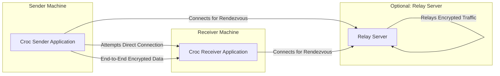
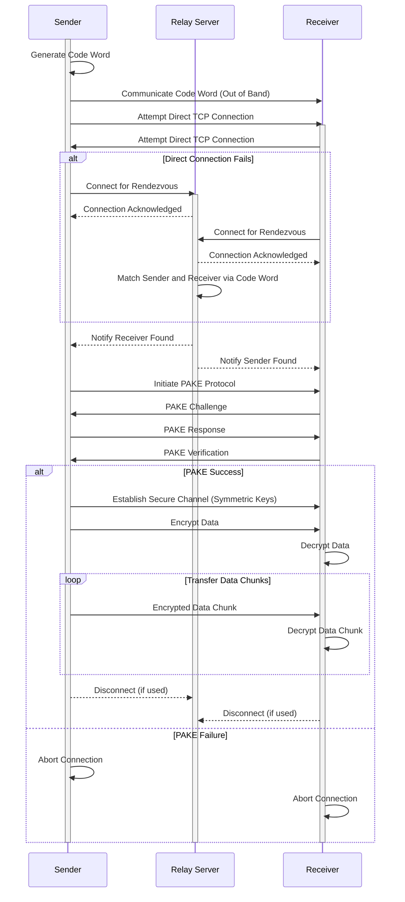

## Project Design Document: croc (Improved)

**1. Introduction**

This document provides an enhanced architectural design for the `croc` project, a command-line tool facilitating easy and secure file and folder transfers between two computers. A primary goal of this document is to provide a robust understanding of the system's components, data flow, and inherent security mechanisms to serve as a solid foundation for subsequent threat modeling exercises. Understanding these aspects is crucial for identifying potential vulnerabilities and designing appropriate mitigations.

**2. Goals**

* Provide a clear, concise, and comprehensive description of the `croc` system architecture.
* Clearly identify key components and explicitly define their interactions and responsibilities.
* Detail the data flow during a typical file transfer, highlighting security-relevant stages.
* Thoroughly describe the security mechanisms employed and discuss potential security considerations.
* Serve as the definitive basis for future threat modeling activities and security assessments.

**3. Scope**

This document focuses on the core functionality and architecture of `croc`, including:

* Initiation of file and folder transfers by the sender.
* Secure establishment of communication channels between sender and receiver.
* The process of transferring data (files and folders).
* Utilization of relay servers to overcome Network Address Translation (NAT) challenges.
* Generation, exchange, and the role of the code word in the connection process.

This document explicitly excludes:

* In-depth implementation specifics of underlying libraries or operating system interfaces.
* Detailed, line-by-line code explanations.
* User interface/user experience (UI/UX) design considerations, as `croc` is a command-line tool.
* Specific deployment and installation instructions or procedures.

**4. High-Level Architecture**

The `croc` system fundamentally involves two primary actors: the **Sender** and the **Receiver**. Communication can occur directly if network conditions allow, or indirectly through an optional **Relay Server**.

* **Croc Sender Application:** The instance of the `croc` application running on the machine initiating the file transfer process. Its primary responsibility is to package and securely transmit the data.
* **Croc Receiver Application:** The instance of the `croc` application running on the machine intended to receive the file transfer. Its primary responsibility is to securely receive and unpack the transmitted data.
* **Relay Server:** A publicly accessible server acting as an intermediary to facilitate the initial connection and relay traffic between the Sender and Receiver when a direct peer-to-peer connection is not feasible due to network configurations like NAT. It should only relay encrypted traffic.

**5. Detailed Design**

The file transfer process is a sequence of well-defined steps:

1. **Transfer Initiation by Sender:**
    *   The Sender executes the `croc send <file/folder>` command, specifying the data to be transferred.
    *   The Sender generates a unique, human-friendly code word (e.g., "happy-mountain-22"). This code word acts as a shared secret for the initial connection.
    *   The Sender displays this code word to the user and enters a waiting state.

2. **Reception Initiation by Receiver:**
    *   The Receiver executes the `croc <code word>` command, providing the code word received from the Sender.

3. **Rendezvous and Initial Connection:**
    *   Both the Sender and Receiver initially attempt to establish a direct TCP connection with each other.
    *   If a direct connection attempt fails (commonly due to NAT or firewall restrictions), both parties connect to a pre-configured Relay Server.
    *   The Relay Server uses the provided code word to match the Sender and Receiver, facilitating their initial connection.

4. **Password Authenticated Key Exchange (PAKE):**
    *   Once a connection is established (either direct or via the Relay Server), the Sender and Receiver engage in a secure Password Authenticated Key Exchange (PAKE) protocol. The code word serves as the shared password in this exchange.
    *   The PAKE protocol allows both parties to authenticate each other and establish a shared secret key without revealing the code word itself or being susceptible to eavesdropping attacks on the initial handshake.

5. **Establishment of Secure Encrypted Channel:**
    *   Following a successful PAKE, a secure, end-to-end encrypted channel is established between the Sender and Receiver. This channel utilizes symmetric encryption algorithms, with the encryption keys derived from the shared secret generated during the PAKE process.

6. **Data Transfer Process:**
    *   The Sender reads the file or folder data from the local file system.
    *   This data is then encrypted using the established secure channel.
    *   The encrypted data is transmitted to the Receiver, either directly or by being relayed through the Relay Server. The Relay Server only sees and forwards encrypted data.
    *   The Receiver receives the encrypted data.
    *   The Receiver decrypts the data using the shared secret key.
    *   The Receiver writes the decrypted data to the specified location on its local file system.

7. **Connection Termination:**
    *   After the complete data transfer, the secure encrypted channel between the Sender and Receiver is gracefully closed.
    *   If a Relay Server was used, both the Sender and Receiver disconnect from it.

**5.1. Component Responsibilities**

*   **Core Transfer Logic:**
    *   Orchestrates the entire file transfer lifecycle, managing initiation, connection establishment (direct or relayed), key exchange, data transfer, and termination.
    *   Implements the state machine and logic for handling different connection scenarios and potential errors.

*   **Networking Layer:**
    *   Manages all network-related operations, including establishing TCP connections, listening for incoming connections, and handling network errors.
    *   Implements NAT traversal techniques and peer discovery mechanisms.
    *   Handles communication protocols with the Relay Server.

*   **Security Module:**
    *   Implements the Password Authenticated Key Exchange (PAKE) protocol (e.g., SPAKE2) for secure authentication and key agreement.
    *   Provides encryption and decryption functionalities using robust symmetric encryption algorithms (e.g., AES-GCM).
    *   Manages the generation, storage (in memory only during the transfer), and secure derivation of cryptographic keys.

*   **Relay Client:**
    *   Specifically responsible for establishing and maintaining connections with the Relay Server.
    *   Implements the communication protocol for rendezvous (using the code word) and relaying encrypted data.

*   **File System Interface:**
    *   Provides abstractions for reading data from the file system on the Sender side.
    *   Provides abstractions for writing data to the file system on the Receiver side.
    *   Handles file metadata (name, size, etc.) transfer.

**5.2. Data Flow Diagram (Detailed)**

**6. Security Considerations**

*   **End-to-End Encryption:**  `croc` employs end-to-end encryption using authenticated encryption schemes (like AES-GCM) to ensure the confidentiality and integrity of the transferred data. Only the Sender and Receiver possess the keys to encrypt and decrypt the data.
*   **Password Authenticated Key Exchange (PAKE):** The use of a PAKE protocol (likely SPAKE2) protects against man-in-the-middle attacks during the initial key exchange, even if an attacker is eavesdropping on the connection. The security relies on the strength and secrecy of the code word.
*   **Relay Server Security Posture:** While the Relay Server only handles encrypted traffic, its security is still important:
    *   **Traffic Analysis:**  A compromised Relay Server could potentially analyze traffic patterns and connection metadata (though not the content).
    *   **Denial of Service (DoS):** The Relay Server is a potential target for DoS attacks, which could disrupt the service for all users.
    *   **Malicious Relay Server:** Users connecting to a malicious Relay Server could be vulnerable to attacks if the server attempts to manipulate the connection or gather information (though the end-to-end encryption mitigates content interception). Users should ideally have the option to specify trusted relay servers.
*   **Code Word Strength and Management:** The security of the initial connection hinges on the code word. Short or easily guessable code words are susceptible to brute-force attacks. `croc`'s code word generation should prioritize randomness and sufficient length. Secure communication of the code word out-of-band is also crucial.
*   **Man-in-the-Middle (MITM) Attack Resistance:** The PAKE protocol is specifically designed to prevent MITM attacks on the key exchange. However, implementation flaws in the PAKE protocol could introduce vulnerabilities.
*   **Transport Layer Security (TLS) for Relay Communication:** Communication between `croc` clients and the Relay Server should be secured using TLS to protect the code word and other handshake information during the rendezvous process. This prevents eavesdropping on the initial connection setup.
*   **Dependency Management:**  Vulnerabilities in third-party libraries used by `croc` could introduce security risks. A robust dependency management strategy, including regular updates and security audits of dependencies, is essential.
*   **Local Data Security:**  While `croc` focuses on secure transfer, the security of the data at rest on the Sender and Receiver machines is outside its scope but remains a relevant security consideration.

**7. Deployment Considerations**

*   `croc` is primarily intended as a command-line tool, deployed directly on user workstations or servers.
*   The Relay Server is a separate infrastructure component that needs to be deployed and maintained independently. Users often rely on publicly available Relay Servers, but the option to self-host a Relay Server provides greater control and potentially enhanced security.

**8. Future Considerations**

*   **Support for User-Specified Relay Servers:** Allowing users to configure and use their own trusted Relay Servers.
*   **Enhanced Code Word Generation:** Implementing more sophisticated code word generation algorithms with options for customization or increased entropy.
*   **File Integrity Verification Mechanisms:** Integrating methods like checksums or cryptographic hashes to verify the integrity of transferred files after reception.
*   **Improved Progress Indication and Error Handling:** Providing more detailed feedback to the user during the transfer process and more robust error handling.
*   **Consideration of Post-Quantum Cryptography:**  Future-proofing the encryption algorithms against potential threats from quantum computing.

**9. Conclusion**

This improved design document provides a more detailed and structured overview of the `croc` project's architecture, with a strong emphasis on security considerations. By clearly outlining the components, data flow, and security mechanisms, this document serves as a valuable and comprehensive resource for conducting thorough threat modeling and guiding future development efforts with security in mind.