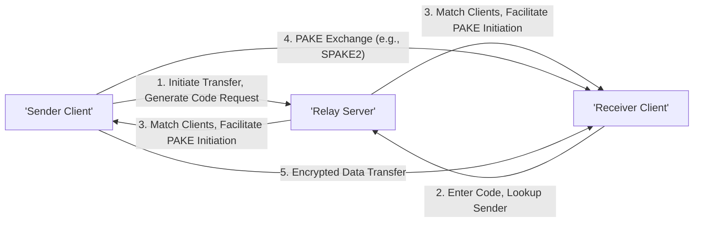
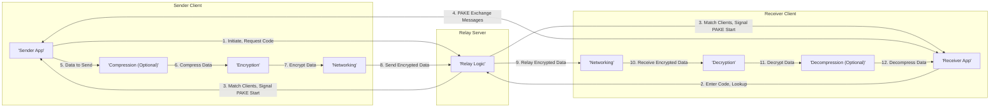

# Project Design Document: croc

**Version:** 1.1
**Date:** October 26, 2023
**Author:** Gemini (AI Language Model)

## 1. Introduction

This document provides a detailed design overview of the `croc` project, a command-line tool facilitating secure file and folder transfers between two peers (a sender and a receiver). This document is intended to serve as a foundation for future threat modeling activities. It outlines the system's architecture, components, data flow, and key security considerations, providing a comprehensive understanding of the system's inner workings.

## 2. Goals

* Provide a comprehensive and technically accurate description of the `croc` system architecture.
* Detail the key components, their functionalities, and interactions with other components.
* Clearly illustrate the data flow during a typical file transfer, highlighting security-relevant steps.
* Identify specific security considerations and potential vulnerabilities relevant for threat modeling.

## 3. System Overview

`croc` enables secure file and folder transfers between a sender and a receiver, often operating behind Network Address Translation (NAT). It leverages a relay server for initial connection establishment and employs a Password Authenticated Key Exchange (PAKE) protocol to establish a shared secret. This shared secret is then used to encrypt the transferred data, ensuring confidentiality.

Here's a high-level architectural diagram illustrating the interaction between the key actors:

## 4. Component Details

This section provides a detailed breakdown of the key components within the `croc` system.

* **`croc` Client (Sender):**
    * **Functionality:** Initiates the file transfer process.
    * **Responsibilities:**
        * Generates a request to the relay server for a new transfer session, receiving a short, human-readable code.
        * Presents this code to the user for sharing with the receiver.
        * Establishes a WebSocket connection with the relay server.
        * Implements the sender side of the chosen PAKE protocol (e.g., SPAKE2).
        * Encrypts the files/folders using a symmetric encryption algorithm (likely AES-GCM) with the key derived from the PAKE.
        * Optionally compresses the data before encryption using a library like `zstd`.
        * Segments the encrypted data for transmission.
        * Sends the encrypted data segments through the established connection (potentially directly to the receiver after PAKE, or via the relay).
        * Provides a command-line interface (CLI) for user interaction, including specifying files/folders to send.
    * **Key Technologies:**  Likely uses libraries for networking (e.g., Go's `net/http/ws`), cryptography (e.g., Go's `crypto` package), and compression.

* **`croc` Client (Receiver):**
    * **Functionality:** Receives the file transfer.
    * **Responsibilities:**
        * Connects to the relay server.
        * Prompts the user to enter the code provided by the sender.
        * Sends the entered code to the relay server to locate the corresponding sender.
        * Establishes a WebSocket connection with the relay server.
        * Implements the receiver side of the chosen PAKE protocol.
        * Receives encrypted data segments.
        * Decrypts the data segments using the shared secret.
        * Optionally decompresses the data after decryption.
        * Reassembles the original files/folders.
        * Provides a command-line interface (CLI) for user interaction, including specifying the destination directory.
    * **Key Technologies:** Similar to the sender, likely uses libraries for networking, cryptography, and compression.

* **Relay Server:**
    * **Functionality:** Facilitates initial connection and PAKE negotiation between clients.
    * **Responsibilities:**
        * Listens for incoming WebSocket connections from clients.
        * Generates and manages transfer session IDs and associated short codes.
        * Matches sender and receiver clients based on the provided code.
        * Facilitates the initial signaling for the PAKE protocol between the matched clients.
        * Relays encrypted data packets between the sender and receiver if a direct peer-to-peer connection is not established or fails.
        * Maintains a temporary state of active transfers.
        * May implement basic rate limiting or connection management to prevent abuse.
        * Does *not* have access to the encryption keys or the decrypted data.
    * **Key Technologies:** Likely built using a framework suitable for real-time communication, such as Go with libraries like `gorilla/websocket`.

* **PAKE (Password Authenticated Key Exchange) Implementation:**
    * **Functionality:** Securely establishes a shared secret between the sender and receiver based on the low-entropy short code.
    * **Details:**
        * Likely utilizes the SPAKE2 algorithm or a similar variant known for its security and suitability for low-entropy passwords.
        * Involves cryptographic exchanges between the sender and receiver, ensuring that only parties knowing the "password" (the short code) can derive the shared secret.
        * Protects against offline dictionary attacks to a certain extent due to the authenticated nature of the exchange.

* **Encryption Module:**
    * **Functionality:** Protects the confidentiality of the transferred data.
    * **Details:**
        * Employs a symmetric encryption algorithm, most likely AES in Galois/Counter Mode (GCM) for authenticated encryption.
        * Uses the shared secret derived from the PAKE as the encryption key.
        * Includes an initialization vector (IV) or nonce for each encryption operation to ensure semantic security.

* **Compression Module (Optional):**
    * **Functionality:** Reduces the size of the data being transferred.
    * **Details:**
        * Implements a lossless compression algorithm, such as `zstd` or `gzip`.
        * Compression occurs before encryption on the sender side and decompression happens after decryption on the receiver side.

* **Networking Layer:**
    * **Functionality:** Handles the underlying network communication.
    * **Details:**
        * Primarily uses WebSocket connections for communication with the relay server and potentially for direct peer-to-peer communication after the PAKE.
        * May fall back to relaying data through the server if direct connections fail due to network constraints.

## 5. Data Flow

The following diagram illustrates the detailed data flow during a typical file transfer using `croc`:

Detailed steps of the data flow:

* **Sender Initiates:** The sender client application initiates the transfer and requests a transfer code from the relay server.
* **Receiver Connects:** The receiver client application connects to the relay server and provides the transfer code.
* **Relay Matches:** The relay server matches the sender and receiver based on the code.
* **PAKE Exchange:** The sender and receiver clients engage in the PAKE protocol (e.g., SPAKE2) directly, potentially facilitated by the relay server for initial signaling. This establishes a shared secret.
* **Data Preparation (Sender):** The sender application prepares the data for transfer.
* **Optional Compression (Sender):** The sender client optionally compresses the data.
* **Encryption (Sender):** The sender client encrypts the data using the shared secret.
* **Sending (Sender):** The sender client's networking layer sends the encrypted data, potentially directly to the receiver or via the relay server.
* **Relaying (Optional):** If a direct connection isn't established, the relay server forwards the encrypted data.
* **Receiving (Receiver):** The receiver client's networking layer receives the encrypted data.
* **Decryption (Receiver):** The receiver client decrypts the data using the shared secret.
* **Optional Decompression (Receiver):** The receiver client optionally decompresses the data.
* **Completion (Receiver):** The receiver application reconstructs the original files/folders.

## 6. Security Considerations

This section details specific security considerations relevant to threat modeling for the `croc` project.

* **PAKE Protocol Vulnerabilities:**
    * **Brute-force attacks on the short code:** While PAKE makes this harder than simple password authentication, a sufficiently weak or short code could still be vulnerable to online or offline brute-force attacks, especially if the PAKE implementation has weaknesses.
    * **Implementation flaws in SPAKE2:** Incorrect implementation of the SPAKE2 algorithm could introduce vulnerabilities, allowing attackers to bypass the authentication or derive the shared secret.
    * **Side-channel attacks:** Potential vulnerabilities in the PAKE implementation that leak information about the secret through timing or power consumption.

* **Encryption Vulnerabilities:**
    * **Weak encryption algorithm or key size:** Using outdated or insecure encryption algorithms or insufficient key lengths (e.g., less than 256-bit AES) would weaken the security.
    * **Incorrect usage of AES-GCM:**  Reusing nonces (IVs) in GCM mode can catastrophically compromise confidentiality and integrity. Proper nonce generation and handling are critical.
    * **Lack of authenticated encryption:** If a mode other than GCM is used without proper authentication, attackers could potentially modify the ciphertext without detection.

* **Relay Server Security Risks:**
    * **Denial of Service (DoS) attacks:** The relay server is a central point and could be targeted by DoS attacks, preventing legitimate users from transferring files.
    * **Man-in-the-middle attacks on relay connections:** While the data is encrypted end-to-end, attackers could potentially intercept and manipulate the initial connection setup or PAKE signaling if these phases are not sufficiently protected (e.g., using TLS for WebSocket connections).
    * **Compromise of the relay server:** If the relay server is compromised, attackers could potentially log connection metadata, disrupt transfers, or even attempt to impersonate clients (though they cannot decrypt the data).
    * **Abuse of the relay service:** Malicious actors could potentially use the relay server for unintended purposes, such as facilitating illegal file sharing.

* **Client-Side Vulnerabilities:**
    * **Memory corruption vulnerabilities:** Bugs in the client code (e.g., buffer overflows) could be exploited to gain control of the client application.
    * **Insecure storage of secrets:** If the client needs to store any persistent secrets (unlikely in this design), insecure storage could lead to compromise.
    * **Path traversal vulnerabilities:** When receiving files, the client must carefully sanitize file paths to prevent writing files to arbitrary locations on the file system.
    * **Dependency vulnerabilities:** Using outdated or vulnerable libraries could introduce security risks.

* **Code Security in General:**
    * **Injection vulnerabilities:** Although less likely in this type of application, improper handling of input could lead to injection attacks.
    * **Logic errors:** Flaws in the application logic could lead to unexpected behavior or security vulnerabilities.

* **Metadata Exposure:**
    * **Relay server logging:** The relay server likely logs connection information, which could reveal metadata about transfers (e.g., IP addresses, timestamps, transfer codes).
    * **Network traffic analysis:** Even with encryption, some metadata (e.g., packet sizes, timing) might be observable by network eavesdroppers.

## 7. Future Considerations

* **Direct Peer-to-Peer Enhancements:** Implementing more robust mechanisms for establishing direct peer-to-peer connections after the PAKE to reduce reliance on the relay server and improve performance. This could involve techniques like STUN/TURN.
* **Improved Code Generation and Handling:** Offering options for users to provide their own passwords or using more sophisticated code generation techniques to increase entropy and reduce susceptibility to brute-force attacks.
* **Relay Server Security Hardening:** Implementing stricter rate limiting, abuse detection mechanisms, and comprehensive logging and monitoring on the relay server. Consider using TLS for all communication with the relay server.
* **GUI Development:** Creating a graphical user interface could improve usability but would introduce new security considerations related to UI frameworks and potential cross-site scripting (XSS) vulnerabilities if web technologies are used.
* **File Integrity Verification:** Implementing mechanisms to verify the integrity of transferred files, such as generating and verifying cryptographic hashes (e.g., SHA-256).
* **Formal Security Audit:** Conducting a professional security audit of the codebase and architecture to identify potential vulnerabilities.

This improved design document provides a more detailed and technically accurate overview of the `croc` project, highlighting key aspects relevant for thorough threat modeling. The expanded security considerations section offers specific examples of potential vulnerabilities that should be investigated further.