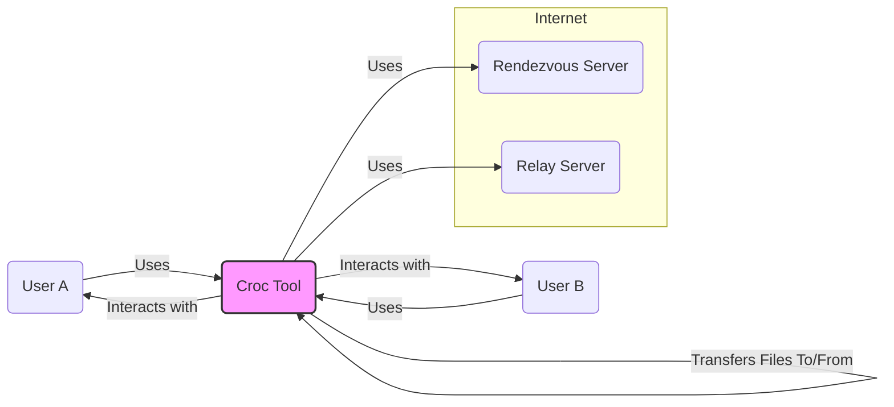
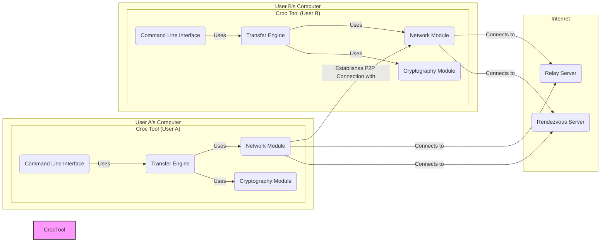
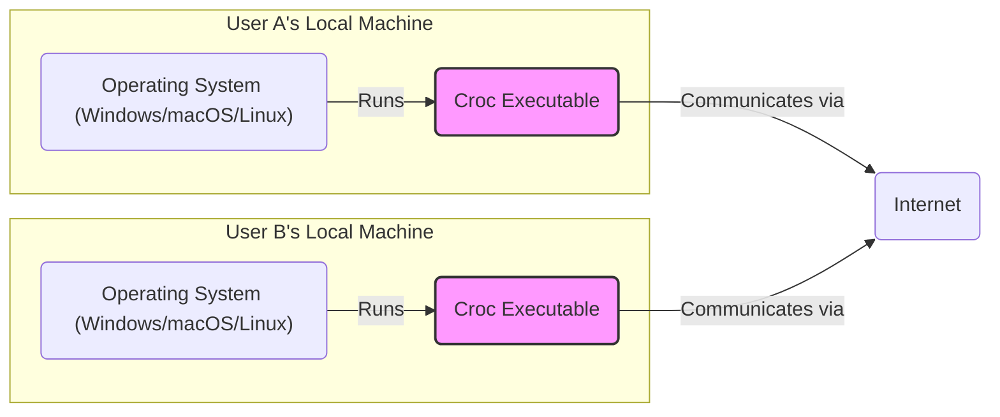

# BUSINESS POSTURE

- Business Priorities and Goals:
 - Priority: Secure and easy file transfer.
 - Goal: Provide a command-line tool for users to quickly and securely transfer files and folders between computers, regardless of their technical expertise.
 - Goal: Offer a user-friendly alternative to complex file transfer methods like SCP, FTP, or cloud storage services when direct peer-to-peer transfer is desired.
 - Goal: Ensure data confidentiality and integrity during transfer through end-to-end encryption.

- Business Risks:
 - Risk: Data breaches due to vulnerabilities in the application or its dependencies.
 - Risk: Availability issues if the rendezvous server or relay server infrastructure is unreliable.
 - Risk: Misuse of the tool for transferring malicious files if security controls are bypassed or insufficient.
 - Risk: Reputational damage if the tool is perceived as insecure or unreliable.
 - Risk: Lack of adoption if the tool is too complex to use or doesn't meet user needs.

# SECURITY POSTURE

- Existing Security Controls:
 - security control: End-to-end encryption using PAKE (Password-Authenticated Key Exchange) and Noise protocol. Implemented in the application code.
 - security control: Password or code-phrase based authentication for secure channel establishment. Implemented in the application code.
 - security control: Optional relay server for NAT traversal when direct peer-to-peer connection is not possible. Implemented in the application code and infrastructure.
 - security control: Public rendezvous server for initial connection setup. Implemented in the application infrastructure.
 - security control: Code is open source and publicly available on GitHub for review. Described in the GitHub repository.

- Accepted Risks:
 - accepted risk: Reliance on the security of the chosen cryptographic libraries and algorithms.
 - accepted risk: Potential vulnerabilities in the rendezvous and relay server infrastructure.
 - accepted risk: User responsibility for choosing strong passwords or code-phrases.
 - accepted risk: Risk of man-in-the-middle attacks if the initial connection is compromised before encryption is established (mitigated by PAKE).

- Recommended Security Controls:
 - security control: Implement automated security scanning (SAST, DAST) in the CI/CD pipeline.
 - security control: Conduct regular security audits and penetration testing of the application and infrastructure.
 - security control: Implement dependency scanning to identify and address vulnerable dependencies.
 - security control: Provide clear security guidelines and best practices for users, including password strength recommendations.
 - security control: Implement rate limiting and abuse prevention mechanisms on rendezvous and relay servers.
 - security control: Consider offering self-hosted rendezvous/relay server options for users with stricter security requirements.

- Security Requirements:
 - Authentication:
  - Requirement: Securely authenticate peers to prevent unauthorized file transfers.
  - Requirement: Use password-authenticated key exchange (PAKE) to establish a shared secret without transmitting passwords in the clear.
  - Requirement: Provide clear feedback to users on authentication success or failure.

 - Authorization:
  - Requirement: Authorization is implicitly handled by the peer-to-peer nature of the tool and password/code-phrase exchange. Only peers who know the password/code-phrase can participate in the file transfer.
  - Requirement: No explicit user roles or permissions are needed as the tool is designed for ad-hoc peer-to-peer transfers.

 - Input Validation:
  - Requirement: Validate all user inputs, including file paths, passwords/code-phrases, and command-line arguments, to prevent injection attacks and unexpected behavior.
  - Requirement: Sanitize file names and paths to prevent directory traversal vulnerabilities.
  - Requirement: Limit file sizes and transfer rates to prevent denial-of-service attacks.

 - Cryptography:
  - Requirement: Use strong and well-vetted cryptographic algorithms for encryption and key exchange (e.g., Noise protocol, AES, ChaCha20, Curve25519).
  - Requirement: Ensure proper key management and secure storage of cryptographic keys (though keys are mostly ephemeral in this peer-to-peer context).
  - Requirement: Regularly review and update cryptographic libraries to address known vulnerabilities.
  - Requirement: Implement TLS/HTTPS for communication with rendezvous and relay servers to protect against eavesdropping and tampering.

# DESIGN

## C4 CONTEXT

- Context Diagram Elements:
 - - Name: User A
   - Type: Person
   - Description: A user who wants to send or receive files using the Croc Tool.
   - Responsibilities: Initiates file transfer, provides password/code-phrase, selects files/folders to transfer.
   - Security controls: Responsible for choosing strong passwords/code-phrases.

 - - Name: User B
   - Type: Person
   - Description: A user who wants to receive or send files using the Croc Tool.
   - Responsibilities: Accepts file transfer, provides password/code-phrase, receives files/folders.
   - Security controls: Responsible for choosing strong passwords/code-phrases.

 - - Name: Croc Tool
   - Type: Software System
   - Description: Command-line tool for secure peer-to-peer file transfer.
   - Responsibilities: Facilitates secure connection between users, encrypts and decrypts data, manages file transfer process, interacts with Rendezvous and Relay Servers.
   - Security controls: End-to-end encryption, password-authenticated key exchange, input validation, secure handling of cryptographic keys.

 - - Name: Rendezvous Server
   - Type: Software System
   - Description: Public server used for initial peer discovery and connection setup.
   - Responsibilities: Facilitates initial handshake between peers, exchanges connection information.
   - Security controls: TLS/HTTPS for communication, rate limiting, abuse prevention mechanisms, regular security updates.

 - - Name: Relay Server
   - Type: Software System
   - Description: Optional server used to relay traffic when direct peer-to-peer connection is not possible due to NAT or firewall issues.
   - Responsibilities: Relays encrypted data between peers when direct connection fails.
   - Security controls: TLS/HTTPS for communication, rate limiting, abuse prevention mechanisms, regular security updates, ensures only encrypted traffic is relayed.

## C4 CONTAINER

- Container Diagram Elements:
 - - Name: Command Line Interface (User A & User B)
   - Type: Application
   - Description: Provides a command-line interface for users to interact with the Croc Tool, initiate transfers, and view progress.
   - Responsibilities: Accepts user commands, displays output, handles user input validation.
   - Security controls: Input validation to prevent command injection, secure handling of user credentials (passwords/code-phrases are not stored).

 - - Name: Transfer Engine (User A & User B)
   - Type: Application Component
   - Description: Core logic for managing the file transfer process, including file system operations, data streaming, and coordination with other modules.
   - Responsibilities: Reads and writes files, manages transfer state, orchestrates encryption and decryption, interacts with network module.
   - Security controls: Secure file handling, input validation for file paths, error handling to prevent information leakage.

 - - Name: Cryptography Module (User A & User B)
   - Type: Application Component
   - Description: Handles all cryptographic operations, including key exchange, encryption, and decryption using Noise protocol and other cryptographic algorithms.
   - Responsibilities: Key generation, key exchange (PAKE), encryption, decryption, secure random number generation.
   - Security controls: Uses well-vetted cryptographic libraries, secure key management (ephemeral keys), implements strong cryptographic algorithms.

 - - Name: Network Module (User A & User B)
   - Type: Application Component
   - Description: Manages network communication, including connection establishment, data transmission, and interaction with Rendezvous and Relay Servers.
   - Responsibilities: Establishes network connections, sends and receives data, handles network protocols, interacts with Rendezvous and Relay Servers.
   - Security controls: TLS/HTTPS for server communication, secure peer-to-peer connection establishment, handles network errors securely.

 - - Name: Rendezvous Server
   - Type: Infrastructure
   - Description: Public server infrastructure for peer discovery.
   - Responsibilities: Facilitates initial peer discovery and exchange of connection information.
   - Security controls: TLS/HTTPS, rate limiting, intrusion detection, regular security updates, access control.

 - - Name: Relay Server
   - Type: Infrastructure
   - Description: Optional server infrastructure for relaying traffic.
   - Responsibilities: Relays encrypted data between peers when direct connection is not possible.
   - Security controls: TLS/HTTPS, rate limiting, intrusion detection, regular security updates, access control, ensures only encrypted traffic is relayed.

## DEPLOYMENT

- Deployment Options:
 - Option 1: User-managed deployment (most common). Users download and run the `croc` executable directly on their local machines (Windows, macOS, Linux). No central deployment infrastructure is required for the tool itself.
 - Option 2: Containerized deployment (less common for end-users, more relevant for server components). Rendezvous and Relay servers can be deployed as Docker containers in cloud environments (e.g., AWS, GCP, Azure) or on-premises.

- Detailed Deployment (User-managed deployment of Croc Tool):

- Deployment Diagram Elements (User-managed deployment of Croc Tool):
 - - Name: Operating System (User A & User B)
   - Type: Infrastructure
   - Description: User's local operating system (Windows, macOS, or Linux) providing the runtime environment for the Croc executable.
   - Responsibilities: Provides system resources, executes the Croc application.
   - Security controls: Operating system level security controls (firewall, antivirus, user permissions), regular OS updates.

 - - Name: Croc Executable (User A & User B)
   - Type: Software
   - Description: The compiled and packaged Croc application executable, downloaded and run by the user.
   - Responsibilities: Implements file transfer functionality, interacts with the operating system and network.
   - Security controls: Application-level security controls (end-to-end encryption, input validation), code signing (optional).

 - - Name: Internet
   - Type: Infrastructure
   - Description: The public internet network enabling communication between User A and User B, and with Rendezvous/Relay servers.
   - Responsibilities: Provides network connectivity.
   - Security controls: Network security controls are outside the scope of the Croc Tool itself, relies on underlying internet infrastructure security.

## BUILD

```mermaid
flowchart LR
    subgraph "Developer Workstation"
        Developer("Developer")
        SourceCode("Source Code (GitHub)")
    end

    subgraph "CI/CD Pipeline (GitHub Actions)"
        CodeCheckout("Code Checkout")
        BuildProcess("Build Process (Go Compiler)")
        SecurityScans("Security Scans (SAST, Dependency Check)")
        ArtifactPackaging("Artifact Packaging")
        ArtifactStorage("Artifact Storage (GitHub Releases)")
    end

    Developer -- "Commits Code" --> SourceCode
    SourceCode -- "Triggers" --> CodeCheckout
    CodeCheckout -- "Inputs" --> BuildProcess
    BuildProcess -- "Outputs" --> SecurityScans
    SecurityScans -- "Outputs" --> ArtifactPackaging
    ArtifactPackaging -- "Outputs" --> ArtifactStorage
    ArtifactStorage -- "Provides Artifacts to" --> User

    style ArtifactStorage fill:#f9f,stroke:#333,stroke-width:2px
```

- Build Process Description:
 - 1. Developer commits code changes to the GitHub repository.
 - 2. GitHub Actions CI/CD pipeline is triggered automatically on code changes (e.g., push, pull request).
 - 3. Code Checkout step retrieves the latest source code from the GitHub repository.
 - 4. Build Process step compiles the Go source code into executable binaries for different platforms (Windows, macOS, Linux).
 - 5. Security Scans step performs static application security testing (SAST) and dependency checks to identify potential vulnerabilities in the code and dependencies.
 - 6. Artifact Packaging step packages the compiled binaries and other necessary files into distributable archives (e.g., zip files).
 - 7. Artifact Storage step uploads the packaged artifacts to GitHub Releases, making them available for users to download.

- Build Diagram Elements:
 - - Name: Developer
   - Type: Person
   - Description: Software developer contributing to the Croc project.
   - Responsibilities: Writes code, commits changes, performs local testing.
   - Security controls: Secure development practices, code review, uses secure development environment.

 - - Name: Source Code (GitHub)
   - Type: Data Store
   - Description: GitHub repository hosting the Croc project's source code.
   - Responsibilities: Version control, source code storage, collaboration platform.
   - Security controls: GitHub's security controls (access control, audit logs), branch protection, vulnerability scanning.

 - - Name: CI/CD Pipeline (GitHub Actions)
   - Type: Automation System
   - Description: GitHub Actions workflow automating the build, test, and release process.
   - Responsibilities: Automated build, testing, security scanning, artifact packaging, release management.
   - Security controls: Secure pipeline configuration, access control to workflow definitions, secrets management, audit logs.

 - - Name: Code Checkout
   - Type: Automation Step
   - Description: Step in the CI/CD pipeline that retrieves source code from the GitHub repository.
   - Responsibilities: Fetches source code for building.
   - Security controls: Uses secure authentication to access the repository.

 - - Name: Build Process (Go Compiler)
   - Type: Automation Step
   - Description: Step in the CI/CD pipeline that compiles the Go source code into executable binaries.
   - Responsibilities: Compiles source code, generates binaries.
   - Security controls: Uses trusted build tools and environments, ensures build process integrity.

 - - Name: Security Scans (SAST, Dependency Check)
   - Type: Automation Step
   - Description: Step in the CI/CD pipeline that performs static application security testing and dependency vulnerability checks.
   - Responsibilities: Identifies potential security vulnerabilities in code and dependencies.
   - Security controls: Uses up-to-date security scanning tools, integrates vulnerability reporting.

 - - Name: Artifact Packaging
   - Type: Automation Step
   - Description: Step in the CI/CD pipeline that packages the compiled binaries and other files into distributable archives.
   - Responsibilities: Creates release packages.
   - Security controls: Ensures integrity of packaged artifacts, signs artifacts (optional).

 - - Name: Artifact Storage (GitHub Releases)
   - Type: Data Store
   - Description: GitHub Releases used to store and distribute the packaged artifacts.
   - Responsibilities: Stores and distributes release artifacts.
   - Security controls: GitHub's security controls for releases, access control, integrity checks (checksums).

# RISK ASSESSMENT

- Critical Business Processes:
 - Process: Secure and confidential file transfer between users.
 - Process: Maintaining the availability and integrity of the Croc tool and its supporting infrastructure (Rendezvous/Relay servers).

- Data to Protect and Sensitivity:
 - Data: Files and folders transferred between users.
  - Sensitivity: Highly sensitive. Files can contain any type of data, including personal information, confidential business documents, and intellectual property. Confidentiality and integrity of this data during transfer are paramount.
 - Data: Passwords or code-phrases used for authentication.
  - Sensitivity: Highly sensitive. These are used to establish secure connections. They are not stored but are used in the PAKE process. Confidentiality during input and processing is critical.
 - Data: Metadata related to file transfers (e.g., IP addresses, connection timestamps).
  - Sensitivity: Moderately sensitive. Can be used for traffic analysis or user tracking if exposed. Should be minimized and protected.

# QUESTIONS & ASSUMPTIONS

- Questions:
 - Question: What is the expected scale of usage for the Rendezvous and Relay servers? This will impact infrastructure security and scalability requirements.
 - Question: Are there any specific compliance requirements (e.g., GDPR, HIPAA) that the Croc tool needs to adhere to?
 - Question: What is the process for handling security vulnerabilities discovered in the Croc tool or its dependencies?
 - Question: Is there a dedicated team or individual responsible for the security of the Croc project and its infrastructure?
 - Question: Are there any plans to offer enterprise features or support for stricter security policies in the future?

- Assumptions:
 - Assumption: The primary business goal is to provide a secure and user-friendly file transfer tool for general users.
 - Assumption: Security is a high priority for the project, especially data confidentiality and integrity during transfer.
 - Assumption: The Rendezvous and Relay servers are operated by the Croc project maintainers or a trusted third party.
 - Assumption: Users are expected to download and run the Croc executable on their own machines.
 - Assumption: The project relies on open-source security principles and community contributions for security improvements.