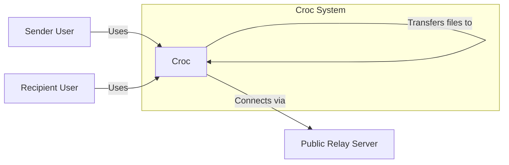
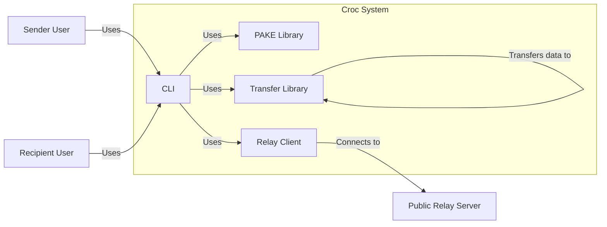
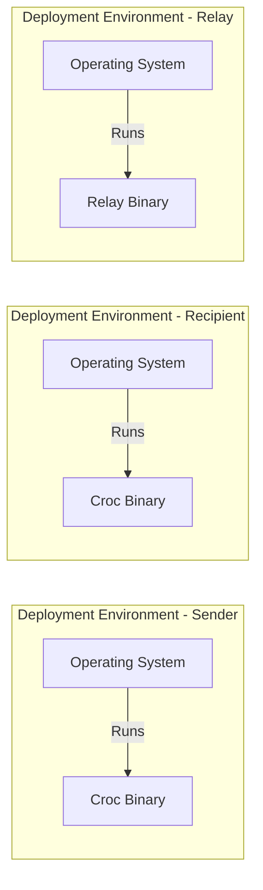
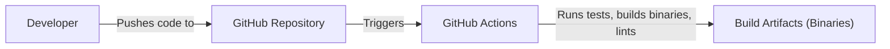

# BUSINESS POSTURE

Croc is a tool that allows any two computers to simply and securely transfer files and folders. The primary business goal appears to be providing a user-friendly, secure, and efficient way to transfer files between any two computers, regardless of their operating system or network configuration. It aims to simplify a common task that often involves complex setups or reliance on third-party services.

Business priorities:

- Ease of use: The tool should be simple to use for non-technical users.
- Security: File transfers must be secure and protect user data.
- Cross-platform compatibility: Support various operating systems.
- Reliability: Transfers should be reliable and resumeable.
- Speed: Transfers should be as fast as possible.
- Open Source: Project is open source and available for everyone.

Most important business risks:

- Data breaches: Unauthorized access to files during transfer.
- Data loss: Files being lost or corrupted during transfer.
- Man-in-the-middle attacks: Attackers intercepting or modifying transfers.
- Relay server compromise: If the relay server is compromised, it could be used to eavesdrop on or manipulate transfers.
- Denial of service: Attackers could flood the relay server, making it unavailable.
- Software vulnerabilities: Vulnerabilities in the Croc codebase could be exploited.

# SECURITY POSTURE

Existing security controls:

- security control: End-to-end encryption using PAKE (Password-Authenticated Key Exchange) protocol (libs/pake). Specifically, it uses the SPAKE2 protocol. This ensures that files are encrypted before leaving the sender's computer and can only be decrypted by the recipient.
- security control: Use of a public relay server with the option to self-host. This allows users to transfer files even if they are behind NATs or firewalls. The relay server only facilitates the connection and does not have access to the encryption keys.
- security control: Code is open source and available for review on GitHub.
- security control: Use of a randomly generated code phrase for establishing the connection between sender and receiver.
- security control: Files are transferred using TCP sockets.

Accepted risks:

- accepted risk: The default relay server is a single point of failure and a potential target for attacks. Users are encouraged to run their own relay servers for increased security and reliability.
- accepted risk: The security of the transfer relies on the secrecy of the code phrase. If the code phrase is compromised, the transfer could be intercepted.
- accepted risk: Croc uses websockets that are not encrypted by default. Encryption is added on application level.

Recommended security controls:

- security control: Implement certificate pinning for the default relay server to prevent man-in-the-middle attacks using forged certificates.
- security control: Provide an option for users to verify the fingerprint of the recipient's public key to further enhance security.
- security control: Implement integrity checks (e.g., hashing) to ensure that files are not corrupted during transfer.
- security control: Regularly conduct security audits and penetration testing of the Croc codebase and the default relay server.
- security control: Implement rate limiting on the relay server to mitigate denial-of-service attacks.
- security control: Provide clear documentation and warnings about the risks of using public relay servers and the importance of keeping the code phrase secret.

Security requirements:

- Authentication:
    - Users are authenticated to each other using a shared secret code phrase (PAKE).
- Authorization:
    - No explicit authorization mechanisms are present. Once the connection is established, both parties have equal access to send and receive files.
- Input validation:
    - The code phrase is validated to ensure it conforms to the expected format.
    - File paths and names should be sanitized to prevent path traversal vulnerabilities.
- Cryptography:
    - End-to-end encryption using PAKE (SPAKE2).
    - Use of strong, well-vetted cryptographic libraries.
    - Secure random number generation for code phrases and encryption keys.

# DESIGN

## C4 CONTEXT

Element descriptions:

- Element:
    - Name: Sender User
    - Type: Person
    - Description: The user initiating the file transfer.
    - Responsibilities: Selects files to send, generates or enters the code phrase, initiates the transfer.
    - Security controls: Uses PAKE for secure key exchange.
- Element:
    - Name: Recipient User
    - Type: Person
    - Description: The user receiving the file transfer.
    - Responsibilities: Enters the code phrase, receives the files.
    - Security controls: Uses PAKE for secure key exchange.
- Element:
    - Name: Croc
    - Type: Software System
    - Description: The Croc application running on both the sender's and recipient's computers.
    - Responsibilities: Handles file encryption/decryption, establishes the connection via the relay server, manages the file transfer.
    - Security controls: End-to-end encryption, code phrase authentication.
- Element:
    - Name: Public Relay Server
    - Type: Software System
    - Description: A publicly available server that facilitates the connection between the sender and recipient.
    - Responsibilities: Relays encrypted data between sender and receiver. Does not have access to the unencrypted data.
    - Security controls: TLS encryption (if configured), rate limiting (recommended).

## C4 CONTAINER

Element descriptions:

- Element:
    - Name: CLI
    - Type: Application
    - Description: Command Line Interface, entry point for user.
    - Responsibilities: Parse user input, orchestrate actions.
    - Security controls: Input validation.
- Element:
    - Name: PAKE Library
    - Type: Library
    - Description: Library implementing Password-Authenticated Key Exchange.
    - Responsibilities: Secure key exchange.
    - Security controls: Cryptographically secure implementation of PAKE.
- Element:
    - Name: Transfer Library
    - Type: Library
    - Description: Library responsible for file transfer.
    - Responsibilities: Encrypt and decrypt files, send and receive files.
    - Security controls: Encryption, integrity checks (recommended).
- Element:
    - Name: Relay Client
    - Type: Library
    - Description: Library responsible for communication with Relay Server.
    - Responsibilities: Connect to Relay Server, send and receive messages.
    - Security controls: TLS encryption (if configured for the relay server).
- Element:
    - Name: Sender User
    - Type: Person
    - Description: The user initiating the file transfer.
    - Responsibilities: Selects files to send, generates or enters the code phrase, initiates the transfer.
    - Security controls: Uses PAKE for secure key exchange.
- Element:
    - Name: Recipient User
    - Type: Person
    - Description: The user receiving the file transfer.
    - Responsibilities: Enters the code phrase, receives the files.
    - Security controls: Uses PAKE for secure key exchange.
- Element:
    - Name: Public Relay Server
    - Type: Software System
    - Description: A publicly available server that facilitates the connection between the sender and recipient.
    - Responsibilities: Relays encrypted data between sender and receiver. Does not have access to the unencrypted data.
    - Security controls: TLS encryption (if configured), rate limiting (recommended).

## DEPLOYMENT

Possible deployment solutions:

1.  Users download pre-built binaries for their operating system.
2.  Users build Croc from source.
3.  Users use package managers (e.g., apt, brew) to install Croc.
4.  Users run Croc in a Docker container.
5.  Users deploy their own relay server using a pre-built binary, Docker image, or by building from source.

Chosen deployment solution (1. Users download pre-built binaries for their operating system):

Element descriptions:

- Element:
    - Name: Sender Operating System
    - Type: Operating System
    - Description: The operating system of the sender's computer.
    - Responsibilities: Provides the environment for running the Croc binary.
    - Security controls: OS-level security controls (e.g., firewalls, access controls).
- Element:
    - Name: Croc Binary
    - Type: Executable
    - Description: The pre-built Croc executable for the sender's operating system.
    - Responsibilities: Executes the Croc application logic.
    - Security controls: Code signing (recommended).
- Element:
    - Name: Recipient Operating System
    - Type: Operating System
    - Description: The operating system of the recipient's computer.
    - Responsibilities: Provides the environment for running the Croc binary.
    - Security controls: OS-level security controls (e.g., firewalls, access controls).
- Element:
    - Name: Recipient Binary
    - Type: Executable
    - Description: The pre-built Croc executable for the recipient's operating system.
    - Responsibilities: Executes the Croc application logic.
    - Security controls: Code signing (recommended).
- Element:
    - Name: Relay Operating System
    - Type: Operating System
    - Description: The operating system of the relay server.
    - Responsibilities: Provides the environment for running the relay server binary.
    - Security controls: OS-level security controls (e.g., firewalls, access controls).
- Element:
    - Name: Relay Binary
    - Type: Executable
    - Description: The pre-built relay server executable.
    - Responsibilities: Executes the relay server application logic.
    - Security controls: Code signing (recommended), regular security updates.

## BUILD

Croc uses GitHub Actions for its build process. The build process is triggered on pushes and pull requests to the main branch.

Build process description:

1.  Developer pushes code changes to the GitHub repository.
2.  GitHub Actions workflow is triggered.
3.  The workflow checks out the code.
4.  The workflow sets up the Go environment.
5.  The workflow runs tests (go test).
6.  The workflow runs linters (golangci-lint).
7.  The workflow builds the Croc binaries for various operating systems and architectures using GoReleaser.
8.  The workflow creates a release on GitHub and uploads the binaries as assets.

Security controls in the build process:

- security control: Automated builds using GitHub Actions ensure consistency and reproducibility.
- security control: Code is automatically tested on every push and pull request.
- security control: Code is automatically linted to identify potential code quality and style issues.
- security control: GoReleaser is used to build binaries for multiple platforms, reducing the risk of manual build errors.
- security control: (Recommended) Implement Software Bill of Materials (SBOM) generation during the build process to track dependencies and identify potential vulnerabilities.
- security control: (Recommended) Integrate Static Application Security Testing (SAST) tools into the GitHub Actions workflow to scan the codebase for vulnerabilities.
- security control: (Recommended) Integrate Dynamic Application Security Testing (DAST) tools, even basic, into build process.
- security control: (Recommended) Sign the released binaries to ensure their integrity and authenticity.

# RISK ASSESSMENT

Critical business processes to protect:

- Secure file transfer between two parties.
- Maintaining the availability and reliability of the default relay server (or providing clear guidance on self-hosting).
- Maintaining the reputation and trustworthiness of the Croc project.

Data to protect and their sensitivity:

- Files being transferred: Sensitivity varies depending on the user and the content of the files. Could range from non-sensitive to highly confidential.
- Code phrase: Highly sensitive. Compromise leads to a complete breakdown of security.
- Metadata about transfers (e.g., file names, sizes, timestamps): Moderately sensitive. Could reveal information about the user's activities.
- Relay server logs (if enabled): Potentially sensitive, depending on the logging level. Could contain IP addresses and other metadata.

# QUESTIONS & ASSUMPTIONS

Questions:

- What is the expected volume of file transfers using the default relay server? This is important for capacity planning and DoS mitigation.
- Are there any plans to monetize Croc? This could influence the security posture and risk appetite.
- What is the process for handling security vulnerabilities reported by external researchers?
- Is there a plan to support U2F/WebAuthn for stronger authentication?

Assumptions:

- Business Posture: Users prioritize ease of use and security. The project aims to remain free and open source.
- Security Posture: The default relay server is trusted to a reasonable extent, but users are aware of the risks and encouraged to self-host for maximum security. The code phrase is kept secret by the users.
- Design: The provided design accurately reflects the current implementation of Croc. The relay server does not store any transferred data permanently. The primary threat model involves attackers attempting to intercept or modify file transfers.