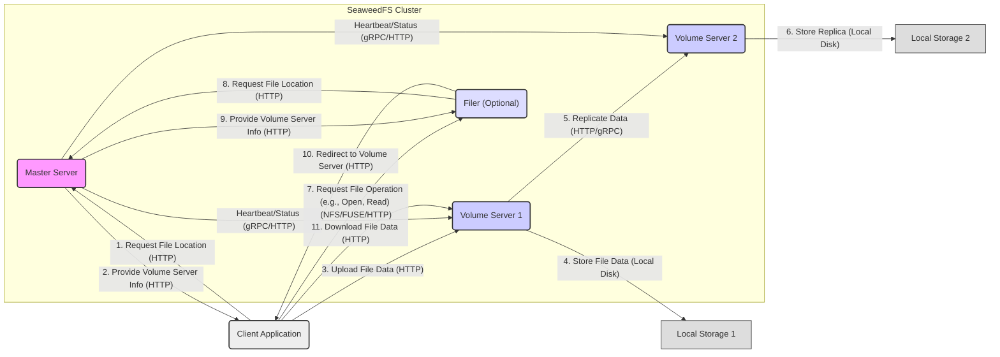

## Project Design Document: SeaweedFS (Improved)

**1. Introduction**

This document provides a detailed architectural design of SeaweedFS, a fast and scalable distributed file system. This document aims to provide a comprehensive understanding of the system's components, their interactions, and data flow, making it suitable for subsequent threat modeling activities. This revision expands on the initial design to provide greater clarity and detail for security analysis.

**1.1. Purpose**

The primary purpose of this document is to outline the architecture of SeaweedFS in sufficient detail to facilitate effective threat modeling. It describes the key components, their responsibilities, and how they interact with each other. This document will serve as a reference point for identifying potential security vulnerabilities, understanding attack surfaces, and designing appropriate mitigation strategies.

**1.2. Scope**

This document covers the core architectural components of SeaweedFS, including the Master Server, Volume Server, and Filer. It also describes the basic data flow for file uploads, storage, and retrieval, as well as more detailed interactions between components. It does not delve into the intricacies of specific implementation details or less central features, but aims to provide a comprehensive overview relevant to security considerations.

**1.3. Target Audience**

This document is intended for security architects, threat modelers, developers, and operations engineers who need a comprehensive understanding of SeaweedFS's architecture for security analysis, risk assessment, and secure deployment.

**2. System Overview**

SeaweedFS is a distributed file system designed for storing and serving large numbers of files quickly. It employs a simple and efficient architecture, separating the metadata management from the actual data storage. Key characteristics include:

*   **Scalability:** Designed to handle petabytes of data and billions of files through horizontal scaling of Volume Servers.
*   **High Performance:** Optimized for fast read and write operations, leveraging direct client-to-Volume Server data transfer.
*   **Simplicity:** Relatively easy to deploy and manage, with a focus on operational efficiency.
*   **Object Storage API:** Provides a RESTful HTTP-based API for object storage operations, enabling integration with various applications.
*   **Filer Support:** Offers an optional Filer component to provide a traditional directory structure and POSIX-like access, bridging the gap between object and file storage paradigms.

**3. Architectural Components**

SeaweedFS consists of several key components that work together to provide its functionality.

*   **Master Server:**
    *   **Responsibilities:** Manages the global metadata of the file system, including volume assignments, file locations (mapping file IDs to volume servers and file offsets), and cluster state. Acts as the central control plane.
    *   **Functionality:**
        *   Tracks available Volume Servers, their storage capacity, and health status.
        *   Assigns new files (or chunks of files) to specific Volume Servers based on available space and replication policies.
        *   Maintains a mapping of file IDs to the location of their data on Volume Servers.
        *   Handles volume replication and failover by orchestrating data synchronization between Volume Servers.
        *   Provides an HTTP API for clients and Filers to request file locations, volume assignments, and cluster status.
        *   Manages cluster topology and ensures consistency of metadata.
    *   **Communication:** Communicates with Volume Servers via gRPC or HTTP for heartbeats and control commands. Interacts with Filers and clients via HTTP for metadata requests and responses.

*   **Volume Server:**
    *   **Responsibilities:** Stores the actual file data (blobs) in configurable storage tiers. Manages local storage resources.
    *   **Functionality:**
        *   Receives and stores file data uploaded by clients, organized into "Needles" (individual file data units).
        *   Serves file data to clients upon request, directly streaming data.
        *   Manages local storage and disk space, including garbage collection of deleted files.
        *   Performs data replication to other Volume Servers as instructed by the Master Server.
        *   Reports its status, available space, and health to the Master Server via heartbeats.
        *   Supports different storage tiers (e.g., memory, disk) for performance optimization.
    *   **Communication:** Communicates with the Master Server via gRPC or HTTP for status updates and control commands. Interacts with clients directly via HTTP for data transfer (uploads and downloads).

*   **Filer (Optional):**
    *   **Responsibilities:** Provides a traditional directory structure and POSIX-like file system interface on top of SeaweedFS's object storage. Translates file system operations into object storage interactions.
    *   **Functionality:**
        *   Manages directory structures, file metadata (names, permissions, timestamps, inodes), and namespace hierarchy.
        *   Translates file system operations (e.g., `mkdir`, `open`, `read`, `write`) into interactions with the Master Server to resolve file locations and then directs client interactions with Volume Servers.
        *   Caches metadata for performance, reducing the load on the Master Server.
        *   Supports features like symbolic links, hard links, and access control lists (ACLs).
        *   Can be configured to use different backend databases for storing its metadata.
    *   **Communication:** Communicates with the Master Server via HTTP to resolve file locations and manage metadata. Interacts with clients via various protocols (e.g., NFS, FUSE, WebDAV, S3 API).

*   **Client:**
    *   **Responsibilities:** Applications or users that interact with SeaweedFS to store and retrieve files. Can interact directly with the object storage API or through the Filer.
    *   **Functionality:**
        *   Uploads files to Volume Servers, following redirection from the Master Server or Filer.
        *   Downloads files from Volume Servers, based on location information obtained from the Master Server or Filer.
        *   Interacts with the Master Server (directly or indirectly through the Filer) to get file locations and manage metadata.
        *   Uses the HTTP API for object storage operations (PUT, GET, DELETE, etc.) or interacts with the Filer via supported protocols.
    *   **Communication:** Communicates with the Master Server and Volume Servers via HTTP. May communicate with the Filer via protocols like NFS, FUSE, WebDAV, or S3 API.

**4. System Architecture Diagram**

**5. Data Flow**

This section describes the typical data flow for common operations, highlighting potential security interaction points.

*   **File Upload (Direct to Volume Server):**
    *   The client sends an upload request to the Master Server (or the Filer).
    *   The Master Server authenticates the request and authorizes the operation.
    *   The Master Server selects an appropriate Volume Server based on available space, replication policy, and potentially proximity to the client.
    *   The Master Server returns the address of the selected Volume Server and a unique file ID (Needle ID) to the client.
    *   The client directly uploads the file data to the designated Volume Server using the provided Volume Server address and file ID via an HTTP PUT request.
    *   The Volume Server stores the file data as a Needle on its local storage.
    *   The Volume Server may initiate replication to other Volume Servers as instructed by the Master Server.
    *   The Master Server updates its metadata with the file location and replication status.

*   **File Retrieval (Direct from Volume Server):**
    *   The client requests the location of a file from the Master Server (or the Filer).
    *   The Master Server authenticates the request and authorizes the operation.
    *   The Master Server provides the address(es) of the Volume Server(s) storing the file data.
    *   The client directly downloads the file data from one of the Volume Servers using an HTTP GET request with the file ID.

*   **File Upload via Filer:**
    *   The client interacts with the Filer using a supported protocol (e.g., NFS, SMB, HTTP).
    *   The Filer authenticates and authorizes the client request.
    *   The Filer communicates with the Master Server to obtain a Volume Server assignment.
    *   The Filer redirects the client to the assigned Volume Server for data upload.
    *   The client uploads the data to the Volume Server.
    *   The Filer updates its metadata with the file information.

*   **File Deletion:**
    *   The client (or Filer) sends a delete request to the Master Server.
    *   The Master Server authenticates and authorizes the request.
    *   The Master Server marks the file as deleted in its metadata.
    *   The Master Server informs the relevant Volume Servers to mark the corresponding Needle as deleted, which will be reclaimed during garbage collection.

**6. Communication Protocols**

*   **Master Server - Volume Server:** gRPC (preferred for performance and efficiency) or HTTP (for simpler deployments or specific use cases). Used for heartbeats, status updates, volume management commands, and replication instructions.
*   **Client - Master Server:** HTTP. Used for metadata requests (file locations, volume assignments), and potentially for administrative operations.
*   **Client - Volume Server:** HTTP. Used for direct data transfer (uploads and downloads).
*   **Filer - Master Server:** HTTP. Used for resolving file locations, managing metadata, and interacting with the control plane.
*   **Client - Filer:** Varies depending on the Filer's configuration and the chosen access protocol. Examples include:
    *   NFS (Network File System)
    *   FUSE (Filesystem in Userspace)
    *   WebDAV (Web Distributed Authoring and Versioning)
    *   S3 API (for object storage compatibility)

**7. Data Storage**

*   **Volume Servers:** Store the actual file data as binary blobs (Needles) on local disk. Can utilize different storage engines and potentially multiple storage tiers (e.g., SSD, HDD).
*   **Master Server:** Stores metadata, including volume assignments, file ID to location mappings, and cluster state, typically in an embedded key-value store like BadgerDB for performance and resilience. Can also be configured to use external databases for larger deployments.
*   **Filer:** Stores file system metadata (directories, permissions, inodes, timestamps, etc.) in a separate database. Common choices include:
    *   SQL databases (e.g., MySQL, PostgreSQL)
    *   NoSQL databases (e.g., etcd, Redis)

**8. Security Considerations (Detailed for Threat Modeling)**

This section outlines security considerations and potential threats that should be thoroughly explored during the threat modeling process.

*   **Authentication and Authorization:**
    *   **Threat:** Unauthorized access to data or control plane.
    *   **Considerations:**
        *   How are clients authenticated when interacting with the Master Server, Volume Servers, and Filer APIs? (e.g., API keys, OAuth 2.0, mutual TLS).
        *   How is access control enforced for file uploads, downloads, and management operations? (e.g., role-based access control, ACLs).
        *   Are there different levels of access control for different users, applications, or API endpoints?
        *   How are authentication credentials managed and stored securely?
        *   Is there protection against brute-force attacks on authentication mechanisms?

*   **Data Confidentiality and Integrity:**
    *   **Threat:** Data breaches, unauthorized data modification.
    *   **Considerations:**
        *   Is data encrypted in transit between clients and servers (HTTPS/TLS)? Are secure ciphers used?
        *   Is data encrypted at rest on Volume Servers? What encryption mechanisms are supported and how are keys managed?
        *   How is data integrity ensured during storage and retrieval? (e.g., checksums, data verification).
        *   Are there mechanisms to detect and prevent data tampering?

*   **Network Security:**
    *   **Threat:** Man-in-the-middle attacks, eavesdropping, unauthorized access to internal components.
    *   **Considerations:**
        *   How are the communication channels between components secured? (e.g., TLS for HTTP/gRPC).
        *   Are there any exposed network ports that could be vulnerable? What services are listening on these ports?
        *   Are there network segmentation considerations to isolate different components and limit the impact of breaches?
        *   Are firewalls or network policies in place to restrict access to specific ports and services?

*   **Availability and Resilience:**
    *   **Threat:** Denial of service, data loss due to component failures.
    *   **Considerations:**
        *   How does SeaweedFS handle failures of Master Servers and Volume Servers? (e.g., leader election, data replication).
        *   What mechanisms are in place for data replication and recovery? What is the replication factor?
        *   Are there any single points of failure? How is the Master Server made highly available?
        *   Are there rate limiting or other mechanisms to prevent denial-of-service attacks?

*   **Input Validation:**
    *   **Threat:** Injection attacks (e.g., SQL injection, command injection).
    *   **Considerations:**
        *   How are inputs from clients and other components validated to prevent injection attacks?
        *   Are there proper sanitization and encoding of user-supplied data?

*   **API Security:**
    *   **Threat:** Exploitation of API vulnerabilities.
    *   **Considerations:**
        *   How are the HTTP APIs secured against common web vulnerabilities (e.g., cross-site scripting (XSS), cross-site request forgery (CSRF))?
        *   Are there security headers implemented (e.g., Content-Security-Policy, HTTP Strict Transport Security)?
        *   Is input validation performed on API requests?

*   **Filer Security:**
    *   **Threat:** Unauthorized access to file system data and metadata.
    *   **Considerations:**
        *   If the Filer is used, how are the chosen access protocols (e.g., NFS, SMB) secured? (e.g., Kerberos, encryption).
        *   How is the Filer's metadata database secured? (e.g., access controls, encryption at rest).
        *   Are there vulnerabilities in the Filer's implementation of file system semantics?

*   **Dependency Management:**
    *   **Threat:** Vulnerabilities in third-party libraries.
    *   **Considerations:**
        *   How are dependencies managed and updated?
        *   Are there processes for monitoring and patching known vulnerabilities in dependencies?

**9. Deployment Considerations**

*   SeaweedFS can be deployed on various infrastructure platforms, including:
    *   Cloud environments (e.g., AWS, Azure, GCP) leveraging virtual machines, containers, and managed services.
    *   On-premise data centers using physical servers or virtualized infrastructure.
    *   Containerized environments (e.g., Docker, Kubernetes) for scalability and orchestration.

*   Deployment typically involves setting up:
    *   A cluster of Master Servers (typically an odd number for quorum-based leader election) for high availability and fault tolerance.
    *   Multiple Volume Server instances distributed across different availability zones or racks to provide storage capacity, redundancy, and performance.
    *   Optional Filer instances, potentially load-balanced, to provide traditional file system access.

*   Security considerations during deployment include:
    *   Secure configuration of network firewalls and security groups.
    *   Properly configuring authentication and authorization mechanisms.
    *   Encrypting communication channels and data at rest.
    *   Regular security patching of the operating system and SeaweedFS components.
    *   Implementing monitoring and logging for security events.

**10. Future Considerations**

*   Further enhancements and features that might impact the architecture and security include:
    *   Integration with more sophisticated authentication and authorization providers (e.g., LDAP, Active Directory).
    *   Advanced data lifecycle management features (e.g., automated tiering, data retention policies).
    *   Improved monitoring and logging capabilities with integration into security information and event management (SIEM) systems.
    *   Support for more granular access control mechanisms.
    *   Enhanced auditing capabilities for tracking user and system actions.

**11. Conclusion**

This document provides an improved and more detailed overview of the SeaweedFS architecture, detailing its key components, data flow, communication protocols, and crucial security considerations. This information serves as a robust foundation for conducting thorough threat modeling exercises to identify, assess, and mitigate potential security risks. The detailed security considerations outlined in this document provide a starting point for a comprehensive security analysis of SeaweedFS deployments.
