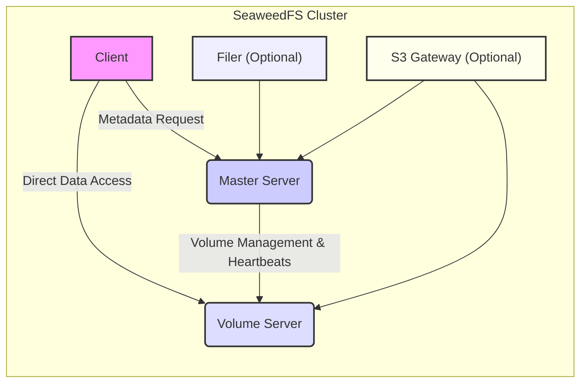
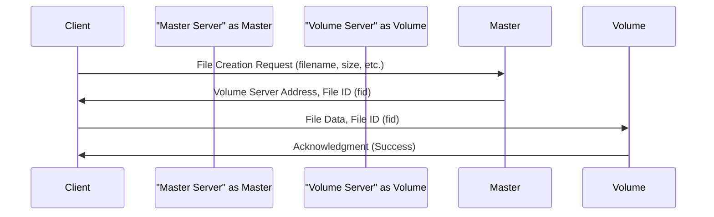
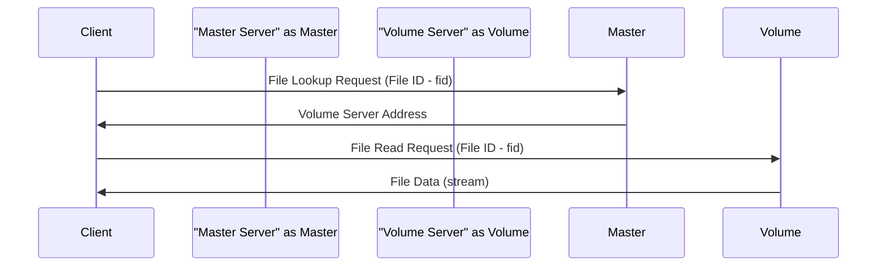

# Project Design Document: SeaweedFS

**Version:** 1.1
**Date:** October 26, 2023
**Author:** Gemini (AI Expert)

## 1. Project Overview

This document provides an enhanced design overview of SeaweedFS, a high-performance distributed file system with an object store interface. It aims to offer a detailed understanding of the system's architecture, core components, and data flow, specifically tailored for subsequent threat modeling activities. SeaweedFS is engineered for efficient storage and retrieval of large volumes of files.

## 2. Goals

* Present a comprehensive architectural overview of SeaweedFS.
* Detail the responsibilities, key functions, and internal aspects of each core component.
* Clearly illustrate the typical data flow for both read and write operations using sequence diagrams.
* Highlight potential security considerations and areas of interest for future threat modeling exercises.
* Serve as a robust foundational document for security analysis and discussions.

## 3. Non-Goals

* Provide an exhaustive feature list or delve into every system functionality.
* Detail the low-level implementation specifics or code-level details of each component.
* Conduct a formal threat analysis or identify specific, actionable vulnerabilities.
* Offer detailed deployment guides, configuration instructions, or operational procedures.
* Cover uncommon edge cases, error handling mechanisms in detail, or less frequent operational scenarios.

## 4. System Architecture

SeaweedFS employs a master-slave architecture designed for simplicity, speed, and scalability. The primary components are:

* **Master Server:**  The central metadata manager, responsible for tracking file locations and managing volume server assignments. It does not handle the actual file data.
* **Volume Server:**  The data storage unit, responsible for storing the actual file data within volumes. The system can scale horizontally by adding more volume servers.
* **Client:**  The interface for users or applications to interact with SeaweedFS. It communicates with the Master Server for metadata operations and directly with Volume Servers for data transfer.
* **Filer (Optional):**  An optional component providing a traditional hierarchical file system namespace and semantics on top of the underlying object store.
* **S3 Gateway (Optional):**  An optional component that enables access to SeaweedFS using the widely adopted Amazon S3 API protocol.

## 5. Component Details

### 5.1. Master Server

* **Core Responsibilities:**
    * **Metadata Management:** Stores and manages the file namespace, including file IDs and their corresponding volume server locations.
    * **Volume Management:** Tracks the health, capacity, and availability of volume servers within the cluster.
    * **Assignment and Allocation:** Assigns new files to appropriate volume servers based on factors like available space and replication policies.
    * **Namespace Operations:** Handles metadata-related operations such as file creation, deletion, and lookup requests.
    * **Cluster Coordination:** Oversees volume rebalancing, garbage collection processes, and ensures overall cluster consistency.
* **Key Functions:**
    * **File Creation Handling:** Receives requests to create new files, selects a suitable volume server, and returns the volume server address and a unique file ID to the client.
    * **File Deletion Handling:** Processes file deletion requests by marking the corresponding metadata entry as deleted.
    * **File Lookup Service:** Provides a mechanism to query the location (volume server address) of a file given its unique file ID.
    * **Volume Server Heartbeats:** Receives periodic health updates from volume servers to monitor their status.
* **Internal Aspects Relevant to Security:**
    * Stores critical metadata, making its integrity and availability paramount.
    * Serves as the central point for authentication and authorization decisions for metadata operations.
    * Its performance and availability directly impact the overall system.

### 5.2. Volume Server

* **Core Responsibilities:**
    * **Data Storage:** Stores the actual file data within allocated volumes on local storage.
    * **Data Serving:** Handles direct read and write requests for file data from clients.
    * **Local Storage Management:** Manages the disk space within its assigned volumes and reports usage to the Master Server.
    * **Health Reporting:** Periodically reports its status, available space, and health metrics to the Master Server.
* **Key Functions:**
    * **File Write Handling:** Receives file data and the corresponding file ID from clients and stores the data in its local storage.
    * **File Read Handling:** Retrieves the requested file data from its local storage based on the provided file ID and streams it back to the client.
    * **Data Integrity Checks:** May implement mechanisms for ensuring the integrity of stored data (e.g., checksums).
* **Internal Aspects Relevant to Security:**
    * Contains the actual file data, making it a primary target for unauthorized access.
    * Needs robust access control mechanisms to ensure only authorized clients can read or write data.
    * Data at rest encryption may be a concern depending on security requirements.

### 5.3. Client

* **Core Responsibilities:**
    * **API Interaction:** Implements the SeaweedFS API to interact with the cluster.
    * **Metadata Operations:** Communicates with the Master Server for metadata-related operations like file creation and lookup.
    * **Data Transfer:** Directly interacts with Volume Servers to upload and download file data.
* **Key Functions:**
    * **File Upload:** Sends file creation requests to the Master Server and subsequently uploads the file data to the designated Volume Server.
    * **File Download:** Queries the Master Server for the location of a file and then downloads the file data directly from the corresponding Volume Server.
    * **File Deletion:** Sends deletion requests to the Master Server.
* **Internal Aspects Relevant to Security:**
    * May store credentials required to authenticate with the Master Server.
    * Needs to establish secure connections with both the Master Server and Volume Servers.
    * The client's security posture can impact the overall security of the system.

### 5.4. Filer (Optional)

* **Core Responsibilities:**
    * **File System Abstraction:** Provides a traditional file system interface (directories, permissions, etc.) on top of the object store.
    * **Metadata Translation:** Translates file system operations into underlying object store operations.
    * **Metadata Caching:** May cache metadata to improve performance for frequent file system operations.
* **Key Functions:**
    * **Namespace Management:** Handles operations related to directories (creation, deletion, listing).
    * **Permission Management:** Enforces file system permissions (read, write, execute).
    * **File Operations:** Supports standard file operations like open, close, read, write, and delete.
* **Internal Aspects Relevant to Security:**
    * Responsible for enforcing file system level access control.
    * Caching mechanisms need to be secure to prevent unauthorized access to metadata.

### 5.5. S3 Gateway (Optional)

* **Core Responsibilities:**
    * **S3 API Compatibility:** Provides an interface that adheres to the Amazon S3 API specifications.
    * **Protocol Translation:** Translates incoming S3 API requests into corresponding SeaweedFS operations.
* **Key Functions:**
    * **Object Storage Operations:** Handles S3 object operations like PUT (upload), GET (download), DELETE, and LIST.
    * **Authentication Handling:** Typically handles S3 authentication mechanisms (e.g., AWS Signature Version 4).
* **Internal Aspects Relevant to Security:**
    * Responsible for authenticating and authorizing S3 clients.
    * Needs to securely map S3 concepts (buckets, objects) to SeaweedFS concepts.

## 6. Data Flow

### 6.1. File Write Operation (Detailed)

1. The **Client** initiates a file upload by sending a file creation request to the **Master Server**. This request may include metadata about the file.
2. The **Master Server**, upon receiving the request, selects an appropriate **Volume Server** based on factors like available storage capacity, replication policies, and potentially load balancing algorithms.
3. The **Master Server** responds to the **Client**, providing the network address of the selected **Volume Server** and a unique file ID (fid) for the new file.
4. The **Client** then directly establishes a connection with the designated **Volume Server**.
5. The **Client** sends the actual file data along with the assigned file ID to the **Volume Server**.
6. The **Volume Server** receives the file data and stores it within its allocated volume.
7. Upon successful storage, the **Volume Server** sends an acknowledgment back to the **Client**, confirming the successful write operation.

### 6.2. File Read Operation (Detailed)

1. The **Client** initiates a file download by sending a file lookup request to the **Master Server**, providing the file ID (fid) of the file it wants to retrieve.
2. The **Master Server** consults its metadata store to locate the **Volume Server** that holds the data for the requested file ID.
3. The **Master Server** responds to the **Client** with the network address of the **Volume Server** hosting the file.
4. The **Client** establishes a direct connection with the identified **Volume Server**.
5. The **Client** sends a file read request to the **Volume Server**, including the file ID.
6. The **Volume Server** retrieves the requested file data from its local storage based on the provided file ID.
7. The **Volume Server** streams the file data back to the **Client**.

## 7. Security Considerations (For Future Threat Modeling)

This section expands upon potential security considerations to guide future threat modeling efforts.

* **Authentication and Authorization Mechanisms:**
    * **Client to Master Server:** How are clients authenticated when interacting with the Master Server for metadata operations? Are API keys, tokens, or other mechanisms used?
    * **Client to Volume Server:** How are clients authorized to access specific files on Volume Servers? Is authorization solely based on the file ID obtained from the Master Server?
    * **Filer Authentication:** How are users or applications authenticating when using the Filer interface? How are file system permissions enforced?
    * **S3 Gateway Authentication:** Does the S3 Gateway support standard AWS authentication mechanisms like Signature Version 4? How are S3 buckets and objects mapped to SeaweedFS permissions?
* **Data Security (Confidentiality and Integrity):**
    * **Data at Rest Encryption:** Is there support for encrypting file data stored on Volume Servers? If so, how are encryption keys managed?
    * **Data in Transit Encryption:** Are communications between clients and servers (Master and Volume) encrypted using protocols like TLS?
    * **Metadata Integrity:** How is the integrity of the metadata stored on the Master Server ensured? Are there mechanisms to prevent tampering?
* **Network Security and Access Control:**
    * **Network Segmentation:** Are there recommendations or best practices for network segmentation to isolate SeaweedFS components?
    * **Firewall Rules:** What are the necessary firewall rules to allow communication between different components? Are default ports configurable?
* **Availability and Resilience from a Security Perspective:**
    * **Denial of Service (DoS) Attacks:** How resilient are the Master Server and Volume Servers against DoS attacks? Are there rate limiting or other protective measures?
* **Input Validation and Sanitization:**
    * How are inputs to the Master Server and Volume Servers validated to prevent injection attacks (e.g., command injection, path traversal)?
* **Dependency and Supply Chain Security:**
    * What are the security implications of third-party libraries and dependencies used by SeaweedFS? Are there processes for vulnerability scanning and management?
* **API Security Best Practices:**
    * Are there security best practices enforced for the SeaweedFS API and the S3 Gateway API (e.g., rate limiting, input validation, output encoding)?

## 8. Deployment Considerations

The security posture of a SeaweedFS deployment can be significantly influenced by the deployment environment and configuration.

* **On-Premise Deployments:** Require careful consideration of network security, physical security of servers, and access control management.
* **Cloud Deployments:** Leverage cloud provider security features (e.g., VPCs, security groups, IAM roles) but require proper configuration and management.
* **Containerized Deployments (Docker, Kubernetes):** Benefit from container security features but require attention to container image security and orchestration platform security.

## 9. Future Considerations

Future development efforts could include enhancements in the following security areas:

* **Granular Access Control:** Implementing more fine-grained access control mechanisms beyond basic file-level permissions.
* **Centralized Key Management:** Providing a robust and centralized solution for managing encryption keys.
* **Enhanced Auditing and Logging:** Implementing more detailed audit logging for security monitoring and incident response.
* **Integration with Security Information and Event Management (SIEM) Systems:** Facilitating integration with SIEM systems for centralized security monitoring.

This enhanced design document provides a more detailed foundation for understanding SeaweedFS architecture and its security considerations, facilitating more effective threat modeling activities.