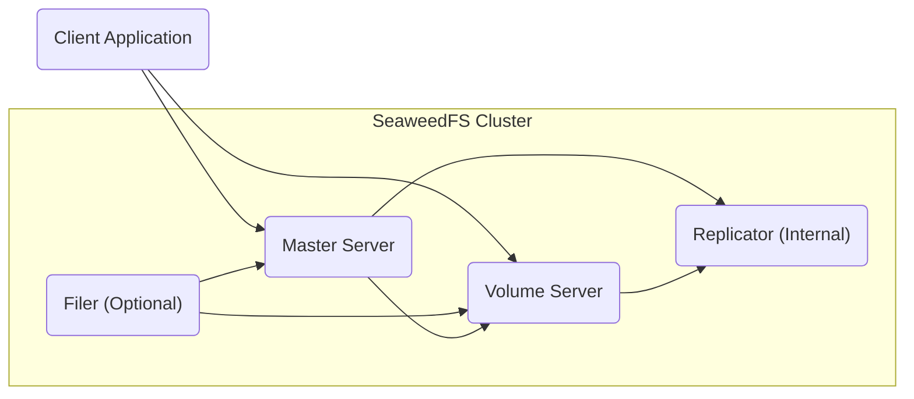
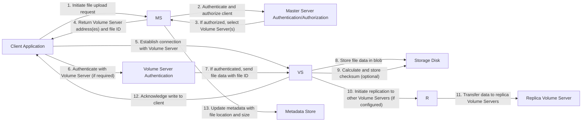
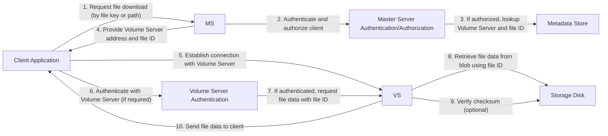

# Project Design Document: SeaweedFS

**Version:** 1.1
**Date:** October 26, 2023
**Author:** AI Software Architect

## 1. Introduction

This document provides an enhanced and more detailed design overview of the SeaweedFS project, an open-source distributed file system with an object store. This document aims to clearly articulate the system's architecture, components, and data flow, serving as a robust foundation for subsequent threat modeling activities. The information presented here is based on the project's public documentation and source code available at [https://github.com/seaweedfs/seaweedfs](https://github.com/seaweedfs/seaweedfs). This revision includes more specific details relevant to security considerations.

## 2. Goals

*   Provide a comprehensive and detailed architectural overview of SeaweedFS.
*   Clearly identify key components, their specific responsibilities, and internal workings.
*   Describe the data flow within the system for both read and write operations with greater granularity.
*   Highlight potential security-relevant aspects of the design, including potential vulnerabilities and existing security mechanisms.
*   Serve as a robust and informative basis for conducting thorough threat modeling.

## 3. System Overview

SeaweedFS is designed as a simple and highly scalable distributed file system. It primarily consists of two core server types: Master Servers and Volume Servers. Clients interact with the system to store and retrieve files. Optionally, a Filer component can be used to provide a more traditional file system interface, and a Replicator ensures data redundancy.

*   **Master Server:** Manages global metadata about the file system, including volume assignments, file locations (file IDs within volumes), and cluster state.
*   **Volume Server:** Stores the actual file data in append-only files called "blobs" within volumes.
*   **Client Application:** Applications that interact with SeaweedFS to store, retrieve, and manage files.
*   **Filer (Optional):** Provides a standard file system interface (like NFS, S3, or WebDAV) on top of SeaweedFS, managing namespace and permissions.
*   **Replicator (Internal):**  An internal process within Volume Servers responsible for replicating data to other Volume Servers for redundancy.

## 4. Component Details

### 4.1. Master Server

*   **Purpose:**
    *   Acts as the central coordinator and metadata manager for the SeaweedFS cluster.
    *   Maintains the authoritative mapping of file keys to volume servers and file IDs.
    *   Tracks the health and capacity of Volume Servers.
    *   Handles volume creation, deletion, and assignment.
    *   Manages namespace operations (directories, permissions) when a Filer is in use.
    *   Provides APIs for clients to request file locations and for Volume Servers to register and report status.
*   **Functionality:**
    *   **Volume Management:** Creates new volumes on Volume Servers, marks volumes as read-only or read-write, and manages volume decommissioning.
    *   **Location Lookup:**  Resolves file keys to specific Volume Servers and file IDs within those servers. This involves looking up metadata stored in its internal store (often an embedded database like BoltDB or a distributed consensus system like Raft).
    *   **Write Assignment:**  Selects the appropriate Volume Server(s) for new file writes based on factors like available space, replication policies, and load balancing algorithms.
    *   **Garbage Collection Coordination:**  Initiates and coordinates garbage collection processes on Volume Servers to reclaim space from deleted files.
    *   **Cluster Membership and Health Monitoring:**  Maintains a registry of active Volume Servers, monitors their heartbeat signals, and detects failures.
    *   **Namespace Management (with Filer):**  Stores and manages the hierarchical file system structure, including directories, file names, permissions, and metadata like modification times.
    *   **ID Generation:** Generates unique file IDs.
*   **Interactions:**
    *   Receives file upload and download requests (indirectly, for location lookup) from clients.
    *   Receives registration requests, heartbeat signals, and volume status updates from Volume Servers.
    *   Issues commands to Volume Servers for volume management tasks (e.g., compaction, replication).
    *   Interacts with the Filer to handle namespace operations and metadata updates.
    *   May interact with other Master Servers in a high-availability setup using a consensus protocol.
*   **Security Considerations:**
    *   **Authentication and Authorization:**  Needs robust mechanisms to authenticate clients and Volume Servers. Consider the methods used (e.g., API keys, mutual TLS). Authorization policies are crucial to control access to metadata and administrative functions.
    *   **Metadata Integrity:**  Protecting the integrity of the metadata store is paramount. Consider mechanisms like checksums, transaction logs, and backups.
    *   **Availability and Fault Tolerance:**  As a central point of control, the Master Server's availability is critical. High-availability deployments using consensus protocols (like Raft) are essential. Consider the resilience against network partitions and node failures.
    *   **Protection against Denial-of-Service (DoS):**  Mechanisms to prevent resource exhaustion from excessive requests are needed.
    *   **Secure Inter-Component Communication:** Communication with Volume Servers and Filers should be secured (e.g., using TLS).

### 4.2. Volume Server

*   **Purpose:**
    *   Provides the actual storage for file data (blobs).
    *   Serves read and write requests for files stored on its assigned volumes.
    *   Manages the physical storage space allocated to it, typically on local disks.
    *   Reports its storage capacity, health, and usage to the Master Server.
*   **Functionality:**
    *   **Data Storage:** Stores file data in append-only files (blobs) within volumes. Each volume typically consists of multiple blob files.
    *   **Read Operations:** Retrieves file data based on the provided file ID and offset within its stored blobs.
    *   **Write Operations:** Appends new file data to the end of the current blob file.
    *   **Deletion Operations (Logical):** Marks files as deleted in its internal index. Physical deletion occurs during compaction.
    *   **Replication:**  Participates in data replication by receiving data from other Volume Servers or pushing data to replica servers.
    *   **Erasure Coding (Optional):**  Implements erasure coding schemes to provide data redundancy with less storage overhead than full replication.
    *   **Compaction:**  Reclaims disk space by rewriting live data and discarding deleted data. This process helps maintain storage efficiency.
    *   **Checksum Verification:**  Calculates and verifies checksums of stored data to ensure data integrity.
*   **Interactions:**
    *   Receives direct read and write requests from clients.
    *   Registers with the Master Server and sends periodic heartbeat signals.
    *   Receives volume management commands from the Master Server (e.g., compaction, replication tasks).
    *   Communicates with other Volume Servers for data replication and erasure coding operations.
*   **Security Considerations:**
    *   **Authentication and Authorization:**  Needs to authenticate clients making read and write requests. Consider how access is controlled based on file IDs.
    *   **Data Integrity:**  Ensuring the integrity of stored data is crucial. Checksums and other data integrity mechanisms are vital. Protection against bit rot should be considered.
    *   **Secure Storage at Rest (Encryption):**  Consider options for encrypting data at rest on the underlying storage.
    *   **Protection against Unauthorized Access:**  Preventing unauthorized access to the raw storage or the Volume Server process is important.
    *   **Secure Inter-Component Communication:** Communication with the Master Server and other Volume Servers should be secured.

### 4.3. Client Application

*   **Purpose:**
    *   Acts as the interface for users or applications to interact with SeaweedFS.
    *   Provides functionalities to upload, download, and manage files.
*   **Functionality:**
    *   **File Upload:** Sends file data to the appropriate Volume Server(s) after obtaining the location from the Master Server.
    *   **File Download:** Retrieves file data directly from the Volume Server(s) identified by the Master Server.
    *   **File Deletion:** Sends a deletion request to the Master Server (or Filer).
    *   **Metadata Operations (Directly with Master or via Filer):** Depending on whether a Filer is used, clients might interact directly with the Master Server for basic operations or through the Filer for more complex file system interactions.
*   **Interactions:**
    *   Sends requests to the Master Server to obtain the location of Volume Servers for specific files.
    *   Sends read and write requests directly to Volume Servers.
    *   May interact with the Filer for namespace operations (create directories, list files, etc.).
*   **Security Considerations:**
    *   **Secure Authentication:**  Clients need to authenticate securely with the SeaweedFS cluster. Consider the authentication methods supported (e.g., API keys, OAuth).
    *   **Secure Data Transmission:**  Communication between the client and the Master Server and Volume Servers should be encrypted (e.g., using HTTPS/TLS).
    *   **Protection of Credentials:**  Securely managing and storing client credentials is essential.

### 4.4. Filer (Optional)

*   **Purpose:**
    *   Provides a traditional file system abstraction on top of SeaweedFS's object storage model.
    *   Manages the hierarchical namespace (directories and files), permissions, and metadata associated with files.
    *   Translates file system operations (like `open`, `read`, `write`, `mkdir`) into interactions with the Master and Volume Servers.
*   **Functionality:**
    *   **Namespace Management:** Creates, deletes, renames, and manages directories and files. Stores the directory structure and file metadata.
    *   **Permission Management:**  Enforces file and directory permissions (e.g., POSIX-style permissions).
    *   **File System Operations:** Implements standard file system operations, handling the translation to object storage operations.
    *   **Metadata Caching:**  Caches frequently accessed metadata to improve performance.
    *   **Access Control:**  Manages access control lists (ACLs) or other permission models.
    *   **Integration with Access Protocols:**  Provides interfaces for accessing the file system via protocols like NFS, S3, or WebDAV.
*   **Interactions:**
    *   Receives file system operation requests from clients (e.g., via NFS, S3 API calls).
    *   Interacts with the Master Server to resolve file paths to file IDs and volume locations, and to update metadata.
    *   Interacts with Volume Servers to read and write file data on behalf of clients.
*   **Security Considerations:**
    *   **Authentication and Authorization:**  Needs robust mechanisms to authenticate clients accessing the file system via supported protocols. Authorization policies based on file and directory permissions are crucial.
    *   **Metadata Integrity:**  Protecting the integrity of the namespace metadata is vital.
    *   **Secure Access Protocol Implementations:**  Ensuring the security of the implemented access protocols (NFS, S3, WebDAV) is critical. This includes proper authentication, authorization, and secure communication channels.
    *   **Protection against Path Traversal Attacks:**  Properly validating file paths to prevent access to unauthorized parts of the file system.

### 4.5. Replicator (Internal Component)

*   **Purpose:**
    *   Ensures data redundancy and availability by creating and maintaining copies of file data on multiple Volume Servers.
*   **Functionality:**
    *   **Data Replication:** Copies file data from a source Volume Server to one or more replica Volume Servers based on configured replication policies.
    *   **Consistency Management:**  Ensures consistency between the original data and its replicas.
    *   **Failure Handling:**  Facilitates failover to replica Volume Servers in case of a primary Volume Server failure.
    *   **Replication Strategies:**  Supports different replication strategies (e.g., synchronous, asynchronous).
*   **Interactions:**
    *   Receives instructions from the Master Server regarding replication tasks and policies.
    *   Communicates directly with other Volume Servers to transfer data for replication.
*   **Security Considerations:**
    *   **Secure Data Transfer:**  Data transferred between Volume Servers for replication should be encrypted.
    *   **Authentication and Authorization:**  Volume Servers involved in replication need to authenticate each other.
    *   **Integrity of Replicated Data:**  Mechanisms to ensure the integrity of the replicated data during transfer and storage.

## 5. Data Flow

### 5.1. File Write Operation (Detailed)

1. The client application initiates a file upload request to the Master Server.
2. The Master Server authenticates and authorizes the client.
3. If authorized, the Master Server selects one or more appropriate Volume Servers based on available space, replication policies, and load balancing.
4. The Master Server returns the address(es) of the selected Volume Server(s) and a unique file ID to the client.
5. The client application establishes a direct connection with the assigned Volume Server.
6. The client may need to authenticate with the Volume Server, depending on the security configuration.
7. The client sends the file data along with the assigned file ID to the Volume Server.
8. The Volume Server stores the file data in an append-only blob file on its local storage.
9. Optionally, the Volume Server calculates and stores a checksum of the data for integrity verification.
10. If replication is configured, the Volume Server initiates the replication process to other designated Volume Servers.
11. The Replicator component (within the Volume Server) transfers the data to the replica Volume Servers.
12. The Volume Server sends an acknowledgment back to the client upon successful write.
13. The Master Server updates its metadata store with the file's location (Volume Server and file ID), size, and other relevant information.

### 5.2. File Read Operation (Detailed)

1. The client application sends a request to the Master Server (or Filer) to download a file, typically identified by a file key or path.
2. The Master Server authenticates and authorizes the client.
3. If authorized, the Master Server looks up the file's location (Volume Server address and file ID) in its metadata store.
4. The Master Server provides the address of the Volume Server and the file ID to the client.
5. The client application establishes a direct connection with the identified Volume Server.
6. The client may need to authenticate with the Volume Server.
7. The client sends a request to the Volume Server for the file data, including the file ID.
8. The Volume Server retrieves the requested file data from its local storage using the provided file ID.
9. Optionally, the Volume Server verifies the checksum of the retrieved data.
10. The Volume Server sends the file data back to the client application.

## 6. Security Considerations (Detailed)

This section expands on the initial security considerations, providing more specific examples and potential threats:

*   **Authentication and Authorization:**
    *   **Threats:** Unauthorized access to data, metadata manipulation, unauthorized administrative actions.
    *   **Considerations:**
        *   Mechanisms for authenticating clients interacting with the Master Server (e.g., API keys, OAuth 2.0).
        *   Mechanisms for authenticating Volume Servers registering with the Master Server (e.g., shared secrets, mutual TLS).
        *   Access control policies for managing who can read, write, or delete files (especially relevant with the Filer). Consider role-based access control (RBAC).
        *   Authorization checks at both the Master Server (for metadata operations) and Volume Servers (for data access).
*   **Data Confidentiality:**
    *   **Threats:** Exposure of sensitive data in transit or at rest.
    *   **Considerations:**
        *   Encryption of data in transit between clients and servers (HTTPS/TLS).
        *   Encryption of data at rest on Volume Server storage (e.g., using LUKS, file system-level encryption, or application-level encryption). Key management for encryption is a critical aspect.
*   **Data Integrity:**
    *   **Threats:** Data corruption, unauthorized modification of data.
    *   **Considerations:**
        *   Use of checksums or other data integrity mechanisms on Volume Servers to detect data corruption.
        *   Mechanisms to ensure the integrity of metadata stored on the Master Server (e.g., transaction logs, write-ahead logs).
        *   Protection against accidental or malicious data modification.
*   **Availability:**
    *   **Threats:** Denial of service, system failures leading to data unavailability.
    *   **Considerations:**
        *   High-availability deployment of the Master Server using a consensus protocol (e.g., Raft).
        *   Data replication across multiple Volume Servers to tolerate server failures.
        *   Mechanisms to handle network partitions and ensure consistency.
        *   Rate limiting and other DoS prevention measures.
*   **Network Security:**
    *   **Threats:** Man-in-the-middle attacks, eavesdropping, unauthorized access to internal components.
    *   **Considerations:**
        *   Securing communication channels between all components using TLS.
        *   Proper firewall configuration to restrict access to exposed services.
        *   Regular security audits of network configurations.
*   **Input Validation:**
    *   **Threats:** Injection attacks (e.g., SQL injection if a database is used, command injection), buffer overflows.
    *   **Considerations:**
        *   Thorough validation of all inputs received from clients and between servers.
        *   Sanitization of data before processing or storing it.
*   **Logging and Auditing:**
    *   **Threats:** Lack of visibility into security events, difficulty in investigating incidents.
    *   **Considerations:**
        *   Comprehensive logging of security-relevant events (e.g., authentication attempts, authorization failures, administrative actions).
        *   Secure storage and management of logs.
        *   Mechanisms for auditing access to data and metadata.

## 7. Deployment Considerations

*   SeaweedFS offers flexibility in deployment, suitable for various environments:
    *   **Cloud Environments (AWS, Azure, GCP):** Leveraging cloud-native services for storage, networking, and compute. Consider using managed Kubernetes services for orchestration. Security considerations include securing cloud IAM roles and permissions, network security groups, and encryption provided by the cloud provider.
    *   **On-Premise Deployments:**  Deploying on physical servers or virtual machines within a private data center. Security considerations include physical security of the hardware, network segmentation, and managing the underlying infrastructure.
    *   **Containerized Deployments (Docker, Kubernetes):**  Packaging components into containers for easier deployment and management. Security considerations include container image security, secure orchestration platform configuration, and network policies within the container environment.
*   **Master Server Deployment:**  Typically deployed in a clustered, highly-available configuration (e.g., using Raft consensus with 3 or 5 nodes) to ensure resilience. Leader election mechanisms are crucial.
*   **Volume Server Deployment:**  Can be scaled horizontally by adding more servers as storage needs grow. Consider data locality and network bandwidth when deploying Volume Servers.
*   **Filer Deployment:** Can be deployed as a separate service, potentially with multiple instances for high availability and load balancing. Consider the security implications of the chosen access protocols (NFS, S3, WebDAV).

## 8. Future Considerations

*   Detailed design of specific security features like encryption key management and access control mechanisms.
*   Implementation details of different authentication and authorization methods.
*   Consideration of integration with external authentication providers (e.g., LDAP, Active Directory).
*   Detailed design of the Filer component's interaction with access protocols and security implications.
*   Exploration of different storage backends used by Volume Servers and their security characteristics.
*   In-depth analysis of replication and erasure coding mechanisms and their impact on data security and availability.

This enhanced document provides a more detailed and security-focused understanding of the SeaweedFS architecture, serving as a more robust foundation for subsequent threat modeling activities.