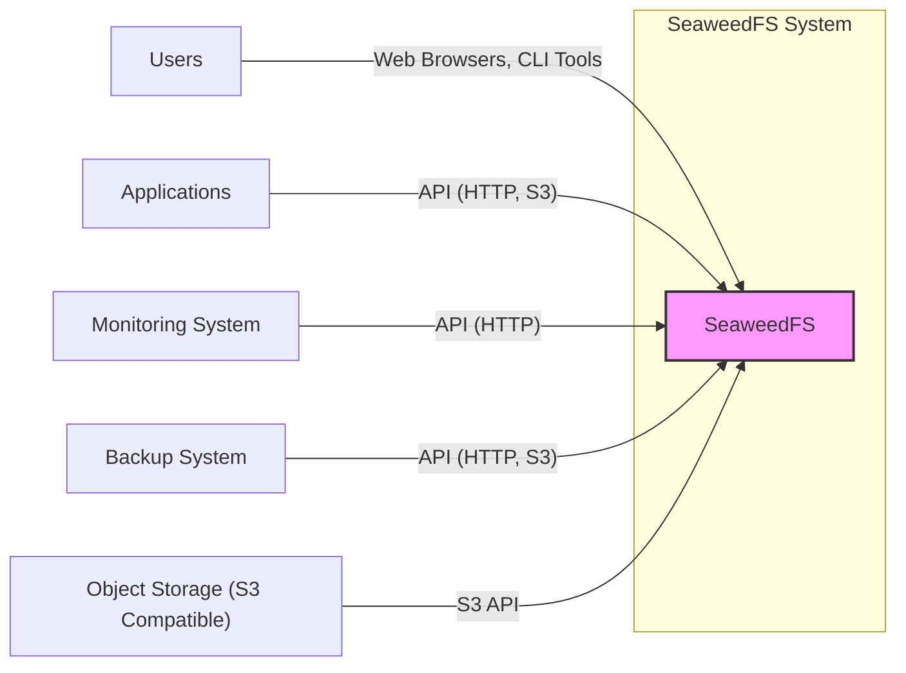
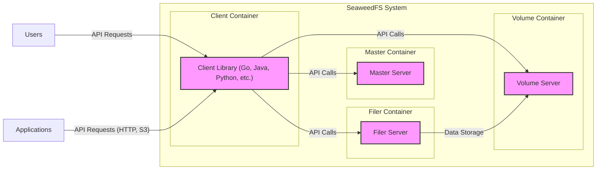
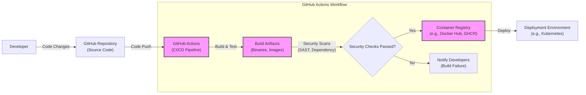

# BUSINESS POSTURE

- Business Priorities and Goals:
  - Priority 1: High Performance and Scalability. SeaweedFS is designed for fast read and write operations and to scale to handle large amounts of data and high request rates. This is critical for applications requiring low latency and high throughput storage.
  - Priority 2: Data Durability and Availability. Ensuring data is reliably stored and accessible is paramount. Data loss or prolonged downtime can have significant business impact.
  - Priority 3: Cost Efficiency. Optimizing storage utilization and operational costs is important for managing infrastructure expenses, especially at scale.
  - Priority 4: Ease of Use and Integration.  Simple APIs and compatibility with existing systems (like S3) are important for developer adoption and reducing integration effort.

- Most Important Business Risks:
  - Risk 1: Data Loss or Corruption. Failure of storage nodes, software bugs, or malicious attacks could lead to data loss or corruption, impacting data integrity and business operations.
  - Risk 2: Performance Degradation.  System overload, network issues, or inefficient configurations could lead to performance degradation, impacting application responsiveness and user experience.
  - Risk 3: Unauthorized Access to Data.  Lack of proper access controls or vulnerabilities in authentication and authorization mechanisms could lead to unauthorized access to sensitive data, resulting in data breaches and compliance violations.
  - Risk 4: Service Downtime.  Failures in critical components, operational errors, or security incidents could cause service downtime, impacting business continuity and availability of applications relying on SeaweedFS.
  - Risk 5: Vendor Lock-in.  Heavy reliance on a specific storage solution could create vendor lock-in, limiting flexibility and potentially increasing costs in the long term.

# SECURITY POSTURE

- Existing Security Controls:
  - security control: Access Control Lists (ACLs) for buckets and objects. Implemented within SeaweedFS Filer and S3 API.
  - security control: HTTPS support for API endpoints. Configurable during SeaweedFS setup.
  - security control: Basic Authentication for API access. Configurable during SeaweedFS setup.
  - security control: Data replication across volume servers for fault tolerance. Implemented within SeaweedFS volume server logic.
  - security control: Erasure coding for data redundancy and storage efficiency. Implemented within SeaweedFS volume server logic.
  - security control: Input validation on API requests. Implemented within SeaweedFS API handlers.
  - security control: Logging of API requests and system events. Configurable within SeaweedFS master and volume servers.

- Accepted Risks:
  - accepted risk: Reliance on basic authentication might be insufficient for highly sensitive environments.
  - accepted risk: Lack of built-in encryption at rest. Users are responsible for implementing encryption if required.
  - accepted risk: Limited built-in audit logging capabilities. More comprehensive audit logging might be needed for compliance requirements.
  - accepted risk: Potential vulnerabilities in third-party dependencies. Requires ongoing monitoring and patching of dependencies.

- Recommended Security Controls:
  - security control: Implement Role-Based Access Control (RBAC) for finer-grained access management.
  - security control: Integrate with external authentication providers (e.g., OAuth 2.0, LDAP) for stronger authentication.
  - security control: Implement encryption at rest for data confidentiality.
  - security control: Enhance audit logging to capture more security-relevant events and integrate with security information and event management (SIEM) systems.
  - security control: Implement regular security vulnerability scanning and penetration testing.
  - security control: Establish a secure software development lifecycle (SSDLC) incorporating security reviews and testing at each stage.
  - security control: Implement automated security checks in the CI/CD pipeline (SAST, DAST, dependency scanning).

- Security Requirements:
  - Authentication:
    - Requirement: Securely authenticate users and applications accessing SeaweedFS APIs.
    - Requirement: Support for strong authentication mechanisms beyond basic authentication (e.g., API keys, OAuth 2.0).
    - Requirement: Option to integrate with existing identity providers.
  - Authorization:
    - Requirement: Implement granular authorization controls to manage access to buckets and objects based on user roles or application permissions.
    - Requirement: Enforce the principle of least privilege.
    - Requirement: Support for ACLs and potentially RBAC.
  - Input Validation:
    - Requirement: Validate all inputs from API requests to prevent injection attacks (e.g., command injection, path traversal).
    - Requirement: Sanitize inputs before processing and storing data.
    - Requirement: Implement input validation on both client-side and server-side.
  - Cryptography:
    - Requirement: Use HTTPS for all API communication to protect data in transit.
    - Requirement: Consider encryption at rest for sensitive data stored in SeaweedFS.
    - Requirement: Securely manage cryptographic keys used for encryption.

# DESIGN

- C4 CONTEXT



- C4 CONTEXT Elements:
  - - Name: SeaweedFS
      - Type: Software System
      - Description: Distributed storage system for blobs, objects, files, and data lake. Provides high-performance, scalable, and cost-efficient storage.
      - Responsibilities: Storing and retrieving data, managing storage volumes, handling API requests, ensuring data durability and availability.
      - Security controls: Access control lists (ACLs), HTTPS for API endpoints, basic authentication, input validation, logging.
  - - Name: Users
      - Type: Person
      - Description: End-users who interact with applications that use SeaweedFS for storage. Can also be administrators managing SeaweedFS directly.
      - Responsibilities: Accessing and managing data stored in SeaweedFS through applications or direct API interaction.
      - Security controls: Authentication to applications, potentially direct authentication to SeaweedFS for management tasks.
  - - Name: Applications
      - Type: Software System
      - Description: Various applications (web applications, mobile apps, microservices, etc.) that require storage and retrieval of files and objects.
      - Responsibilities: Utilizing SeaweedFS API to store and retrieve data for their functionalities.
      - Security controls: Application-level authentication and authorization, secure API communication with SeaweedFS.
  - - Name: Monitoring System
      - Type: Software System
      - Description: System used to monitor the health, performance, and security of SeaweedFS. Examples: Prometheus, Grafana, ELK stack.
      - Responsibilities: Collecting metrics and logs from SeaweedFS, alerting on anomalies, providing dashboards for visualization.
      - Security controls: Secure API access to SeaweedFS metrics and logs, access control to monitoring dashboards.
  - - Name: Backup System
      - Type: Software System
      - Description: System responsible for backing up data stored in SeaweedFS for disaster recovery and data protection. Examples: Cloud backup services, custom backup scripts.
      - Responsibilities: Periodically backing up SeaweedFS data, restoring data in case of data loss.
      - Security controls: Secure API access to SeaweedFS for backup operations, encryption of backups, secure storage of backups.
  - - Name: Object Storage (S3 Compatible)
      - Type: External System
      - Description: External object storage services or systems that are compatible with the S3 API. SeaweedFS can act as an S3-compatible storage.
      - Responsibilities: Interoperability with S3 ecosystem, potentially migrating data to or from other S3-compatible storage.
      - Security controls: S3 API authentication and authorization mechanisms, network security between SeaweedFS and external S3 storage.

- C4 CONTAINER



- C4 CONTAINER Elements:
  - - Name: Master Server
      - Type: Container - Go Application
      - Description: Manages metadata, volume assignments, cluster topology, and coordination between volume servers.
      - Responsibilities: Metadata management, volume allocation, cluster health monitoring, API endpoint for client and filer interactions.
      - Security controls: Access control for administrative APIs, secure communication with volume servers, logging of administrative actions.
  - - Name: Volume Server
      - Type: Container - Go Application
      - Description: Stores the actual data blobs. Manages data replication, erasure coding, and data retrieval.
      - Responsibilities: Data storage and retrieval, data replication, erasure coding, handling read/write requests for data blobs.
      - Security controls: Access control to data blobs, data integrity checks, secure communication with master server, potentially encryption at rest.
  - - Name: Filer Server
      - Type: Container - Go Application
      - Description: Optional component providing a file system interface on top of SeaweedFS, supporting features like directories, permissions, and metadata. Can also provide S3 API compatibility.
      - Responsibilities: File system namespace management, S3 API emulation, metadata management for files and directories, interaction with master and volume servers.
      - Security controls: Access control lists (ACLs) for files and directories, S3 API authentication and authorization, input validation for file system operations.
  - - Name: Client Library (Go, Java, Python, etc.)
      - Type: Container - Software Library
      - Description: Libraries in various programming languages that applications can use to interact with SeaweedFS API.
      - Responsibilities: Providing convenient API abstractions for applications to store and retrieve data from SeaweedFS, handling communication with master and volume servers.
      - Security controls: Secure API client implementation, handling authentication credentials securely, input validation before sending requests to SeaweedFS.

- DEPLOYMENT

- Deployment Options:
  - Option 1: Cloud Deployment (AWS, GCP, Azure). Deploy SeaweedFS components (Master, Volume, Filer) on cloud virtual machines or container services (e.g., Kubernetes). Leverage cloud-managed services for networking, storage, and monitoring.
  - Option 2: On-Premise Deployment. Deploy SeaweedFS on physical servers or virtual machines within a private data center. Requires managing infrastructure, networking, and storage directly.
  - Option 3: Hybrid Deployment. Combine cloud and on-premise resources, potentially using cloud for master servers and on-premise for volume servers for data locality or compliance reasons.

- Detailed Deployment (Cloud Deployment - AWS using Kubernetes):

```mermaid
flowchart LR
    subgraph "AWS Cloud"
        subgraph "Kubernetes Cluster"
            subgraph "Namespace: seaweedfs"
                A["Master Pod\n(Master Server)"]
                B["Volume Pods\n(Volume Servers)"]
                C["Filer Pods\n(Filer Servers)"]
            end
        end
        D["Load Balancer\n(External)"] -- HTTPS --> A & C
        E["EBS Volumes\n(Persistent Storage)"] -- Mount --> B
        F["CloudWatch\n(Monitoring)"] <-- A & B & C
        G["S3\n(Backup Storage)"] <-- C
        H["Internet"] -- HTTPS --> D
    end
    style A fill:#f9f,stroke:#333,stroke-width:2px
    style B fill:#f9f,stroke:#333,stroke-width:2px
    style C fill:#f9f,stroke:#333,stroke-width:2px
```

- DEPLOYMENT Elements (Cloud Deployment - AWS using Kubernetes):
  - - Name: Kubernetes Cluster
      - Type: Infrastructure - Container Orchestration Platform
      - Description: AWS Elastic Kubernetes Service (EKS) cluster used to orchestrate and manage SeaweedFS containers.
      - Responsibilities: Container deployment, scaling, health management, networking, and resource allocation for SeaweedFS components.
      - Security controls: Kubernetes RBAC, network policies, pod security policies, security audits of Kubernetes configurations.
  - - Name: Master Pod (Master Server)
      - Type: Container - Pod in Kubernetes
      - Description: Kubernetes pod running the SeaweedFS Master Server container.
      - Responsibilities: Metadata management, volume allocation, cluster coordination within the Kubernetes environment.
      - Security controls: Kubernetes network policies to restrict access, resource limits, security context configurations.
  - - Name: Volume Pods (Volume Servers)
      - Type: Container - Pods in Kubernetes
      - Description: Multiple Kubernetes pods running SeaweedFS Volume Server containers.
      - Responsibilities: Data storage and retrieval, data replication, erasure coding within the Kubernetes environment, persistent storage using EBS volumes.
      - Security controls: Kubernetes network policies, resource limits, security context configurations, encryption at rest on EBS volumes (if configured).
  - - Name: Filer Pods (Filer Servers)
      - Type: Container - Pods in Kubernetes
      - Description: Kubernetes pods running SeaweedFS Filer Server containers (optional, depending on file system or S3 API needs).
      - Responsibilities: File system interface, S3 API emulation within the Kubernetes environment.
      - Security controls: Kubernetes network policies, resource limits, security context configurations, access control lists managed by Filer.
  - - Name: Load Balancer (External)
      - Type: Infrastructure - AWS Elastic Load Balancer (ELB)
      - Description: AWS ELB used to expose SeaweedFS Master and Filer services to external users and applications over HTTPS.
      - Responsibilities: Load balancing traffic to Master and Filer pods, TLS termination, external access point for SeaweedFS APIs.
      - Security controls: HTTPS configuration, security groups to restrict access to specific ports and IP ranges, regular security audits of load balancer configurations.
  - - Name: EBS Volumes (Persistent Storage)
      - Type: Infrastructure - AWS Elastic Block Storage (EBS)
      - Description: AWS EBS volumes attached to Volume Server pods for persistent data storage.
      - Responsibilities: Providing durable and persistent storage for data blobs managed by Volume Servers.
      - Security controls: EBS volume encryption, access control policies for EBS volumes, regular backups of EBS volumes.
  - - Name: CloudWatch (Monitoring)
      - Type: Service - AWS CloudWatch
      - Description: AWS CloudWatch used for monitoring SeaweedFS components, collecting logs and metrics.
      - Responsibilities: Monitoring system health, performance, and security events, alerting on anomalies.
      - Security controls: Access control to CloudWatch logs and metrics, secure API access to CloudWatch.
  - - Name: S3 (Backup Storage)
      - Type: Service - AWS S3
      - Description: AWS S3 used for storing backups of SeaweedFS data (optional, depending on backup strategy).
      - Responsibilities: Secure and durable storage for SeaweedFS backups.
      - Security controls: S3 bucket policies for access control, S3 server-side encryption, S3 versioning for data recovery.

- BUILD



- BUILD Elements:
  - - Name: Developer
      - Type: Person
      - Description: Software developers contributing code to the SeaweedFS project.
      - Responsibilities: Writing code, committing changes to the repository, participating in code reviews.
      - Security controls: Secure development practices, code review process, access control to the GitHub repository.
  - - Name: GitHub Repository (Source Code)
      - Type: Code Repository - GitHub
      - Description: GitHub repository hosting the SeaweedFS source code.
      - Responsibilities: Version control, source code management, collaboration platform for development.
      - Security controls: Access control to the repository, branch protection rules, audit logging of repository activities.
  - - Name: GitHub Actions (CI/CD Pipeline)
      - Type: CI/CD Service - GitHub Actions
      - Description: GitHub Actions workflows used for automating the build, test, security scanning, and deployment processes.
      - Responsibilities: Automated build process, running tests, performing security scans, publishing build artifacts, deploying to environments.
      - Security controls: Secure workflow definitions, secrets management for credentials, access control to GitHub Actions workflows, audit logging of workflow executions.
  - - Name: Build Artifacts (Binaries, Images)
      - Type: Artifact - Docker Images, Binaries
      - Description: Compiled binaries and container images produced by the build process.
      - Responsibilities: Packaging software for distribution and deployment.
      - Security controls: Integrity checks (e.g., checksums) for build artifacts, signing of artifacts (optional).
  - - Name: Security Scans (SAST, Dependency)
      - Type: Security Tool - Static Analysis Security Testing (SAST), Dependency Scanning
      - Description: Security scanning tools integrated into the CI/CD pipeline to identify vulnerabilities in the code and dependencies.
      - Responsibilities: Automated vulnerability detection, providing feedback to developers on security issues.
      - Security controls: Configuration of security scanning tools, vulnerability reporting and tracking, integration with developer workflows.
  - - Name: Container Registry (e.g., Docker Hub, GHCR)
      - Type: Artifact Repository - Container Registry
      - Description: Container registry (e.g., GitHub Container Registry) used to store and distribute Docker images of SeaweedFS components.
      - Responsibilities: Secure storage and distribution of container images.
      - Security controls: Access control to the container registry, image vulnerability scanning, image signing (optional).
  - - Name: Deployment Environment (e.g., Kubernetes)
      - Type: Environment - Kubernetes Cluster
      - Description: Target environment (e.g., Kubernetes cluster) where SeaweedFS is deployed.
      - Responsibilities: Running SeaweedFS components, providing runtime environment.
      - Security controls: Security controls of the deployment environment (as described in the DEPLOYMENT section).

# RISK ASSESSMENT

- Critical Business Processes:
  - Process 1: Data Storage and Retrieval. This is the core function of SeaweedFS. Disruption or compromise directly impacts applications relying on it.
  - Process 2: Metadata Management. Managing metadata is crucial for data organization and access. Corruption or loss of metadata can lead to data inaccessibility.
  - Process 3: API Access.  Applications and users rely on APIs to interact with SeaweedFS. Security and availability of APIs are essential.
  - Process 4: Data Replication and Durability. Ensuring data is replicated and durable is critical for preventing data loss and maintaining business continuity.

- Data Sensitivity:
  - Data Type: Blobs, Objects, Files, Data Lake data.
  - Sensitivity: Sensitivity varies greatly depending on the use case. Could range from publicly available images to highly confidential business data, financial records, or personal information.
  - Data at Rest: Potentially sensitive data stored on volume servers.
  - Data in Transit: API requests and data transfer between clients and SeaweedFS components.
  - Data in Backups: Backups may contain all types of data stored in SeaweedFS and should be treated with appropriate sensitivity.

# QUESTIONS & ASSUMPTIONS

- BUSINESS POSTURE:
  - Question: What are the specific compliance requirements (e.g., GDPR, HIPAA, PCI DSS) that SeaweedFS needs to adhere to?
  - Assumption: Business prioritizes high performance and scalability over extreme security measures, especially in initial deployments, but security becomes increasingly important as data sensitivity and scale grow.

- SECURITY POSTURE:
  - Question: What is the current level of security awareness and maturity within the SeaweedFS development and operations teams?
  - Assumption: Basic security controls are in place, but there is room for improvement in areas like RBAC, encryption at rest, and comprehensive audit logging.
  - Question: Are there any existing security policies or standards that SeaweedFS must comply with within the organization using it?

- DESIGN:
  - Question: What is the expected scale and performance requirements for the SeaweedFS deployment?
  - Assumption: Deployment will likely be in a cloud environment (AWS, GCP, Azure) using container orchestration (Kubernetes) for scalability and manageability.
  - Assumption: Filer component is used to provide file system and S3 API access, in addition to direct volume server access.
  - Question: What are the specific backup and disaster recovery requirements for SeaweedFS data?
  - Assumption: Backup strategy will involve regular backups to a separate storage location (e.g., S3) and procedures for data restoration in case of failures.