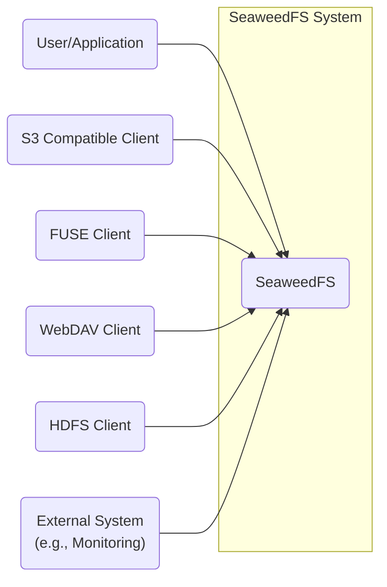
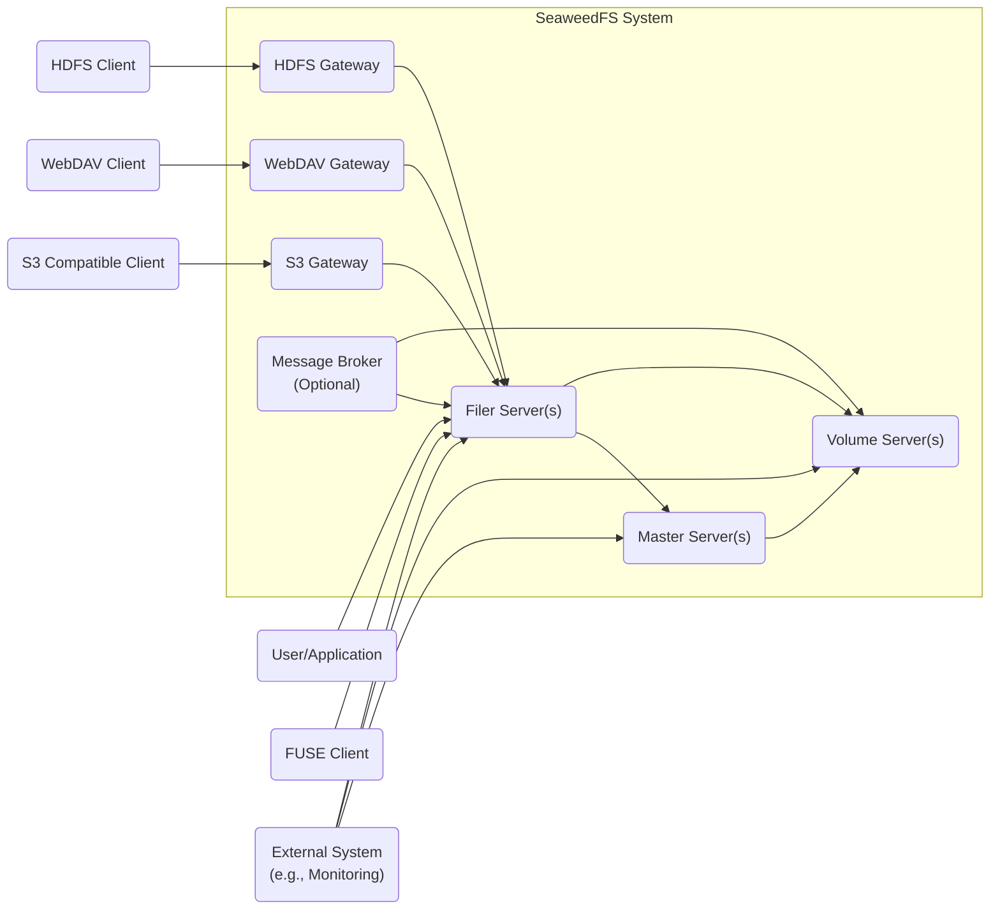
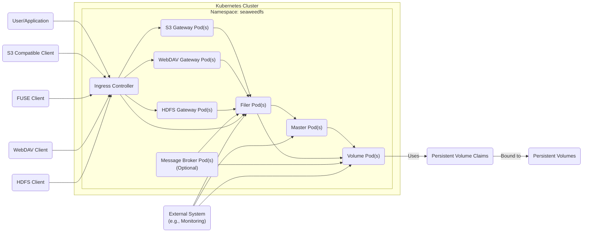
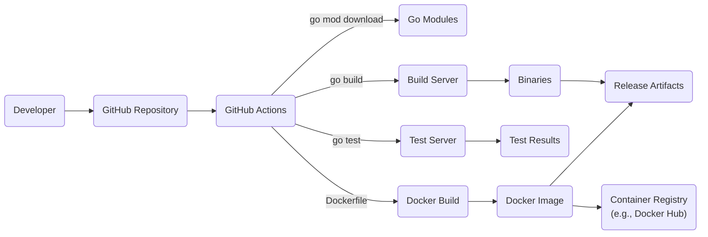

# Project Design Document: SeaweedFS

## BUSINESS POSTURE

SeaweedFS is a distributed file system, aiming to provide fast, scalable, and reliable storage. Based on the GitHub repository, the following business priorities and goals can be inferred:

Priorities:

*   Performance: The project emphasizes speed and low latency for accessing files.
*   Scalability: It's designed to handle large amounts of data and scale horizontally.
*   Simplicity: The system aims for ease of use and deployment.
*   Cost-Effectiveness: By using commodity hardware and efficient storage mechanisms, it aims to reduce storage costs.
*   Availability: The system should provide continuous access to data, even in the face of failures.

Goals:

*   Provide a fast and scalable distributed file system.
*   Offer a simple and easy-to-use storage solution.
*   Support various use cases, including object storage, file storage, and potentially cloud storage.
*   Maintain data integrity and availability.

Business Risks:

*   Data Loss: Failure of storage nodes or volumes could lead to permanent data loss.
*   Data Corruption: Bugs in the software or hardware failures could lead to data corruption.
*   Unauthorized Access: Insufficient access controls could allow unauthorized users to access or modify data.
*   Downtime: System outages could disrupt services that rely on SeaweedFS.
*   Performance Degradation: Under heavy load or due to network issues, the system's performance could degrade, impacting applications.
*   Security Breaches: Vulnerabilities in the software could be exploited by attackers to gain access to data or disrupt the system.

## SECURITY POSTURE

Existing Security Controls:

*   security control: Authentication: Supports access key and secret key authentication for S3 API. (Described in documentation and code).
*   security control: Authorization: Limited authorization capabilities, primarily based on access keys. Fine-grained access control at the object level is not a primary focus. (Described in documentation and code).
*   security control: Data Replication: Data is replicated across multiple storage nodes to ensure availability and prevent data loss. (Described in documentation and code).
*   security control: Encryption at Rest: Supports encryption at rest using customer-provided keys (SSE-C) with the S3 API. (Described in documentation).
*   security control: HTTPS Support: Supports HTTPS for secure communication. (Described in documentation).

Accepted Risks:

*   accepted risk: Limited Authorization Granularity: The system's authorization model is relatively coarse-grained, potentially leading to over-provisioning of access.
*   accepted risk: Reliance on External Authentication for Some Features: Some features, like FUSE mount, may rely on the underlying operating system's authentication mechanisms.
*   accepted risk: Potential for Misconfiguration: Incorrect configuration of replication or security settings could lead to data loss or security vulnerabilities.
*   accepted risk: Limited Auditing: Built-in auditing capabilities are limited.

Recommended Security Controls:

*   security control: Implement Role-Based Access Control (RBAC): Introduce RBAC to provide more granular control over access to data and operations.
*   security control: Enhance Auditing: Implement comprehensive auditing to track all access and modifications to data and configuration.
*   security control: Integrate with Centralized Identity Provider: Allow integration with external identity providers (e.g., LDAP, Active Directory, OIDC) for centralized user management and authentication.
*   security control: Implement Network Segmentation: Use network segmentation to isolate different components of SeaweedFS and limit the impact of potential security breaches.
*   security control: Regular Security Audits and Penetration Testing: Conduct regular security assessments to identify and address vulnerabilities.
*   security control: Data Loss Prevention (DLP): Implement mechanisms to prevent sensitive data from being stored or transmitted insecurely.

Security Requirements:

*   Authentication:
    *   Support strong authentication mechanisms, including multi-factor authentication (MFA).
    *   Integrate with existing enterprise identity providers.
    *   Provide secure key management for API access.
*   Authorization:
    *   Implement fine-grained access control based on roles and permissions.
    *   Enforce the principle of least privilege.
    *   Support access control lists (ACLs) for individual objects.
*   Input Validation:
    *   Validate all input from clients and external systems to prevent injection attacks.
    *   Sanitize file names and metadata to prevent path traversal vulnerabilities.
*   Cryptography:
    *   Use strong encryption algorithms for data at rest and in transit.
    *   Implement secure key management practices.
    *   Regularly update cryptographic libraries to address known vulnerabilities.

## DESIGN

### C4 CONTEXT

Element Descriptions:

*   Element:
    *   Name: User/Application
    *   Type: User
    *   Description: Represents a user or application interacting directly with SeaweedFS.
    *   Responsibilities: Accessing and managing data stored in SeaweedFS.
    *   Security controls: Authentication and authorization via API keys or other supported methods.
*   Element:
    *   Name: S3 Compatible Client
    *   Type: External System
    *   Description: Represents a client using the S3-compatible API.
    *   Responsibilities: Interacting with SeaweedFS using S3 API calls.
    *   Security controls: Authentication and authorization using S3 access keys and secret keys, HTTPS.
*   Element:
    *   Name: FUSE Client
    *   Type: External System
    *   Description: Represents a client mounting SeaweedFS as a file system using FUSE.
    *   Responsibilities: Accessing SeaweedFS as a local file system.
    *   Security controls: Relies on the underlying operating system's authentication and authorization, HTTPS.
*   Element:
    *   Name: WebDAV Client
    *   Type: External System
    *   Description: Represents a client using the WebDAV protocol.
    *   Responsibilities: Accessing and managing files via WebDAV.
    *   Security controls: Authentication and authorization via WebDAV, HTTPS.
*   Element:
    *   Name: HDFS Client
    *   Type: External System
    *   Description: Represents a client using the HDFS interface.
    *   Responsibilities: Accessing SeaweedFS data through HDFS API.
    *   Security controls: Authentication and authorization via HDFS, HTTPS.
*   Element:
    *   Name: External System (e.g., Monitoring)
    *   Type: External System
    *   Description: Represents external systems interacting with SeaweedFS, such as monitoring or logging systems.
    *   Responsibilities: Monitoring the health and performance of SeaweedFS, collecting logs.
    *   Security controls: Authentication and authorization via API keys or other supported methods, HTTPS.
*   Element:
    *   Name: SeaweedFS
    *   Type: System
    *   Description: The SeaweedFS distributed file system.
    *   Responsibilities: Storing and retrieving data, managing metadata, handling replication, and providing various access interfaces.
    *   Security controls: Authentication, authorization, data replication, encryption at rest (optional), HTTPS.

### C4 CONTAINER

Element Descriptions:

*   Element:
    *   Name: Master Server(s)
    *   Type: Container
    *   Description: Manages volume servers and metadata.  Handles volume allocation and lookup.  High availability is achieved through multiple master servers.
    *   Responsibilities: Volume management, metadata management, leader election.
    *   Security controls: Authentication (internal communication), TLS for inter-node communication.
*   Element:
    *   Name: Volume Server(s)
    *   Type: Container
    *   Description: Stores actual data in volumes.
    *   Responsibilities: Data storage, data retrieval, replication.
    *   Security controls: Authentication (internal communication), TLS for inter-node communication, data encryption at rest (optional).
*   Element:
    *   Name: Filer Server(s)
    *   Type: Container
    *   Description: Provides a POSIX-like file system interface and metadata storage.
    *   Responsibilities: File system operations, metadata storage, directory management.
    *   Security controls: Authentication, authorization, TLS, input validation.
*   Element:
    *   Name: S3 Gateway
    *   Type: Container
    *   Description: Provides an S3-compatible API endpoint.
    *   Responsibilities: Translating S3 API calls to SeaweedFS operations.
    *   Security controls: Authentication and authorization using S3 access keys and secret keys, HTTPS.
*   Element:
    *   Name: WebDAV Gateway
    *   Type: Container
    *   Description: Provides a WebDAV interface.
    *   Responsibilities: Translating WebDAV requests to SeaweedFS operations.
    *   Security controls: Authentication and authorization via WebDAV, HTTPS.
*   Element:
    *   Name: HDFS Gateway
    *   Type: Container
    *   Description: Provides an HDFS interface.
    *   Responsibilities: Translating HDFS requests to SeaweedFS operations.
    *   Security controls: Authentication and authorization via HDFS, HTTPS.
*   Element:
    *   Name: Message Broker (Optional)
    *   Type: Container
    *   Description: Used for asynchronous tasks and notifications (e.g., replication events). Examples include Kafka, RabbitMQ.
    *   Responsibilities: Handling asynchronous messages.
    *   Security controls: Authentication and authorization for message broker access, TLS.
*   Element:
    *   Name: User/Application
    *   Type: User
    *   Description: Represents a user or application interacting directly with SeaweedFS Filer.
    *   Responsibilities: Accessing and managing data stored in SeaweedFS.
    *   Security controls: Authentication and authorization via API keys or other supported methods.
*   Element:
    *   Name: S3 Compatible Client
    *   Type: External System
    *   Description: Represents a client using the S3-compatible API.
    *   Responsibilities: Interacting with SeaweedFS using S3 API calls.
    *   Security controls: Authentication and authorization using S3 access keys and secret keys, HTTPS.
*   Element:
    *   Name: FUSE Client
    *   Type: External System
    *   Description: Represents a client mounting SeaweedFS as a file system using FUSE.
    *   Responsibilities: Accessing SeaweedFS as a local file system.
    *   Security controls: Relies on the underlying operating system's authentication and authorization, HTTPS.
*   Element:
    *   Name: WebDAV Client
    *   Type: External System
    *   Description: Represents a client using the WebDAV protocol.
    *   Responsibilities: Accessing and managing files via WebDAV.
    *   Security controls: Authentication and authorization via WebDAV, HTTPS.
*   Element:
    *   Name: HDFS Client
    *   Type: External System
    *   Description: Represents a client using the HDFS interface.
    *   Responsibilities: Accessing SeaweedFS data through HDFS API.
    *   Security controls: Authentication and authorization via HDFS, HTTPS.
*   Element:
    *   Name: External System (e.g., Monitoring)
    *   Type: External System
    *   Description: Represents external systems interacting with SeaweedFS, such as monitoring or logging systems.
    *   Responsibilities: Monitoring the health and performance of SeaweedFS, collecting logs.
    *   Security controls: Authentication and authorization via API keys or other supported methods, HTTPS.

### DEPLOYMENT

SeaweedFS can be deployed in several ways:

1.  Bare Metal: Directly on physical servers.
2.  Virtual Machines: On virtual machines within a private or public cloud.
3.  Containers (Docker): Using Docker containers.
4.  Kubernetes: Orchestrated using Kubernetes.

The chosen deployment model for this design document is **Kubernetes**, as it provides scalability, resilience, and ease of management.

Element Descriptions:

*   Element:
    *   Name: Master Pod(s)
    *   Type: Deployment/Pod
    *   Description: Kubernetes Pod running the SeaweedFS Master server.  Multiple pods can be deployed for high availability.
    *   Responsibilities: Volume management, metadata management, leader election.
    *   Security controls: Authentication (internal communication), TLS for inter-node communication, network policies.
*   Element:
    *   Name: Volume Pod(s)
    *   Type: Deployment/Pod
    *   Description: Kubernetes Pod running the SeaweedFS Volume server.
    *   Responsibilities: Data storage, data retrieval, replication.
    *   Security controls: Authentication (internal communication), TLS for inter-node communication, data encryption at rest (optional), network policies, persistent volume claims.
*   Element:
    *   Name: Filer Pod(s)
    *   Type: Deployment/Pod
    *   Description: Kubernetes Pod running the SeaweedFS Filer server.
    *   Responsibilities: File system operations, metadata storage, directory management.
    *   Security controls: Authentication, authorization, TLS, input validation, network policies.
*   Element:
    *   Name: S3 Gateway Pod(s)
    *   Type: Deployment/Pod
    *   Description: Kubernetes Pod running the SeaweedFS S3 Gateway.
    *   Responsibilities: Translating S3 API calls to SeaweedFS operations.
    *   Security controls: Authentication and authorization using S3 access keys and secret keys, HTTPS, network policies.
*   Element:
    *   Name: WebDAV Gateway Pod(s)
    *   Type: Deployment/Pod
    *   Description: Kubernetes Pod running the SeaweedFS WebDAV Gateway.
    *   Responsibilities: Translating WebDAV requests to SeaweedFS operations.
    *   Security controls: Authentication and authorization via WebDAV, HTTPS, network policies.
*   Element:
    *   Name: HDFS Gateway Pod(s)
    *   Type: Deployment/Pod
    *   Description: Kubernetes Pod running the SeaweedFS HDFS Gateway.
    *   Responsibilities: Translating HDFS requests to SeaweedFS operations.
    *   Security controls: Authentication and authorization via HDFS, HTTPS, network policies.
*   Element:
    *   Name: Message Broker Pod(s) (Optional)
    *   Type: Deployment/Pod
    *   Description: Kubernetes Pod running a message broker (e.g., Kafka, RabbitMQ).
    *   Responsibilities: Handling asynchronous messages.
    *   Security controls: Authentication and authorization for message broker access, TLS, network policies.
*   Element:
    *   Name: Ingress Controller
    *   Type: Ingress
    *   Description: Kubernetes Ingress controller to manage external access to services.
    *   Responsibilities: Routing external traffic to the appropriate SeaweedFS services.
    *   Security controls: TLS termination, potentially WAF integration.
*   Element:
    *   Name: Persistent Volumes (PV)
    *   Type: PersistentVolume
    *   Description: Kubernetes Persistent Volumes representing storage capacity.
    *   Responsibilities: Providing storage for Volume servers.
    *   Security controls: Access controls on the underlying storage, encryption at rest (if supported by the storage provider).
*   Element:
    *   Name: Persistent Volume Claims (PVC)
    *   Type: PersistentVolumeClaim
    *   Description: Kubernetes Persistent Volume Claims requesting storage from Persistent Volumes.
    *   Responsibilities: Requesting storage for Volume servers.
    *   Security controls: Access controls based on Kubernetes RBAC.
*   Element:
    *   Name: User/Application
    *   Type: User
    *   Description: Represents a user or application interacting directly with SeaweedFS Filer.
    *   Responsibilities: Accessing and managing data stored in SeaweedFS.
    *   Security controls: Authentication and authorization via API keys or other supported methods.
*   Element:
    *   Name: S3 Compatible Client
    *   Type: External System
    *   Description: Represents a client using the S3-compatible API.
    *   Responsibilities: Interacting with SeaweedFS using S3 API calls.
    *   Security controls: Authentication and authorization using S3 access keys and secret keys, HTTPS.
*   Element:
    *   Name: FUSE Client
    *   Type: External System
    *   Description: Represents a client mounting SeaweedFS as a file system using FUSE.
    *   Responsibilities: Accessing SeaweedFS as a local file system.
    *   Security controls: Relies on the underlying operating system's authentication and authorization, HTTPS.
*   Element:
    *   Name: WebDAV Client
    *   Type: External System
    *   Description: Represents a client using the WebDAV protocol.
    *   Responsibilities: Accessing and managing files via WebDAV.
    *   Security controls: Authentication and authorization via WebDAV, HTTPS.
*   Element:
    *   Name: HDFS Client
    *   Type: External System
    *   Description: Represents a client using the HDFS interface.
    *   Responsibilities: Accessing SeaweedFS data through HDFS API.
    *   Security controls: Authentication and authorization via HDFS, HTTPS.
*   Element:
    *   Name: External System (e.g., Monitoring)
    *   Type: External System
    *   Description: Represents external systems interacting with SeaweedFS, such as monitoring or logging systems.
    *   Responsibilities: Monitoring the health and performance of SeaweedFS, collecting logs.
    *   Security controls: Authentication and authorization via API keys or other supported methods, HTTPS.

### BUILD

The SeaweedFS build process involves compiling the Go source code and creating binaries or Docker images.

1.  **Source Code Checkout:** Developers check out the source code from the GitHub repository.
2.  **Dependency Management:** Go modules are used to manage dependencies. `go mod download` fetches the required dependencies.
3.  **Compilation:** The Go compiler (`go build`) is used to compile the source code into executables for different components (master, volume, filer, etc.).
4.  **Testing:** Unit tests and integration tests are run using the Go testing framework (`go test`).
5.  **Docker Image Creation (Optional):** Dockerfiles are used to create Docker images for each component. This involves copying the compiled binaries into a base image (e.g., Alpine Linux) and setting the entry point.
6.  **Image Publishing (Optional):** Docker images are pushed to a container registry (e.g., Docker Hub, Quay.io).
7.  **Release Artifacts:** Release artifacts (binaries, Docker images, and potentially configuration files) are created and made available for download.

SeaweedFS uses GitHub Actions for CI/CD.

Security Controls in Build Process:

*   security control: Dependency Scanning: Use tools like `go mod verify` and vulnerability scanners to identify and mitigate vulnerabilities in dependencies.
*   security control: Static Analysis: Integrate static analysis tools (e.g., `go vet`, `staticcheck`) into the build process to identify potential code quality and security issues.
*   security control: Code Signing: Sign binaries and Docker images to ensure their integrity and authenticity.
*   security control: Build Automation: Use GitHub Actions to automate the build process, ensuring consistency and reducing the risk of manual errors.
*   security control: Least Privilege: Build agents should run with minimal privileges.
*   security control: Reproducible Builds: Aim for reproducible builds to ensure that the same source code always produces the same binary output.

## RISK ASSESSMENT

*   Critical Business Processes:
    *   Data Storage and Retrieval: The primary business process is the reliable storage and retrieval of data. Any disruption to this process can have significant consequences.
    *   High Availability: Maintaining continuous access to data is critical for applications relying on SeaweedFS.
    *   Scalability: The ability to scale the system to meet growing storage demands is essential.

*   Data Sensitivity:
    *   The sensitivity of the data stored in SeaweedFS depends on the specific use case. It can range from non-sensitive public data to highly confidential information.
    *   Examples:
        *   Low Sensitivity: Publicly available images or videos.
        *   Medium Sensitivity: User-uploaded content that is not publicly accessible but is not highly confidential.
        *   High Sensitivity: Personally Identifiable Information (PII), financial data, or other confidential business data.

## QUESTIONS & ASSUMPTIONS

*   Questions:
    *   What specific compliance requirements (e.g., GDPR, HIPAA, PCI DSS) must SeaweedFS adhere to, if any?
    *   What are the expected data retention policies?
    *   What are the specific performance requirements (latency, throughput)?
    *   What is the expected growth rate of data storage?
    *   Are there any existing security tools or infrastructure that SeaweedFS should integrate with?
    *   What level of support is required for different client types (S3, FUSE, WebDAV, HDFS)?
    *   What are the disaster recovery requirements?
    *   What is the budget for security controls and tools?

*   Assumptions:
    *   BUSINESS POSTURE: The primary goal is to provide a fast, scalable, and reliable distributed file system. Cost-effectiveness is a significant consideration.
    *   SECURITY POSTURE: The organization has a moderate risk appetite. Basic security controls are in place, but there is room for improvement. The focus is on preventing data loss and unauthorized access.
    *   DESIGN: The Kubernetes deployment model is suitable for the organization's infrastructure. The use of a message broker is optional and depends on specific requirements. The build process relies on GitHub Actions.
    *   The organization has basic monitoring capabilities.
    *   The organization has some level of expertise in managing Kubernetes clusters.