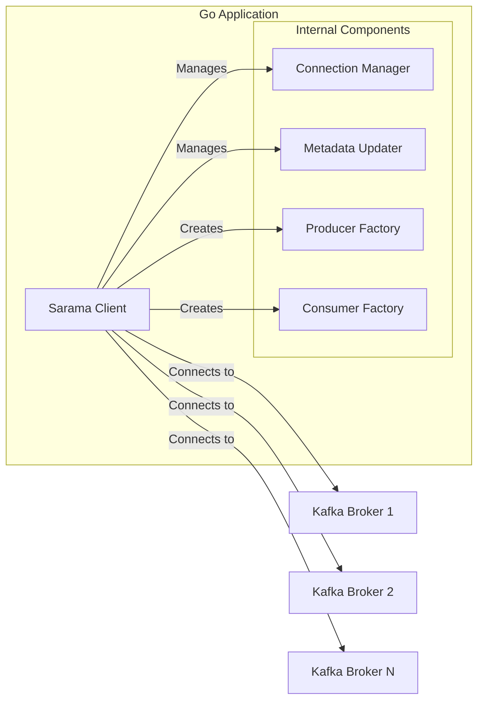
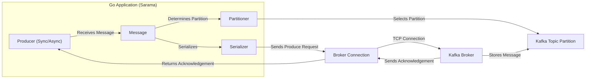
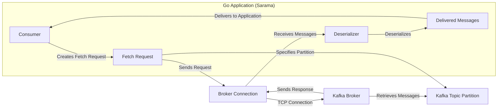
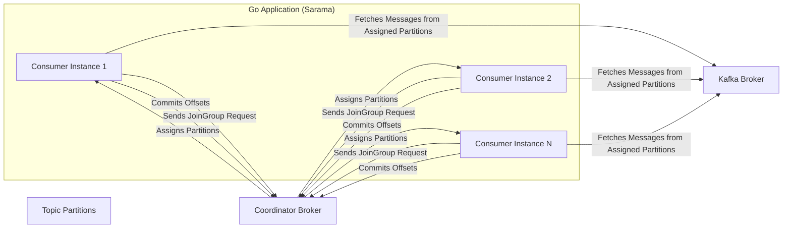

# Project Design Document: Sarama - Go Client Library for Apache Kafka

**Version:** 1.1
**Date:** October 26, 2023
**Author:** AI Software Architect

## 1. Introduction

This document provides an enhanced design overview of the Sarama Go client library for Apache Kafka. It aims to deliver a clear, comprehensive understanding of Sarama's architecture, core components, and data flow mechanisms. This detailed design serves as a crucial artifact for subsequent threat modeling exercises, enabling a thorough evaluation of potential security risks and vulnerabilities associated with its use. Understanding this design is essential for developers integrating Sarama and security professionals assessing its security posture.

## 2. Goals

*   Present a clear and detailed explanation of Sarama's architecture and operational principles.
*   Identify and describe the key components within Sarama and their interactions.
*   Illustrate the data flow for both message production and consumption, highlighting critical steps.
*   Emphasize areas of significant relevance for security considerations and the threat modeling process.
*   Provide sufficient detail to facilitate informed security analysis and mitigation strategies.

## 3. Scope

This document encompasses the essential functionalities of the Sarama library, including:

*   Establishing and managing connections to Apache Kafka brokers.
*   Producing messages to designated Kafka topics with various configurations.
*   Consuming messages from Kafka topics, including the complexities of consumer groups and offset management.
*   Managing and utilizing Kafka metadata, such as topic and partition information, and broker discovery.
*   Handling the underlying communication protocols and structures for various Kafka API requests and responses.

This document explicitly excludes:

*   An in-depth analysis of the internal workings and architecture of the Apache Kafka broker itself.
*   Specific implementation details of application logic that utilizes the Sarama library.
*   Granular code-level implementation details within the Sarama library.

## 4. Target Audience

This document is primarily intended for:

*   Security engineers and architects responsible for conducting threat modeling and security assessments.
*   Software developers integrating the Sarama library into their Go applications.
*   Operations teams responsible for deploying and managing applications using Sarama.
*   Anyone seeking a detailed understanding of Sarama's design and its interaction with Kafka.

## 5. Architectural Overview

Sarama functions as a client-side library, enabling Go applications to interact with Apache Kafka brokers. Its core architecture is centered around managing connections, orchestrating request/response cycles, and providing high-level abstractions for message producers and consumers. The `Client` component acts as the central orchestrator, managing connections and providing access to other functionalities.

## 6. Key Components

*   **`Client`:**
    *   The primary interface for interacting with Kafka through Sarama.
    *   Responsible for bootstrapping and managing connections to the Kafka cluster.
    *   Provides methods for creating `Producer` instances, various types of `Consumer` instances, and cluster administration utilities.
    *   Handles the initial connection handshake and ongoing broker discovery and monitoring.
    *   Internally manages a pool of `Broker Connection` instances.

*   **`Producer`:**
    *   Facilitates the sending of messages to Kafka topics.
    *   Offers both synchronous and asynchronous message sending modes to suit different application needs.
    *   Implements message partitioning strategies to determine the target partition for each message.
    *   Handles message serialization (converting Go objects to byte arrays) and optional compression.
    *   Can be configured for idempotent message delivery.
        *   **`SyncProducer`:** Sends messages and waits for confirmation from the broker.
        *   **`AsyncProducer`:** Sends messages to a buffer and handles acknowledgements asynchronously.

*   **`Consumer`:**
    *   Enables the retrieval of messages from Kafka topics.
    *   Supports different consumption models:
        *   **`Consumer` (Simple Consumer):** Allows direct consumption from specific partitions, requiring manual offset management.
        *   **`ConsumerGroup`:** Enables multiple consumers to coordinate and consume messages from a topic collectively, with automatic partition assignment and offset management handled by a coordinator broker.

*   **`Consumer Group`:**
    *   A higher-level abstraction for coordinated message consumption.
    *   Distributes partitions of a topic among multiple consumer instances within the group.
    *   Relies on a designated `Coordinator` broker to manage group membership, partition assignments, and offset commits.
    *   Handles partition rebalancing when consumers join or leave the group.

*   **`Broker Connection`:**
    *   Represents a persistent, multiplexed TCP connection to a specific Kafka broker.
    *   Manages the underlying communication protocol for sending requests and receiving responses.
    *   Handles connection state management, including reconnection attempts and error handling.
    *   Provides mechanisms for authentication and encryption (TLS).

*   **`Metadata Manager`:**
    *   Responsible for fetching, caching, and updating metadata about the Kafka cluster's topology (topics, partitions, brokers, leaders).
    *   Used by producers to determine the leader broker for a given topic and partition.
    *   Used by consumers to discover partition assignments and the location of the `Coordinator` broker.
    *   Periodically refreshes metadata to reflect changes in the Kafka cluster.

*   **`Coordinator`:**
    *   A specific Kafka broker elected to manage the state of a consumer group.
    *   Handles requests from consumers to join or leave the group.
    *   Performs partition assignment for consumers within the group.
    *   Manages the storage and retrieval of committed offsets for the consumer group.

## 7. Data Flow

### 7.1. Producing Messages

*   The application provides a `Message` to the `Producer`.
*   The `Producer` utilizes a configured `Partitioner` to determine the target partition for the message.
*   The `Serializer` converts the message content into a byte array.
*   The `Producer` sends a produce request containing the serialized message to the appropriate `Broker Connection`.
*   The `Broker Connection` transmits the request over a TCP connection to the designated Kafka broker.
*   The Kafka broker receives the message and stores it in the target `Kafka Topic Partition`.
*   The Kafka broker sends an acknowledgement back to the `Broker Connection`.
*   The `Broker Connection` relays the acknowledgement back to the `Producer`.

### 7.2. Consuming Messages (Simple Consumer)

*   The application creates a `Consumer` instance, specifying the topic and partition to consume from.
*   The `Consumer` constructs a `Fetch Request` targeting the specific partition.
*   The `Consumer` sends the fetch request to the `Broker Connection` associated with the leader broker for that partition.
*   The `Broker Connection` transmits the request over a TCP connection.
*   The Kafka broker retrieves messages from the specified `Kafka Topic Partition`.
*   The Kafka broker sends the retrieved messages back in a response through the `Broker Connection`.
*   The `Deserializer` converts the received byte arrays back into application-level message objects.
*   The `Consumer` delivers the deserialized messages to the application.

### 7.3. Consuming Messages (Consumer Group)

*   Multiple consumer instances join a consumer group by sending `JoinGroup` requests to the `Coordinator` broker.
*   The `Coordinator` broker determines the partition assignment strategy and assigns partitions from the subscribed topics to the consumers in the group.
*   The `Coordinator` sends the partition assignments back to each consumer instance.
*   Each consumer instance establishes connections to the brokers holding its assigned `Topic Partitions`.
*   Consumers send fetch requests to the appropriate brokers to receive messages from their assigned partitions.
*   Consumers periodically commit their processed offsets to the `Coordinator` broker.

## 8. Security Considerations (For Threat Modeling)

The following areas represent key security considerations when utilizing the Sarama library and are crucial for effective threat modeling:

*   **Broker Authentication and Authorization:**
    *   **Threat:** Unauthorized access to Kafka brokers.
    *   How does Sarama authenticate with Kafka brokers? (e.g., SASL/PLAIN, SASL/SCRAM, TLS Client Authentication with certificates).
    *   Are the configured authentication credentials stored securely within the application's environment?
    *   Does the application utilizing Sarama adhere to the principle of least privilege, possessing only the necessary permissions to produce and consume from the intended topics?

*   **Transport Layer Security (TLS):**
    *   **Threat:** Interception and eavesdropping of communication between Sarama and Kafka brokers.
    *   Is TLS encryption enabled for all communication channels between Sarama clients and Kafka brokers?
    *   Are TLS certificates properly validated to prevent man-in-the-middle attacks?
    *   What cipher suites are negotiated and are they considered secure?

*   **Message Security:**
    *   **Threat:** Exposure of sensitive data within messages.
    *   Is message content encrypted at rest within Kafka or in transit beyond the transport layer (TLS)? Sarama itself does not provide application-level encryption.
    *   How is sensitive data handled within the message payload? Are appropriate encryption mechanisms applied before sending messages?

*   **Input Validation (Limited Scope for Sarama):**
    *   **Threat:** Exploitation of vulnerabilities through malicious broker responses.
    *   While Sarama primarily sends data, it also receives responses from Kafka brokers. Are these responses validated for unexpected formats, malicious content, or excessively large payloads that could lead to denial-of-service?

*   **Error Handling and Information Disclosure:**
    *   **Threat:** Leakage of sensitive information through error messages or logs.
    *   How does Sarama handle errors during communication with brokers? Are error messages sanitized to prevent the disclosure of sensitive information about the application or the Kafka cluster?

*   **Dependency Management:**
    *   **Threat:** Introduction of vulnerabilities through compromised dependencies.
    *   Are the dependencies of Sarama regularly reviewed and updated to mitigate known security vulnerabilities? Employing dependency scanning tools is crucial.

*   **Configuration Management:**
    *   **Threat:** Exposure of sensitive configuration data, such as credentials.
    *   How are connection details, authentication credentials, and other sensitive configurations managed and protected? Are secrets stored securely (e.g., using environment variables, secrets management systems)?

*   **Consumer Group Security:**
    *   **Threat:** Interference with consumer group operations or unauthorized access to consumed data.
    *   Are there any security implications related to consumer group management and rebalancing? Can malicious actors interfere with consumer group operations, such as causing excessive rebalances or stealing partition assignments?

*   **Data Integrity:**
    *   **Threat:** Corruption or tampering of messages in transit.
    *   Does Sarama leverage any mechanisms to ensure message integrity beyond TLS (e.g., message signing)?

*   **Availability:**
    *   **Threat:** Denial of service or disruption of message flow.
    *   How does Sarama handle connection failures and broker unavailability? Are appropriate retry mechanisms and backoff strategies implemented to maintain availability?

## 9. Dependencies

Sarama relies on standard Go libraries for core functionalities like networking, concurrency, and time management. It may also depend on specific system libraries for TLS support, depending on the Go runtime environment. A comprehensive list of both direct and transitive dependencies can be found in Sarama's `go.mod` file. Regularly auditing these dependencies for known vulnerabilities is a critical security practice.

## 10. Deployment Considerations

Sarama is typically deployed as a library embedded within a Go application. The security of the Sarama client is therefore intrinsically linked to the security of the host application and its deployment environment. Key considerations include:

*   The security posture of the environment where the application is deployed (e.g., container security, network segmentation).
*   Access controls and permissions applied to the application and its configuration files.
*   Secure configuration practices for Sarama, including the secure storage and retrieval of sensitive information.
*   Monitoring and logging of Sarama's activities for security auditing and incident response.

## 11. Future Considerations

*   Potential integration with more advanced Kafka security features, such as Access Control Lists (ACLs) at the topic and group level, and Kerberos authentication.
*   Enhancements in error handling and logging to provide more detailed information for security auditing and incident analysis.
*   Support for emerging Kafka features and security enhancements as they are introduced.
*   Exploration of built-in mechanisms for message-level encryption or integration with external encryption libraries.

This enhanced document provides a more detailed and comprehensive understanding of the Sarama Go client library's architecture, components, and data flow. By thoroughly examining the outlined security considerations, security professionals can conduct more effective threat modeling exercises and implement appropriate mitigation strategies to ensure the secure operation of applications utilizing Sarama.