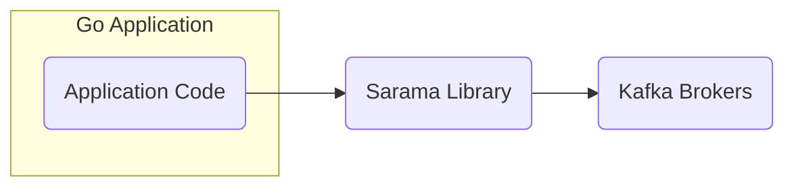
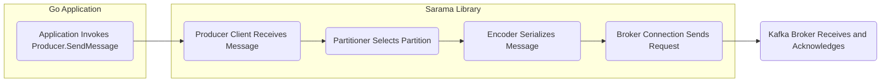
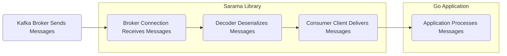

## Project Design Document: Sarama - A Go Client Library for Apache Kafka (Improved)

**1. Introduction**

This document provides a detailed design overview of Sarama, a robust and widely used Go client library for interacting with Apache Kafka. The primary purpose of this document is to offer a comprehensive understanding of Sarama's internal architecture, its key components, and the flow of data during its operations. This detailed design will serve as a critical foundation for subsequent threat modeling activities, enabling a thorough assessment of potential security vulnerabilities. The focus remains on the internal workings of the Sarama library and its direct interactions with Kafka brokers.

**2. Goals**

The overarching goals of this design document are to:

*   Articulate a clear and detailed architectural representation of the Sarama library.
*   Facilitate the identification of potential attack surfaces and vulnerabilities within Sarama's codebase and operational logic.
*   Provide a comprehensive understanding of data flow patterns, highlighting potential points of interception or manipulation.
*   Serve as a foundational resource for conducting thorough threat modeling exercises and risk assessments.
*   Act as a valuable reference point for security audits, code reviews, and ongoing security analysis.

**3. Scope**

This design document encompasses the core functionalities provided by the Sarama library, including:

*   **Producer Functionality:** Mechanisms for sending messages to Kafka topics, including synchronous and asynchronous modes.
*   **Consumer Functionality:**  Processes for subscribing to Kafka topics, receiving messages, and managing consumer group membership.
*   **Admin Client Functionality:** Capabilities for managing Kafka topics, partitions, configurations, and consumer groups.
*   **Internal Communication and Connection Management:**  Details on how Sarama establishes, maintains, and manages connections with Kafka brokers.
*   **Configuration Options:**  A description of key configuration parameters and their security implications.
*   **Message Encoding and Decoding:** How Sarama handles the serialization and deserialization of messages.

This document explicitly excludes:

*   The internal implementation details and architecture of the Apache Kafka broker software itself.
*   The specific design and implementation of applications that utilize the Sarama library.
*   The intricacies of the deployment environments or infrastructure where Sarama-based applications are deployed.

**4. High-Level Architecture**

Sarama acts as a crucial intermediary, bridging the gap between Go applications and the Kafka cluster. It abstracts away the complexities of the Kafka protocol, offering a developer-friendly API for seamless interaction.

*   **"Application Code"**: The user-developed Go application that leverages the Sarama library to communicate with Kafka.
*   **"Sarama Library"**: The central focus of this document, responsible for handling Kafka protocol interactions, connection management, and data serialization/deserialization.
*   **"Kafka Brokers"**: The servers forming the Kafka cluster, responsible for persistent message storage and distribution.

**5. Key Components**

Sarama's functionality is built upon several interconnected components:

*   **Client Interface:** The primary entry point for applications to interact with Kafka through Sarama. Different client types cater to specific needs:
    *   **Producer:**  The interface for sending messages to Kafka.
    *   **Consumer:** The interface for subscribing to and receiving messages from Kafka.
    *   **AdminClient:** The interface for performing administrative tasks on the Kafka cluster.
*   **Producer Implementation:** Responsible for the mechanics of sending messages:
    *   **AsyncProducer:**  Sends messages non-blockingly, offering higher throughput but requiring more complex error handling.
    *   **SyncProducer:** Sends messages synchronously, ensuring delivery confirmation before proceeding.
    *   **Partitioner Interface:** Defines strategies for selecting the target partition for a message:
        *   **`HashPartitioner`:**  Selects the partition based on a hash of the message key.
        *   **`RandomPartitioner`:**  Distributes messages randomly across available partitions.
        *   **`ManualPartitioner`:** Allows the application to explicitly specify the target partition.
    *   **Encoder Interface:**  Responsible for serializing message keys and values into the binary format expected by Kafka.
    *   **Interceptor Chain (Optional):** Allows for custom logic to be applied to messages before they are sent.
*   **Consumer Implementation:** Handles the process of receiving messages:
    *   **ConsumerGroup:** Enables multiple consumers to work collaboratively on a topic, with each partition assigned to one consumer within the group.
    *   **PartitionConsumer:**  Responsible for consuming messages from a specific partition of a topic.
    *   **Offset Management:**  Tracks the consumer's progress within each partition, allowing for message delivery guarantees. Strategies include:
        *   Automatic offset committing.
        *   Manual offset committing.
    *   **Decoder Interface:** Responsible for deserializing message keys and values from the binary format received from Kafka.
    *   **Interceptor Chain (Optional):** Allows for custom logic to be applied to messages after they are received.
*   **Admin Client Implementation:** Provides functionalities for managing Kafka resources:
    *   Topic creation, deletion, and listing.
    *   Partition management and reconfiguration.
    *   Configuration updates for topics and brokers.
    *   Consumer group management operations.
*   **Broker Connection Management:**  Handles the underlying TCP connections to individual Kafka brokers:
    *   Connection establishment and tear-down.
    *   Maintaining persistent connections.
    *   Implementing the Kafka wire protocol for request/response communication.
    *   Handling authentication and authorization handshakes (if configured).
    *   Managing TLS encryption for secure communication (if configured).
*   **Metadata Management:**  Responsible for fetching and caching metadata about the Kafka cluster topology:
    *   Retrieving information about topics, partitions, leaders, and replicas.
    *   Periodically refreshing metadata to reflect cluster changes.
    *   Using metadata to route requests to the correct brokers.
*   **Configuration Management:**  Provides a structured way to configure Sarama's behavior:
    *   Specifying broker addresses.
    *   Setting security parameters (TLS certificates, SASL credentials).
    *   Defining retry policies and backoff strategies.
    *   Configuring timeouts for various operations.
    *   Setting compression algorithms for message payloads.
*   **Error Handling:**  Provides mechanisms for handling errors during communication with Kafka:
    *   Retries with configurable backoff.
    *   Error reporting and propagation to the application.
    *   Handling of transient and permanent errors.

**6. Data Flow**

The flow of data within Sarama differs depending on whether the operation is producing or consuming messages.

**6.1. Producer Data Flow (Message Sending)**

1. **"Application Invokes Producer.SendMessage"**: The Go application initiates the process by calling the appropriate method on the Sarama producer instance, providing the topic, key, and value.
2. **"Producer Client Receives Message"**: The Sarama producer client receives the message details.
3. **"Partitioner Selects Partition"**: Based on the configured partitioning strategy and the message key (if provided), the partitioner determines the target partition within the topic.
4. **"Encoder Serializes Message"**: The encoder serializes the message key and value into the Kafka-specific binary format.
5. **"Broker Connection Sends Request"**: The broker connection component establishes or reuses a connection to the leader broker for the selected partition and sends the serialized message.
6. **"Kafka Broker Receives and Acknowledges"**: The Kafka broker receives the message, writes it to the appropriate partition's log, and sends an acknowledgment back to Sarama (depending on the producer's configuration).

**6.2. Consumer Data Flow (Message Receiving)**

1. **"Kafka Broker Sends Messages"**: The Kafka broker, upon receiving a fetch request from the consumer, retrieves messages from the requested partition.
2. **"Broker Connection Receives Messages"**: The Sarama broker connection receives the batch of messages in the Kafka binary format.
3. **"Decoder Deserializes Messages"**: The decoder deserializes the message keys and values from the received binary data.
4. **"Consumer Client Delivers Messages"**: The consumer client makes the deserialized messages available to the Go application, typically through a channel or callback mechanism.
5. **"Application Processes Messages"**: The Go application receives and processes the messages.

**7. Security Considerations (Pre-Threat Modeling)**

Several aspects of Sarama's design directly impact its security posture:

*   **Authentication and Authorization:** Sarama supports various mechanisms for authenticating with Kafka brokers, including:
    *   **SASL/PLAIN:**  Simple username/password authentication.
    *   **SASL/SCRAM:**  Salted Challenge Response Authentication Mechanism.
    *   **SASL/GSSAPI (Kerberos):**  Industry-standard authentication protocol.
    *   Proper configuration and secure management of credentials are paramount.
*   **Encryption in Transit (TLS):** Sarama supports TLS encryption for all communication between the client and the Kafka brokers, protecting data from eavesdropping and tampering. Proper certificate management is essential.
*   **Input Validation and Data Handling:** While Sarama primarily handles the Kafka protocol, it's crucial that the *application* using Sarama validates the content of messages to prevent injection attacks or other data-related vulnerabilities. Sarama's internal parsing of the Kafka protocol should be robust against malformed data.
*   **Error Handling and Information Disclosure:**  Careful error handling within Sarama is vital to prevent the leakage of sensitive information through error messages or logs.
*   **Dependency Management:**  The security of Sarama is also dependent on the security of its external dependencies. Regularly auditing and updating dependencies is crucial.
*   **Configuration Security:**  Sensitive configuration parameters, such as authentication credentials and TLS keys, must be stored and managed securely. Avoid hardcoding credentials.
*   **Access Control:** Ensure that the application running Sarama has the necessary least privileges to interact with the Kafka cluster.
*   **Denial of Service (DoS) Considerations:**  Configuration parameters like timeouts and retry policies can impact resilience against DoS attacks. Proper tuning is necessary.

**8. Dependencies**

Sarama relies primarily on the Go standard library for its core functionalities:

*   **`net` package:** For network communication (TCP connections).
*   **`time` package:** For handling timeouts and delays.
*   **`sync` package:** For managing concurrency and synchronization primitives.
*   **`crypto/tls` package:** For implementing TLS encryption.
*   **Potentially external libraries for specific SASL mechanisms:**  For example, libraries for Kerberos integration might be required if using SASL/GSSAPI. These dependencies would need to be assessed for their own security.

**9. Deployment Considerations**

Secure deployment of applications using Sarama involves several key considerations:

*   **Secure Credential Management:**  Employ secure methods for storing and retrieving Kafka authentication credentials (e.g., using secrets management systems).
*   **Network Segmentation:**  Isolate the application and Kafka brokers within secure network segments.
*   **Firewall Rules:** Configure firewalls to allow only necessary communication between the application and the Kafka brokers.
*   **Resource Limits:**  Set appropriate resource limits (CPU, memory, network) for the application to prevent resource exhaustion attacks.
*   **Monitoring and Logging:** Implement robust monitoring and logging to detect suspicious activity or security incidents.
*   **Regular Updates:** Keep the Sarama library and its dependencies up-to-date to patch known vulnerabilities.
*   **Principle of Least Privilege:** Ensure the application runs with the minimum necessary permissions.

**10. Assumptions**

This design document operates under the following assumptions:

*   The underlying Apache Kafka cluster is configured and managed according to security best practices.
*   The Go application utilizing Sarama is developed with security principles in mind, including proper input validation and secure data handling.
*   The network infrastructure connecting the application and the Kafka brokers is considered reasonably secure.

This improved design document provides a more detailed and comprehensive overview of the Sarama library's architecture, setting a stronger foundation for subsequent threat modeling activities.
