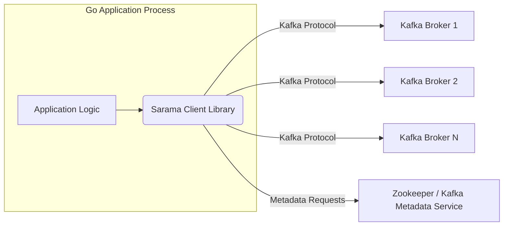
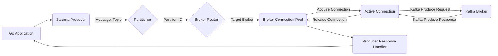
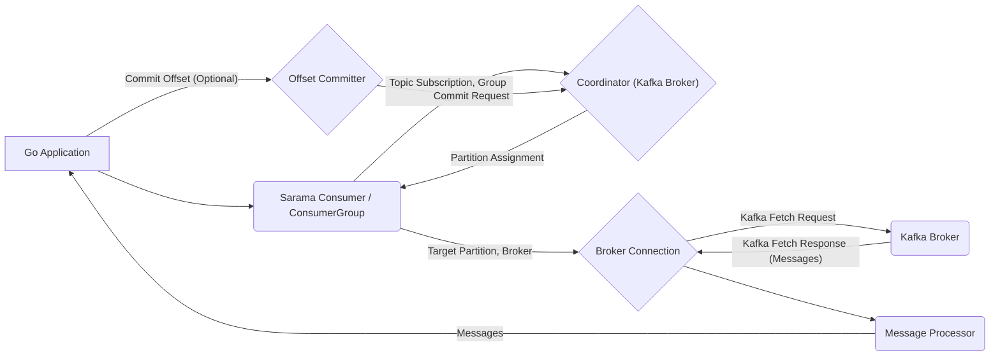

## Project Design Document: Sarama - Go Client for Apache Kafka

**Version:** 1.1
**Date:** October 26, 2023
**Author:** Gemini (AI Language Model)

### 1. Introduction

This document provides an enhanced design overview of the Sarama project, a widely used Go library that enables applications to interact with Apache Kafka clusters as clients. This detailed design serves as a crucial foundation for subsequent threat modeling exercises by clearly outlining the key components, data flows, and interactions within the Sarama library and its operational environment. Understanding this architecture is essential for identifying potential security vulnerabilities.

### 2. Goals

*   Present a refined and comprehensive architectural overview of the Sarama library.
*   Clearly define the responsibilities and interactions of key components within Sarama.
*   Thoroughly describe the data flow patterns within the library and the communication pathways between Sarama and Kafka brokers.
*   Proactively highlight potential areas of security concern to guide future threat modeling efforts.
*   Establish a definitive reference point for understanding the system's design principles and operational mechanics.

### 3. Scope

This document focuses on the essential architectural design of the Sarama library, emphasizing its role as a Kafka client. It comprehensively covers the primary functionalities involved in producing and consuming messages, managing connections to Kafka brokers, and the overall interaction lifecycle. While it touches upon the underlying Kafka protocol where relevant, it deliberately avoids delving into the intricate implementation details of specific functions or the complete specification of the Kafka protocol itself, unless directly pertinent to understanding the architectural context.

### 4. High-Level Architecture

The following diagram illustrates the high-level architecture of a typical system leveraging the Sarama library to communicate with a Kafka cluster. This emphasizes Sarama's role within the application.

*   **Go Application Process:** The runtime environment of the application that integrates and utilizes the Sarama library to interact with the Kafka cluster.
    *   **Application Logic:** The specific business logic within the Go application that orchestrates the use of the Sarama library for Kafka interactions.
    *   **Sarama Client Library:** The core focus of this document, providing the necessary abstractions and functionalities to communicate with Kafka brokers.
*   **Kafka Broker 1, 2, N:** Individual server instances that collectively form the Apache Kafka cluster, responsible for storing and serving messages.
*   **Zookeeper / Kafka Metadata Service:**  A service responsible for managing cluster metadata. In older Kafka versions, this is typically Zookeeper. Newer versions increasingly rely on internal Kafka mechanisms for metadata management, often referred to as the Metadata Service.

### 5. Component Details

This section provides a more detailed breakdown of the key components within the Sarama library and their respective responsibilities.

*   **`Client`:**
    *   The central component responsible for establishing and managing connections to one or more Kafka brokers within the cluster.
    *   Maintains a pool of persistent connections to facilitate efficient and concurrent communication.
    *   Handles the crucial task of broker discovery and dynamically updating its internal view of the cluster topology by querying metadata from brokers or Zookeeper.
    *   Serves as the primary entry point for creating instances of `Producer`, `Consumer`, and `AdminClient`.

*   **`Producer`:**
    *   Provides the functionality to send messages to designated Kafka topics.
    *   Offers flexibility through different producer types:
        *   **Synchronous Producer:** Blocks the calling thread until the broker acknowledges the message delivery.
        *   **Asynchronous Producer:** Sends messages to an internal buffer and returns immediately, relying on background processes for delivery and error handling.
    *   Implements message partitioning logic, routing messages to the appropriate broker and partition based on configured strategies (e.g., round-robin, key-based hashing).
    *   Handles message serialization (converting application data into a byte stream) and optional compression (e.g., Gzip, Snappy, LZ4) before sending.
    *   Provides mechanisms for receiving and processing message delivery acknowledgments (acks) from the brokers, ensuring delivery guarantees.

*   **`Consumer`:**
    *   Enables applications to subscribe to and receive messages from one or more Kafka topics.
    *   Supports the concept of consumer groups, allowing multiple consumers to work together to process messages from a topic in a scalable and fault-tolerant manner.
    *   Manages the assignment of partitions to individual consumers within a group, ensuring that each partition is consumed by only one consumer at a time.
    *   Tracks the current offset (position) of the consumer within each assigned partition.
    *   Handles message deserialization (converting the byte stream back into application data).
    *   Provides mechanisms for committing offsets back to Kafka, indicating the progress of message consumption and ensuring that messages are not reprocessed upon restart.

*   **`AsyncProducer`:**
    *   A specialized non-blocking producer designed for high-throughput scenarios.
    *   Accepts messages and places them into an internal channel for asynchronous processing and delivery by a separate goroutine.
    *   Requires careful handling of success and error channels to track the outcome of message deliveries.

*   **`ConsumerGroup`:**
    *   Offers a higher-level abstraction for managing groups of consumers.
    *   Simplifies the process of joining and leaving consumer groups.
    *   Automatically handles partition assignment and rebalancing when consumers join or leave the group, ensuring even distribution of workload.

*   **`AdminClient`:**
    *   Provides capabilities for performing administrative operations on the Kafka cluster.
    *   Allows for programmatic creation, deletion, and modification of topics and partitions.
    *   Enables management of Kafka configurations and other cluster-level settings.

*   **`Config`:**
    *   A central configuration object that encapsulates various settings and parameters governing the behavior of the Sarama client.
    *   Includes crucial parameters such as broker addresses, connection timeouts, security protocol configurations (TLS, SASL), compression settings, retry policies, and other operational preferences.

*   **`Metadata`:**
    *   Represents the client's current understanding of the Kafka cluster's topology and state.
    *   Contains information about available brokers, existing topics, the partitions within each topic, and the leader broker for each partition.
    *   This information is periodically refreshed to reflect changes in the cluster.

*   **`Networking` (Internal):**
    *   Manages the low-level details of communication with Kafka brokers over TCP sockets.
    *   Implements the Kafka wire protocol, responsible for encoding client requests into the binary format expected by Kafka and decoding broker responses.
    *   Handles connection establishment, maintenance (including heartbeats), and graceful closure.

*   **`Authentication/Authorization` (Internal):**
    *   Implements security mechanisms for authenticating the Sarama client with Kafka brokers.
    *   Supports various authentication protocols, including SASL/PLAIN (username/password), SASL/SCRAM (Salted Challenge Response Authentication Mechanism), and SASL/GSSAPI (Kerberos).
    *   Handles the negotiation and establishment of secure connections using TLS encryption.

*   **`Error Handling` (Internal):**
    *   Manages and processes errors that occur during communication with Kafka brokers or within the library itself.
    *   Provides mechanisms for retrying transient operations and propagating fatal errors to the application.

### 6. Data Flow

The following diagrams illustrate the typical data flow patterns for producing and consuming messages using the Sarama library, providing a visual representation of the interactions.

#### 6.1. Message Production

*   The Go application initiates the message production process by sending a message payload and the target topic name to the Sarama Producer instance.
*   The Partitioner component determines the specific partition within the topic where the message should be sent, based on the configured partitioning strategy.
*   The Broker Router identifies the Kafka broker that is the leader for the selected partition.
*   The Broker Connection Pool manages a set of connections to various brokers. It attempts to acquire an existing connection to the target broker.
*   An Active Connection is established or retrieved from the pool.
*   Sarama constructs and sends a Kafka Produce Request containing the message to the designated Kafka Broker.
*   The Kafka Broker processes the request and sends a Kafka Produce Response back to Sarama.
*   The Active Connection receives the response and returns to the connection pool.
*   The Producer Response Handler processes the response, checking for errors and notifying the Go application about the success or failure of the message delivery.

#### 6.2. Message Consumption

*   The Go application creates a Sarama Consumer (or utilizes the ConsumerGroup abstraction) and specifies the topics to subscribe to and the consumer group identifier.
*   The Consumer interacts with the Kafka Coordinator (a component within one of the Kafka Brokers) to participate in consumer group management and partition assignment.
*   The Coordinator determines the partitions that should be assigned to this specific consumer instance.
*   The Consumer establishes a Broker Connection to the leader broker responsible for the assigned partitions.
*   Sarama periodically sends Kafka Fetch Requests to the Kafka Broker to retrieve new messages from its assigned partitions.
*   The Kafka Broker responds with a Kafka Fetch Response containing batches of messages.
*   The Message Processor within Sarama deserializes the messages and delivers them to the Go application for processing.
*   Optionally, the Go application can commit the processed message offsets back to Kafka through the Offset Committer.
*   The Offset Committer sends a commit request to the Coordinator, ensuring that the consumer's progress is persisted.

### 7. Security Considerations

This section expands on potential security considerations relevant to the Sarama library, providing more specific examples and potential threats to inform threat modeling activities.

*   **Authentication and Authorization:**
    *   **Threat:** Unauthorized access to Kafka topics, leading to data breaches or manipulation.
    *   **Considerations:** Ensure strong authentication mechanisms (e.g., SASL/SCRAM-SHA-512) are configured and enforced. Verify that Kafka ACLs are properly configured to restrict access based on the principle of least privilege. Securely manage and store authentication credentials, avoiding hardcoding or storing them in version control.
    *   **Example:** A misconfigured application with default credentials could allow an attacker to produce or consume messages from sensitive topics.

*   **Data in Transit Encryption:**
    *   **Threat:** Eavesdropping on communication between the Sarama client and Kafka brokers, exposing sensitive data.
    *   **Considerations:** Always enable TLS encryption for all client-broker communication. Ensure proper certificate validation is configured to prevent man-in-the-middle attacks. Use strong cipher suites.
    *   **Example:** Without TLS, an attacker on the network could intercept messages containing personal or financial information.

*   **Data at Rest Encryption (Indirect):**
    *   **Considerations:** While Sarama doesn't directly handle this, understand if Kafka brokers are configured for data at rest encryption. This provides an additional layer of security if brokers are compromised.

*   **Input Validation and Deserialization:**
    *   **Threat:** Malicious or malformed messages from Kafka brokers could exploit vulnerabilities in the application's deserialization logic.
    *   **Considerations:** Implement robust input validation on messages received from Kafka. Be cautious when using custom deserialization logic and ensure it is secure against common vulnerabilities.
    *   **Example:** An attacker could publish a specially crafted message that, when deserialized, causes a buffer overflow or other memory corruption issues in the consuming application.

*   **Dependency Management:**
    *   **Threat:** Vulnerabilities in Sarama's dependencies could be exploited to compromise the application.
    *   **Considerations:** Regularly update Sarama and its dependencies to patch known security vulnerabilities. Use dependency scanning tools to identify and address potential risks.

*   **Configuration Security:**
    *   **Threat:** Exposure of sensitive configuration parameters could lead to unauthorized access or compromise.
    *   **Considerations:** Securely manage configuration parameters, especially broker addresses and credentials. Avoid storing sensitive information in plain text. Utilize environment variables or secure configuration management tools.
    *   **Example:** Hardcoding broker credentials in the application code exposes them if the code is compromised.

*   **Logging and Auditing:**
    *   **Threat:** Excessive or insecure logging could expose sensitive information. Insufficient logging hinders incident response.
    *   **Considerations:** Carefully configure logging levels to avoid logging sensitive data. Ensure logs are stored securely and access is controlled. Implement auditing of critical operations.

*   **Denial of Service (DoS):**
    *   **Threat:** An attacker could exploit vulnerabilities to cause a denial of service against the client application or the Kafka cluster.
    *   **Considerations:** Implement appropriate timeouts and resource limits. Be aware of potential resource exhaustion issues related to connection management or message processing. Rate limiting might be necessary in some scenarios.

*   **Spoofing and Man-in-the-Middle (MITM) Attacks:**
    *   **Threat:** A malicious actor could impersonate a Kafka broker or intercept communication.
    *   **Considerations:** TLS encryption with proper certificate validation mitigates MITM attacks. Ensure the client is configured to trust only legitimate broker certificates.

### 8. Deployment Considerations

*   The Sarama library is typically integrated directly into Go applications, making its security posture tightly coupled with the application's deployment environment.
*   Applications using Sarama can be deployed across diverse environments, including on-premise data centers, various cloud platforms (e.g., AWS, Azure, GCP), and containerized orchestrations (e.g., Docker, Kubernetes).
*   The specific deployment environment significantly influences security considerations, particularly concerning network security (firewalls, network segmentation), access control mechanisms (IAM roles, Kubernetes RBAC), and the overall security of the underlying infrastructure.
*   In containerized environments, ensure proper security configurations for containers, including limiting privileges and scanning for vulnerabilities.

### 9. Dependencies

The Sarama library relies on standard Go libraries for core functionalities. It may also utilize external libraries for specific features such as compression algorithms. Key categories of dependencies include:

*   **Standard Go Libraries:** For networking, concurrency, and basic data structures.
*   **Compression Libraries:**  For supporting message compression (e.g., `github.com/klauspost/compress`).
*   **Potentially other utility libraries:** Depending on specific features enabled.

A comprehensive list of dependencies is maintained in the `go.mod` file of the Sarama project, which should be consulted for the most up-to-date information.

### 10. Glossary

*   **Broker:** A single server instance within an Apache Kafka cluster responsible for storing and serving messages.
*   **Topic:** A named category or feed to which messages are published. Think of it as a logical channel for messages.
*   **Partition:** A horizontal division of a topic, allowing for parallel processing and increased throughput. Each partition is an ordered, immutable sequence of messages.
*   **Producer:** An application or process that publishes (sends) messages to specific Kafka topics.
*   **Consumer:** An application or process that subscribes to and reads (receives) messages from specific Kafka topics.
*   **Consumer Group:** A set of consumers that work together to consume messages from a topic. Kafka ensures that each partition of a topic is consumed by only one consumer within a group at any given time.
*   **Offset:** A unique, sequential identifier that denotes the position of a message within a partition. Consumers track offsets to manage their progress.
*   **Zookeeper / Kafka Metadata Service:** A service used by Kafka to manage cluster metadata, coordinate brokers, and facilitate leader election. Newer Kafka versions are increasingly relying on internal metadata management.
*   **Kafka Protocol:** The binary protocol that defines the communication format between Kafka clients (like Sarama) and Kafka brokers.
*   **SASL:** Simple Authentication and Security Layer, a framework for providing authentication and data security services in network protocols.
*   **TLS:** Transport Layer Security, a cryptographic protocol that provides communication security over a network.
*   **ACL:** Access Control List, a mechanism in Kafka for controlling which users or applications have permission to perform specific actions (e.g., produce, consume) on topics.