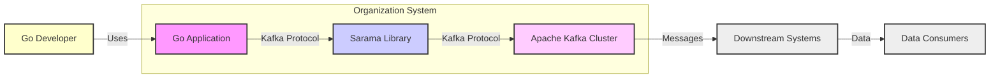
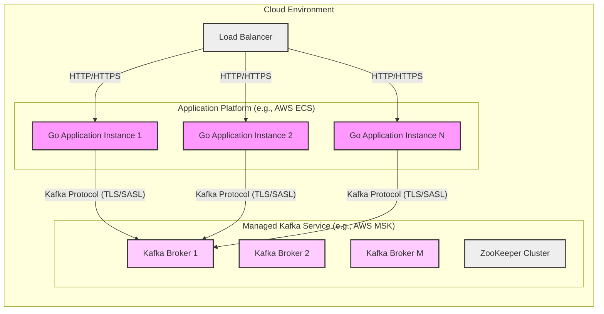

# BUSINESS POSTURE

The Sarama project, as a Go client library for Apache Kafka, aims to provide a robust, efficient, and widely adopted solution for Go applications to interact with Kafka clusters.

Business Priorities and Goals:
- Enable Go developers to easily integrate with Apache Kafka.
- Provide a high-performance Kafka client library in Go.
- Offer a reliable and stable client for production environments.
- Support core Kafka features and functionalities.
- Maintain compatibility with various Kafka versions.
- Foster community adoption and contribution.

Business Risks:
- Data loss or corruption during message production or consumption.
- Service disruption due to client library instability or bugs.
- Performance bottlenecks introduced by inefficient client implementation.
- Security vulnerabilities in the client library leading to unauthorized access or data breaches.
- Compatibility issues with newer or older Kafka versions causing application failures.
- Lack of community support or maintenance leading to project stagnation.

# SECURITY POSTURE

Existing Security Controls:
- security control: Code review process for contributions (described in GitHub repository contribution guidelines).
- security control: Dependency management using Go modules to track and manage dependencies (implicitly used in Go projects).
- security control: Static analysis and linting as part of development process (best practice in Go development, not explicitly mentioned but assumed).

Accepted Risks:
- accepted risk: Security vulnerabilities in dependencies (mitigated by dependency management and updates).
- accepted risk: Misconfiguration of the library by end-users leading to security issues (user responsibility).
- accepted risk: Vulnerabilities in Kafka brokers themselves (external dependency, user responsibility to secure Kafka cluster).

Recommended Security Controls:
- recommended security control: Implement automated security scanning (SAST/DAST) in the CI/CD pipeline for the library.
- recommended security control: Provide clear documentation and examples on secure configuration and usage of the library, including TLS/SSL and SASL authentication.
- recommended security control: Establish a process for reporting and handling security vulnerabilities in the library.
- recommended security control: Consider providing security-focused configuration options with safer defaults.

Security Requirements:
- Authentication:
    - Requirement: Support SASL/PLAIN and SASL/SCRAM authentication mechanisms for secure connection to Kafka brokers.
    - Requirement: Support TLS/SSL encryption for communication with Kafka brokers.
    - Requirement: Provide mechanisms for users to configure and manage authentication credentials securely (e.g., environment variables, configuration files).
- Authorization:
    - Requirement:  The library should correctly implement Kafka's authorization protocols to ensure users can only access authorized topics and perform allowed operations (this is largely dependent on Kafka broker configuration and user permissions, but the client must correctly handle authorization responses).
- Input Validation:
    - Requirement: Implement input validation to prevent common injection attacks, especially when handling user-provided data that might be used in Kafka messages or configurations. While the library primarily handles Kafka protocol, validation of configuration parameters is crucial.
- Cryptography:
    - Requirement: Utilize robust and well-vetted cryptographic libraries for TLS/SSL and SASL/SCRAM implementations.
    - Requirement: Ensure proper handling of cryptographic keys and secrets, avoiding hardcoding or insecure storage.

# DESIGN

## C4 CONTEXT



Context Diagram Elements:

- Element:
    - Name: Go Application
    - Type: Software System
    - Description: A Go-based application that needs to interact with an Apache Kafka cluster for message production and/or consumption. This application utilizes the Sarama library.
    - Responsibilities:
        - Implementing business logic.
        - Utilizing the Sarama library to interact with Kafka.
        - Handling application-specific security controls.
    - Security controls:
        - security control: Application-level authentication and authorization.
        - security control: Input validation for application inputs.
        - security control: Secure configuration management for application settings.

- Element:
    - Name: Sarama Library
    - Type: Software System / Library
    - Description: A Go client library for Apache Kafka, providing functionalities for producing and consuming messages, managing Kafka connections, and handling Kafka protocols.
    - Responsibilities:
        - Implementing Kafka client protocol.
        - Managing connections to Kafka brokers.
        - Providing API for Go applications to interact with Kafka.
        - Handling Kafka-specific security protocols (SASL, TLS).
    - Security controls:
        - security control: Secure implementation of Kafka client protocol.
        - security control: Handling of authentication and encryption for Kafka connections.
        - security control: Input validation for Kafka protocol messages (to prevent library-level vulnerabilities).

- Element:
    - Name: Apache Kafka Cluster
    - Type: Software System
    - Description: A distributed streaming platform used for building real-time data pipelines and streaming applications. It acts as the message broker in this context.
    - Responsibilities:
        - Storing and managing Kafka topics and partitions.
        - Handling message persistence and replication.
        - Enforcing access control and security policies for topics.
        - Providing Kafka broker services.
    - Security controls:
        - security control: Kafka ACLs for authorization.
        - security control: TLS/SSL encryption for inter-broker and client-broker communication.
        - security control: SASL authentication for client and inter-broker authentication.
        - security control: Network security controls (firewalls, network segmentation).

- Element:
    - Name: Go Developer
    - Type: Person
    - Description: Software developers who use the Sarama library to build Go applications that interact with Kafka.
    - Responsibilities:
        - Developing Go applications using Sarama.
        - Configuring and deploying Go applications.
        - Securely configuring and using the Sarama library.
    - Security controls:
        - security control: Secure coding practices.
        - security control: Following security guidelines for using Sarama.
        - security control: Secure management of application credentials.

- Element:
    - Name: Downstream Systems
    - Type: Software System
    - Description: Other systems or applications that consume messages from the Kafka cluster. These could be databases, analytics platforms, microservices, or other applications.
    - Responsibilities:
        - Consuming and processing messages from Kafka topics.
        - Implementing business logic based on consumed messages.
        - Potentially producing messages back to Kafka or other systems.
    - Security controls:
        - security control: Authorization to consume from specific Kafka topics.
        - security control: Input validation for messages received from Kafka.
        - security control: Application-level security controls.

- Element:
    - Name: Data Consumers
    - Type: Person
    - Description: End-users or systems that consume data processed by the downstream systems.
    - Responsibilities:
        - Utilizing data processed by downstream systems.
        - Accessing reports, dashboards, or applications that rely on Kafka data.
    - Security controls:
        - security control: Access control to downstream systems and data.
        - security control: Data privacy and protection measures in downstream systems.

## C4 CONTAINER

```mermaid
flowchart LR
    subgraph "Go Application Container"
        A["Go Application Process"]
        subgraph "Sarama Library Container"
            B["Producer"]
            C["Consumer"]
            D["Admin Client"]
            E["Connection Manager"]
            F["Protocol Handlers"]
        end
        A -- "Uses" --> B
        A -- "Uses" --> C
        A -- "Uses" --> D
        B -- "Kafka Protocol" --> G["Kafka Brokers"]
        C -- "Kafka Protocol" --> G
        D -- "Kafka Protocol" --> G
        E -- "Manages" --> G
        F -- "Implements" --> "Kafka Protocol"
        A -- "Configuration" --> E
    end
    G["Kafka Brokers"]
    style A fill:#f9f,stroke:#333,stroke-width:2px
    style B fill:#ccf,stroke:#333,stroke-width:2px
    style C fill:#ccf,stroke:#333,stroke-width:2px
    style D fill:#ccf,stroke:#333,stroke-width:2px
    style E fill:#ccf,stroke:#333,stroke-width:2px
    style F fill:#ccf,stroke:#333,stroke-width:2px
    style G fill:#fcf,stroke:#333,stroke-width:2px
```

Container Diagram Elements:

- Element:
    - Name: Go Application Process
    - Type: Container / Process
    - Description: The running instance of the Go application that utilizes the Sarama library. It encapsulates the application's business logic and interacts with Sarama components.
    - Responsibilities:
        - Executing application code.
        - Instantiating and configuring Sarama Producer, Consumer, and Admin Client.
        - Handling application-specific logic for message processing and Kafka interaction.
    - Security controls:
        - security control: Process isolation provided by the operating system.
        - security control: Application-level security controls (authentication, authorization within the application).
        - security control: Secure logging and monitoring within the application.

- Element:
    - Name: Producer
    - Type: Container / Go Package
    - Description: Sarama's Producer component responsible for sending messages to Kafka topics. It handles message serialization, partitioning, and delivery to Kafka brokers.
    - Responsibilities:
        - Providing API for producing messages to Kafka.
        - Implementing producer-side Kafka protocol logic.
        - Managing message queues and batching.
        - Handling producer acknowledgements and error handling.
    - Security controls:
        - security control: Secure implementation of Kafka producer protocol.
        - security control: Handling of TLS/SSL and SASL authentication for producer connections.
        - security control: Input validation for producer configuration parameters.

- Element:
    - Name: Consumer
    - Type: Container / Go Package
    - Description: Sarama's Consumer component responsible for receiving messages from Kafka topics. It handles topic subscription, partition assignment, message deserialization, and delivery to the application.
    - Responsibilities:
        - Providing API for consuming messages from Kafka.
        - Implementing consumer-side Kafka protocol logic.
        - Managing consumer groups and partition assignments.
        - Handling message deserialization and delivery to application.
        - Managing consumer offsets and commit operations.
    - Security controls:
        - security control: Secure implementation of Kafka consumer protocol.
        - security control: Handling of TLS/SSL and SASL authentication for consumer connections.
        - security control: Input validation for consumer configuration parameters.

- Element:
    - Name: Admin Client
    - Type: Container / Go Package
    - Description: Sarama's Admin Client component provides administrative functionalities for interacting with Kafka, such as creating/deleting topics, managing configurations, and inspecting cluster metadata.
    - Responsibilities:
        - Providing API for Kafka administrative operations.
        - Implementing admin client-side Kafka protocol logic.
        - Handling administrative requests to Kafka brokers.
    - Security controls:
        - security control: Secure implementation of Kafka admin client protocol.
        - security control: Handling of TLS/SSL and SASL authentication for admin client connections.
        - security control: Authorization checks based on Kafka ACLs for administrative operations (handled by Kafka brokers).

- Element:
    - Name: Connection Manager
    - Type: Container / Go Package
    - Description: Sarama's Connection Manager handles the establishment and management of connections to Kafka brokers. It manages connection pooling, reconnection logic, and broker discovery.
    - Responsibilities:
        - Establishing and maintaining connections to Kafka brokers.
        - Implementing connection pooling and reuse.
        - Handling connection failures and reconnection logic.
        - Broker discovery and metadata management.
        - Managing TLS/SSL and SASL handshake processes.
    - Security controls:
        - security control: Secure connection establishment using TLS/SSL and SASL.
        - security control: Secure storage and handling of connection credentials (if applicable).
        - security control: Rate limiting and connection throttling to prevent denial-of-service.

- Element:
    - Name: Protocol Handlers
    - Type: Container / Go Package
    - Description: Sarama's Protocol Handlers implement the Kafka protocol logic for various Kafka API versions. They handle message serialization/deserialization, request/response processing, and protocol-specific error handling.
    - Responsibilities:
        - Implementing Kafka protocol encoding and decoding.
        - Handling request and response serialization/deserialization.
        - Implementing protocol-specific error handling and retries.
        - Supporting different Kafka API versions.
    - Security controls:
        - security control: Secure implementation of Kafka protocol logic to prevent protocol-level vulnerabilities.
        - security control: Input validation for Kafka protocol messages to prevent parsing vulnerabilities.
        - security control: Handling of protocol-level security features (e.g., security protocol negotiation).

- Element:
    - Name: Kafka Brokers
    - Type: Container / Software System
    - Description: Instances of Kafka brokers within the Kafka cluster. They are responsible for storing data, handling client requests, and managing cluster operations.
    - Responsibilities:
        - Storing Kafka topics and partitions.
        - Handling message persistence and replication.
        - Serving client requests (produce, consume, admin).
        - Enforcing security policies and access control.
    - Security controls:
        - security control: Kafka ACLs for authorization.
        - security control: TLS/SSL encryption for inter-broker and client-broker communication.
        - security control: SASL authentication for client and inter-broker authentication.
        - security control: Network security controls (firewalls, network segmentation).
        - security control: Operating system and infrastructure security controls.

## DEPLOYMENT

Deployment Architecture Options:

1.  **On-Premise Deployment:** Go application and Kafka cluster are deployed within the organization's own data centers.
2.  **Cloud Deployment (IaaS):** Go application and Kafka cluster are deployed on cloud infrastructure (e.g., AWS EC2, Azure VMs, GCP Compute Engine).
3.  **Cloud Deployment (PaaS/Managed Kafka):** Go application is deployed on cloud platform (e.g., AWS ECS, Azure Kubernetes Service, GCP Cloud Run), and Kafka cluster is a managed service (e.g., AWS MSK, Azure Event Hubs, GCP Cloud Pub/Sub - although Pub/Sub is not strictly Kafka, it's a similar managed messaging service).
4.  **Hybrid Deployment:** Combination of on-premise and cloud deployments.

Detailed Deployment Architecture (Cloud Deployment - PaaS/Managed Kafka):



Deployment Diagram Elements (Cloud Deployment - PaaS/Managed Kafka):

- Element:
    - Name: Go Application Instance (1, 2, N)
    - Type: Compute Instance / Container
    - Description: Instances of the Go application running within a container orchestration platform (e.g., AWS ECS, Kubernetes). Each instance utilizes the Sarama library to interact with the managed Kafka service.
    - Responsibilities:
        - Running application code.
        - Producing and consuming messages from Kafka.
        - Handling application-specific scaling and resilience.
    - Security controls:
        - security control: Container image security scanning.
        - security control: Least privilege container runtime configuration.
        - security control: Network policies to restrict container network access.
        - security control: Application-level security controls within the container.

- Element:
    - Name: Load Balancer
    - Type: Network Component
    - Description: A load balancer distributing incoming HTTP/HTTPS traffic to the Go application instances. This is relevant if the Go application also serves HTTP endpoints in addition to interacting with Kafka.
    - Responsibilities:
        - Distributing traffic across application instances.
        - Providing high availability and scalability for HTTP endpoints.
        - TLS/SSL termination for HTTPS traffic (optional).
    - Security controls:
        - security control: Web Application Firewall (WAF) for HTTP/HTTPS traffic.
        - security control: DDoS protection.
        - security control: Access control lists (ACLs) to restrict access to the load balancer.
        - security control: TLS/SSL configuration for secure HTTPS communication.

- Element:
    - Name: Managed Kafka Service (e.g., AWS MSK)
    - Type: Managed Service
    - Description: A managed Kafka service provided by a cloud provider. It handles the underlying infrastructure and management of the Kafka cluster.
    - Responsibilities:
        - Providing Kafka broker services.
        - Managing Kafka cluster infrastructure (brokers, ZooKeeper).
        - Handling Kafka cluster scaling and maintenance.
        - Providing security features like TLS/SSL and SASL.
    - Security controls:
        - security control: Cloud provider's security controls for managed services.
        - security control: TLS/SSL encryption for Kafka communication (managed service configuration).
        - security control: SASL authentication for Kafka clients (managed service configuration).
        - security control: Network security groups to control access to the Kafka cluster.
        - security control: Kafka ACLs (configurable within the managed service).

- Element:
    - Name: Kafka Broker (1, 2, M)
    - Type: Software Instance
    - Description: Instances of Kafka brokers within the managed Kafka service. They are responsible for storing data and handling client requests.
    - Responsibilities:
        - Storing Kafka topics and partitions.
        - Handling message persistence and replication.
        - Serving client requests (produce, consume, admin).
    - Security controls:
        - security control: Managed service provider's security controls for Kafka brokers.
        - security control: TLS/SSL encryption for inter-broker and client-broker communication (managed service configuration).
        - security control: SASL authentication for client and inter-broker authentication (managed service configuration).
        - security control: Operating system and infrastructure security controls managed by the cloud provider.

- Element:
    - Name: ZooKeeper Cluster
    - Type: Software System
    - Description: A ZooKeeper cluster used by the managed Kafka service for cluster coordination and metadata management.
    - Responsibilities:
        - Kafka cluster coordination and leader election.
        - Metadata management for Kafka topics and brokers.
    - Security controls:
        - security control: Managed service provider's security controls for ZooKeeper.
        - security control: Access control to ZooKeeper nodes (managed service configuration).
        - security control: Security hardening of ZooKeeper instances by the cloud provider.

## BUILD

```mermaid
flowchart LR
    A["Go Developer"] -- "Code Changes" --> B["Version Control System (e.g., GitHub)"]
    B -- "Webhook/Trigger" --> C["CI/CD System (e.g., GitHub Actions)"]
    subgraph "CI/CD System (e.g., GitHub Actions)"
        C["CI/CD System (e.g., GitHub Actions)"] -- "Checkout Code" --> D["Source Code"]
        D -- "Build & Test" --> E["Build Artifacts (Go Library)"]
        E -- "Security Scans (SAST, Dependency Check)" --> F["Scan Results"]
        F -- "Quality Gates & Policy Checks" --> G{Pass/Fail}
        G -- "Pass" --> H["Artifact Repository (e.g., Go Modules Proxy)"]
        G -- "Fail" --> I["Notification to Developers"]
    end
    H -- "Publish Artifact" --> J["Artifact Repository (e.g., Go Modules Proxy)"]
    style A fill:#ffc,stroke:#333,stroke-width:2px
    style B fill:#eee,stroke:#333,stroke-width:2px
    style C fill:#ccf,stroke:#333,stroke-width:2px
    style D fill:#eee,stroke:#333,stroke-width:2px
    style E fill:#eee,stroke:#333,stroke-width:2px
    style F fill:#eee,stroke:#333,stroke-width:2px
    style G fill:#eee,stroke:#333,stroke-width:2px
    style H fill:#eee,stroke:#333,stroke-width:2px
    style I fill:#eee,stroke:#333,stroke-width:2px
    style J fill:#eee,stroke:#333,stroke-width:2px
```



Build Process Description:

1.  **Code Changes:** A Go developer makes code changes to the Sarama library and commits them to a version control system (e.g., GitHub).
2.  **Version Control System (e.g., GitHub):** The version control system stores the source code and triggers the CI/CD pipeline upon code changes (e.g., via webhook).
3.  **CI/CD System (e.g., GitHub Actions):** A CI/CD system (like GitHub Actions, Jenkins, GitLab CI) is configured to automate the build, test, and security scanning process.
4.  **Checkout Code:** The CI/CD system checks out the latest source code from the version control system.
5.  **Build & Test:** The CI/CD system builds the Go library using Go build tools and runs automated tests (unit tests, integration tests).
6.  **Build Artifacts (Go Library):** The build process produces build artifacts, which are the compiled Go library files.
7.  **Security Scans (SAST, Dependency Check):** Static Application Security Testing (SAST) tools and dependency check tools are used to scan the source code and dependencies for potential security vulnerabilities.
8.  **Scan Results:** The security scan tools generate reports with findings of potential vulnerabilities.
9.  **Quality Gates & Policy Checks:** Automated quality gates and policy checks are implemented to evaluate the build quality and security scan results against predefined criteria. This step determines if the build process should proceed or fail.
10. **Pass/Fail:** Based on the quality gates and policy checks, the build process either passes or fails.
11. **Artifact Repository (e.g., Go Modules Proxy):** If the build process passes, the build artifacts (Go library) are published to an artifact repository (e.g., Go Modules Proxy, JFrog Artifactory, Sonatype Nexus).
12. **Notification to Developers:** If the build process fails, notifications are sent to developers to address the issues.
13. **Artifact Repository (e.g., Go Modules Proxy):** The artifact repository securely stores and manages the released versions of the Sarama library, making them available for Go developers to use in their applications.

Build Process Security Controls:

- security control: Secure CI/CD pipeline configuration and access control.
- security control: Static Application Security Testing (SAST) to identify code-level vulnerabilities.
- security control: Dependency scanning to detect vulnerabilities in third-party dependencies.
- security control: Automated testing (unit, integration) to ensure code quality and prevent regressions.
- security control: Code linting and formatting checks to enforce coding standards and best practices.
- security control: Secure artifact repository with access control and vulnerability scanning.
- security control: Code signing of build artifacts (optional, for enhanced integrity).
- security control: Regular security audits of the build process and tools.

# RISK ASSESSMENT

Critical Business Processes:
- Applications relying on Sarama for real-time data ingestion, processing, and streaming.
- Event-driven architectures that depend on Kafka messaging facilitated by Sarama.
- Data pipelines that use Kafka and Sarama for data movement and transformation.
- Any business process that depends on the reliable and secure delivery of messages through Kafka using the Sarama library.

Data Sensitivity:
- The sensitivity of data handled by Sarama depends entirely on the Kafka topics and messages being processed by applications using the library.
- Data sensitivity can range from public information to highly confidential data, including personal data, financial data, and proprietary business information.
- The Sarama library itself does not inherently handle sensitive data, but it facilitates the transport and processing of data within applications.
- Data sensitivity should be assessed in the context of the applications using Sarama and the Kafka topics they interact with.

# QUESTIONS & ASSUMPTIONS

Questions:
- What is the primary use case for the Sarama library within the organization? (e.g., real-time analytics, microservices communication, data ingestion).
- What type of data will be processed using Sarama and Kafka? What is the sensitivity level of this data?
- What is the deployment environment for applications using Sarama and Kafka? (On-premise, cloud, hybrid).
- What are the specific security requirements and compliance standards that need to be met?
- What existing security controls are in place for the Kafka infrastructure and the applications using Sarama?
- What is the organization's risk appetite regarding security vulnerabilities in open-source libraries?

Assumptions:
- The Sarama library will be used in production environments for business-critical applications.
- Security and reliability are important considerations for the use of the Sarama library.
- Applications using Sarama will handle some level of sensitive data (at least business-related data).
- The deployment environment will likely involve cloud infrastructure or a hybrid approach.
- The organization is concerned about security risks associated with open-source software and wants to ensure secure usage of Sarama.
- The organization has a standard software development lifecycle and security practices that should be integrated with the use of Sarama.