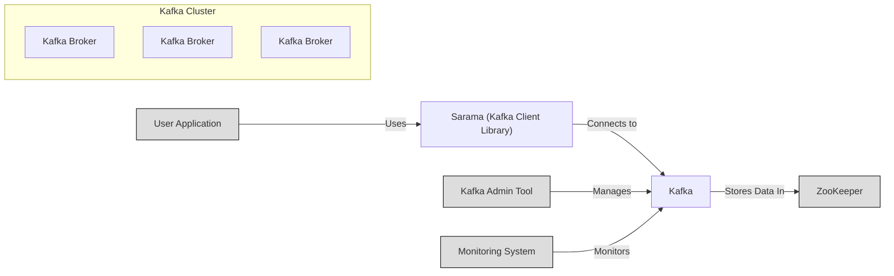
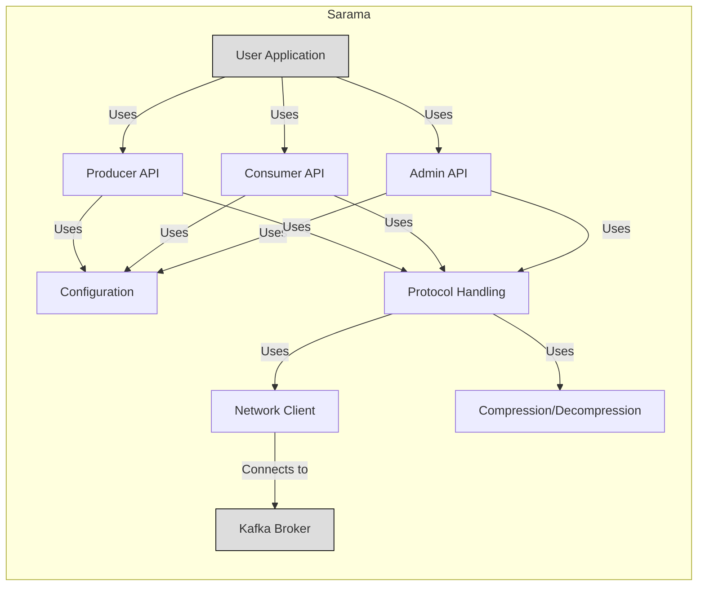
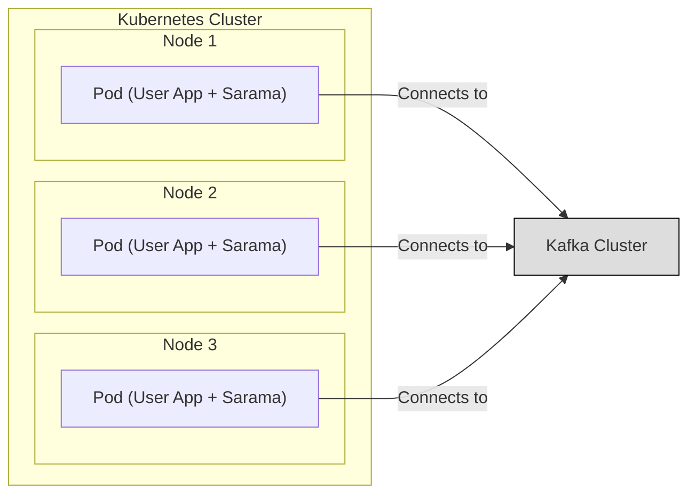
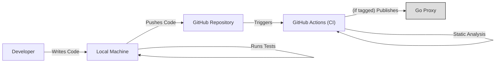

Okay, let's create a design document for the Sarama project, a Go library for Apache Kafka.

# BUSINESS POSTURE

Sarama is a pure Go library for working with Apache Kafka, a distributed, fault-tolerant, high-throughput, real-time messaging system.  It's an open-source project maintained by Shopify.  Given its nature as a foundational library, the primary business goals and priorities are:

*   Reliability:  The library must be stable and dependable, as it forms the basis for applications that rely on Kafka.  Any instability directly impacts downstream applications.
*   Performance:  Kafka is often used in high-throughput scenarios.  The library must be performant to avoid becoming a bottleneck.
*   Maintainability:  As an open-source project, maintainability is crucial.  The codebase should be easy to understand, modify, and extend.  This includes good documentation and a clear structure.
*   Compatibility:  Kafka evolves, and the library must maintain compatibility with different Kafka versions.
*   Completeness: The library should provide a comprehensive API covering all major Kafka features.
*   Community Support:  Foster a community around the library to encourage contributions and provide support.

Business risks that need to be addressed, based on these priorities:

*   Data Loss/Corruption:  Bugs in the library could lead to message loss or corruption, which is a critical risk for any messaging system.
*   Performance Degradation:  Inefficient code or poor handling of concurrency could lead to performance bottlenecks, impacting applications using the library.
*   Security Vulnerabilities:  Vulnerabilities in the library could be exploited to compromise Kafka clusters or the applications interacting with them. This includes unauthorized access, data breaches, or denial-of-service attacks.
*   Incompatibility:  Failure to keep up with Kafka API changes or broker version updates could render the library unusable.
*   Lack of Adoption: If the library is difficult to use, poorly documented, or perceived as unreliable, it may not gain widespread adoption, limiting its impact and community support.

# SECURITY POSTURE

Existing security controls (based on the GitHub repository and common practices):

*   security control: Code Reviews: Shopify likely has internal code review processes before merging changes. (Inferred from Shopify's general engineering practices).
*   security control: Static Analysis: Go's built-in tooling (e.g., `go vet`, `go lint`) and likely additional static analysis tools are used to identify potential bugs and security issues. (Inferred from standard Go development practices).
*   security control: Testing: The repository contains a comprehensive suite of unit and integration tests. (Visible in the repository).
*   security control: Dependency Management: Go modules are used to manage dependencies, allowing for version pinning and vulnerability scanning. (Visible in `go.mod` and `go.sum`).
*   security control: Issue Tracking: Security vulnerabilities can be reported and tracked via GitHub Issues. (Standard GitHub functionality).
*   security control: Documentation: The project includes documentation on how to configure security features like TLS and SASL. (Visible in the repository).

Accepted risks:

*   accepted risk: Reliance on Third-Party Libraries: The library depends on external libraries (e.g., for compression). Vulnerabilities in these libraries could impact Sarama. This is mitigated by dependency management and regular updates.
*   accepted risk: Complexity of Kafka Security: Kafka's security model (especially with SASL and ACLs) can be complex. Misconfiguration by users of the Sarama library is a risk, though the library aims to provide a user-friendly API.
*   accepted risk: Evolving Threat Landscape: New vulnerabilities in Kafka or related technologies may emerge, requiring ongoing updates and security patches to Sarama.

Recommended security controls (high priority):

*   security control: Fuzz Testing: Implement fuzz testing to proactively discover edge cases and potential vulnerabilities that might be missed by traditional testing.
*   security control: Regular Security Audits: Conduct periodic security audits, both internal and potentially external, to identify potential vulnerabilities.
*   security control: Supply Chain Security: Implement measures to verify the integrity of dependencies and prevent supply chain attacks (e.g., using tools like `cosign` or `in-toto`).
*   security control: Security Policy: Create and publish a `SECURITY.md` file outlining the vulnerability reporting process and security policies.

Security Requirements:

*   Authentication:
    *   The library must support secure connections to Kafka brokers using TLS.
    *   The library must support SASL authentication mechanisms (e.g., PLAIN, SCRAM, GSSAPI, OAUTHBEARER).
    *   Configuration options for authentication should be clearly documented and easy to use.

*   Authorization:
    *   The library should not handle authorization directly; authorization is managed by Kafka brokers using ACLs. The library's role is to correctly authenticate the client.

*   Input Validation:
    *   The library must validate user-provided inputs (e.g., topic names, configuration parameters) to prevent injection attacks or unexpected behavior.
    *   Error handling should be robust and provide informative error messages without leaking sensitive information.

*   Cryptography:
    *   The library must use strong cryptographic algorithms for TLS and SASL.
    *   Key management should be handled securely, relying on the underlying operating system or external key management systems where appropriate.
    *   The library should not implement its own cryptographic primitives but rely on well-vetted libraries (like Go's standard library).

# DESIGN

## C4 CONTEXT

C4 CONTEXT Element List:

*   1.  Name: User Application
    *   Type: External System
    *   Description: An application that uses the Sarama library to produce or consume messages from a Kafka cluster.
    *   Responsibilities: Sending and receiving data, processing messages, handling business logic.
    *   Security controls: Authentication to Kafka (via Sarama), authorization (managed by Kafka ACLs), input validation, data encryption (if applicable).

*   2.  Name: Sarama (Kafka Client Library)
    *   Type: System
    *   Description: The Go library for interacting with Apache Kafka. This is the system being designed.
    *   Responsibilities: Providing an API for producing and consuming messages, handling Kafka protocol details, managing connections, supporting security features (TLS, SASL).
    *   Security controls: TLS, SASL authentication, input validation.

*   3.  Name: Kafka Cluster
    *   Type: External System
    *   Description: A cluster of Kafka brokers that store and manage messages.
    *   Responsibilities: Receiving messages from producers, storing messages, delivering messages to consumers, managing replication and fault tolerance.
    *   Security controls: Network security, authentication (TLS, SASL), authorization (ACLs), data encryption (if configured).

*   4.  Name: Kafka Admin Tool
    *   Type: External System
    *   Description: Tools used to manage and administer the Kafka cluster (e.g., creating topics, managing ACLs).
    *   Responsibilities: Cluster management, configuration, monitoring.
    *   Security controls: Authentication to Kafka, authorization (managed by Kafka ACLs).

*   5.  Name: Monitoring System
    *   Type: External System
    *   Description: Systems used to monitor the health and performance of the Kafka cluster.
    *   Responsibilities: Collecting metrics, generating alerts, providing dashboards.
    *   Security controls: Authentication to Kafka (if required for monitoring).

*   6.  Name: ZooKeeper
    *   Type: External System
    *   Description: A distributed coordination service used by Kafka for cluster management.
    *   Responsibilities: Maintaining cluster metadata, managing broker membership, coordinating leader elections.
    *   Security controls: Network security, authentication (if configured), authorization (if configured).

## C4 CONTAINER

C4 CONTAINER Element List:

*   1.  Name: Producer API
    *   Type: Container
    *   Description: Provides an interface for applications to send messages to Kafka topics.
    *   Responsibilities: Handling message encoding, partitioning, and sending to the appropriate brokers.
    *   Security controls: TLS, SASL authentication (passed through from configuration).

*   2.  Name: Consumer API
    *   Type: Container
    *   Description: Provides an interface for applications to consume messages from Kafka topics.
    *   Responsibilities: Managing consumer groups, fetching messages from brokers, handling offsets, and rebalancing.
    *   Security controls: TLS, SASL authentication (passed through from configuration).

*   3.  Name: Admin API
    *   Type: Container
    *   Description: Provides an interface for administrative tasks, such as creating topics, deleting topics, and managing consumer groups.
    *   Responsibilities: Sending administrative requests to Kafka brokers.
    *   Security controls: TLS, SASL authentication (passed through from configuration).

*   4.  Name: Configuration
    *   Type: Container
    *   Description: Handles configuration settings for the library, including connection parameters, security settings, and client behavior.
    *   Responsibilities: Parsing configuration options, validating inputs, providing default values.
    *   Security controls: Input validation, secure handling of sensitive configuration values (e.g., passwords).

*   5.  Name: Network Client
    *   Type: Container
    *   Description: Manages the underlying network connections to Kafka brokers.
    *   Responsibilities: Establishing connections, handling reconnections, managing timeouts, and sending/receiving data.
    *   Security controls: TLS encryption.

*   6.  Name: Protocol Handling
    *   Type: Container
    *   Description: Implements the Kafka protocol for encoding and decoding messages and requests.
    *   Responsibilities: Serializing and deserializing data according to the Kafka protocol specification.
    *   Security controls: Input validation (to prevent malformed messages from causing issues).

*   7.  Name: Compression/Decompression
    *   Type: Container
    *   Description: Handles message compression and decompression (e.g., using Gzip, Snappy, LZ4, Zstd).
    *   Responsibilities: Compressing messages before sending, decompressing messages after receiving.
    *   Security controls: Using well-vetted compression libraries.

## DEPLOYMENT

Possible deployment solutions:

1.  As a Go library, Sarama is not "deployed" in the traditional sense of a standalone application. It's included as a dependency in other Go applications.
2.  The Go applications that use Sarama can be deployed in various ways:
    *   Bare metal servers
    *   Virtual machines (e.g., AWS EC2, Google Compute Engine, Azure VMs)
    *   Containers (e.g., Docker, Kubernetes)
    *   Serverless functions (e.g., AWS Lambda, Google Cloud Functions, Azure Functions)

Chosen deployment solution (Containers using Kubernetes):

DEPLOYMENT Element List:

*   1.  Name: Kubernetes Cluster
    *   Type: Infrastructure Node
    *   Description: A cluster of machines managed by Kubernetes.
    *   Responsibilities: Orchestrating containers, managing resources, providing networking and storage.
    *   Security controls: Network policies, RBAC (Role-Based Access Control), pod security policies, secrets management.

*   2.  Name: Node (1, 2, 3)
    *   Type: Infrastructure Node
    *   Description: A worker machine within the Kubernetes cluster.
    *   Responsibilities: Running pods, providing resources (CPU, memory, storage).
    *   Security controls: OS hardening, network security, container runtime security.

*   3.  Name: Pod (User App + Sarama)
    *   Type: Container Instance
    *   Description: A Kubernetes pod containing a container running the user application that includes the Sarama library.
    *   Responsibilities: Running the application logic, producing/consuming messages from Kafka.
    *   Security controls: Container image security (scanning for vulnerabilities), least privilege principle, network policies.

*   4.  Name: Kafka Cluster
    *   Type: External System
    *   Description: The Kafka cluster (external to the Kubernetes cluster).
    *   Responsibilities: See C4 Context description.
    *   Security controls: See C4 Context description.

## BUILD

The build process for Sarama, being a Go library, is integrated into the Go toolchain.

Build Process Description:

1.  Developer writes code and runs tests locally.
2.  Code is pushed to the GitHub repository.
3.  GitHub Actions (or a similar CI system) is triggered.
4.  The CI pipeline performs the following steps:
    *   Runs unit and integration tests.
    *   Builds the library.
    *   Runs linters (e.g., `go vet`, `go lint`).
    *   Performs static analysis (potentially using additional tools).
    *   If the commit is tagged (indicating a release), the library is published to the Go Proxy (proxy.golang.org).

Security Controls in Build Process:

*   security control: Automated Testing: Unit and integration tests are run automatically on every commit.
*   security control: Static Analysis: Linters and static analysis tools are used to identify potential bugs and security issues.
*   security control: Dependency Management: Go modules ensure consistent and reproducible builds, and allow for vulnerability scanning of dependencies.
*   security control: CI/CD Pipeline: The build process is automated, reducing the risk of manual errors and ensuring consistency.
*   security control: Code Review: (Inferred) Code reviews are likely required before merging changes to the main branch.

# RISK ASSESSMENT

Critical Business Processes:

*   Real-time data ingestion and processing: Many applications rely on Kafka for real-time data pipelines. Sarama's reliability is critical for these processes.
*   Event-driven architectures: Kafka is often used as the backbone for event-driven systems. Sarama's stability and performance are essential for these architectures to function correctly.
*   Data streaming and analytics: Kafka is used for streaming data to analytics platforms. Sarama's ability to handle high throughput is crucial for these use cases.

Data Sensitivity:

The data sensitivity depends entirely on the *content* of the messages being passed through Kafka by applications *using* Sarama. Sarama itself does not inherently handle sensitive data, but it *transports* it. Therefore:

*   Data Sensitivity: Varies greatly depending on the application. Can range from non-sensitive (e.g., public sensor data) to highly sensitive (e.g., financial transactions, PII).
*   Data to Protect: The messages being transmitted through Kafka.
*   Protection Goals:
    *   Confidentiality: Ensure that messages are not intercepted or read by unauthorized parties (achieved through TLS).
    *   Integrity: Ensure that messages are not tampered with during transit (achieved through TLS and proper message handling).
    *   Availability: Ensure that messages can be reliably produced and consumed (achieved through robust library design and proper error handling).

# QUESTIONS & ASSUMPTIONS

Questions:

*   What specific Kafka versions are officially supported by Sarama?
*   What are the performance benchmarks and targets for Sarama?
*   Are there any specific security certifications or compliance requirements that Sarama aims to meet (e.g., SOC 2, ISO 27001)?
*   What is the process for handling security vulnerability reports? Is there a dedicated security contact?
*   Are there plans to integrate with specific key management systems (e.g., HashiCorp Vault)?

Assumptions:

*   BUSINESS POSTURE: Assumed that Shopify prioritizes the reliability, performance, and security of Sarama due to its use in their own infrastructure.
*   SECURITY POSTURE: Assumed that Shopify has internal security practices and code review processes that are not publicly documented in the repository. Assumed that regular dependency updates are performed.
*   DESIGN: Assumed that the C4 diagrams accurately represent the high-level architecture of Sarama and its interactions with other systems. Assumed that the deployment scenario using Kubernetes is a common use case. Assumed that GitHub Actions is the primary CI/CD system used.