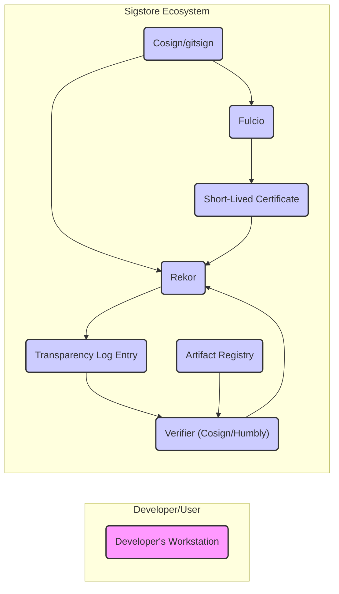
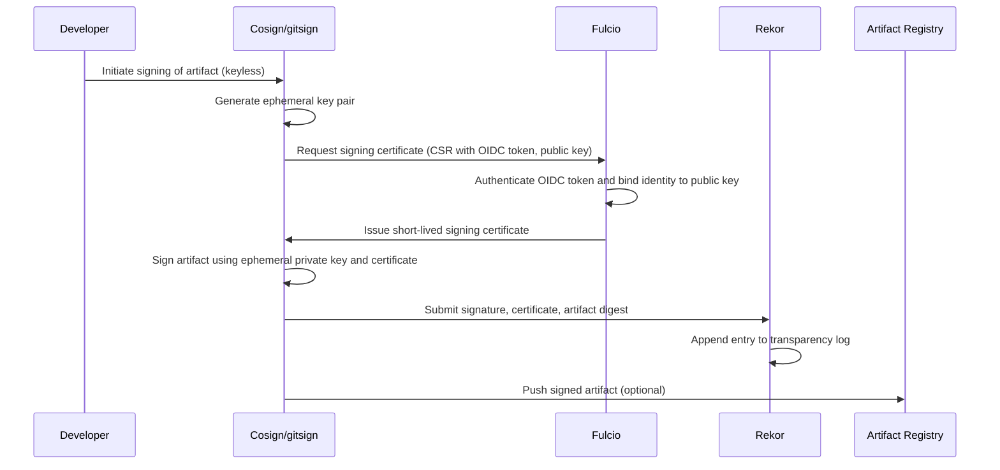
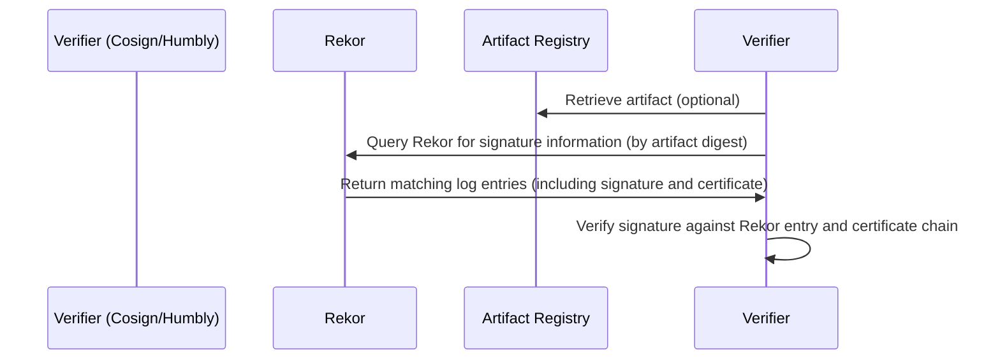

# Project Design Document: Sigstore

**Version:** 1.1
**Date:** October 26, 2023
**Author:** AI Software Architect

## 1. Introduction

This document provides an enhanced design overview of the Sigstore project, an open-source initiative dedicated to bolstering software supply chain security. Sigstore streamlines software signing and verification by leveraging ephemeral key pairs issued by a central authority, thereby alleviating the complexities of managing long-lived signing keys. This refined document aims to provide a more detailed foundation for subsequent threat modeling exercises.

## 2. Goals and Objectives

The core objectives of Sigstore are:

* **Democratized Code Signing:** To make code signing a standard and easily achievable practice for all developers.
* **Strengthened Software Supply Chain Integrity:** To significantly improve the trustworthiness and authenticity of software artifacts throughout their lifecycle.
* **Establish Non-Repudiation:** To create an irrefutable record linking software artifacts to their signers and the time of signing.
* **Ensure Transparency and Auditability:** To offer a publicly accessible and auditable log of all signing events, fostering trust and accountability.
* **Minimize Key Management Overhead:** To remove the burden of managing and securing long-term private keys from developers.

## 3. High-Level Architecture

Sigstore's architecture is built upon the interaction of several key components:

* **Fulcio:** The central Certificate Authority (CA) responsible for issuing short-lived signing certificates based on verified OpenID Connect (OIDC) identities.
* **Rekor:** The immutable, append-only transparency log that securely records metadata associated with signed artifacts.
* **Cosign:** A versatile command-line tool used for signing and verifying various software artifacts, primarily container images.
* **gitsign:** A specialized tool designed for signing Git commits, integrating Sigstore's security into the development workflow.
* **Humbly:** A focused verification tool, particularly useful in automated environments, for confirming the authenticity of signed artifacts.
* **The Sigstore Public Good Instance:** The publicly maintained and operated instance of Fulcio and Rekor, providing a free service to the community.

## 4. Detailed Component Descriptions

### 4.1. Fulcio

* **Purpose:** Serves as the core Certificate Authority, issuing short-duration X.509 signing certificates.
* **Key Functionality:**
    * Accepts Certificate Signing Requests (CSRs) from clients.
    * Authenticates the requester's identity through OpenID Connect (OIDC) verification.
    * Issues a short-lived certificate that cryptographically binds the OIDC identity to the signing key.
    * Supports the inclusion of Subject Alternative Names (SANs) in certificates, allowing for more granular identity association (e.g., email, GitHub Actions workflow).
    * May integrate with policy enforcement engines to control certificate issuance based on predefined rules.
* **Technology Stack:** Primarily implemented in Go, utilizing libraries for OIDC handling, cryptographic operations, and certificate management.
* **Key Interactions:**
    * Receives CSRs from signing tools like Cosign and gitsign.
    * Communicates with OIDC providers (e.g., Google, GitHub) for identity validation.
    * Provides signed certificates back to the requesting clients.
    * Potentially interacts with policy engines for authorization checks before issuing certificates.

### 4.2. Rekor

* **Purpose:** Functions as an immutable and append-only transparency log, securely recording metadata about signed artifacts.
* **Key Functionality:**
    * Accepts signed artifact metadata, including the signature, public key (embedded in the Fulcio certificate), and a digest of the signed artifact.
    * Creates a tamper-evident entry in the transparency log, ensuring the integrity of the recorded information.
    * Provides APIs for querying and retrieving log entries based on various criteria (e.g., artifact digest, public key).
    * Implements a Merkle tree data structure, enabling efficient verification of log consistency and proof of inclusion for specific entries. This ensures that the log hasn't been tampered with and that a specific entry exists within the log.
* **Technology Stack:** Built using Go, typically leveraging a database for persistent storage of log entries and a Merkle tree implementation for cryptographic integrity.
* **Key Interactions:**
    * Receives signed artifact metadata from clients like Cosign and gitsign after a successful signing operation.
    * Provides log entries to verification tools (Cosign, Humbly) when verifying the authenticity of an artifact.

### 4.3. Cosign

* **Purpose:** A versatile command-line tool for signing and verifying software artifacts, with a primary focus on container images.
* **Key Functionality:**
    * Generates ephemeral signing key pairs for each signing operation (in keyless scenarios).
    * Initiates the Fulcio certificate issuance process by presenting an OIDC token.
    * Signs artifacts using the short-lived certificate obtained from Fulcio.
    * Submits the generated signature, the associated Fulcio certificate, and the artifact digest to Rekor for inclusion in the transparency log.
    * Verifies signatures by querying Rekor for matching log entries and validating the cryptographic chain of trust.
    * Supports various signing methods, including keyless signing (using ephemeral keys), signing with KMS (Key Management Service) managed keys, and signing with local keys.
    * Can attach signatures as image manifests or as separate signature objects in container registries.
* **Technology Stack:** Developed in Go, utilizing libraries for container image manipulation (e.g., `go-containerregistry`), cryptographic operations, and communication with Fulcio and Rekor.
* **Key Interactions:**
    * Communicates with Fulcio to request and obtain short-lived signing certificates.
    * Interacts with Rekor to submit signature information and retrieve entries for verification.
    * Interacts with container registries (e.g., Docker Registry, GitHub Container Registry) to push and pull container images and associated signatures.

### 4.4. gitsign

* **Purpose:** A specialized tool designed for signing Git commits using the Sigstore ecosystem.
* **Key Functionality:**
    * Integrates seamlessly with Git to allow developers to sign their commits.
    * Leverages Fulcio to obtain short-lived certificates based on the committer's verified identity.
    * Records the commit signature and associated metadata in the Rekor transparency log.
    * Enables verification of commit signatures by others, ensuring the integrity and authenticity of the commit history.
* **Technology Stack:** Implemented in Go, utilizing the Git command-line interface and libraries for interacting with Fulcio and Rekor.
* **Key Interactions:**
    * Interacts directly with the local Git repository to sign commits.
    * Communicates with Fulcio to request signing certificates.
    * Interacts with Rekor to submit commit signature information.

### 4.5. Humbly

* **Purpose:** A focused verification tool, particularly valuable in automated environments like CI/CD pipelines, for confirming the authenticity of signed artifacts.
* **Key Functionality:**
    * Verifies signatures of various artifact types by querying Rekor.
    * Designed for integration into automated workflows, providing a programmatic way to ensure artifact integrity.
    * Retrieves signature information from Rekor based on artifact digests or other identifiers.
    * Can be configured with policies to define acceptable signers and verification criteria.
* **Technology Stack:** Built using Go, leveraging libraries for interacting with Rekor and performing signature verification.
* **Key Interactions:**
    * Primarily interacts with Rekor to retrieve signature and certificate information.
    * May optionally interact with artifact registries to retrieve the artifact being verified.

### 4.6. The Sigstore Public Good Instance

* **Purpose:** A publicly accessible and community-operated instance of Fulcio and Rekor, providing a free and readily available service for software signing and verification.
* **Key Functionality:**
    * Hosts and maintains the infrastructure for the Fulcio and Rekor services.
    * Ensures the high availability and integrity of the services for the broader community.
    * Implements robust security measures to protect the underlying infrastructure and the integrity of the transparency log.
    * Operated under a transparent governance model.
* **Technology Stack:** Likely utilizes a combination of cloud infrastructure (e.g., Kubernetes), robust database systems, and the core technologies of Fulcio and Rekor.
* **Key Interactions:**
    * Serves as the primary point of interaction for all Sigstore clients (Cosign, gitsign, Humbly) using the public good instance.

## 5. Data Flow Diagrams

### 5.1. Keyless Signing Workflow

### 5.2. Verification Workflow

## 6. Key Security Considerations

* **Identity Provider Security (Fulcio):** The security of the integrated OIDC providers is paramount. Compromise of these providers could lead to the issuance of fraudulent signing certificates.
* **Ephemeral Key Security (Signing):** While Sigstore emphasizes ephemeral keys, the secure generation and in-memory handling of these keys during the signing process are crucial. Memory corruption or unauthorized access could lead to key compromise.
* **Rekor Integrity and Availability:** The integrity and continuous availability of the Rekor transparency log are critical. Any tampering or downtime would severely impact the non-repudiation and auditability guarantees of the system. Measures like database replication and regular backups are essential.
* **Fulcio Availability and Resilience:** The availability of Fulcio is essential for the signing process. Denial-of-service attacks or infrastructure failures targeting Fulcio could prevent developers from signing artifacts. Redundancy and failover mechanisms are necessary.
* **Client-Side Tool Security (Cosign, gitsign):** The security of the client-side tools on developer workstations is important. Compromised tools could be used to sign malicious artifacts. Secure software distribution and regular updates are important.
* **Public Good Instance Security Hardening:** The infrastructure hosting the public good instance of Fulcio and Rekor requires rigorous security hardening to protect against attacks and ensure the integrity of the services. This includes access controls, intrusion detection, and regular security audits.
* **Certificate Revocation (Although Short-Lived):** While certificates are short-lived, a mechanism to handle potentially compromised or mis-issued certificates within their validity period might be considered, even if it's a manual process.
* **Rekor Entry Immutability:** Ensuring the immutability of entries within the Rekor log is crucial. Cryptographic techniques like Merkle trees are employed for this purpose, and the underlying storage mechanism must also guarantee immutability.

## 7. Assumptions and Constraints

* **Trust in OIDC Providers:** Sigstore's identity verification model relies on the security and trustworthiness of the configured OIDC identity providers.
* **Trust in the Sigstore Public Good Instance Operators:** Users of the public good instance implicitly trust the operators to maintain the security and integrity of the infrastructure and the data within it.
* **Reliable Network Connectivity:** The signing and verification workflows require reliable network connectivity to communicate with Fulcio and Rekor. Intermittent network issues could disrupt these processes.
* **Accurate System Clocks:** Accurate time synchronization across all participating systems is important for the validity of the short-lived certificates issued by Fulcio.
* **Open Source Security Model:** The security of Sigstore benefits from community review and contribution, but also relies on the timely identification and remediation of potential vulnerabilities.

## 8. Future Considerations

* **Expanding Artifact Type Support:** Extending Sigstore's capabilities to support a wider range of software artifacts beyond container images and Git commits.
* **Deeper CI/CD Integration:** Providing more seamless and integrated experiences within popular Continuous Integration and Continuous Delivery (CI/CD) platforms.
* **Enhanced Policy Enforcement:** Implementing more sophisticated policy engines to allow for fine-grained control over signing and verification processes.
* **Exploring Decentralized or Federated Rekor Instances:** Investigating options for decentralized or federated Rekor deployments to improve resilience and potentially address data sovereignty concerns. This could involve different organizations running their own Rekor instances while maintaining interoperability.
* **Formal Verification of Core Components:** Applying formal verification techniques to the core components like Fulcio and Rekor to provide stronger guarantees about their security properties.

This improved document provides a more detailed and nuanced understanding of the Sigstore project architecture, offering a stronger foundation for comprehensive threat modeling activities.