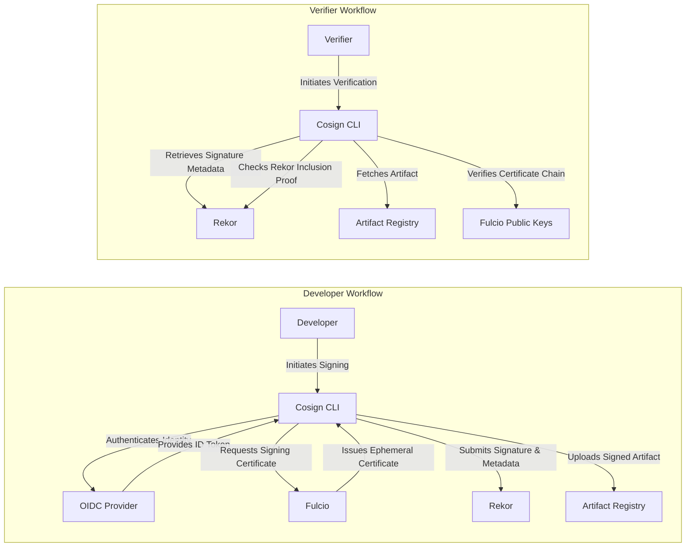

# Project Design Document: Sigstore

**Version:** 1.1
**Date:** October 26, 2023
**Author:** AI Software Architect

## 1. Introduction

This document provides a detailed design overview of the Sigstore project, an initiative focused on simplifying and strengthening digital signature verification for software artifacts. By leveraging established technologies like Public Key Infrastructure (PKI) and transparency logs, Sigstore aims to make code signing more accessible and secure for all developers. This document is specifically crafted to serve as a comprehensive foundation for subsequent threat modeling exercises.

## 2. Goals and Objectives

*   **Democratized Code Signing:** Enable widespread adoption of code signing by removing the traditional complexities associated with key management and distribution.
*   **Robust Security Guarantees:** Offer strong cryptographic assurance regarding the origin and integrity of software, protecting against tampering and unauthorized modifications.
*   **Unambiguous Transparency and Auditability:** Maintain a publicly verifiable and immutable record of all signing events, fostering trust and facilitating security audits.
*   **Minimized Key Management Overhead:** Alleviate the burden of managing long-lived private signing keys for individual developers, reducing the risk of key compromise.
*   **Seamless Integration with Development Practices:** Facilitate smooth integration with existing development and deployment workflows, minimizing friction for developers.

## 3. System Architecture

The Sigstore ecosystem is composed of several interconnected components that facilitate secure signing and verification.

## 4. Component Details

This section provides a detailed breakdown of the purpose, functionality, and key characteristics of each major component within the Sigstore architecture.

### 4.1. Core Components

*   **Fulcio:**
    *   **Role:** Serves as a short-lived certificate authority (CA) for code signing.
    *   **Functionality:** Issues ephemeral signing certificates to developers based on their verified identity from an OIDC provider.
    *   **Key Characteristics:**
        *   Eliminates the need for developers to generate and manage their own long-lived signing keys.
        *   Ties signing certificates directly to verifiable identities.
        *   Operates with a publicly known root certificate, enabling trust establishment.
        *   Employs robust security measures to protect its private key.
*   **Rekor:**
    *   **Role:** Functions as an immutable and publicly accessible transparency log for recording software signing events.
    *   **Functionality:** Receives and permanently stores records of each signing operation, including the signed artifact's digest, the signing certificate, and associated identity information.
    *   **Key Characteristics:**
        *   Provides cryptographic guarantees of immutability and append-only behavior.
        *   Allows for public auditing of signing events, enhancing transparency.
        *   Utilizes Merkle tree structures to enable efficient verification of entry inclusion.
        *   Protects against tampering and retroactive changes to the log.
*   **Cosign:**
    *   **Role:**  A command-line interface (CLI) tool that simplifies the process of signing and verifying software artifacts.
    *   **Functionality:**  Orchestrates the interaction with Fulcio and Rekor, abstracting away the underlying complexities of the signing and verification workflows.
    *   **Key Characteristics:**
        *   Provides user-friendly commands for signing and verifying various artifact types (e.g., container images, binaries).
        *   Handles authentication with OIDC providers.
        *   Manages the request and retrieval of signing certificates from Fulcio.
        *   Interacts with Rekor to submit and retrieve signing information.

### 4.2. Supporting Components

*   **OpenID Connect (OIDC) Provider:**
    *   **Role:** Acts as an identity provider, authenticating developers and asserting their identity.
    *   **Functionality:** Issues ID tokens to developers upon successful authentication, which are then used by Fulcio to verify their identity.
    *   **Examples:** Google, GitHub, GitLab.
    *   **Key Characteristics:**
        *   Provides a standardized mechanism for identity verification.
        *   Establishes the link between the signing certificate and a real-world identity.
        *   The security of the OIDC provider is crucial for the overall security of Sigstore.
*   **Artifact Registry:**
    *   **Role:** Stores the software artifacts being signed.
    *   **Functionality:**  Provides a repository for managing and distributing software artifacts.
    *   **Examples:** Docker Registry, GitHub Container Registry, various cloud provider registries.
    *   **Key Characteristics:**
        *   Sigstore integrates with existing artifact registries without requiring changes to their core functionality.
        *   Signatures and verification metadata are typically stored alongside the artifacts or in a related location within the registry.

## 5. Data Flow

This section details the typical data flow during the signing and verification processes within the Sigstore ecosystem.

### 5.1. Signing Workflow (Detailed)

1. **Developer Initiates Signing:** A developer uses the Cosign CLI, specifying the artifact to be signed.
2. **Authentication with OIDC Provider:** Cosign redirects the developer to their configured OIDC provider for authentication.
3. **ID Token Retrieval:** Upon successful authentication, the OIDC provider issues an ID token to Cosign. This token cryptographically asserts the developer's identity.
4. **Ephemeral Key Pair Generation:** Cosign generates a temporary cryptographic key pair. The private key is held ephemerally and is not persisted.
5. **Certificate Signing Request (CSR) to Fulcio:** Cosign creates a CSR containing the public key from the generated pair and the OIDC ID token. This request is sent to Fulcio.
6. **Certificate Issuance by Fulcio:** Fulcio validates the OIDC ID token. If valid, it issues a short-lived signing certificate, linking the provided public key to the verified identity.
7. **Artifact Signing:** Cosign uses the ephemeral private key (corresponding to the certificate) to sign the artifact, creating a digital signature.
8. **Signature and Certificate Submission to Rekor:** Cosign submits the artifact's cryptographic digest (hash), the issued signing certificate, and relevant identity information to Rekor.
9. **Rekor Log Entry:** Rekor appends a new, immutable entry to its transparency log, containing the submitted information and a cryptographic proof of inclusion.
10. **Artifact and Signature Upload:** The developer (or an automated process) uploads the signed artifact and the signature (often along with the signing certificate or a reference to the Rekor entry) to the artifact registry.

### 5.2. Verification Workflow (Detailed)

1. **Verifier Initiates Verification:** A verifier uses the Cosign CLI, specifying the artifact to be verified.
2. **Signature Metadata Retrieval:** Cosign retrieves the signature and associated metadata. This might involve fetching the signature directly from the artifact registry or querying Rekor.
3. **Rekor Entry Retrieval (if needed):** If the signature metadata points to a Rekor entry, Cosign retrieves the relevant entry from the Rekor transparency log using the artifact digest or other identifiers.
4. **Certificate Chain Verification:** Cosign verifies the chain of trust for the signing certificate, ensuring it is signed by the trusted Fulcio root certificate.
5. **Rekor Inclusion Proof Verification:** Cosign verifies the cryptographic proof of inclusion for the Rekor entry. This confirms that the entry exists in the immutable log and has not been tampered with.
6. **Signature Verification:** Cosign uses the public key from the retrieved signing certificate to verify the digital signature against the downloaded artifact.
7. **Identity Assertion Verification:** Cosign verifies the identity information associated with the signature (obtained from the certificate or Rekor entry) against expected values or defined policies. This confirms who signed the artifact.
8. **Verification Result:** Cosign reports the outcome of the verification process, indicating whether the artifact is validly signed, by whom, and that the signing event is recorded in the transparency log.

## 6. Security Considerations (Detailed)

This section outlines key security considerations for the Sigstore project, categorized for clarity. These considerations will be central to future threat modeling activities.

### 6.1. Component-Specific Considerations

*   **Fulcio:**
    *   **Private Key Security:** The security of Fulcio's root private key is paramount. Compromise would allow for the issuance of fraudulent certificates. HSMs and strict access controls are essential.
    *   **Availability:**  Downtime of Fulcio would prevent new signatures from being created. Redundancy and disaster recovery planning are critical.
    *   **Certificate Policy Enforcement:** Ensuring Fulcio correctly enforces its certificate issuance policies is vital to maintaining trust.
*   **Rekor:**
    *   **Immutability:**  Maintaining the integrity and immutability of the Rekor log is crucial. Mechanisms to prevent tampering and unauthorized modifications are essential.
    *   **Availability:**  While not directly impacting signing, Rekor's availability is necessary for verification.
    *   **Data Integrity:** Ensuring the integrity of the data stored within Rekor entries is important.
*   **Cosign:**
    *   **Secure Key Generation (Ephemeral):** While ephemeral, the generation of the temporary key pair should be cryptographically secure.
    *   **Code Integrity:** Ensuring the integrity of the Cosign binary itself is important to prevent malicious modifications.
*   **OIDC Provider:**
    *   **Account Security:**  The security of developer accounts at the OIDC provider is critical. Account takeovers could lead to unauthorized signing.
    *   **Trust in Provider:**  Sigstore relies on the security and trustworthiness of the configured OIDC provider.

### 6.2. Workflow-Specific Considerations

*   **Replay Attacks:** Preventing the reuse of signatures for unintended artifacts or purposes. Mechanisms like timestamps and context binding can mitigate this.
*   **Identity Spoofing:** Ensuring that the identity asserted by the OIDC provider is genuinely associated with the signing entity.
*   **Supply Chain Attacks:**  Protecting the signing process itself from compromise, ensuring that only authorized individuals can initiate signing.

### 6.3. General Security Considerations

*   **Denial of Service (DoS):** Protecting Fulcio and Rekor from DoS attacks that could disrupt signing and verification processes.
*   **Data Privacy:**  While Rekor is public, considerations around the privacy of identity information included in log entries should be addressed.
*   **Key Management (Fulcio Root):** Secure generation, storage, rotation, and recovery of the Fulcio root key are essential.
*   **Vulnerability Management:**  Regularly scanning and patching all components for security vulnerabilities.

## 7. Deployment Considerations

*   **Fulcio Deployment:**
    *   Requires a highly secure and resilient infrastructure.
    *   Typically deployed with Hardware Security Modules (HSMs) or similar secure key management solutions for protecting the root private key.
    *   Needs robust monitoring and alerting.
*   **Rekor Deployment:**
    *   Requires a scalable and durable storage backend.
    *   Often utilizes technologies like Trillian for its verifiable data structure.
    *   Needs mechanisms for ensuring data integrity and availability.
*   **Cosign Distribution:**
    *   Distributed as a CLI tool, often through package managers or direct downloads.
    *   Users should verify the integrity of the Cosign binary before use.
*   **Integration with CI/CD Pipelines:**
    *   Cosign can be seamlessly integrated into CI/CD pipelines for automated signing and verification of software artifacts.
    *   Careful consideration should be given to the security of the CI/CD environment.

## 8. Future Enhancements (Potential)

*   **Expanded Artifact Type Support:** Extending Sigstore's capabilities to support a broader range of software artifacts beyond container images (e.g., binaries, libraries).
*   **Policy-Based Verification:** Integrating policy engines to enable more fine-grained control over verification processes, allowing organizations to define specific requirements for trusted signatures.
*   **Advanced Keyless Signing Techniques:** Exploring and implementing alternative keyless signing mechanisms to further simplify the signing process.
*   **Enhanced Certificate Revocation Mechanisms:** While the use of short-lived certificates mitigates the impact of compromised keys, exploring more explicit revocation mechanisms could be beneficial in certain scenarios.
*   **Formal Verification of Core Components:** Applying formal methods to mathematically prove the correctness and security properties of critical Sigstore components like Fulcio and Rekor.

This revised document provides a more detailed and structured overview of the Sigstore project's design, emphasizing aspects relevant to future threat modeling exercises. It clarifies component functionalities, elaborates on data flows, and provides a more comprehensive breakdown of security considerations.
