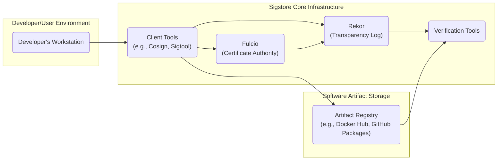
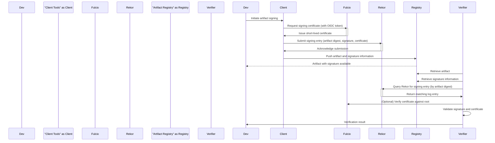

# Project Design Document: Sigstore

**Version:** 1.1
**Date:** October 26, 2023
**Author:** AI Software Architect

## 1. Introduction

This document provides a detailed design overview of the Sigstore project, an open-source initiative dedicated to simplifying and bolstering software signing and verification. This document is intended to serve as a foundational resource for subsequent threat modeling activities, providing a comprehensive understanding of the system's architecture and components.

## 2. Goals and Objectives

The overarching goals of Sigstore are:

*   **Democratized Code Signing:** To offer an accessible and user-friendly method for developers to sign their software artifacts, regardless of their organizational size or resources.
*   **Strengthened Software Supply Chain Security:** To significantly enhance the security of the software supply chain by guaranteeing the integrity and authenticity of software packages and containers.
*   **Open and Transparent Solution:** To provide a non-proprietary, open-source solution for code signing, thereby preventing vendor lock-in and fostering community trust.
*   **Seamless Automation and Integration:** To facilitate the effortless integration of signing and verification processes into existing development workflows and Continuous Integration/Continuous Deployment (CI/CD) pipelines.
*   **Simplified Key Management:** To alleviate the complexities and security risks associated with traditional long-lived code signing key management through the use of short-lived certificates.

## 3. High-Level Architecture

The Sigstore ecosystem is composed of several interconnected components. The following diagram illustrates the high-level architecture and the relationships between these components:

**Key Components:**

*   **Developer's Workstation:** The local environment where developers build, test, and initiate the signing of software artifacts.
*   **Client Tools (e.g., Cosign, Sigtool):** Command-line interface (CLI) tools that developers utilize to interact with the Sigstore ecosystem for signing, verifying, and managing signatures.
*   **Fulcio (Certificate Authority):** The component responsible for issuing short-lived X.509 certificates. It leverages OpenID Connect (OIDC) to verify the identity of the signer, linking the signing key to the developer's authenticated identity.
*   **Rekor (Transparency Log):** An immutable, cryptographically secure, append-only ledger that records comprehensive details of each signing event. This includes the artifact digest, the digital signature, and the associated signing certificate.
*   **Verification Tools:** Software components or libraries used to verify the authenticity and integrity of signed artifacts by consulting the Rekor log and validating the signing certificate against trusted authorities.
*   **Artifact Registry (e.g., Docker Hub, GitHub Packages):** The repository where software artifacts (e.g., container images, binaries) are stored and distributed.

## 4. Detailed Component Descriptions

### 4.1. Client Tools (e.g., Cosign, Sigtool)

*   **Functionality:**
    *   **Ephemeral Key Generation:** Generates temporary cryptographic key pairs for signing operations, minimizing the risk associated with long-lived keys.
    *   **Signing Initiation:** Communicates with Fulcio to request and obtain short-lived signing certificates based on the user's OIDC identity.
    *   **Signature Submission:** Submits the generated signature, the artifact's cryptographic digest (e.g., SHA256), and the obtained signing certificate to Rekor for inclusion in the transparency log.
    *   **Signature Attachment:** Facilitates the attachment of digital signatures and related verification information to the software artifacts within the artifact registry (e.g., as image signatures in container registries).
    *   **Signature Verification:** Provides the capability to verify the authenticity and integrity of signed artifacts by querying Rekor and validating the signing certificate against trusted Certificate Authority (CA) roots.
*   **Key Interactions:**
    *   **Fulcio Communication:** Establishes secure communication with Fulcio to request and receive signing certificates, presenting the user's OIDC identity token.
    *   **Rekor Communication:** Interacts with the Rekor API to submit new signing entries and query existing entries based on artifact digests or public keys.
    *   **Artifact Registry Interaction:** Communicates with various artifact registries (e.g., using registry-specific APIs) to push and pull artifacts and their associated signature metadata.
*   **Data Handled:**
    *   Cryptographic digests of software artifacts (e.g., SHA256 hashes).
    *   Digital signatures generated using the ephemeral private key.
    *   Ephemeral private keys (held temporarily in memory during the signing process and then discarded).
    *   Short-lived signing certificates received from Fulcio.
    *   Rekor log entry data structures.

### 4.2. Fulcio (Certificate Authority)

*   **Functionality:**
    *   **Short-Lived Certificate Issuance:** Operates as a Certificate Authority (CA), issuing short-lived X.509 certificates specifically for code signing purposes.
    *   **OIDC-Based Authentication:** Authenticates signing requests by verifying the validity of OpenID Connect (OIDC) identity tokens provided by the client tools. This links the signing action to a verifiable identity.
    *   **Key Pair Association:** Cryptographically links the generated ephemeral signing key (used by the client) to the verified OIDC identity of the signer.
    *   **Limited Validity Certificates:** Issues certificates with a restricted validity period (typically measured in minutes or hours), reducing the window of opportunity for misuse if a private key were to be compromised.
*   **Key Interactions:**
    *   **Client Tool Requests:** Receives signing requests from client tools, which include the user's OIDC identity token and a Certificate Signing Request (CSR).
    *   **OIDC Provider Verification:** Communicates with configured OIDC identity providers (e.g., Google, GitHub) to validate the authenticity and validity of the presented OIDC token.
    *   **Certificate Generation and Signing:** Generates the short-lived X.509 certificate and signs it using Fulcio's private key.
    *   **Certificate Delivery:** Provides the issued signing certificate back to the requesting client tool.
    *   **Rekor Submission:** Submits information about the issued certificate (e.g., the public key and associated identity information) to Rekor for inclusion in the transparency log.
*   **Data Handled:**
    *   OpenID Connect (OIDC) identity tokens.
    *   Certificate Signing Requests (CSRs) from client tools.
    *   Generated and signed X.509 certificates.
    *   Public keys associated with the issued certificates.

### 4.3. Rekor (Transparency Log)

*   **Functionality:**
    *   **Immutable Log:** Provides an append-only, tamper-evident transparency log for recording software signing events. Once an entry is added, it cannot be modified or deleted.
    *   **Public Auditability:** Ensures that all signing events are publicly auditable, enhancing trust and accountability in the software supply chain.
    *   **Merkle Tree Structure:** Employs a Merkle tree data structure to provide cryptographic proofs of inclusion (verifying that a specific signing event is present in the log) and consistency (verifying that the log has not been tampered with).
    *   **API Endpoints:** Offers Application Programming Interfaces (APIs) for submitting new log entries and querying existing entries based on various criteria (e.g., artifact digest, public key, certificate identity).
*   **Key Interactions:**
    *   **Data Ingestion:** Receives signing information (including the artifact digest, digital signature, and signing certificate) from client tools and Fulcio.
    *   **Log Append Operation:** Appends new entries to the transparency log in a sequential and cryptographically linked manner.
    *   **Query Processing:** Provides APIs for querying and retrieving log entries based on different search parameters.
    *   **Proof Generation:** Generates cryptographic proofs of inclusion and consistency for auditors and verifiers.
*   **Data Handled:**
    *   Cryptographic digests of software artifacts.
    *   Digital signatures associated with the artifacts.
    *   X.509 signing certificates.
    *   Timestamps of signing events.
    *   Merkle tree root hashes and intermediate hashes.

### 4.4. Verification Tools

*   **Functionality:**
    *   **Authenticity Verification:** Verifies that a software artifact was indeed signed by the claimed identity.
    *   **Integrity Verification:** Confirms that the contents of the software artifact have not been tampered with since it was signed.
    *   **Rekor Lookup:** Retrieves the relevant signing information from the Rekor transparency log for a given artifact (typically by its digest).
    *   **Certificate Validation:** Validates the signing certificate retrieved from Rekor against trusted Fulcio root certificates or a trusted certificate bundle.
    *   **Signature Validation:** Cryptographically verifies the digital signature of the artifact using the public key from the validated signing certificate.
*   **Key Interactions:**
    *   **Artifact Registry Access:** Interacts with artifact registries to download the software artifact and potentially retrieve associated signature metadata.
    *   **Rekor Querying:** Queries the Rekor API to retrieve the signing entry corresponding to the artifact being verified.
    *   **Fulcio Root Trust Store:** Accesses a trusted source of Fulcio root certificates to establish a chain of trust for the signing certificate.
*   **Data Handled:**
    *   Software artifacts to be verified.
    *   Cryptographic digests of the artifacts.
    *   Digital signatures associated with the artifacts.
    *   Rekor log entries retrieved from the transparency log.
    *   Fulcio root certificates used for trust validation.

## 5. Data Flow

The following sequence diagram illustrates the typical data flow involved in signing and subsequently verifying a software artifact using Sigstore:

**Detailed Steps:**

1. **Developer Initiates Signing:** The developer uses the client tools to begin the process of signing a software artifact.
2. **Certificate Request with Identity:** The client tool sends a request to Fulcio for a signing certificate, including the developer's authenticated OpenID Connect (OIDC) identity token.
3. **Certificate Issuance:** Fulcio validates the OIDC token and, upon successful verification, issues a short-lived signing certificate, cryptographically linking it to the developer's identity.
4. **Rekor Submission:** The client tool submits a signing entry to Rekor. This entry includes the cryptographic digest of the artifact, the digital signature generated using the ephemeral key, and the short-lived signing certificate obtained from Fulcio.
5. **Rekor Logging:** Rekor appends the received signing information as a new, immutable entry in its transparency log.
6. **Artifact and Signature Upload:** The client tool uploads the signed software artifact and the associated signature information to the designated artifact registry.
7. **Verification Request:** A verifier (which could be another developer, an automated system, or a security tool) initiates the verification process for the artifact.
8. **Artifact and Signature Retrieval:** The verifier retrieves the software artifact and its associated signature information from the artifact registry.
9. **Rekor Query for Signing Entry:** The verifier queries the Rekor transparency log, typically using the artifact's cryptographic digest, to locate the corresponding signing entry.
10. **Log Entry Retrieval:** Rekor returns the matching log entry, which contains the signature and certificate details.
11. **Optional Certificate Validation:** The verifier may optionally validate the signing certificate against a trusted set of Fulcio root certificates to ensure its authenticity and chain of trust.
12. **Signature Validation:** The verifier performs cryptographic signature validation using the public key from the retrieved and validated signing certificate and the downloaded software artifact.
13. **Verification Result:** The verifier determines whether the artifact is validly signed and provides the verification outcome.

## 6. Security Considerations (Initial)

This section outlines initial security considerations that will be further analyzed during the threat modeling process:

*   **OIDC Provider Security:** The security of Fulcio is intrinsically linked to the security and trustworthiness of the configured OpenID Connect (OIDC) identity providers. Compromise of these providers could lead to the issuance of unauthorized signing certificates.
*   **Ephemeral Key Security:** While ephemeral keys mitigate the risks of long-lived key compromise, the security of these keys during their short lifespan and within the client tool's memory is crucial.
*   **Rekor Integrity and Availability:** The integrity and continuous availability of the Rekor transparency log are paramount. Any compromise or prolonged downtime of Rekor would severely impact the ability to verify signatures and could undermine trust in the system.
*   **Client Tool Security:** The security of the client tools themselves is vital. Compromised client tools could be exploited to sign malicious artifacts or leak sensitive information. Secure distribution and update mechanisms for client tools are essential.
*   **Artifact Registry Security:** The security measures implemented by the artifact registry are critical to prevent tampering with artifacts and associated signature metadata. Sigstore's security relies on the integrity of the artifacts it signs.
*   **Replay Attack Prevention:** Mechanisms should be in place to prevent replay attacks, where valid signatures intended for one artifact are fraudulently reused for a different or modified artifact. Timestamping in Rekor helps mitigate this.
*   **Denial of Service (DoS) Attacks:** The availability of Sigstore components, particularly Fulcio and Rekor, needs to be protected against denial-of-service attacks that could disrupt signing and verification processes. Rate limiting and robust infrastructure are important.
*   **Data Privacy in Rekor:** While the signing information in Rekor is intended to be public for transparency, care must be taken to avoid inadvertently logging sensitive or personally identifiable information within the log entries.
*   **Fulcio Root Key Protection:** The private key used by Fulcio to sign certificates is a critical asset and must be protected with the highest level of security. Secure key generation, storage (e.g., using Hardware Security Modules - HSMs), and access control are essential.

## 7. Deployment Model

Sigstore components are typically deployed in a cloud-native environment, often leveraging containerization technologies like Docker and orchestration platforms such as Kubernetes. This allows for scalability, resilience, and ease of management.

*   **Fulcio Deployment:** Typically deployed as a stateless service accessible over HTTPS. It requires secure access to the configured OIDC identity providers and secure storage for its signing key (ideally an HSM).
*   **Rekor Deployment:** Deployed as a stateful service with a persistent data store. It requires a robust and reliable storage backend (e.g., a distributed database) to ensure the durability and integrity of the transparency log. Considerations for high availability and disaster recovery are important.
*   **Client Tools Distribution:** Distributed as command-line binaries for various operating systems and architectures. They can be installed directly on developer workstations or integrated into CI/CD pipeline environments. Secure distribution channels and integrity checks are necessary.

## 8. Assumptions and Constraints

*   **Trust in Identity Providers:** The security of the entire Sigstore ecosystem hinges on the assumption that the configured OpenID Connect (OIDC) identity providers are trustworthy and have robust security measures in place.
*   **Secure Client Environment:** It is assumed that the environments where client tools are used (developer workstations, CI/CD systems) are reasonably secure and not compromised.
*   **Reliable Network Connectivity:** Consistent and reliable network connectivity is essential for communication between the various Sigstore components.
*   **Public Accessibility of Rekor:** Rekor is designed to be publicly accessible to ensure transparency and allow anyone to verify signatures. This implies that the data stored in Rekor is considered public information.
*   **Cryptographic Algorithm Strength:** The security of Sigstore relies on the strength and proper implementation of the underlying cryptographic algorithms used for signing, verification, and secure communication.
*   **Time Synchronization:** Accurate time synchronization across the Sigstore infrastructure is important for the validity of short-lived certificates and the integrity of the Rekor timestamping.
*   **Regular Security Audits:** It is assumed that the Sigstore project and its deployed infrastructure will undergo regular security audits and penetration testing to identify and address potential vulnerabilities.

This improved document provides a more detailed and comprehensive design overview of the Sigstore project, offering a solid foundation for subsequent threat modeling activities and a deeper understanding of the system's architecture and security considerations.