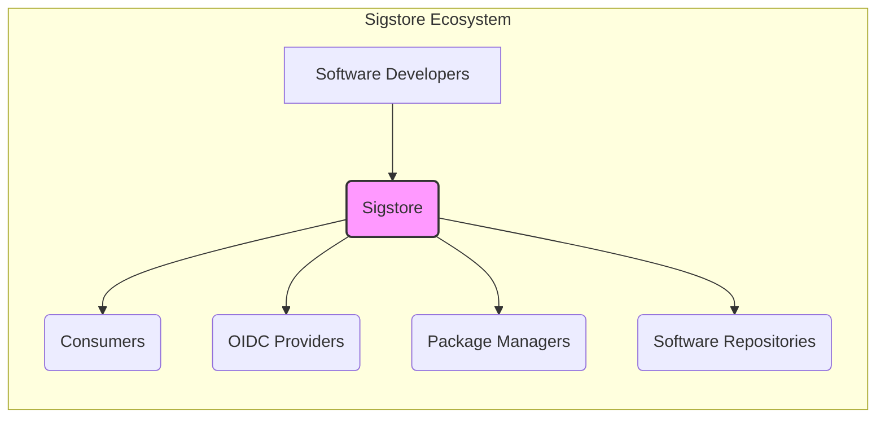
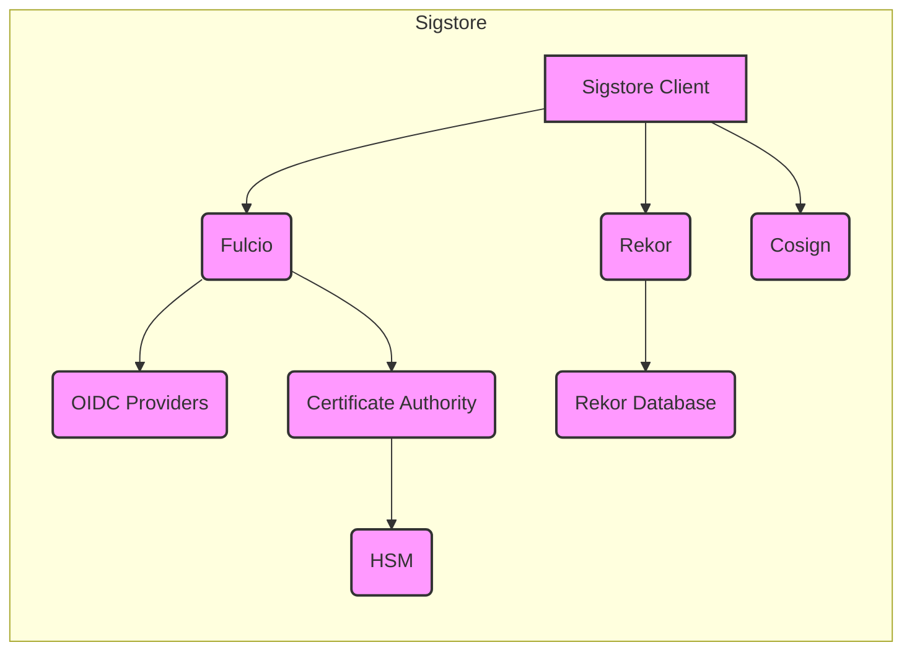
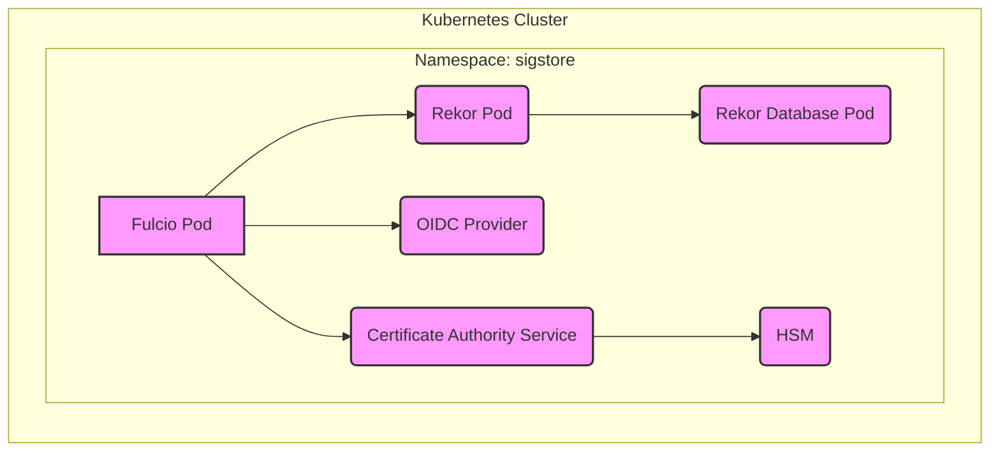
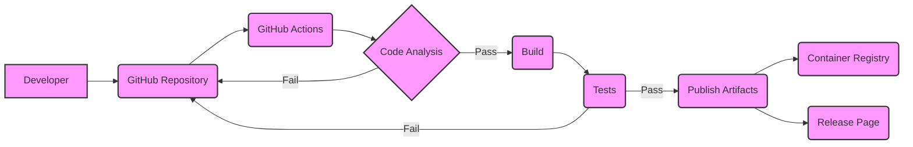

# BUSINESS POSTURE

Sigstore is a non-profit, public-benefit project aiming to improve the open-source software supply chain security. It addresses the critical issue of software provenance and integrity, making it easier for developers to sign software artifacts and for consumers to verify them.

Business Priorities:

*   Enhance the security of the open-source software supply chain.
*   Provide free, easy-to-use tools for code signing and verification.
*   Promote transparency and trust in software distribution.
*   Reduce the risk of supply chain attacks, such as malicious code injection.
*   Gain widespread adoption across the open-source community.
*   Maintain a sustainable and robust infrastructure.

Business Goals:

*   Become the standard for signing and verifying open-source software.
*   Integrate with major package managers and software distribution platforms.
*   Provide a reliable and scalable service.
*   Foster a strong community around the project.

Most Important Business Risks:

*   Compromise of the Sigstore infrastructure, leading to the signing of malicious software.
*   Lack of adoption by key players in the open-source ecosystem.
*   Scalability issues preventing the service from handling widespread use.
*   Usability problems hindering developer adoption.
*   Failure to maintain the long-term sustainability of the project.
*   Legal or regulatory challenges related to code signing and liability.

# SECURITY POSTURE

Existing Security Controls:

*   security control: Short-lived certificates: Sigstore uses short-lived certificates issued by Fulcio, reducing the impact of key compromise. (Described in Fulcio documentation and design).
*   security control: Transparency log: Rekor provides a tamper-proof, publicly auditable transparency log of all signing events. (Described in Rekor documentation and design).
*   security control: Keyless signing: Sigstore leverages OpenID Connect (OIDC) to authenticate users, eliminating the need for developers to manage long-term signing keys. (Described in Sigstore documentation and design).
*   security control: Hardware security module (HSM) backed root CA: The root CA used by Fulcio is protected by a hardware security module. (Mentioned in Sigstore documentation).
*   security control: Code reviews: All code changes undergo mandatory code reviews. (Standard practice for open-source projects on GitHub).
*   security control: Regular security audits: Sigstore undergoes regular security audits by third-party security firms. (Mentioned in Sigstore documentation).
*   security control: Use of memory-safe languages: Significant portions of Sigstore, particularly Rekor, are written in Go, a memory-safe language, reducing the risk of memory corruption vulnerabilities.

Accepted Risks:

*   accepted risk: Reliance on OIDC providers: Sigstore's security depends on the security and availability of the configured OIDC providers. A compromise or outage of an OIDC provider could impact Sigstore's functionality.
*   accepted risk: Short-lived certificate revocation: While short-lived certificates minimize the impact of compromise, revocation mechanisms for these certificates are still an area of development and potential risk.
*   accepted risk: Transparency log DoS: While the transparency log is designed to be robust, a sufficiently large distributed denial-of-service (DDoS) attack could potentially disrupt its operation.

Recommended Security Controls:

*   security control: Implement a robust incident response plan specifically tailored to the unique aspects of Sigstore's architecture.
*   security control: Develop and publish a comprehensive threat model for the entire Sigstore ecosystem.
*   security control: Establish a bug bounty program to incentivize security researchers to find and report vulnerabilities.
*   security control: Implement more fine-grained access control within the Sigstore infrastructure.
*   security control: Explore options for decentralized key management to further reduce reliance on centralized components.

Security Requirements:

*   Authentication:
    *   Users (software developers) must be authenticated via OIDC before signing software.
    *   The system must support multiple OIDC providers.
    *   Authentication tokens must have a short lifespan.

*   Authorization:
    *   Only authenticated users should be able to sign software.
    *   Access control policies should be in place to restrict access to sensitive operations within the Sigstore infrastructure.

*   Input Validation:
    *   All input received from external sources (e.g., OIDC providers, software artifacts) must be validated to prevent injection attacks.
    *   The system must verify the integrity of software artifacts before signing them.

*   Cryptography:
    *   Strong cryptographic algorithms must be used for all signing and verification operations.
    *   Key material must be protected using hardware security modules (HSMs) where appropriate.
    *   The system must support a variety of signing algorithms to accommodate different software ecosystems.

# DESIGN

## C4 CONTEXT

C4 Context Element List:

*   1.  Name: Software Developers
    *   Type: Person
    *   Description: Individuals or teams who create and publish software.
    *   Responsibilities: Develop software, sign software artifacts using Sigstore, publish signed artifacts.
    *   Security controls: Authenticate via OIDC, use Sigstore client tools.

*   2.  Name: Sigstore
    *   Type: Software System
    *   Description: A system for signing and verifying software artifacts.
    *   Responsibilities: Issue short-lived signing certificates, maintain a transparency log, provide tools for signing and verification.
    *   Security controls: HSM-backed root CA, short-lived certificates, transparency log, code reviews, security audits.

*   3.  Name: Consumers
    *   Type: Person
    *   Description: Individuals or systems that download and use software.
    *   Responsibilities: Verify the signatures of software artifacts before using them.
    *   Security controls: Use Sigstore client tools for verification.

*   4.  Name: OIDC Providers
    *   Type: Software System
    *   Description: Identity providers that support OpenID Connect.
    *   Responsibilities: Authenticate users, provide identity information to Sigstore.
    *   Security controls: Standard OIDC security practices.

*   5.  Name: Package Managers
    *   Type: Software System
    *   Description: Tools for managing software packages (e.g., npm, PyPI, Maven).
    *   Responsibilities: Integrate with Sigstore to provide signature verification for packages.
    *   Security controls: Integrate with Sigstore client tools, verify signatures before installing packages.

*   6.  Name: Software Repositories
    *   Type: Software System
    *   Description: Storage locations for software artifacts (e.g., GitHub, GitLab, artifact registries).
    *   Responsibilities: Store signed software artifacts, provide access to artifacts for download.
    *   Security controls: Access controls, integrity checks.

## C4 CONTAINER

C4 Container Element List:

*   1.  Name: Sigstore Client
    *   Type: Software Component
    *   Description: Command-line tools or libraries used by developers and consumers to interact with Sigstore.
    *   Responsibilities: Initiate signing requests, verify signatures, interact with Fulcio and Rekor.
    *   Security controls: Input validation, secure communication with Sigstore services.

*   2.  Name: Fulcio
    *   Type: Web Service
    *   Description: A root CA that issues short-lived signing certificates based on OIDC identity.
    *   Responsibilities: Authenticate users via OIDC, issue short-lived certificates, log certificate issuance to Rekor.
    *   Security controls: Authentication via OIDC, short-lived certificates, integration with Rekor.

*   3.  Name: Rekor
    *   Type: Web Service
    *   Description: A transparency log server that records metadata about signed artifacts.
    *   Responsibilities: Store and serve transparency log entries, provide proof of inclusion and consistency.
    *   Security controls: Tamper-proof data structure, cryptographic verification of log integrity.

*   4.  Name: Cosign
    *   Type: Software Component
    *   Description: A container signing, verification and storage tool.
    *   Responsibilities: Sign container images, verify container image signatures, store signatures in OCI registries.
    *   Security controls: Integration with Fulcio and Rekor, secure communication with container registries.

*   5.  Name: OIDC Providers
    *   Type: External System
    *   Description: Identity providers that support OpenID Connect (e.g., Google, GitHub, Microsoft).
    *   Responsibilities: Authenticate users, provide identity information to Fulcio.
    *   Security controls: Standard OIDC security practices.

*   6.  Name: Rekor Database
    *   Type: Database
    *   Description: Stores the transparency log data.
    *   Responsibilities: Persistently store log entries, provide efficient access for queries.
    *   Security controls: Access controls, data encryption at rest (if applicable).

*   7.  Name: Certificate Authority
    *   Type: Software Component
    *   Description: Internal component of Fulcio responsible for certificate generation.
    *   Responsibilities: Generate X.509 certificates, manage private keys.
    *   Security controls: Private key protection, secure certificate generation process.

*   8.  Name: HSM
    *   Type: Hardware
    *   Description: Hardware Security Module used to protect the Fulcio root CA private key.
    *   Responsibilities: Securely store and manage cryptographic keys, perform cryptographic operations.
    *   Security controls: Physical security, tamper resistance, access controls.

## DEPLOYMENT

Possible Deployment Solutions:

1.  Kubernetes: Deploy Sigstore components as containers within a Kubernetes cluster. This is the most likely and recommended deployment model.
2.  Virtual Machines: Deploy each component on separate virtual machines.
3.  Serverless Functions: Deploy some components (e.g., Fulcio) as serverless functions. This is less likely due to the stateful nature of Rekor.

Chosen Deployment Solution: Kubernetes

Deployment Element List:

*   1.  Name: Kubernetes Cluster
    *   Type: Infrastructure
    *   Description: A cluster of machines managed by Kubernetes.
    *   Responsibilities: Orchestrate and manage the Sigstore containers.
    *   Security controls: Network policies, RBAC, pod security policies.

*   2.  Name: Namespace: sigstore
    *   Type: Logical Isolation
    *   Description: A Kubernetes namespace to isolate Sigstore components.
    *   Responsibilities: Provide a scope for names and resources.
    *   Security controls: Resource quotas, network policies.

*   3.  Name: Fulcio Pod
    *   Type: Container
    *   Description: A Kubernetes pod running the Fulcio service.
    *   Responsibilities: Handle certificate issuance requests.
    *   Security controls: Network policies, resource limits.

*   4.  Name: Rekor Pod
    *   Type: Container
    *   Description: A Kubernetes pod running the Rekor service.
    *   Responsibilities: Manage the transparency log.
    *   Security controls: Network policies, resource limits.

*   5.  Name: OIDC Provider
    *   Type: External System
    *   Description: An external OIDC provider (e.g., Google, GitHub).
    *   Responsibilities: Authenticate users.
    *   Security controls: Standard OIDC security practices.

*   6.  Name: Rekor Database Pod
    *   Type: Container
    *   Description: A Kubernetes pod running the database for Rekor.
    *   Responsibilities: Persist transparency log data.
    *   Security controls: Network policies, persistent volume claims, data encryption.

*   7.  Name: Certificate Authority Service
    *   Type: Service
    *   Description: Internal service for managing certificate generation within Fulcio.
    *   Responsibilities: Generate certificates, manage keys.
    *   Security controls: Internal communication only, key protection.

*   8.  Name: HSM
    *   Type: Hardware
    *   Description: Hardware Security Module protecting the Fulcio root CA key.
    *   Responsibilities: Securely store and manage the root CA key.
    *   Security controls: Physical security, tamper resistance.

## BUILD

The Sigstore project utilizes GitHub Actions for its build and release process. This ensures automation, consistency, and security in the software supply chain.

Build Process Description:

1.  Developers commit code to the Sigstore GitHub repository.
2.  GitHub Actions workflows are triggered by events (e.g., push, pull request).
3.  Code Analysis:
    *   Static analysis tools (e.g., linters, SAST scanners) are run to identify potential code quality and security issues.
    *   If analysis fails, the build is stopped, and feedback is provided to the developers.
4.  Build:
    *   The code is compiled or packaged into the appropriate format (e.g., binaries, container images).
5.  Tests:
    *   Automated tests (unit, integration, end-to-end) are executed to verify the functionality and security of the software.
    *   If tests fail, the build is stopped, and feedback is provided.
6.  Publish Artifacts:
    *   Successful builds result in the publication of artifacts.
    *   Container images are pushed to a container registry (e.g., GitHub Container Registry).
    *   Binaries and other release assets are published on the GitHub Releases page.

Security Controls in Build Process:

*   security control: Automated workflows: GitHub Actions ensure consistent and repeatable builds.
*   security control: Code analysis: Static analysis tools help identify vulnerabilities early in the development lifecycle.
*   security control: Automated testing: Comprehensive tests verify functionality and security.
*   security control: Signed commits: Developers are encouraged to sign their commits, ensuring the integrity of the codebase.
*   security control: Dependency management: Tools like Dependabot help keep dependencies up-to-date and address known vulnerabilities.
*   security control: Artifact signing: Build artifacts (e.g., container images) are signed using Sigstore itself, providing a chain of trust from code to deployment.

# RISK ASSESSMENT

Critical Business Processes to Protect:

*   Software signing and verification: Ensuring the integrity and authenticity of software artifacts.
*   Transparency log maintenance: Maintaining a tamper-proof record of signing events.
*   Certificate issuance: Securely issuing short-lived signing certificates.
*   Key management: Protecting the private keys used for signing and certificate issuance.

Data to Protect and Sensitivity:

*   Transparency log data: Contains metadata about signed software, including timestamps, public keys, and artifact digests. Sensitivity: Medium (publicly auditable, but integrity is critical).
*   Fulcio root CA private key: Used to sign short-lived certificates. Sensitivity: Extremely High (compromise would allow attackers to sign malicious software).
*   Rekor database: Contains the transparency log entries. Sensitivity: Medium (integrity is critical).
*   OIDC provider tokens: Used to authenticate users. Sensitivity: High (compromise could allow unauthorized signing).
*   Code signing keys (used by developers before Sigstore adoption): Sensitivity: High (compromise allows signing malicious software).

# QUESTIONS & ASSUMPTIONS

Questions:

*   What are the specific service-level agreements (SLAs) for Sigstore's availability and performance?
*   What is the disaster recovery plan for the Sigstore infrastructure?
*   What are the specific OIDC providers that are currently supported, and what is the process for adding new providers?
*   What are the plans for long-term maintenance and funding of the Sigstore project?
*   What is the process for handling vulnerability reports and security incidents?
*   What level of support is provided to users and developers adopting Sigstore?

Assumptions:

*   BUSINESS POSTURE: The open-source community will widely adopt Sigstore.
*   BUSINESS POSTURE: Sigstore will be able to scale to meet the demands of widespread adoption.
*   BUSINESS POSTURE: Funding and resources will be available to maintain the project long-term.
*   SECURITY POSTURE: OIDC providers used by Sigstore will maintain high levels of security and availability.
*   SECURITY POSTURE: The transparency log will be resistant to tampering and denial-of-service attacks.
*   SECURITY POSTURE: Developers will follow best practices for securing their development environments.
*   DESIGN: The Kubernetes deployment model will be used for the production Sigstore infrastructure.
*   DESIGN: GitHub Actions will continue to be used for the build and release process.
*   DESIGN: The Sigstore project will continue to evolve and adapt to new security threats and technologies.