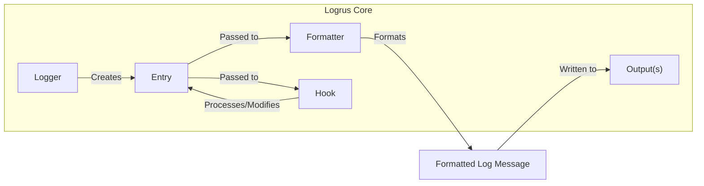
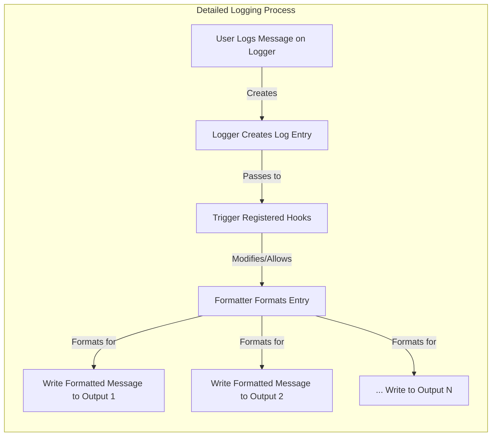

# Project Design Document: Logrus Logging Library

**Version:** 1.1
**Date:** October 26, 2023
**Author:** Gemini (AI Language Model)

## 1. Introduction

This document provides an enhanced design overview of the Logrus logging library, a widely adopted structured logging library for Go. The primary goal of this document is to offer a clear and detailed understanding of Logrus's architecture, components, and data flow, specifically tailored for effective threat modeling. This document will serve as a robust foundation for security professionals to identify potential vulnerabilities and design appropriate mitigation strategies.

## 2. Goals and Non-Goals

**Goals:**

*   Clearly and comprehensively define the architectural components of Logrus, including their responsibilities and interactions.
*   Precisely describe the data flow within the logging process, highlighting key transformation and interaction points.
*   Identify key interfaces and extension points, emphasizing their potential security implications.
*   Provide sufficient technical detail and context for security professionals to perform thorough threat modeling exercises.
*   Document the intended functionality and scope of the library, focusing on aspects relevant to security.

**Non-Goals:**

*   Serve as a user manual or a comprehensive guide to using the Logrus library.
*   Detail the intricate internal implementation of specific functions or methods beyond what is necessary for understanding the architecture and data flow.
*   Analyze the security of specific applications *using* Logrus. The focus remains on the security characteristics of the library itself.
*   Exhaustively cover every possible configuration option. The focus is on commonly used and security-relevant configurations.

## 3. Architectural Overview

Logrus employs a flexible and pluggable architecture, enabling users to customize various stages of the logging pipeline. The core components interact to process and output log messages in a structured manner.

### 3.1. Key Components

*   **Logger:** The central orchestrator of the logging process. It acts as the primary interface for users to initiate logging events. The `Logger` manages configuration settings such as the minimum logging level, the active formatter, and the registered hooks.
*   **Entry:** Represents an individual log event as it progresses through the logging pipeline. It encapsulates the raw log message, its associated severity level, the timestamp of the event, and any supplementary fields (key-value pairs) added for context.
*   **Formatter:** Responsible for transforming the structured `Entry` data into a specific output format suitable for various destinations. Logrus provides built-in formatters (e.g., JSON, text), and users can implement custom formatters to meet specific requirements.
*   **Hook:**  Provides a mechanism for users to inject custom logic into the logging process at specific points. Hooks are triggered when a log event at a certain level occurs. They can be used for diverse purposes, including sending logs to external services, enriching log entries with contextual information, or filtering out specific log messages. Multiple hooks can be registered with a single `Logger`.
*   **Output(s):**  Represents the destination(s) where the final, formatted log messages are written. By default, this is typically `os.Stdout` or `os.Stderr`, but it can be redirected to various other destinations, such as files, network sockets, or custom `io.Writer` implementations. A `Logger` can be configured to write to multiple outputs simultaneously.

## 4. Data Flow

The journey of a log message through Logrus involves the following sequential steps:

1. **User Invocation:** The user initiates a logging event by calling a logging function on a `Logger` instance (e.g., `logger.Info("message")`, `logger.WithField("key", "value").Error("error message")`).
2. **Entry Creation:**  The `Logger` creates a new `Entry` object. This `Entry` is populated with the provided log message, the specified log level, the current timestamp, and any additional fields supplied by the user through methods like `WithField`.
3. **Hook Processing:** Registered `Hook`s are triggered based on their configured log levels. Each relevant hook's `Fire` method is invoked, receiving the `Entry` as an argument. Hooks have the ability to inspect, modify (e.g., add or remove fields), or even suppress the `Entry` from further processing.
4. **Formatting:** The `Entry` is passed to the configured `Formatter`. The `Formatter` transforms the structured data within the `Entry` into a formatted log message, typically a byte slice. The specific format depends on the chosen formatter (e.g., JSON, plain text).
5. **Output Writing:** The formatted log message (byte slice) is then written to the configured `Output(s)`. If multiple outputs are configured, the message is written to each of them.

## 5. Component Details

### 5.1. Logger

*   **Responsibilities:**
    *   Receiving and initiating log requests from application code.
    *   Creating and managing `Entry` objects for each log event.
    *   Enforcing the configured minimum logging level, filtering out messages below that level.
    *   Maintaining references to the configured `Formatter` and registered `Hook`s.
    *   Orchestrating the logging pipeline by passing `Entry` objects to hooks and the formatter.
    *   Directing the formatted log message to the designated `Output(s)`.
*   **Configuration:**
    *   **Log Level:** Defines the minimum severity level for log messages to be processed (e.g., Debug, Info, Warning, Error, Fatal, Panic).
    *   **Formatter:** Specifies the formatter to be used for outputting log messages (e.g., TextFormatter, JSONFormatter, custom implementations).
    *   **Output(s):** Configures the destination(s) for log output, which can include standard output/error, files, or network connections.
    *   **Hooks:** A collection of registered `Hook` implementations that are triggered during the logging process.
*   **Security Considerations:**
    *   Improperly configured log levels might lead to excessive logging, potentially exposing sensitive information or consuming excessive resources.
    *   The choice of formatter can impact security, especially when dealing with potentially untrusted data.
    *   The configured outputs determine where log data is sent, which has implications for data confidentiality and integrity.

### 5.2. Entry

*   **Responsibilities:**
    *   Holding the raw log message provided by the user.
    *   Storing the determined log level for the event.
    *   Recording the timestamp when the log event occurred.
    *   Maintaining a collection of associated fields (key-value pairs) that provide contextual information.
    *   Providing methods for hooks to access and potentially modify its data.
*   **Data Attributes:**
    *   `Message` (string): The core textual content of the log message.
    *   `Level` (Level): An enumeration representing the severity of the log event.
    *   `Time` (time.Time): The timestamp indicating when the log occurred.
    *   `Data` (map[string]interface{}): A map storing key-value pairs associated with the log entry. The `interface{}` type allows for storing various data types.
*   **Security Considerations:**
    *   The `Data` field can potentially contain sensitive information. Care must be taken to avoid logging sensitive data unintentionally.
    *   Hooks can modify the `Entry` data, potentially introducing vulnerabilities if hooks are malicious or poorly implemented.

### 5.3. Formatter

*   **Responsibilities:**
    *   Transforming a structured `Entry` object into a serialized representation (e.g., a byte slice).
    *   Implementing the specific formatting logic according to the chosen format (e.g., adding timestamps, log levels, and fields in a defined structure).
    *   Handling the encoding of data for the output destination.
*   **Interfaces:**
    *   `Format(entry *Entry) ([]byte, error)`: The primary method responsible for formatting the `Entry`. It returns the formatted output as a byte slice and any potential errors encountered during formatting.
*   **Built-in Formatters:**
    *   `TextFormatter`: Formats logs as human-readable text, with options for customization.
    *   `JSONFormatter`: Formats logs as JSON objects, suitable for machine processing.
*   **Security Considerations:**
    *   Custom formatters need to be carefully implemented to avoid introducing vulnerabilities such as log injection attacks, especially when handling user-provided data within log entries.
    *   The chosen formatter can impact the readability and parsability of logs for security analysis tools.

### 5.4. Hook

*   **Responsibilities:**
    *   Executing custom code in response to specific log events.
    *   Modifying the `Entry` object before it is passed to the formatter (e.g., adding, removing, or modifying fields).
    *   Performing side effects such as sending logs to external monitoring systems, databases, or other services.
    *   Filtering log messages based on specific criteria, preventing them from being processed further.
*   **Interfaces:**
    *   `Levels() []Level`: Returns a slice of `Level` values indicating the log levels for which the hook should be triggered.
    *   `Fire(entry *Entry) error`: The method that is executed when a log event at a matching level occurs. It receives the `Entry` object as input and can return an error if necessary.
*   **Examples of Use Cases:**
    *   Sending error logs to a centralized logging system (e.g., Elasticsearch, Splunk).
    *   Adding contextual information like request IDs, user IDs, or transaction IDs to log entries.
    *   Filtering out sensitive data before it is written to the output.
*   **Security Considerations:**
    *   Hooks execute arbitrary code and represent a significant potential attack surface. Malicious or compromised hooks could:
        *   Expose sensitive information by logging it to unauthorized destinations.
        *   Perform denial-of-service attacks by consuming excessive resources or crashing the application.
        *   Execute arbitrary code on the system if they interact with external systems insecurely.
        *   Modify or delete log data, hindering forensic analysis.
    *   The security of third-party hooks is a major concern, as vulnerabilities in these hooks can compromise the application's security.

### 5.5. Output(s)

*   **Responsibilities:**
    *   Receiving the formatted log message as a byte slice.
    *   Writing the received message to the designated output destination.
    *   Handling any necessary encoding or buffering for the specific output type.
*   **Examples:**
    *   `os.Stdout`: Standard output stream.
    *   `os.Stderr`: Standard error stream.
    *   File writers (`os.File`): Writing logs to files.
    *   Network connections (e.g., TCP or UDP sockets): Sending logs over the network.
    *   Custom writers implementing the `io.Writer` interface: Allowing integration with various logging backends.
*   **Security Considerations:**
    *   The choice of output destination has significant security implications. Writing logs to publicly accessible locations can lead to information disclosure.
    *   Insecurely configured network outputs could allow unauthorized access to log data.
    *   Insufficient permissions on log files could allow unauthorized modification or deletion of logs.

## 6. Security Considerations (Detailed)

This section expands on the initial security considerations, providing more specific examples and potential attack vectors.

*   **Log Injection Vulnerabilities:** If user-provided data is directly included in log messages without proper sanitization, attackers might be able to inject malicious content that could be interpreted as commands or control characters by downstream log processing systems. This is especially relevant when using text-based formatters.
*   **Sensitive Information Disclosure:**  Carelessly logging sensitive information (e.g., passwords, API keys, personal data) can lead to significant security breaches if logs are stored or transmitted insecurely. Proper configuration of log levels and the use of filtering hooks are crucial to mitigate this risk.
*   **Malicious Hooks:** As hooks execute arbitrary code, they represent a significant attack vector. A compromised or malicious hook could perform various malicious actions, including:
    *   **Data Exfiltration:** Sending sensitive information to attacker-controlled servers.
    *   **Remote Code Execution:** Exploiting vulnerabilities in external systems or the host environment.
    *   **Denial of Service:** Consuming excessive resources or crashing the application.
    *   **Log Tampering:** Modifying or deleting log entries to cover up malicious activity.
*   **Insecure Output Destinations:**  Writing logs to publicly accessible locations or using insecure network protocols can expose sensitive information to unauthorized parties. Ensure that log outputs are properly secured and access is restricted.
*   **Configuration Vulnerabilities:**  If the Logrus configuration (e.g., output paths, hook registrations) can be modified by unauthorized users, it could lead to security breaches. Secure configuration management practices are essential.
*   **Dependency Vulnerabilities:**  Logrus, like any software, relies on dependencies. Vulnerabilities in these dependencies could potentially be exploited. Regularly updating dependencies and performing security audits are important.
*   **Lack of Input Validation in Custom Formatters:** Custom formatters that don't properly handle potentially malicious data within log entries could introduce vulnerabilities. Ensure that custom formatters sanitize or escape data appropriately.

## 7. Deployment Considerations

The security of Logrus is intrinsically linked to how it is deployed and used within an application.

*   **Secure Library Integration:** Developers must be mindful of how they use Logrus and avoid practices that introduce vulnerabilities, such as directly logging unsanitized user input.
*   **Secure Configuration Management:** Logrus configuration should be stored and managed securely, preventing unauthorized modifications. Consider using environment variables or dedicated configuration files with appropriate access controls.
*   **Principle of Least Privilege for Outputs:** Ensure that the application has only the necessary permissions to write to the configured log outputs. Avoid running the application with overly permissive accounts.
*   **Regular Security Audits of Hooks:** If using custom or third-party hooks, conduct regular security audits to identify potential vulnerabilities.
*   **Secure Transmission of Logs:** If logs are transmitted over a network, use secure protocols (e.g., TLS/SSL) to protect their confidentiality and integrity.
*   **Log Rotation and Archival:** Implement proper log rotation and archival mechanisms to prevent logs from consuming excessive disk space and to facilitate long-term security analysis. Ensure that archived logs are also stored securely.

## 8. Future Considerations

*   **Built-in Sanitization Options:** Exploring the possibility of adding built-in sanitization options within Logrus could help developers avoid common log injection vulnerabilities.
*   **Enhanced Hook Security Mechanisms:** Investigating ways to sandbox or restrict the capabilities of hooks could mitigate the risks associated with malicious or compromised hooks.
*   **Formal Security Audit:** A comprehensive security audit by external security experts would provide valuable insights and recommendations for further improving the security of Logrus.
*   **Content Security Policy (CSP) for Log Output:** For web-based log viewers, consider the implications of log content on CSP and ensure appropriate escaping or sanitization.

This enhanced design document provides a more detailed and security-focused overview of the Logrus logging library. It aims to equip security professionals with the necessary information to conduct thorough threat modeling and implement appropriate security measures.