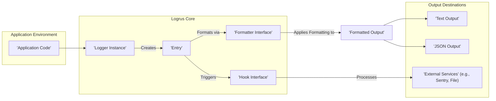
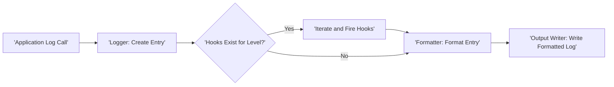

# Project Design Document: Logrus - Structured Logging for Go

**Version:** 1.1
**Date:** October 26, 2023
**Author:** AI Software Architect

## 1. Introduction

This document provides a detailed design overview of the Logrus project, a widely used structured logging library for the Go programming language. Its primary purpose is to clearly define the architecture, components, and data flow within Logrus, specifically to support comprehensive threat modeling activities. This document will serve as a foundational resource for security assessments and discussions.

## 2. Goals of Logrus

* Provide structured logging capabilities for Go applications, enabling easier parsing and analysis.
* Offer a flexible and pluggable architecture to accommodate diverse output formats and destinations.
* Facilitate contextual logging by allowing the addition of relevant information to log messages.
* Implement standardized logging levels (Debug, Info, Warn, Error, Fatal, Panic) for consistent severity indication.
* Enable extensibility through hooks, allowing users to inject custom logic into the logging process.
* Maintain a simple and intuitive API for common logging tasks, promoting ease of integration.

## 3. High-Level Architecture

Logrus employs a modular design where distinct components interact to process and output log messages.

**Key Components:**

* **Application Code:** The Go application utilizing the Logrus library for its logging needs.
* **Logger Instance:** The central management point for logging configuration and the creation of log entries.
* **Entry:** Represents an individual log message, encapsulating its level, timestamp, message content, and associated data.
* **Formatter Interface:** Defines the contract for transforming log entries into specific output formats.
* **Hook Interface:** Defines the contract for intercepting and acting upon log entries before their final output.
* **Text Output:** A default formatter producing human-readable text-based logs.
* **JSON Output:** A formatter generating logs in JSON format for structured data handling.
* **External Services:** Represents external systems or locations where logs can be directed using hooks (e.g., file systems, error tracking platforms).

## 4. Detailed Design

### 4.1. Logger Instance

* **Core Functions:**
    * Manages the overall logging configuration for the application.
    * Sets the logging level, determining the minimum severity of messages to be output.
    * Holds the default formatter for log entries.
    * Maintains a registry of active hooks.
    * Provides methods for generating new log entries (e.g., `Debug()`, `Info()`, `Warn()`, `Error()`, `Fatal()`, `Panic()`, `WithFields()`).
    * Offers methods to configure the formatter and add/remove hooks.
    * Specifies the output destination for logs (e.g., `os.Stdout`, a file).

* **Key Attributes:**
    * `Level`:  An enumeration representing the minimum logging severity.
    * `Formatter`: An object implementing the `Formatter` interface.
    * `Out`: An `io.Writer` instance defining the log output stream.
    * `Hooks`: A map associating logging levels with lists of `Hook` implementations.

### 4.2. Entry

* **Core Functions:**
    * Represents a single, discrete logging event.
    * Stores the log level, timestamp of occurrence, the core message, and any associated structured data.
    * Provides mechanisms to append additional contextual fields to the log entry.
    * Serves as the data structure passed to formatters and hooks for processing.

* **Key Attributes:**
    * `Level`: The severity level assigned to the log message.
    * `Time`: A timestamp indicating when the log entry was created.
    * `Message`: The textual content of the log message.
    * `Data`: A `map[string]interface{}` holding structured key-value pairs associated with the log message.
    * `Logger`: A reference back to the `Logger` instance that created this entry.

### 4.3. Formatter Interface

* **Core Functions:**
    * Defines a single method signature: `Format(*Entry) ([]byte, error)`. This method is responsible for transforming a log entry into a byte slice representing its formatted output.
    * Enables complete customization of the log output format.

* **Common Implementations:**
    * `TextFormatter`: Renders logs in a human-readable text format, offering options for customizing elements like timestamp format and colorization.
    * `JSONFormatter`: Serializes log entries into JSON format, with options for pretty-printing.

### 4.4. Hook Interface

* **Core Functions:**
    * Defines a single method signature: `Fire(*Entry) error`. This method is invoked when a log entry at the hook's registered level (or a more severe level) is generated.
    * Allows interception and custom processing of log entries before they reach their final output.
    * Enables integration with external services, custom filtering logic, and the addition of dynamic context.

* **Examples of Hook Implementations:**
    * Hooks for transmitting logs to error tracking services (e.g., Sentry, Rollbar).
    * Hooks for routing logs to specific files based on their severity.
    * Hooks for enriching log entries with contextual information from the application environment.

## 5. Data Flow

The following describes the typical lifecycle of a log message within the Logrus library:

1. **Initiation:** Application code invokes a logging method on a `Logger` instance (e.g., `logger.Info("User logged in")`).
2. **Entry Creation:** The `Logger` instantiates a new `Entry` object, populating it with the log level, current timestamp, and the provided message.
3. **Contextual Enrichment (Optional):** If methods like `WithFields()` are used, additional key-value data is added to the `Entry`'s `Data` map.
4. **Hook Invocation:** The `Logger` iterates through its registered hooks. If a hook is configured to handle the `Entry`'s log level (or lower), the hook's `Fire()` method is called, passing the `Entry` object. Hooks can modify the entry or trigger external actions.
5. **Formatting:** The `Logger`'s configured `Formatter` processes the `Entry`, transforming it into a formatted byte slice according to its defined rules.
6. **Output:** The formatted log message (as a byte slice) is written to the `Logger`'s designated `io.Writer` (e.g., `os.Stdout`, a file).

## 6. Security Considerations for Threat Modeling

This section outlines potential security vulnerabilities and attack vectors related to Logrus, crucial for effective threat modeling:

* **Information Disclosure:**
    * **Accidental Logging of Sensitive Data:**  Credentials (API keys, passwords), personal identifiable information (PII), or internal system details might be unintentionally included in log messages.
    * **Insecure Log Storage:** Log files themselves, if not properly secured with appropriate permissions and access controls, can become targets for unauthorized access.
    * **Compromised External Log Destinations:** If external services receiving logs via hooks are compromised, the logged data could be exposed.

* **Log Injection:**
    * **Unsanitized User Input in Logs:** If user-provided data is directly incorporated into log messages without proper sanitization or encoding, attackers can inject malicious control characters or code. This could lead to:
        * **Log Manipulation:** Altering log content to hide malicious activity.
        * **Exploitation of Log Processing Tools:** Injecting commands or scripts that are executed by log analysis tools.

* **Denial of Service (DoS):**
    * **Log Flooding:** Attackers could overwhelm the application with a massive volume of log messages, consuming excessive resources (CPU, memory, disk space) and potentially causing service disruption or failure.
    * **Resource Exhaustion via Misconfigured Hooks:**  Incorrectly configured or poorly implemented hooks could lead to infinite loops, excessive resource consumption, or deadlocks.

* **Configuration Vulnerabilities:**
    * **Overly Verbose Logging Levels in Production:** Leaving debug or trace logging enabled in production environments can expose sensitive information and degrade performance.
    * **Insecure Default Configurations:**  Default settings that do not enforce strong security practices can create vulnerabilities.
    * **Incorrect Output Destination Configuration:**  Misconfiguring where logs are written could lead to them being stored in publicly accessible locations.

* **Dependency Chain Risks:**
    * **Vulnerabilities in Logrus Dependencies:** Security flaws in libraries that Logrus depends on could indirectly introduce vulnerabilities into the logging system.

* **Hook-Related Security Concerns:**
    * **Malicious or Compromised Hooks:**  If custom hooks are not developed with security in mind or if an attacker can inject malicious hooks, they could perform unauthorized actions, such as data exfiltration or system modification.
    * **Lack of Input Validation in Custom Hooks:**  Custom hooks that process log data without proper validation could be susceptible to injection attacks or other vulnerabilities.

## 7. Assumptions and Constraints

* This design assumes a reasonably secure underlying Go runtime environment and operating system.
* The document primarily focuses on the core Logrus library and does not delve into the specifics of individual hook or formatter implementations.
* The security considerations outlined are not exhaustive but represent key areas of concern for threat modeling.

## 8. Future Considerations

* Explore the integration of built-in mechanisms for automatically sanitizing log messages to mitigate log injection risks.
* Implement more robust error handling within the hook execution process to prevent cascading failures.
* Consider adding support for more advanced log rotation and management strategies directly within Logrus.
* Enhance documentation and provide best practice guidelines for secure logging configurations and hook development.

This design document provides a comprehensive understanding of the Logrus project's architecture and components, serving as a solid foundation for thorough threat modeling. By understanding the system's design and data flow, potential security weaknesses can be proactively identified and addressed.