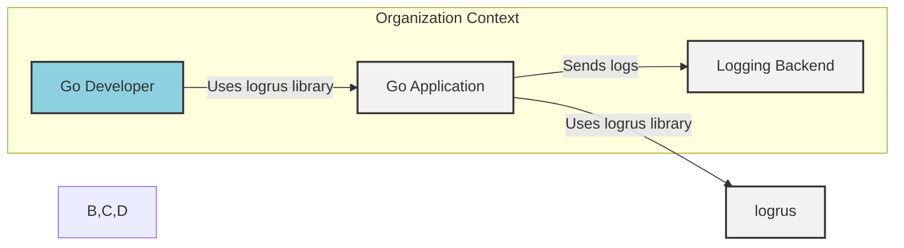
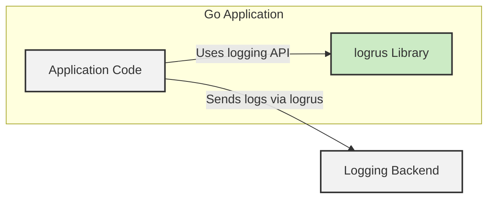
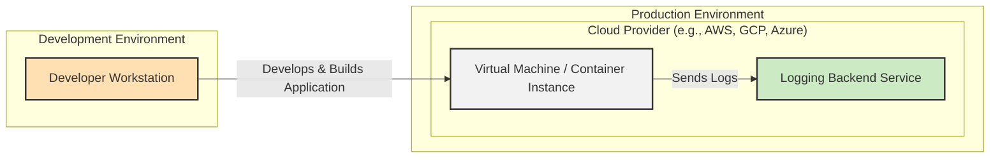

# BUSINESS POSTURE

- Business Priorities and Goals:
  - Provide a robust, flexible, and widely adopted logging library for Go applications.
  - Enable developers to easily integrate structured logging into their Go projects.
  - Maintain high performance and minimal overhead to avoid impacting application performance.
  - Foster a strong community around the library for contributions and support.
- Business Risks:
  - Security vulnerabilities in `logrus` could impact a large number of applications that depend on it.
  - Performance bottlenecks introduced by `logrus` could negatively affect applications.
  - Lack of maintenance or slow response to issues could reduce developer trust and adoption.
  - Incompatibility with newer Go versions or logging standards could limit its long-term usability.

# SECURITY POSTURE

- Existing Security Controls:
  - security control: Open Source Code - The source code is publicly available on GitHub (https://github.com/sirupsen/logrus), allowing for community review and scrutiny.
  - security control: Community Contributions - The project benefits from community contributions, including bug fixes and feature enhancements, which can indirectly improve security.
  - accepted risk: Reliance on Community Security Audits - Security audits are primarily driven by the community and may not be as frequent or comprehensive as dedicated security reviews.
  - accepted risk: Vulnerability Response Time - Response time to reported vulnerabilities depends on maintainer availability and community contributions.

- Recommended Security Controls:
  - security control: Automated Dependency Scanning - Implement automated checks for known vulnerabilities in dependencies used by `logrus`.
  - security control: Static Application Security Testing (SAST) - Integrate SAST tools into the CI/CD pipeline to automatically scan the `logrus` codebase for potential security flaws.
  - security control: Vulnerability Disclosure Policy - Establish a clear process for reporting and handling security vulnerabilities, including a security contact and expected response times.
  - security control: Security Contact - Designate a security contact or security team responsible for handling security-related inquiries and vulnerability reports.

- Security Requirements:
  - Authentication:
    - Not directly applicable to `logrus` as it is a logging library. Authentication is the responsibility of the applications using `logrus` when interacting with logging backends.
  - Authorization:
    - Not directly applicable to `logrus`. Authorization is the responsibility of the applications using `logrus` to control access to log data and logging configurations.
  - Input Validation:
    - Log message inputs should be handled carefully by applications using `logrus` to prevent log injection attacks if logs are processed by external systems. `logrus` itself should handle formatting and encoding of log messages safely.
  - Cryptography:
    - `logrus` itself does not directly implement cryptography. However, applications using `logrus` might log sensitive data that requires encryption at rest or in transit when sent to logging backends. This is the responsibility of the application and the logging backend infrastructure.

# DESIGN

- C4 CONTEXT



  - Context Diagram Elements:
    - - Name: Go Developer
      - Type: Person
      - Description: Software developers who use the `logrus` library in their Go applications.
      - Responsibilities: Integrate `logrus` into their Go applications to enable logging. Configure `logrus` to meet their application's logging needs.
      - Security controls: Secure development practices when using and configuring `logrus`.
    - - Name: Go Application
      - Type: Software System
      - Description: Applications written in Go that utilize the `logrus` library for logging purposes.
      - Responsibilities: Generate log messages using `logrus`. Configure `logrus` to send logs to appropriate logging backends. Handle sensitive data in logs securely.
      - Security controls: Input validation for log messages. Secure configuration of logging backends. Encryption of sensitive log data if necessary.
    - - Name: Logging Backend
      - Type: Software System
      - Description: External systems that receive and store logs generated by Go applications using `logrus`. Examples include Elasticsearch, cloud logging services, file systems.
      - Responsibilities: Receive, store, and potentially process log messages. Provide interfaces for querying and analyzing logs. Ensure the security and integrity of stored logs.
      - Security controls: Access control to log data. Encryption of logs at rest and in transit. Audit logging of access to logs.
    - - Name: logrus
      - Type: Software System
      - Description: The `logrus` logging library itself. A Go package that provides structured logging capabilities.
      - Responsibilities: Provide a flexible and efficient API for logging in Go applications. Format and output log messages to various destinations. Be reliable and performant.
      - Security controls: Secure coding practices in the development of `logrus`. Vulnerability management and timely patching.

- C4 CONTAINER



  - Container Diagram Elements:
    - - Name: logrus Library
      - Type: Library
      - Description: The `logrus` Go library, integrated as a dependency within Go applications.
      - Responsibilities: Provide logging API for applications. Format log messages. Handle different log levels and output formats.
      - Security controls: Secure coding practices in library development. Vulnerability scanning of library dependencies.
    - - Name: Application Code
      - Type: Container
      - Description: The main codebase of the Go application that utilizes the `logrus` library.
      - Responsibilities: Implement application logic. Generate log messages using `logrus` API. Configure `logrus` for desired logging behavior.
      - Security controls: Secure coding practices in application development. Input validation for data logged. Proper handling of sensitive data.
    - - Name: Logging Backend
      - Type: Software System
      - Description: External system receiving logs from the Go application via `logrus`.
      - Responsibilities: Receive and store logs. Provide access to logs for analysis and monitoring.
      - Security controls: Access control to logs. Secure storage and transmission of logs.

- DEPLOYMENT

Deployment is not directly applicable to `logrus` itself, as it is a library. `logrus` is deployed as part of the Go applications that use it. The deployment architecture will depend on how the Go application is deployed.

Assuming a common deployment scenario for a Go application:



  - Deployment Diagram Elements (for a Go application using `logrus`):
    - - Name: Developer Workstation
      - Type: Development Environment
      - Description: Developer's local machine used for writing code, building, and testing the Go application that uses `logrus`.
      - Responsibilities: Code development, local testing, building application binaries.
      - Security controls: Secure workstation configuration, code review, developer training on secure coding practices.
    - - Name: Virtual Machine / Container Instance
      - Type: VM / Container
      - Description: The runtime environment where the Go application (including `logrus` library) is deployed and executed in production. Could be a VM in the cloud, a container in a container orchestration platform (like Kubernetes), or a server.
      - Responsibilities: Run the Go application. Execute application logic. Generate and send logs via `logrus`.
      - Security controls: Hardened OS and runtime environment. Network security controls (firewalls, network segmentation). Regular security patching. Access control to the VM/container.
    - - Name: Logging Backend Service
      - Type: Cloud Service
      - Description: A managed logging service provided by a cloud provider (e.g., AWS CloudWatch, GCP Cloud Logging, Azure Monitor Logs) or a self-hosted logging system (e.g., Elasticsearch cluster).
      - Responsibilities: Receive, store, index, and provide querying capabilities for logs sent by the Go application. Ensure log data availability and durability.
      - Security controls: Access control to log data. Encryption of logs at rest and in transit. Audit logging of access. Data retention policies.

- BUILD

```mermaid
flowchart LR
    A["Developer"] -->|Code Changes, Commit, Push| B["GitHub Repository"]
    B -->|Webhook, Trigger| C["CI/CD System (e.g., GitHub Actions)"]
    C -->|Build, Test, Lint, SAST, Dependency Scan| D["Build Artifacts (logrus package)"]
    D -->|Publish| E["Go Package Registry (e.g., pkg.go.dev)"]
    style A person
    style B,E fill:#f2f2f2,stroke:#333,stroke-width:2px
    style C,D fill:#ccebc5,stroke:#333,stroke-width:2px
    classDef person fill:#8dd1e1,stroke:#333,stroke-width:2px
    classDef fill:#f2f2f2,stroke:#333,stroke-width:2px
    classDef fill:#ccebc5,stroke:#333,stroke-width:2px
```

  - Build Process Elements:
    - - Name: Developer
      - Type: Person
      - Description: Software developer contributing to the `logrus` project.
      - Responsibilities: Write code, commit changes, push code to the GitHub repository.
      - Security controls: Secure coding practices. Code review process.
    - - Name: GitHub Repository
      - Type: Code Repository
      - Description: The GitHub repository (https://github.com/sirupsen/logrus) hosting the `logrus` source code.
      - Responsibilities: Version control, source code management, collaboration platform.
      - Security controls: Access control to the repository. Branch protection. Audit logging of repository actions.
    - - Name: CI/CD System (e.g., GitHub Actions)
      - Type: Build Automation System
      - Description: Automated system that builds, tests, and performs security checks on the `logrus` codebase upon code changes.
      - Responsibilities: Automated build process. Unit testing. Linting. Static Application Security Testing (SAST). Dependency scanning.
      - Security controls: Secure CI/CD pipeline configuration. Access control to CI/CD system. Secrets management for build credentials.
    - - Name: Build Artifacts (logrus package)
      - Type: Artifact
      - Description: The compiled and packaged `logrus` library, ready to be distributed and used by Go applications.
      - Responsibilities: Represent the distributable form of the `logrus` library.
      - Security controls: Integrity checks (e.g., checksums) of build artifacts. Secure storage of build artifacts before publishing.
    - - Name: Go Package Registry (e.g., pkg.go.dev)
      - Type: Package Registry
      - Description: Public registry where Go packages, including `logrus`, are published and made available for download by Go developers.
      - Responsibilities: Host and distribute Go packages. Provide package versioning and dependency management.
      - Security controls: Package integrity verification. Protection against package tampering.

# RISK ASSESSMENT

- Critical Business Processes:
  - Logging functionality in Go applications that depend on `logrus`. If `logrus` has vulnerabilities or malfunctions, it can impact the reliability and security of applications using it. This can affect monitoring, debugging, security incident response, and overall application stability.
- Data to Protect and Sensitivity:
  - Log messages generated by applications using `logrus`. The sensitivity of this data depends entirely on what the applications log. It could range from non-sensitive informational messages to highly sensitive data like:
    - Personally Identifiable Information (PII): Usernames, email addresses, IP addresses, etc.
    - Application Secrets: API keys, passwords (though logging passwords is a very bad practice).
    - Business-critical data: Transaction details, financial information, etc.
  - The sensitivity level needs to be determined by each application that uses `logrus` based on their specific logging practices and data being logged.

# QUESTIONS & ASSUMPTIONS

- Questions:
  - What is the intended scope of security responsibility for the `logrus` project maintainers versus the applications that use `logrus`?
  - Are there any specific security certifications or compliance requirements that `logrus` aims to meet?
  - Is there a dedicated security contact or team for the `logrus` project to handle vulnerability reports?
  - What is the process for handling and disclosing security vulnerabilities in `logrus`?

- Assumptions:
  - `logrus` is intended to be used in a wide variety of Go applications, including those that handle sensitive data.
  - Security is a significant concern for a widely used logging library like `logrus`.
  - The primary security responsibility for `logrus` maintainers is to ensure the library itself is free from vulnerabilities and to provide secure coding practices.
  - Applications using `logrus` are responsible for securely configuring logging, handling sensitive data in logs, and protecting the logging infrastructure.