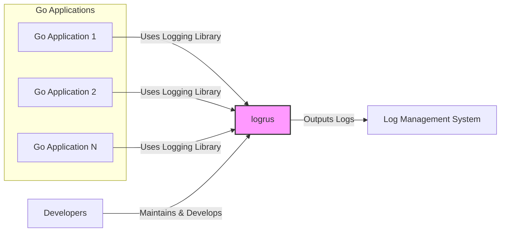
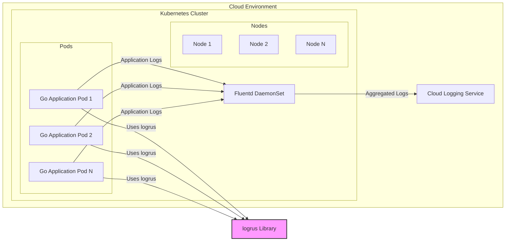

# BUSINESS POSTURE

This project, `logrus`, is a structured logger for Go, aiming to provide a flexible and efficient logging library for Go applications.

- Business Priorities:
  - Reliability: `logrus` must be reliable and not introduce instability into applications that use it. Logging is a critical function for monitoring and debugging.
  - Performance: `logrus` should be performant and not add significant overhead to applications. Logging should be fast and efficient.
  - Ease of Use: `logrus` API should be easy to understand and use for Go developers. Integration into existing projects should be straightforward.
  - Flexibility: `logrus` should be flexible and customizable to meet various logging needs, supporting different output formats and levels.
  - Wide Adoption: `logrus` aims to be a widely adopted and trusted logging library within the Go ecosystem.

- Business Goals:
  - Provide a robust and feature-rich logging solution for Go developers.
  - Maintain a high level of quality and stability for the library.
  - Foster a community around `logrus` to ensure its continued development and support.
  - Ensure compatibility with various Go versions and environments.

- Business Risks:
  - Vulnerabilities in `logrus` could impact all applications that depend on it, potentially leading to security breaches or operational disruptions.
  - Performance bottlenecks introduced by `logrus` could degrade the performance of applications using it.
  - Bugs or instability in `logrus` could lead to application crashes or incorrect logging, hindering debugging and monitoring efforts.
  - Lack of maintenance or community support could lead to the library becoming outdated or insecure over time.
  - Incompatibility with newer Go versions or popular libraries could limit adoption and usability.

# SECURITY POSTURE

- Existing Security Controls:
  - security control: Open Source Code: The source code is publicly available on GitHub, allowing for community review and scrutiny. Implemented in: GitHub Repository.
  - security control: Community Contributions: The project accepts contributions from the community, potentially leading to broader code review and identification of issues. Implemented in: GitHub Contribution Model.
  - security control: Version Control: Git is used for version control, providing history and traceability of changes. Implemented in: GitHub Repository.
  - security control: Testing: The project likely includes unit and integration tests to ensure code quality and prevent regressions. Implemented in: Go testing framework, visible in repository.

- Accepted Risks:
  - accepted risk: Reliance on Community Security Review: Security depends on the vigilance of the open-source community to identify and report vulnerabilities.
  - accepted risk: Potential for Dependency Vulnerabilities: `logrus` might depend on other libraries that could have vulnerabilities.
  - accepted risk: No Dedicated Security Team: As an open-source project, there might not be a dedicated security team continuously monitoring and auditing the code.

- Recommended Security Controls:
  - security control: Automated Static Analysis Security Testing (SAST): Integrate SAST tools into the CI/CD pipeline to automatically scan the codebase for potential vulnerabilities.
  - security control: Dependency Scanning: Implement dependency scanning to identify and monitor known vulnerabilities in third-party libraries used by `logrus`.
  - security control: Fuzzing: Perform fuzz testing to discover unexpected behavior and potential vulnerabilities by providing invalid or malformed inputs.
  - security control: Security Focused Code Review: Encourage security-focused code reviews, especially for critical components and contributions from new developers.
  - security control: Regular Security Audits: Conduct periodic security audits, potentially by external security experts, to identify and address potential vulnerabilities.

- Security Requirements:
  - Authentication: Not directly applicable to `logrus` library itself. Authentication is relevant for systems that consume and process logs generated by applications using `logrus`.
  - Authorization: Not directly applicable to `logrus` library itself. Authorization is relevant for systems that consume and process logs generated by applications using `logrus`. Access control should be implemented in log management systems to protect sensitive information contained in logs.
  - Input Validation: `logrus` should handle log messages safely to prevent log injection attacks. While `logrus` primarily formats and outputs logs, it should not be vulnerable to format string vulnerabilities or other injection issues based on the content of log messages. Input validation is more relevant in applications that generate log messages and systems that process logs.
  - Cryptography: Not directly applicable to `logrus` library itself. Cryptography might be relevant for applications using `logrus` if they need to log sensitive data securely. In such cases, encryption should be applied at the application level before logging, or in the log management system after logs are collected. `logrus` itself does not handle encryption.

# DESIGN

## C4 CONTEXT



- Context Diagram Elements:
  - - Name: Go Applications
    - Type: System
    - Description: Various Go applications that utilize `logrus` for logging purposes. These applications can be microservices, web applications, command-line tools, or any other software written in Go.
    - Responsibilities: Generate log messages using the `logrus` library to record events, errors, and informational data during their execution.
    - Security controls: Security controls are implemented within each Go application independently. These may include input validation, secure coding practices, and protection of sensitive data before logging.
  - - Name: logrus
    - Type: System
    - Description: A structured logging library for Go. It provides an API for Go applications to generate logs in various formats and output them to different destinations.
    - Responsibilities: Provide a flexible and efficient logging API for Go applications. Format log messages, handle different log levels, and output logs to configured destinations (e.g., console, files, network).
    - Security controls: Primarily focused on code quality and preventing vulnerabilities within the library itself. Security controls include code review, testing, and potentially static analysis.
  - - Name: Log Management System
    - Type: External System
    - Description: An external system responsible for collecting, storing, processing, analyzing, and visualizing logs generated by Go applications. Examples include Elasticsearch, Splunk, Loki, and cloud-based logging services.
    - Responsibilities: Ingest logs from various sources, including applications using `logrus`. Store logs securely and efficiently. Provide tools for searching, filtering, analyzing, and visualizing log data for monitoring, debugging, and security analysis.
    - Security controls: Implements security controls for log data protection, including access control, encryption in transit and at rest, data retention policies, and audit logging.
  - - Name: Developers
    - Type: Person
    - Description: Software developers who use `logrus` in their Go applications and contribute to the development and maintenance of the `logrus` library itself.
    - Responsibilities: Utilize `logrus` effectively in Go applications to implement logging. Contribute to the `logrus` project by reporting issues, suggesting improvements, and submitting code changes. Maintain and update applications using `logrus`.
    - Security controls: Follow secure development practices when using `logrus` and contributing to the project. Report any security vulnerabilities discovered in `logrus`.

## C4 CONTAINER

```mermaid
flowchart LR
    subgraph "Go Applications"
        A["Go Application 1"]
        B["Go Application 2"]
        C["Go Application N"]
    end
    D["logrus Library" <br> (Go Library)]
    E["Log Management System" <br> (External System)]

    A -->|Uses Logging API| D
    B -->|Uses Logging API| D
    C -->|Uses Logging API| D
    D -->|Outputs Logs| E

    style D fill:#f9f,stroke:#333,stroke-width:2px
```

- Container Diagram Elements:
  - - Name: logrus Library
    - Type: Library
    - Description: The `logrus` library is a Go package that provides logging functionality. It is integrated into Go applications as a dependency.
    - Responsibilities: Provides the logging API for Go applications. Handles log formatting, levels, and output destinations. Is distributed as a Go module.
    - Security controls: Security controls are focused on the library's codebase. These include code review, testing, static analysis, and dependency scanning during development.
  - - Name: Log Management System
    - Type: External System
    - Description:  Same as in the Context Diagram. An external system for collecting, storing, and analyzing logs.
    - Responsibilities: Same as in the Context Diagram. Ingest, store, process, and analyze logs.
    - Security controls: Same as in the Context Diagram. Access control, encryption, data retention, audit logging.

## DEPLOYMENT

`logrus` itself is a library and does not have a deployment architecture in the traditional sense. It is distributed as a Go module and is included in the deployment of Go applications that use it. The deployment of applications using `logrus` can vary widely. Let's consider a common cloud deployment scenario for a Go application using `logrus`.



- Deployment Diagram Elements:
  - - Name: Go Application Pods
    - Type: Container
    - Description: Instances of Go applications running as pods within a Kubernetes cluster. Each pod contains a Go application that uses the `logrus` library.
    - Responsibilities: Execute the Go application logic. Generate log messages using `logrus`. Output application logs to standard output/standard error, which are captured by the container runtime.
    - Security controls: Security controls are applied at the container and pod level, including container image scanning, resource limits, network policies, and security contexts.
  - - Name: logrus Library
    - Type: Library
    - Description:  Same as in the Container Diagram. The `logrus` library embedded within each Go application pod.
    - Responsibilities: Same as in the Container Diagram. Provide logging API, format logs, output logs to standard output/standard error.
    - Security controls: Same as in the Container Diagram. Code review, testing, static analysis, dependency scanning.
  - - Name: Fluentd DaemonSet
    - Type: DaemonSet
    - Description: A Fluentd DaemonSet deployed in the Kubernetes cluster. Fluentd is a log aggregator that collects logs from all nodes in the cluster. In this case, it collects logs from the standard output/standard error of the Go application pods.
    - Responsibilities: Collect logs from all nodes in the Kubernetes cluster. Aggregate logs from Go application pods. Forward aggregated logs to the Cloud Logging Service.
    - Security controls: Secure configuration of Fluentd, secure communication channels to the Cloud Logging Service, and potentially local log buffering and encryption.
  - - Name: Cloud Logging Service
    - Type: Cloud Service
    - Description: A cloud-based log management service provided by the cloud provider (e.g., Google Cloud Logging, AWS CloudWatch Logs, Azure Monitor Logs).
    - Responsibilities: Ingest, store, index, and analyze logs received from Fluentd. Provide a user interface and API for querying, visualizing, and alerting on log data.
    - Security controls: Robust security controls provided by the cloud provider, including access control (IAM), encryption in transit and at rest, data retention policies, audit logging, and compliance certifications.

## BUILD

```mermaid
flowchart LR
    A["Developer"] -->|Code Changes, Dependencies| B["Version Control (GitHub)"]
    B -->|Code Repository, Workflow Definition| C["CI/CD System (GitHub Actions)"]
    C -->|Checkout Code, Build, Test, Scan| D["Build Environment"]
    D -->|Build Artifacts (Go Module)| E["Package Registry (pkg.go.dev)"]

    subgraph "Build Environment"
        F["Go Toolchain"]
        G["SAST Scanner"]
        H["Dependency Scanner"]
        I["Unit Tests"]
        D --> F
        D --> G
        D --> H
        D --> I
    end

    style D fill:#ccf,stroke:#333,stroke-width:1px
    style F fill:#eee,stroke:#333,stroke-width:1px
    style G fill:#eee,stroke:#333,stroke-width:1px
    style H fill:#eee,stroke:#333,stroke-width:1px
    style I fill:#eee,stroke:#333,stroke-width:1px
```

- Build Process Elements:
  - - Name: Developer
    - Type: Person
    - Description: A software developer who writes code, makes changes, and contributes to the `logrus` project.
    - Responsibilities: Write code for `logrus`, including new features, bug fixes, and tests. Commit code changes to the version control system.
    - Security controls: Secure development practices, code review before committing changes, and adherence to project coding standards.
  - - Name: Version Control (GitHub)
    - Type: Service
    - Description: GitHub repository hosting the `logrus` source code, including code history, branches, and pull requests.
    - Responsibilities: Store and manage the `logrus` codebase. Track code changes and facilitate collaboration among developers. Trigger CI/CD pipelines on code changes.
    - Security controls: Access control to the repository, branch protection rules, audit logging of repository activities, and vulnerability scanning of the GitHub platform itself.
  - - Name: CI/CD System (GitHub Actions)
    - Type: Service
    - Description: GitHub Actions is used for continuous integration and continuous delivery. It automates the build, test, and release process for `logrus`.
    - Responsibilities: Automate the build process. Run unit tests, static analysis, and dependency scanning. Build and package the `logrus` library. Publish the library to the package registry.
    - Security controls: Secure configuration of CI/CD pipelines, secrets management for accessing package registries, and ensuring the integrity of the build environment.
  - - Name: Build Environment
    - Type: Environment
    - Description: A controlled environment within GitHub Actions where the `logrus` library is built and tested. It includes necessary tools like the Go toolchain, SAST scanner, dependency scanner, and test runners.
    - Responsibilities: Provide the tools and runtime environment for building and testing `logrus`. Execute build steps, run security scans, and execute unit tests.
    - Security controls: Hardened build environment, access control to build resources, and monitoring of build activities.
  - - Name: Package Registry (pkg.go.dev)
    - Type: Service
    - Description: A package registry for Go modules, where `logrus` releases are published and made available for Go developers to download and use.
    - Responsibilities: Host and distribute `logrus` Go modules. Provide versioning and dependency management for `logrus`.
    - Security controls: Security controls provided by the package registry platform, including package integrity checks and protection against malicious packages.

# RISK ASSESSMENT

- Critical Business Processes:
  - Application Logging: The primary critical business process is application logging itself. If `logrus` fails or is compromised, applications will lose the ability to log events, errors, and important information. This can severely impact monitoring, debugging, incident response, and security auditing.
  - Software Supply Chain: As a widely used library, `logrus` is a part of the software supply chain for many Go applications. Compromising `logrus` could have a cascading effect on numerous downstream applications.

- Data to Protect and Sensitivity:
  - Log Messages: The primary data to protect are the log messages generated by applications using `logrus`. The sensitivity of this data varies greatly depending on what applications log. Logs can contain:
    - PII (Personally Identifiable Information): Usernames, email addresses, IP addresses, session IDs, etc. Sensitivity: High to Critical, depending on regulations (GDPR, CCPA, etc.).
    - Application Secrets: API keys, passwords, tokens (if improperly logged). Sensitivity: Critical.
    - Business Sensitive Data: Transaction details, financial information, proprietary algorithms. Sensitivity: Medium to High, depending on the business context.
    - Operational Data: Application state, performance metrics, debug information. Sensitivity: Low to Medium, primarily for operational purposes, but can reveal system vulnerabilities if exposed.

# QUESTIONS & ASSUMPTIONS

- BUSINESS POSTURE:
  - Assumption: `logrus` is intended to be a general-purpose logging library widely used in various types of Go applications, from small utilities to large-scale systems.
  - Question: What is the target audience for `logrus`? Is it primarily aimed at individual developers, small teams, or large enterprises?
  - Question: Are there specific industries or use cases where `logrus` is particularly popular or critical?

- SECURITY POSTURE:
  - Assumption: The current security posture relies heavily on community review and standard open-source development practices.
  - Question: Are there any formal security audits or penetration testing performed on `logrus`?
  - Question: Is there a documented process for handling security vulnerabilities reported in `logrus`?
  - Question: Are there any specific security guidelines or secure coding practices followed by `logrus` developers?

- DESIGN:
  - Assumption: `logrus` is designed to be lightweight and modular, allowing for flexible integration into different application architectures and deployment environments.
  - Question: Are there any specific architectural considerations or limitations in the design of `logrus` that could impact security or performance?
  - Question: Are there any plans to add new features to `logrus` that might have security implications (e.g., built-in encryption, secure log transport)?
  - Question: How does `logrus` handle error conditions and potential exceptions during log processing? Are there any error handling mechanisms that could be exploited?