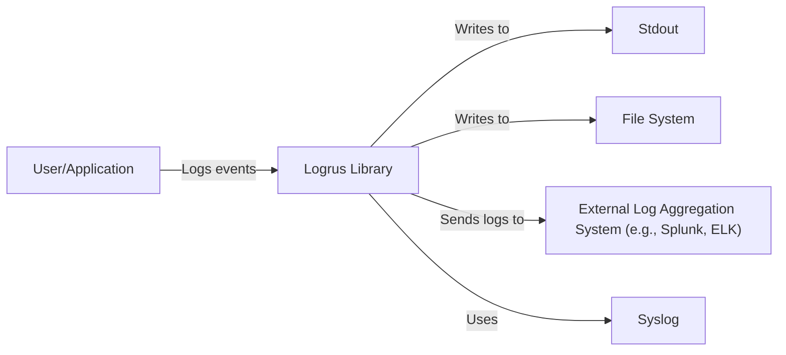
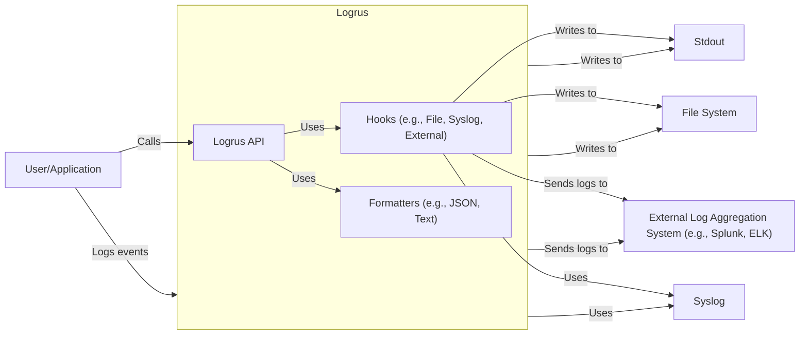
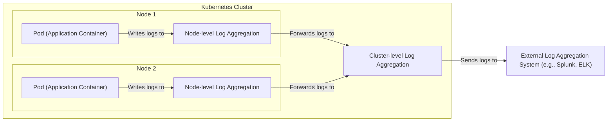
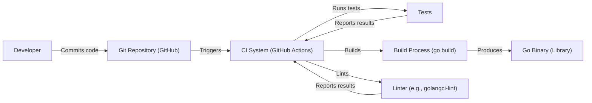

# Project Design Document: Logrus

This document outlines the design and security considerations for Logrus, a structured logger for Go (Golang).

## BUSINESS POSTURE

Logrus is a widely used, open-source logging library for Go applications. Its primary goal is to provide a flexible and extensible logging solution that supports structured logging. This allows for easier log parsing, analysis, and querying. The business priorities are:

*   Maintainability: The library should be easy to maintain and update.
*   Extensibility: Users should be able to easily extend the library with custom formatters and hooks.
*   Performance: Logging should have minimal performance overhead.
*   Compatibility: Maintain backward compatibility where possible, and provide clear migration paths for breaking changes.
*   Community: Foster a healthy and active community around the project.

Business risks that need to be addressed:

*   Security vulnerabilities in the library itself or its dependencies could lead to application compromise.
*   Poor performance could impact the performance of applications using the library.
*   Lack of maintainability could lead to the project becoming stagnant and unusable.
*   Incompatibility with other libraries or systems could limit its adoption.
*   Lack of community support could hinder the project's long-term viability.

## SECURITY POSTURE

Logrus, as a logging library, plays a crucial role in security auditing and incident response. However, it also presents potential security risks if not used and configured correctly.

Existing security controls:

*   security control: Input sanitization: Logrus itself doesn't directly handle user input in a way that would typically lead to injection vulnerabilities (like SQL injection). However, it's crucial that applications using Logrus sanitize any user-provided data *before* logging it to prevent log forging or injection attacks. Implemented in application code using Logrus.
*   security control: Dependency management: The project uses Go modules for dependency management, which helps ensure that dependencies are tracked and can be updated to address security vulnerabilities. Described in `go.mod` and `go.sum` files.
*   security control: Code reviews: Contributions to the project are subject to code review, which helps identify potential security issues before they are merged. Described in contribution guidelines.
*   security control: Static analysis: The project may use static analysis tools to identify potential security vulnerabilities in the codebase. Not explicitly mentioned, but implied by best practices.

Accepted risks:

*   accepted risk: Log forging/injection: If applications using Logrus do not properly sanitize user input before logging, attackers could inject malicious data into log files, potentially leading to misinterpretation of logs or even code execution in log analysis tools.
*   accepted risk: Denial of service (DoS): While Logrus itself is designed to be performant, excessive logging or poorly configured logging could contribute to a denial-of-service condition by consuming excessive resources (CPU, memory, disk I/O).
*   accepted risk: Sensitive data exposure: If applications log sensitive data (e.g., passwords, API keys) without proper redaction, this information could be exposed in log files.

Recommended security controls:

*   security control: Implement regular security audits of the codebase and its dependencies.
*   security control: Integrate static application security testing (SAST) and dynamic application security testing (DAST) tools into the CI/CD pipeline.
*   security control: Provide clear documentation and examples on how to securely use Logrus, including best practices for input sanitization and avoiding sensitive data exposure.
*   security control: Consider implementing a mechanism for automatically redacting sensitive data from log messages.
*   security control: Encourage the use of structured logging (e.g., JSON format) to facilitate automated log analysis and security monitoring.

Security Requirements:

*   Authentication: Not directly applicable to the Logrus library itself. Authentication is the responsibility of the application using Logrus.
*   Authorization: Not directly applicable to the Logrus library itself. Authorization is the responsibility of the application using Logrus.
*   Input Validation: Applications using Logrus *must* validate and sanitize all user-provided data before logging it to prevent log forging and injection attacks.
*   Cryptography: If Logrus is used to transmit logs over a network (e.g., via a hook), it should use secure transport protocols (e.g., TLS) to protect the confidentiality and integrity of the log data. The specific implementation would depend on the hook being used.

## DESIGN

### C4 CONTEXT

Element Descriptions:

*   Element:
    *   Name: User/Application
    *   Type: User/Application
    *   Description: The application or user that is using the Logrus library to generate logs.
    *   Responsibilities: Generates log events, calls Logrus API.
    *   Security controls: Input validation, sanitization of data before logging.

*   Element:
    *   Name: Logrus
    *   Type: Library
    *   Description: The Logrus library itself.
    *   Responsibilities: Provides an API for logging, formats log messages, dispatches log messages to configured hooks.
    *   Security controls: Dependency management, code reviews.

*   Element:
    *   Name: Stdout
    *   Type: Output
    *   Description: Standard output stream.
    *   Responsibilities: Displays log messages on the console.
    *   Security controls: Access controls to the console.

*   Element:
    *   Name: File
    *   Type: Output
    *   Description: File system.
    *   Responsibilities: Stores log messages in files.
    *   Security controls: File system permissions, encryption at rest.

*   Element:
    *   Name: ExternalSystem
    *   Type: External System
    *   Description: An external log aggregation system (e.g., Splunk, ELK stack).
    *   Responsibilities: Collects, stores, and analyzes log data from multiple sources.
    *   Security controls: Authentication, authorization, encryption in transit, encryption at rest, access controls.

*   Element:
    *   Name: Syslog
    *   Type: System Service
    *   Description: System logging service.
    *   Responsibilities: Receives and processes log messages from applications.
    *   Security controls: System-level security controls, access controls, auditing.

### C4 CONTAINER

Since Logrus is a library, the container diagram is essentially the same as the context diagram. The "containers" in this case are the different components within the library itself (formatters, hooks, etc.), but these are internal implementation details and not relevant at the container level.

Element Descriptions:

*   Element:
    *   Name: Formatters
    *   Type: Component
    *   Description: Components responsible for formatting log messages (e.g., JSONFormatter, TextFormatter).
    *   Responsibilities: Convert log entries into specific string formats.
    *   Security controls: None specific, relies on application-level input sanitization.

*   Element:
    *   Name: Hooks
    *   Type: Component
    *   Description: Components responsible for sending log messages to different destinations (e.g., FileHook, SyslogHook).
    *   Responsibilities: Dispatch log entries to configured outputs.
    *   Security controls: Depend on the specific hook (e.g., TLS for network hooks, file permissions for file hooks).

*   Element:
    *   Name: Logrus API
    *   Type: API
    *   Description: The public API of the Logrus library.
    *   Responsibilities: Provides functions for logging (e.g., `Info()`, `Error()`, `WithFields()`).
    *   Security controls: None specific, relies on application-level input sanitization.

*   All other elements are the same as in the C4 Context diagram.

### DEPLOYMENT

Logrus is a library, not a standalone application. Therefore, it doesn't have its own deployment diagram. It is "deployed" as part of the application that uses it. The deployment of the *application* using Logrus would be described in a separate deployment diagram.

Possible deployment solutions for applications using Logrus:

1.  Standalone executable: The Go application (with Logrus embedded) is compiled into a single executable file and deployed directly to a server.
2.  Docker container: The Go application is packaged into a Docker container and deployed to a container orchestration platform (e.g., Kubernetes, Docker Swarm).
3.  Serverless function: The Go application is deployed as a serverless function (e.g., AWS Lambda, Google Cloud Functions).

Chosen solution (example: Docker container on Kubernetes):

Element Descriptions:

*   Element:
    *   Name: Pod
    *   Type: Container
    *   Description: A Kubernetes Pod running the application container that uses Logrus.
    *   Responsibilities: Executes the application code, generates log events.
    *   Security controls: Container security context, network policies, resource limits.

*   Element:
    *   Name: NodeLog
    *   Type: Log Aggregator
    *   Description: Node-level log aggregation (e.g., Fluentd, Logstash).
    *   Responsibilities: Collects logs from all Pods running on the node.
    *   Security controls: Access controls, resource limits.

*   Element:
    *   Name: NodeLog2
    *   Type: Log Aggregator
    *   Description: Node-level log aggregation (e.g., Fluentd, Logstash).
    *   Responsibilities: Collects logs from all Pods running on the node.
    *   Security controls: Access controls, resource limits.

*   Element:
    *   Name: ClusterLog
    *   Type: Log Aggregator
    *   Description: Cluster-level log aggregation (e.g., Fluentd, Logstash).
    *   Responsibilities: Collects logs from all nodes in the cluster.
    *   Security controls: Access controls, resource limits, authentication, authorization.

*   Element:
    *   Name: ExternalSystem
    *   Type: External System
    *   Description: An external log aggregation system (e.g., Splunk, ELK stack).
    *   Responsibilities: Collects, stores, and analyzes log data from multiple sources.
    *   Security controls: Authentication, authorization, encryption in transit, encryption at rest, access controls.

### BUILD

Logrus uses Go modules for dependency management and a Makefile for build automation.

Security Controls in Build Process:

*   security control: Dependency management: Go modules (`go.mod`, `go.sum`) ensure that dependencies are tracked and can be updated for security vulnerabilities.
*   security control: Static analysis: Linters (e.g., `golangci-lint`) can be used to identify potential code quality and security issues.
*   security control: Automated testing: Unit tests and integration tests help ensure the correctness and security of the code.
*   security control: Code review: All code changes are reviewed before being merged into the main branch.
*   security control: CI/CD pipeline: GitHub Actions (or similar) automates the build, test, and linting process, ensuring consistency and reducing the risk of manual errors.

## RISK ASSESSMENT

*   Critical business process we are trying to protect: The primary business process is providing a reliable and secure logging library for Go applications. This supports the broader business processes of the applications *using* Logrus, by enabling monitoring, debugging, auditing, and security incident response.

*   Data we are trying to protect and their sensitivity:
    *   Logrus itself does not handle sensitive data directly. However, it is *used* to process and output log data, which *may* contain sensitive information if the application using Logrus logs it. The sensitivity of this data depends entirely on the application.
    *   Examples of potentially sensitive data that *could* be logged (and therefore need protection):
        *   Usernames and passwords (if logged improperly)
        *   API keys and access tokens
        *   Personal data (names, addresses, etc.)
        *   Financial data
        *   Session identifiers
        *   Internal IP addresses and system configurations

## QUESTIONS & ASSUMPTIONS

*   Questions:
    *   Are there any specific compliance requirements (e.g., GDPR, HIPAA) that applications using Logrus typically need to adhere to? This would influence recommendations for data redaction and logging practices.
    *   What is the typical deployment environment for applications using Logrus? (e.g., cloud, on-premise, Kubernetes)
    *   What are the performance expectations for Logrus? (e.g., maximum log volume, latency requirements)
    *   Are there any plans to add features that might introduce new security considerations (e.g., network-based logging)?
    *   What is the current process for handling security vulnerabilities reported in Logrus or its dependencies?

*   Assumptions:
    *   BUSINESS POSTURE: The primary users of Logrus are developers building Go applications.
    *   BUSINESS POSTURE: The project prioritizes stability, performance, and ease of use.
    *   SECURITY POSTURE: Applications using Logrus are responsible for their own security, including input validation and protecting sensitive data.
    *   SECURITY POSTURE: Logrus is used in a variety of environments, including those with strict security requirements.
    *   DESIGN: Logrus is primarily used as a library embedded within other applications.
    *   DESIGN: The build process uses standard Go tooling and best practices.
    *   DESIGN: The deployment of applications using Logrus varies widely.