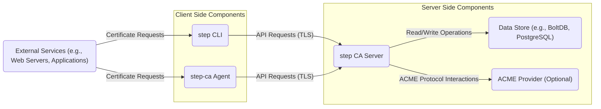
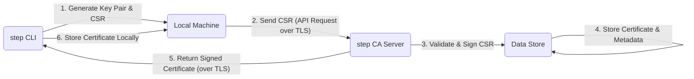
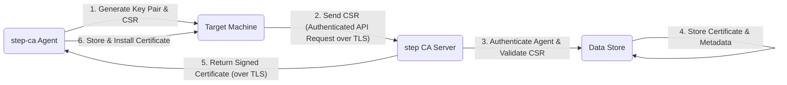
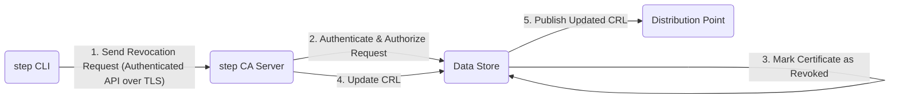

# Project Design Document: smallstep/certificates

**Version:** 1.1
**Date:** October 26, 2023
**Author:** AI Software Architect

## 1. Introduction

This document provides an enhanced design overview of the `smallstep/certificates` project, a robust open-source solution for managing and operating a Public Key Infrastructure (PKI). This detailed description of the system's architecture, components, and data flow is intended to serve as a solid foundation for subsequent threat modeling activities.

### 1.1. Project Overview

The `smallstep/certificates` project offers a comprehensive suite of tools designed to simplify the creation and management of private Certificate Authorities (CAs). It streamlines the processes of issuing, renewing, and revoking TLS certificates for a wide range of applications, including web servers, microservices, and Internet of Things (IoT) devices. The project prioritizes security, user-friendliness, and automation.

### 1.2. Goals

* Present a clear, detailed, and improved architectural overview of the `smallstep/certificates` project.
* Clearly identify key components and elucidate their interactions.
* Provide a more detailed description of the data flow within the system.
* Emphasize critical security considerations with greater depth.
* Serve as a robust and comprehensive basis for future threat modeling exercises.

### 1.3. Scope

This document focuses on the core components and functionalities of the `smallstep/certificates` project, with a particular emphasis on the `step CA` and its interactions with other elements. The scope includes:

* The `step CA Server` and its central role in the PKI.
* The `step` Command Line Interface (CLI) and its interactions with the CA.
* The `step-ca Agent` and its purpose in automated certificate management.
* The various data storage mechanisms employed by the system.
* Detailed explanations of certificate issuance and renewal processes.
* Comprehensive coverage of certificate revocation processes.

This document explicitly excludes:

* Specific deployment configurations (e.g., detailed Kubernetes deployment manifests).
* Exhaustive configuration options for each individual component.
* The intricate internal implementation details of cryptographic operations.

## 2. High-Level Architecture

The `smallstep/certificates` project employs a client-server architecture, centered around a core Certificate Authority (CA) server and various client tools that interact with it.

**Components:**

* **`step CLI`:** A versatile command-line interface utilized by administrators and developers to interact directly with the `step CA`. It facilitates tasks such as certificate creation, inspection, and revocation, providing granular control over the PKI.
* **`step-ca Agent`:** A lightweight agent designed to run on target machines (e.g., application servers) to automate the entire certificate lifecycle. It handles requesting, renewing, and managing certificates autonomously on behalf of the host.
* **`step CA Server`:** The central and most critical component, responsible for managing all aspects of the PKI. It processes Certificate Signing Requests (CSRs), issues digital certificates, maintains Certificate Revocation Lists (CRLs), and exposes a secure API for client interactions.
* **Data Store:** A persistent storage layer used by the `step CA` to store essential information, including CA configurations, issued certificates, revocation details, and other critical metadata. Supported options offer flexibility and scalability, including BoltDB and PostgreSQL.
* **ACME Provider (Optional):**  This component enables the `step CA` to function as an ACME server, allowing external clients using the ACME protocol (such as `certbot`) to automate certificate issuance and renewal processes.
* **External Services:** Represent the diverse range of applications and services that rely on the certificates issued by the `step CA` for secure communication and authentication.

## 3. Component Details

### 3.1. `step CA Server`

* **Functionality:**
    * Receives and rigorously validates incoming Certificate Signing Requests (CSRs) to ensure integrity and adherence to policy.
    * Signs validated CSRs using the CA's private key, thereby issuing trusted digital certificates.
    * Manages the lifecycle of issued certificates, including tracking serial numbers and enforcing validity periods.
    * Generates and securely publishes Certificate Revocation Lists (CRLs), providing a mechanism to invalidate compromised certificates.
    * Offers a well-defined API (typically over HTTPS) for secure communication and interaction with clients.
    * Implements robust authentication and authorization mechanisms to control access to its functionalities.
    * Securely stores and retrieves certificate data and revocation information from the designated Data Store.
    * Optionally operates as an ACME server, facilitating automated certificate management for ACME-compliant clients.
* **Key Security Aspects:**
    * **Secure Private Key Management:** Employs secure storage and management practices for the CA's private key, often leveraging Hardware Security Modules (HSMs) or Key Management Services (KMS) for enhanced protection.
    * **Robust Authentication and Authorization:** Implements strong authentication and authorization controls to restrict API access and prevent unauthorized actions.
    * **Protection Against Unauthorized Operations:** Designed to prevent unauthorized certificate issuance or revocation, safeguarding the integrity of the PKI.
    * **Secure CRL Generation and Distribution:** Ensures the secure generation and distribution of CRLs to trusted endpoints.

### 3.2. `step CLI`

* **Functionality:**
    * Provides a comprehensive set of commands for interacting with the `step CA` API, offering fine-grained control over PKI operations.
    * Enables users to generate cryptographic key pairs and Certificate Signing Requests (CSRs) locally.
    * Facilitates certificate requests, renewals, and revocations through simple and intuitive commands.
    * Allows for the management of `step CA` server configurations.
    * Supports various authentication methods for securely interacting with the CA server.
* **Key Security Aspects:**
    * **Secure Credential Storage:** Emphasizes the secure storage of user credentials or API tokens used for authentication.
    * **Secure Communication Channel:** Ensures secure communication with the `step CA` server through the use of Transport Layer Security (TLS).
    * **Protection Against Injection Attacks:** Implements measures to protect against command injection vulnerabilities.

### 3.3. `step-ca Agent`

* **Functionality:**
    * Automates the entire certificate lifecycle management process on target hosts, reducing manual intervention.
    * Generates cryptographic key pairs and Certificate Signing Requests (CSRs) locally on the managed host.
    * Requests certificates from the `step CA` server on behalf of the host, streamlining the acquisition process.
    * Automatically renews certificates before their expiration, ensuring continuous availability of secure communication.
    * Can be configured to automatically install or deploy certificates into web servers or other applications, simplifying integration.
    * Typically utilizes a pre-shared key or other secure authentication mechanism to identify itself to the CA server.
* **Key Security Aspects:**
    * **Secure Private Key Storage:** Prioritizes the secure storage of the agent's private key on the target host.
    * **Mutual Authentication:** Often employs mutual TLS (mTLS) for secure and authenticated communication with the `step CA` server.
    * **Prevention of Unauthorized Requests:** Implements robust authentication mechanisms to prevent unauthorized certificate requests.
    * **Secure Handling of Credentials:** Ensures the secure handling of certificates and associated private keys on the target host.

### 3.4. Data Store

* **Functionality:**
    * Provides persistent storage for critical data required by the `step CA` server.
    * Stores the `step CA`'s configuration, including issuer details and signing policies.
    * Stores all issued certificates and their associated metadata.
    * Stores certificate revocation information, including Certificate Revocation Lists (CRLs) and Online Certificate Status Protocol (OCSP) responses.
    * May store audit logs, providing a record of significant events.
* **Key Security Aspects:**
    * **Data at Rest Encryption:** Employs encryption at rest to protect sensitive information stored within the database.
    * **Access Control Mechanisms:** Implements strict access control mechanisms to restrict access to authorized components only.
    * **Regular Backups:**  Regularly backs up data to ensure availability and facilitate recovery in case of failures.
    * **Data Integrity Checks:** Performs integrity checks to detect and prevent data corruption.

### 3.5. ACME Provider (Optional)

* **Functionality:**
    * Implements the Automated Certificate Management Environment (ACME) protocol as defined by RFC 8555.
    * Allows external clients (e.g., `certbot`, other ACME clients) to automatically request and renew certificates without manual intervention.
    * Handles ACME challenges (e.g., HTTP-01, DNS-01, TLS-ALPN-01) to verify control over the domain for which a certificate is requested.
* **Key Security Aspects:**
    * **Secure ACME Implementation:** Ensures a secure and compliant implementation of the ACME protocol.
    * **Protection Against Unauthorized Issuance:** Implements safeguards to prevent unauthorized certificate issuance through the ACME interface.
    * **Secure Account Key Handling:**  Manages ACME account keys securely.

## 4. Data Flow

This section details the typical data flow for key operations within the `smallstep/certificates` system, providing a clear understanding of how components interact.

### 4.1. Certificate Issuance (using `step CLI`)

1. The user initiates the process by using the `step CLI` to generate a private key and a corresponding Certificate Signing Request (CSR).
2. The `step CLI` securely transmits the CSR to the `step CA Server` via an API request over a TLS-encrypted connection.
3. The `step CA Server` performs thorough validation of the received CSR and, upon successful validation and authorization, signs it using the CA's private key.
4. The `step CA Server` persists the newly issued certificate and its associated metadata in the designated Data Store.
5. The `step CA Server` securely returns the signed certificate to the `step CLI` over the TLS-encrypted connection.
6. The `step CLI` stores the received certificate locally on the user's machine.

### 4.2. Certificate Issuance (using `step-ca Agent`)

1. The `step-ca Agent`, running on a target machine, automatically generates a private key and a Certificate Signing Request (CSR).
2. The `step-ca Agent` securely sends the CSR to the `step CA Server` via an authenticated API request over a TLS-encrypted connection (often utilizing mutual TLS).
3. The `step CA Server` authenticates the requesting agent and validates the received CSR.
4. The `step CA Server` stores the issued certificate and its associated metadata in the Data Store.
5. The `step CA Server` securely returns the signed certificate to the `step-ca Agent` over the TLS-encrypted connection.
6. The `step-ca Agent` stores the received certificate and may proceed to automatically install it into relevant applications or services on the target machine.

### 4.3. Certificate Renewal (using `step-ca Agent`)

The certificate renewal process, typically automated by the `step-ca Agent`, closely mirrors the initial issuance process described above. The agent proactively requests a new certificate before the existing one expires, ensuring uninterrupted service.

### 4.4. Certificate Revocation

1. An administrator initiates the revocation process using the `step CLI` to send a revocation request to the `step CA Server` via an authenticated API call over TLS.
2. The `step CA Server` authenticates and authorizes the received revocation request to ensure only authorized users can revoke certificates.
3. The `step CA Server` updates the Data Store, marking the specified certificate as revoked.
4. The `step CA Server` generates an updated Certificate Revocation List (CRL) reflecting the revocation.
5. The `step CA Server` publishes the updated CRL to a designated distribution point, making the revocation information available to relying parties.

## 5. Security Considerations

This section provides a more in-depth look at the critical security considerations for the `smallstep/certificates` project.

* **Private Key Protection is Paramount:** The security of the entire PKI is fundamentally dependent on maintaining the secrecy of the CA's private key. Employing robust secure storage mechanisms such as HSMs or KMS is absolutely crucial.
* **Strong Authentication and Authorization:** Implementing robust authentication and authorization mechanisms is essential to strictly control access to the `step CA` API and prevent unauthorized certificate issuance or revocation attempts.
* **Mandatory Secure Communication:** All communication between clients (`step CLI`, `step-ca Agent`) and the `step CA Server` must be encrypted using Transport Layer Security (TLS). Employing mutual TLS (mTLS) provides an even stronger level of authentication.
* **Rigorous Input Validation:** The `step CA Server` must perform thorough validation of all inputs, including Certificate Signing Requests (CSRs), to effectively prevent vulnerabilities such as certificate forgery or injection attacks.
* **Reliable Certificate Revocation Mechanisms:** A reliable and timely certificate revocation mechanism, utilizing either Certificate Revocation Lists (CRLs) or the Online Certificate Status Protocol (OCSP), is essential for invalidating compromised certificates promptly.
* **Data Store Security is Critical:** The data store, which contains sensitive information including certificates, private keys (in some configurations), and revocation data, must be secured with encryption at rest and strictly enforced access control policies.
* **Comprehensive Auditing and Logging:** Maintaining comprehensive audit logs to track all significant actions within the system is vital for security monitoring, incident response, and forensic analysis.
* **Secure Defaults are Essential:** The system should be configured with secure defaults out of the box, encouraging and enforcing best practices for key generation, certificate validity periods, and other security-sensitive parameters.
* **Regular Security Assessments:**  Conducting periodic security audits and penetration testing is highly recommended to proactively identify and address potential vulnerabilities within the system.
* **Proactive Dependency Management:**  Maintaining up-to-date dependencies is crucial to mitigate risks associated with known vulnerabilities in third-party libraries and components.

## 6. Deployment Considerations

The `smallstep/certificates` project offers flexibility in deployment, accommodating various environments:

* **On-Premise Deployments:**  Deploying the `step CA Server` on dedicated physical hardware or virtual machines within an organization's own data center infrastructure.
* **Cloud-Based Deployments:**  Leveraging cloud platforms such as Amazon Web Services (AWS), Microsoft Azure, or Google Cloud Platform (GCP) to host the `step CA Server` and its related components, benefiting from the scalability and resilience of these platforms.
* **Containerized Deployments:**  Deploying the `step CA Server` and agents using containerization technologies like Docker and orchestration platforms such as Kubernetes, enabling portability and simplified management.

The chosen deployment strategy significantly influences security considerations, including network segmentation, access control configurations, and the responsibility for managing the underlying infrastructure's security.

## 7. Future Considerations

* **Enhanced HSM Integration:**  Further improving support and integration with a wider range of Hardware Security Module (HSM) vendors for even stronger private key protection and compliance requirements.
* **Advanced Monitoring and Alerting:** Implementing more sophisticated monitoring capabilities and customizable alerting mechanisms for proactively identifying and responding to critical events and potential security incidents.
* **Exploring Advanced Revocation Techniques:** Investigating and potentially implementing more advanced revocation techniques beyond traditional CRLs, such as short-lived certificates or more dynamic revocation mechanisms.
* **Policy-Driven Certificate Issuance:** Implementing more granular and flexible policy controls for certificate issuance based on a wider range of attributes and contextual information.
* **Support for Federated CA Environments:** Exploring the possibility of supporting federated CA deployments, allowing interoperability and trust relationships with other PKI systems.

This enhanced document provides a more comprehensive and detailed understanding of the `smallstep/certificates` project's architecture, components, and security considerations. This information will serve as an invaluable resource for conducting thorough and effective threat modeling exercises to identify potential security risks and develop appropriate mitigation strategies.