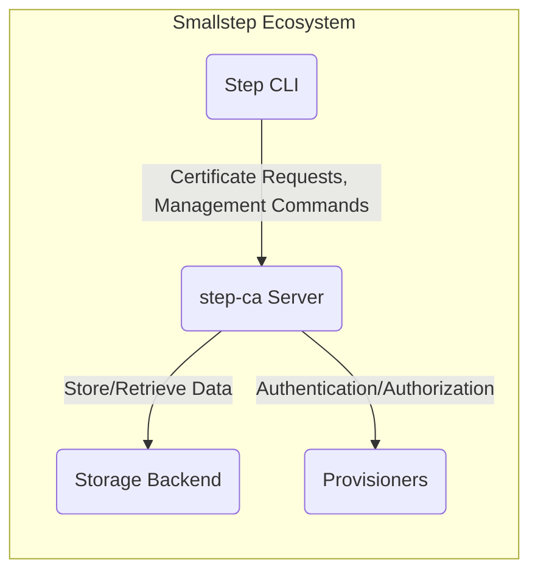
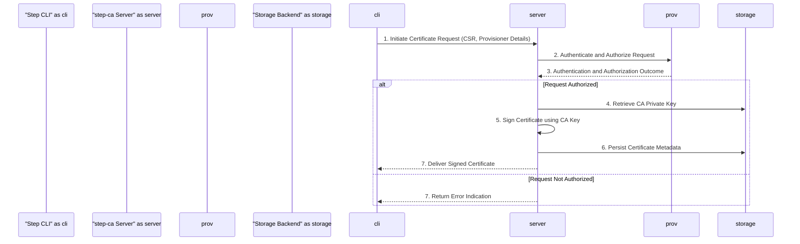
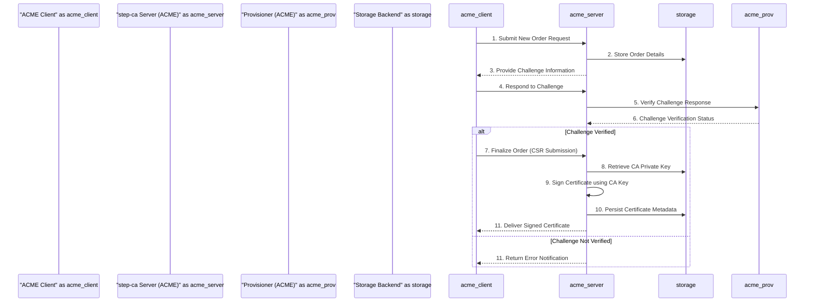

# Project Design Document: smallstep/certificates

**Version:** 1.1
**Date:** October 26, 2023
**Author:** AI Software Architect

## 1. Introduction

This document provides an enhanced and detailed design overview of the `smallstep/certificates` project, an open-source suite of tools designed for robust management of X.509 and SSH certificates. It encompasses a private Certificate Authority (CA) and an integrated ACME server, enabling secure and automated certificate lifecycle management. The primary objective of this document is to offer a comprehensive understanding of the system's architecture, individual components, and the intricate data flows within it. This detailed design will serve as the essential foundation for subsequent threat modeling activities, ensuring a focused and effective security analysis.

## 2. Goals and Objectives

The core goals underpinning the design and development of `smallstep/certificates` are:

* **Secure and Reliable Private CA:** To establish a dependable and secure private Certificate Authority capable of issuing and meticulously managing TLS certificates for internal infrastructure and services.
* **Integrated ACME Server:** To seamlessly integrate an ACME (Automated Certificate Management Environment) server, facilitating automated certificate acquisition and renewal, adhering to industry standards.
* **Automated SSH Certificate Management:** To provide robust and automated management of SSH host and user certificates, enhancing security and simplifying SSH key management.
* **User-Friendly Command-Line Interface:** To offer an intuitive and powerful command-line interface (`step` CLI) for users to effectively interact with the CA and manage certificates.
* **Flexibility and Extensibility:** To ensure adaptability and extensibility through a range of configurable options and diverse provisioner types, catering to various authentication and authorization needs.

## 3. High-Level Architecture

The `smallstep/certificates` ecosystem is architected around the central `step-ca` server, which serves as the core authority for certificate operations. Clients interact with this CA either programmatically through API calls or directly via the `step` CLI.

* **Key Architectural Elements:**
    * **`step-ca` Server:** The pivotal component acting as the Certificate Authority and ACME server, responsible for core certificate management functions.
    * **`step` CLI:** The primary command-line interface used by administrators and users to interact with the `step-ca` server.
    * **Storage Backend:** A persistent storage mechanism crucial for securely storing CA configurations, cryptographic keys, and issued certificates.
    * **Provisioners:**  Modular components responsible for authenticating and authorizing incoming certificate requests based on various criteria.

## 4. Detailed Component Design

### 4.1. `step-ca` Server

The `step-ca` server is the central processing unit of the system, responsible for the following critical functions:

* **Core Certificate Authority (CA) Operations:**
    * **Root CA Management:** Generating, securely storing, and managing the foundational root CA certificate and its associated private key.
    * **Intermediate CA Management (Optional):**  Supporting the creation and management of intermediate CA certificates for enhanced security and organizational structure.
    * **Certificate Signing:**  Processing and signing valid Certificate Signing Requests (CSRs) to issue X.509 certificates.
    * **Certificate Revocation:**  Providing mechanisms to revoke issued certificates when necessary due to compromise or other reasons.
    * **Revocation Publication:**  Publishing Certificate Revocation Lists (CRLs) or operating an Online Certificate Status Protocol (OCSP) responder to inform relying parties about the revocation status of certificates.
* **Integrated ACME Server Functionality:**
    * **ACME Protocol Implementation:** Fully implementing the Automated Certificate Management Environment (ACME) protocol as defined by RFC 8555.
    * **Challenge Handling:**  Managing various ACME challenge types such as HTTP-01, DNS-01, and TLS-ALPN-01 to verify domain ownership.
    * **Certificate Issuance via ACME:** Issuing certificates automatically upon successful completion of ACME challenges.
* **Secure SSH Certificate Management:**
    * **SSH Host Certificate Issuance:**  Issuing certificates that authenticate SSH servers.
    * **SSH User Certificate Issuance:** Issuing certificates that authenticate SSH users, replacing traditional SSH keys.
    * **Policy Enforcement:** Defining and enforcing policies related to SSH certificate validity, allowed principals, and other constraints.
* **API Endpoints for Programmatic Access:**
    * **RESTful API:** Exposing a comprehensive set of RESTful APIs for programmatic interaction, allowing applications and services to request and manage certificates.
    * **Authentication Methods:** Supporting various authentication methods for API access, including API keys and potentially mutual TLS.
* **Centralized Configuration Management:**
    * **Configuration Loading:** Loading and managing the CA's configuration from a dedicated configuration file, typically in YAML or JSON format.
    * **Secrets Management Integration:** Integrating with secrets management solutions (e.g., HashiCorp Vault) to securely handle sensitive data like private key passwords.
* **Comprehensive Logging and Auditing:**
    * **Detailed Activity Logs:** Recording all significant actions performed by the CA, including certificate issuance, revocation events, administrative changes, and authentication attempts.

### 4.2. `step` CLI

The `step` command-line interface provides a versatile toolkit for users to interact with the `step-ca` server and manage certificates effectively. Key functionalities include:

* **Streamlined Certificate Enrollment:**
    * **Key Pair Generation:** Generating private keys and corresponding Certificate Signing Requests (CSRs) locally.
    * **X.509 Certificate Requests:** Submitting requests to the `step-ca` server to obtain X.509 certificates for various purposes.
    * **SSH Certificate Requests:** Requesting both host and user SSH certificates from the CA.
    * **ACME Client Operations:** Acting as an ACME client to automate certificate acquisition from the integrated ACME server.
* **Efficient Certificate Inspection and Management:**
    * **Certificate Detail Inspection:** Examining the details of existing certificates, including validity periods, subject names, and issuer information.
    * **Certificate Chain Verification:** Verifying the trust chain of a certificate back to the root CA.
    * **Certificate Revocation Requests:** Initiating the revocation process for compromised or outdated certificates.
* **Simplified CA Management Tasks:**
    * **CA Initialization:**  Setting up a new Certificate Authority instance.
    * **Configuration Management:**  Modifying and managing the CA's configuration settings.
    * **Provisioner Management:** Adding, configuring, and managing different types of provisioners.
* **Integrated SSH Key Management:**
    * **SSH Key Generation:** Creating new SSH key pairs.
    * **SSH Key Signing:** Requesting the CA to sign SSH public keys, issuing SSH certificates.

### 4.3. Storage Backend

The `step-ca` server relies on a persistent storage backend to reliably store critical data. The system supports a variety of backend options, allowing flexibility in deployment:

* **Local File System:** Storing data directly within the local file system of the server. Suitable for development or small-scale deployments.
* **Embedded Key-Value Store (BoltDB):** Utilizing an embedded key-value database for simplified setup and management in single-server scenarios.
* **Relational Databases (PostgreSQL, MySQL):** Leveraging robust relational databases for enhanced scalability, reliability, and features like transactional integrity.
* **Cloud-Based Object Storage (AWS S3, Google Cloud Storage, Azure Blob Storage):**  Storing specific types of data, such as issued certificates or audit logs, in scalable and durable cloud storage services.

The storage backend is responsible for persistently storing:

* **Core CA Configuration:**  The fundamental configuration of the CA, including the root and any intermediate CA certificates and their private keys (ideally encrypted or stored in an HSM).
* **Provisioner Configurations:** Detailed configurations for each provisioner, including their type, authentication settings, and authorization policies.
* **Issued Certificate Metadata:**  Comprehensive information about all issued certificates, such as serial numbers, subject distinguished names, validity periods, and associated provisioners.
* **Certificate Revocation Information:**  Data related to certificate revocation, including the Certificate Revocation List (CRL) or information required for the OCSP responder.
* **ACME Protocol Data:**  Information pertaining to ACME protocol interactions, including account registrations, order details, and challenge statuses.

### 4.4. Provisioners

Provisioners are modular components that handle the crucial tasks of authenticating and authorizing incoming certificate requests. The pluggable architecture allows for diverse authentication methods:

* **JWK (JSON Web Key) Provisioner:** Authenticates requests by verifying a signature using a pre-configured JSON Web Key. Suitable for systems with pre-shared secrets.
* **ACME Provisioner:**  Delegates authentication to the integrated ACME server, verifying domain ownership through ACME challenges.
* **OIDC (OpenID Connect) Provisioner:** Integrates with external OpenID Connect identity providers, allowing users to authenticate using their existing organizational accounts.
* **Password Provisioner:**  Authenticates users based on a username and password stored within the `step-ca` system.
* **SCEP (Simple Certificate Enrollment Protocol) Provisioner:** Enables certificate enrollment using the Simple Certificate Enrollment Protocol, often used by network devices.
* **K8sSA (Kubernetes Service Account) Provisioner:**  Authenticates requests originating from within a Kubernetes cluster by verifying Kubernetes Service Account tokens.
* **AWS IAM Provisioner:** Authenticates requests based on the identity of AWS IAM roles or users, leveraging AWS's identity and access management.
* **GCP IAP (Google Cloud Platform Identity-Aware Proxy) Provisioner:** Authenticates requests based on the identity verified by Google Cloud Platform's Identity-Aware Proxy.
* **Azure AD Provisioner:** Integrates with Azure Active Directory, allowing authentication using Azure AD credentials.

## 5. Data Flow Diagrams

### 5.1. Standard X.509 Certificate Enrollment

### 5.2. Automated Certificate Issuance via ACME

## 6. Security Considerations

Given the critical role of a Certificate Authority, security is of paramount importance in the design and operation of `smallstep/certificates`. Key security considerations include:

* **Robust Private Key Protection:** The root CA private key is the most critical asset and must be safeguarded rigorously. Employing Hardware Security Modules (HSMs) is strongly recommended for production deployments to ensure the highest level of security.
* **Strict Authentication and Authorization:** Implementing strong authentication and authorization mechanisms is essential to prevent unauthorized certificate issuance. The diverse range of provisioners allows for tailored security policies based on the environment.
* **End-to-End Secure Communication:** All communication channels between clients (including the `step` CLI) and the `step-ca` server must be encrypted using TLS (Transport Layer Security) to protect sensitive data in transit.
* **Comprehensive Input Validation:**  Rigorous validation of all inputs, including Certificate Signing Requests (CSRs), API requests, and configuration data, is crucial to prevent injection attacks and other forms of malicious input.
* **Secure Secrets Management Practices:**  Sensitive configuration data, such as database credentials, provisioner secrets, and private key passwords, must be managed securely using dedicated secrets management solutions or encrypted storage.
* **Detailed Audit Logging and Monitoring:**  Maintaining comprehensive audit logs of all significant actions, including certificate issuance, revocation attempts, administrative changes, and authentication events, is vital for security monitoring and incident response.
* **Reliable Certificate Revocation Mechanisms:**  Implementing and maintaining reliable mechanisms for certificate revocation, such as publishing timely Certificate Revocation Lists (CRLs) and operating a responsive Online Certificate Status Protocol (OCSP) responder, is crucial for invalidating compromised certificates.
* **Effective Denial of Service (DoS) Prevention:** Implementing measures to protect the CA server from Denial of Service attacks, such as rate limiting and input validation, is necessary to ensure continuous availability.
* **Regular Security Audits and Penetration Testing:**  Conducting periodic security audits and penetration testing by independent security experts is essential for proactively identifying and addressing potential vulnerabilities in the system.
* **Principle of Least Privilege:**  Granting only the necessary permissions to users and services interacting with the CA to minimize the potential impact of a security breach.

## 7. Deployment Considerations

The `step-ca` server offers flexibility in deployment to suit various environments and scalability requirements:

* **Standalone Single Server Deployment:** A simple deployment model suitable for development, testing, or small-scale internal use cases. All components reside on a single server.
* **High Availability (HA) Deployment with Redundancy:**  Deploying multiple `step-ca` instances behind a load balancer, sharing a common and resilient storage backend. This ensures service continuity in case of server failures.
* **Containerized Deployment using Docker and Kubernetes:** Packaging the `step-ca` server and its dependencies into Docker containers and orchestrating them using Kubernetes. This approach facilitates scalability, portability, and easier management.
* **Considerations for Deployment:**
    * **Network Segmentation and Firewall Rules:**  Implementing appropriate network segmentation and firewall rules to restrict access to the CA server and protect it from unauthorized network traffic.
    * **Operating System Hardening:**  Securing the underlying operating system by applying security patches, disabling unnecessary services, and configuring appropriate access controls.
    * **Robust Monitoring and Alerting:**  Setting up comprehensive monitoring and alerting systems to track key performance indicators, security events, and potential issues.
    * **Comprehensive Backup and Recovery Strategy:**  Implementing a robust backup and recovery plan for all critical CA data, including configurations, keys, and issued certificates, to ensure business continuity in case of data loss.

## 8. Potential Risks

Based on the system's design and functionality, several potential risks should be carefully considered during threat modeling:

* **Catastrophic Compromise of the Root CA Private Key:**  If the root CA private key is compromised, attackers could forge certificates for any domain or service, leading to widespread trust exploitation and potentially devastating consequences.
* **Unauthorized Certificate Issuance due to Provisioner Vulnerabilities:** Exploiting vulnerabilities or misconfigurations in provisioners could allow attackers to bypass authentication and authorization controls, leading to the issuance of unauthorized certificates.
* **Denial of Service (DoS) Attacks Disrupting CA Availability:**  Overwhelming the `step-ca` server with a flood of requests could render it unavailable, preventing legitimate certificate issuance and revocation operations.
* **Data Breaches Exposing Sensitive Information:**  Unauthorized access to the storage backend could expose sensitive data, including private keys (if not adequately protected), issued certificates, and configuration details.
* **Man-in-the-Middle (MitM) Attacks on Communication Channels:**  Interception of communication between clients and the CA server could allow attackers to steal credentials, manipulate certificate requests, or eavesdrop on sensitive information.
* **Exploitation of Vulnerabilities in Third-Party Dependencies:** Security flaws in external libraries or dependencies used by the `step-ca` project could be exploited to compromise the system.
* **Security Misconfigurations Leading to Weaknesses:**  Incorrectly configured provisioners, insecure storage backend settings, or inadequate access controls could introduce significant security vulnerabilities.
* **Failure to Revoke Compromised Certificates Promptly:**  Delays or failures in revoking compromised certificates could allow attackers to continue using them for malicious purposes, undermining the trust infrastructure.

This enhanced design document provides a more in-depth understanding of the `smallstep/certificates` project's architecture and components. This detailed information will be invaluable for conducting thorough and effective threat modeling exercises to identify, assess, and mitigate potential security risks associated with the system.