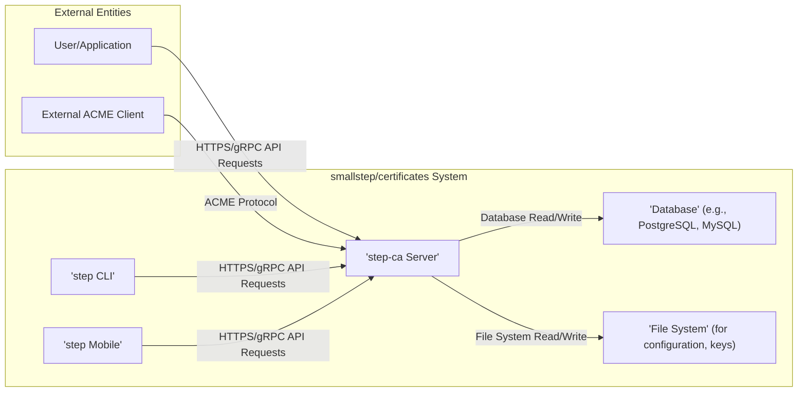

# Project Design Document: smallstep/certificates

**Version:** 1.1
**Date:** October 26, 2023
**Author:** AI Software Architect

## 1. Introduction

This document provides an enhanced design overview of the `smallstep/certificates` project, an open-source suite for managing a private Public Key Infrastructure (PKI). This includes the core Certificate Authority (CA) functionality provided by the `step-ca` server, along with supporting command-line and mobile tools. The purpose of this document is to offer a detailed understanding of the system's architecture, individual components, and the flow of data between them. This comprehensive view will serve as a solid foundation for subsequent threat modeling exercises.

## 2. Goals

*   Clearly and comprehensively define the architecture and individual components of the `smallstep/certificates` project.
*   Elaborate on the interactions and data flow between the various components within the system.
*   Precisely identify key security boundaries and the types of sensitive data handled within the system.
*   Establish a robust and detailed basis for identifying potential threats, vulnerabilities, and attack vectors.

## 3. High-Level Architecture

The `smallstep/certificates` project offers a comprehensive set of tools and services for managing a private PKI. The central element is the `step-ca` server, which functions as the core Certificate Authority. This system interacts with a variety of clients and relies on persistent storage for its operational data.



## 4. Component Details

This section provides a more granular breakdown of the key components within the `smallstep/certificates` system.

*   **`step-ca` Server:**
    *   The core component responsible for all CA operations, including certificate issuance, renewal, and revocation.
    *   Exposes both HTTPS and gRPC APIs for programmatic interaction, facilitating certificate requests and management.
    *   Securely manages the CA's private key and certificate, ensuring their confidentiality and integrity.
    *   Implements a flexible provisioner framework for authenticating and authorizing diverse types of certificate requests.
        *   Examples of provisioners include: JWK (JSON Web Key), SSHPOP (SSH Public Key Ownership Proof), OIDC (OpenID Connect), and ACME.
    *   Supports the creation and management of multiple certificate profiles, tailored for specific use cases such as TLS server authentication, client authentication, and SSH host/user certificates.
    *   Integrates a fully compliant ACME (Automatic Certificate Management Environment) server, enabling automated certificate issuance and renewal for web servers and other services.
    *   Can be configured to operate as a subordinate CA, delegating trust from a root CA.
    *   Provides a dedicated SSH Certificate Authority functionality, allowing for the issuance and management of short-lived SSH certificates, enhancing security and simplifying key management.
*   **`step` CLI:**
    *   A versatile command-line interface designed for interacting with the `step-ca` server and managing various aspects of the PKI.
    *   Key functionalities include:
        *   Requesting various types of certificates (TLS, SSH, etc.).
        *   Revoking issued certificates.
        *   Managing the configuration of the `step-ca` server.
        *   Bootstrapping and initializing new Certificate Authorities.
        *   Interacting with the integrated ACME server for certificate management.
        *   Managing keys and trust stores.
*   **`step Mobile`:**
    *   Native mobile applications available for both iOS and Android platforms, designed for secure identity and certificate management on mobile devices.
    *   Allows users to securely store their private keys and associated certificates within the application's secure enclave or keychain.
    *   Facilitates mutual TLS (mTLS) authentication for secure access to resources and services.
    *   Can be used to request and manage certificates from the `step-ca` server.
*   **Database:**
    *   A persistent data store used by the `step-ca` server to maintain the state of the PKI.
    *   Stores critical information such as:
        *   Metadata for all issued certificates, including serial numbers, validity periods, and subject information.
        *   A record of all revoked certificates.
        *   Configuration details for provisioners, including their types and settings.
        *   Account information for the ACME server, including registration details and authorizations.
        *   Detailed audit logs of all significant actions performed within the system.
*   **File System:**
    *   Used for storing configuration files and sensitive key material.
    *   Key items stored in the file system include:
        *   The `step-ca`'s private key and certificate.
        *   The server's configuration file, defining its operational parameters.
        *   Configuration files for individual provisioners.
        *   Templates used for generating Certificate Signing Requests (CSRs).

## 5. Data Flow

This section provides a more detailed description of the data flow for common operations within the `smallstep/certificates` system.

### 5.1. Certificate Issuance (TLS via ACME)

```mermaid
graph LR
    subgraph "External ACME Client (e.g., certbot)"
        A["'ACME Client Application'"]
    end
    subgraph "smallstep/certificates System"
        B["'step-ca Server' (ACME Endpoint)"]
        E["'Database'"]
    end
    A -->|ACME Challenge Request (e.g., HTTP-01, DNS-01)| B
    B -->|Respond to Challenge| A
    A -->|Prove Domain Ownership| B
    B -->|Validate Challenge Success| B
    A -->|ACME Certificate Request (CSR)| B
    B -->|Validate Request, Issue Certificate| E
    E -->|Store Certificate Metadata| B
    B -->|Issue Certificate| A
```

*   An external ACME client application initiates the certificate issuance process by sending an ACME challenge request to the `step-ca` server's ACME endpoint.
*   The `step-ca` server responds with a specific challenge that the client needs to fulfill to prove control over the requested domain. Common challenge types include HTTP-01 and DNS-01.
*   The ACME client takes the necessary steps to satisfy the challenge (e.g., placing a specific file on a web server or adding a DNS record).
*   The ACME client informs the `step-ca` server that the challenge has been completed.
*   The `step-ca` server validates the successful completion of the challenge.
*   The ACME client generates a Certificate Signing Request (CSR) and sends it to the `step-ca` server.
*   The `step-ca` server validates the CSR, issues the requested certificate, and stores relevant metadata about the issued certificate in the database.
*   The newly issued certificate is then returned to the ACME client.

### 5.2. Certificate Issuance (Direct API via `step` CLI)

```mermaid
graph LR
    subgraph "User/Client"
        A["'step CLI'"]
    end
    subgraph "smallstep/certificates System"
        B["'step-ca Server' (API Endpoint)"]
        C["'Provisioner'"]
        E["'Database'"]
    end
    A -->|Certificate Request (with Provisioner Credentials)| B
    B -->|Authenticate and Authorize Request via Provisioner| C
    C -->|Policy Evaluation| B
    B -->|Generate and Sign Certificate| B
    B -->|Store Certificate Metadata| E
    E -->|Record Audit Log| B
    B -->|Return Issued Certificate| A
```

*   A user initiates a certificate request using the `step` CLI, providing the necessary credentials for a specific provisioner.
*   The `step` CLI sends the certificate request, along with the provisioner credentials, to the `step-ca` server's API endpoint.
*   The `step-ca` server authenticates and authorizes the request by invoking the configured provisioner. This process verifies the identity of the requester based on the provisioner's specific mechanisms.
*   The `step-ca` server evaluates any configured policies associated with the provisioner to ensure the request complies with organizational requirements.
*   Upon successful authentication and authorization, the `step-ca` server generates and signs the requested certificate using its private key.
*   Metadata about the issued certificate is stored in the database for record-keeping and tracking.
*   An audit log entry is recorded, documenting the certificate issuance event.
*   The newly issued certificate is returned to the `step` CLI.

### 5.3. Certificate Revocation

```mermaid
graph LR
    subgraph "User/Client"
        A["'step CLI' / API Client"]
    end
    subgraph "smallstep/certificates System"
        B["'step-ca Server'"]
        E["'Database'"]
    end
    A -->|Revocation Request (with Authentication)| B
    B -->|Authenticate and Authorize Revocation Request| B
    B -->|Update Certificate Status to Revoked| E
    E -->|Record Revocation Event in Audit Log| B
    B -->|Generate Updated CRL/OCSP Data| B
```

*   A user or an automated system initiates a certificate revocation request using either the `step` CLI or a direct API call, providing necessary authentication credentials.
*   The `step-ca` server authenticates and authorizes the revocation request, ensuring that the requester has the necessary permissions to revoke the specified certificate.
*   The `step-ca` server updates the status of the certificate in the database to "revoked."
*   A record of the revocation event, including the time and the entity that initiated the revocation, is added to the audit log.
*   The `step-ca` server generates updated Certificate Revocation Lists (CRLs) or prepares updated responses for Online Certificate Status Protocol (OCSP) requests to reflect the revocation.

## 6. Security Considerations

This section details key security considerations for the `smallstep/certificates` project, highlighting potential threats and necessary safeguards.

*   **Private Key Protection (CA):** The CA's private key is the most critical security asset. Its compromise would allow for the issuance of fraudulent certificates.
    *   **Threats:** Unauthorized access, theft, accidental deletion.
    *   **Mitigations:** Secure storage using strong encryption, access control lists, potential use of Hardware Security Modules (HSMs).
*   **Provisioner Security:** The security of the provisioners directly impacts the trustworthiness of issued certificates.
    *   **Threats:** Compromised provisioner credentials, misconfigured provisioners allowing unauthorized access.
    *   **Mitigations:** Secure storage of provisioner secrets, regular rotation of credentials, principle of least privilege for provisioner permissions, thorough testing of provisioner configurations.
*   **API Security:** The `step-ca` server's APIs are entry points for various operations and must be secured against common web vulnerabilities.
    *   **Threats:** Authentication bypass, authorization flaws, injection attacks (e.g., SQL injection if not using parameterized queries), cross-site scripting (XSS) if a web UI is exposed (though primarily an API).
    *   **Mitigations:** Strong authentication mechanisms (e.g., mTLS, API keys), robust authorization checks, input validation and sanitization, protection against common web attacks.
*   **Database Security:** The database stores sensitive information and must be protected against unauthorized access and data breaches.
    *   **Threats:** Unauthorized access to database credentials, SQL injection vulnerabilities, data exfiltration.
    *   **Mitigations:** Strong database credentials, network segmentation, encryption at rest and in transit, regular security audits, principle of least privilege for database access.
*   **File System Security:** The file system stores configuration files and the CA's private key, requiring strict access controls.
    *   **Threats:** Unauthorized access to configuration files leading to misconfiguration, compromise of the CA's private key.
    *   **Mitigations:** Restrictive file system permissions, encryption at rest for sensitive files.
*   **Audit Logging Integrity:** Audit logs provide a record of actions and are crucial for security monitoring and incident response.
    *   **Threats:** Tampering with or deletion of audit logs.
    *   **Mitigations:** Secure storage of audit logs, integrity checks, potential use of a separate logging service.
*   **ACME Protocol Security:** While ACME automates certificate issuance, vulnerabilities in its implementation can lead to unauthorized certificate issuance.
    *   **Threats:** Domain takeover leading to successful challenge completion, replay attacks.
    *   **Mitigations:** Adherence to ACME standards, proper validation of challenges, secure handling of ACME account keys.
*   **SSH CA Security:** Secure management of SSH signing keys and proper authorization of SSH certificate requests are critical.
    *   **Threats:** Compromise of SSH signing keys, unauthorized issuance of SSH certificates granting access to systems.
    *   **Mitigations:** Secure storage of SSH signing keys, strong authentication for SSH certificate requests, use of short-lived certificates.

## 7. Deployment Considerations

The `smallstep/certificates` system offers flexibility in deployment environments.

*   **Cloud Environments (AWS, Azure, GCP):** Commonly deployed using containerization technologies like Docker and orchestration platforms like Kubernetes. Managed database services are frequently utilized for simplified management and scalability.
*   **On-Premises Deployments:** Can be deployed on physical servers or virtual machines. Requires careful planning for infrastructure security, including network segmentation and access controls.
*   **Containerization (Docker):** The `step-ca` server and associated tools are distributed as Docker images, streamlining deployment, management, and updates.
*   **Orchestration (Kubernetes):** Kubernetes provides capabilities for managing and scaling the `step-ca` deployment, offering features like high availability, automated rollouts, and resource management.

## 8. Future Considerations

*   **Enhanced Integration with Hardware Security Modules (HSMs):** To provide a higher level of security for the CA's private key by storing and managing it within a tamper-proof hardware device.
*   **Advanced Monitoring and Alerting Capabilities:** Implementing more sophisticated monitoring and alerting systems to proactively detect and respond to potential security incidents or performance issues.
*   **Policy Engine Enhancements:** Developing a more granular and flexible policy engine to enforce stricter controls over certificate issuance and usage.
*   **Improved Certificate Revocation Mechanisms:** Exploring and implementing more efficient and scalable certificate revocation methods beyond traditional CRLs and OCSP.
*   **Federated Identity Management Integration:** Seamless integration with enterprise identity providers to simplify user authentication and authorization for certificate requests.

This enhanced design document provides a more detailed and comprehensive understanding of the `smallstep/certificates` project's architecture and security considerations. This information will be invaluable for conducting a thorough threat model to identify potential security risks and develop effective mitigation strategies.