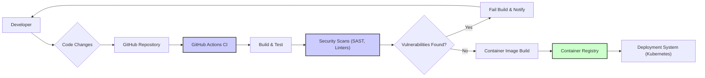

# BUSINESS POSTURE

This project, 'smallstep Certificates', aims to provide a robust and easy-to-use open-source certificate authority (CA) solution. The primary business priority is to enable secure communication and identity verification for various applications, services, and devices. This is crucial for establishing trust and protecting sensitive data in modern IT environments.

The key business goals are:

- Provide a flexible and scalable certificate management solution.
- Simplify the process of issuing and managing TLS certificates.
- Offer an open-source alternative to commercial certificate authorities.
- Support automation of certificate lifecycle management.
- Enhance security posture by enabling strong authentication and encryption.

The most important business risks associated with this project are:

- Risk of security breaches due to vulnerabilities in the CA software.
- Risk of misconfiguration leading to insecure certificate issuance or management.
- Risk of service disruption if the CA system becomes unavailable.
- Risk of reputational damage if the CA is compromised or misused.
- Risk of non-compliance with industry regulations if certificate management is not properly implemented.

# SECURITY POSTURE

## Existing Security Controls

- security control: Code hosted on GitHub, allowing for community review and contribution. (Implemented: GitHub Repository)
- security control: Open-source nature promotes transparency and scrutiny of the codebase. (Implemented: Open Source License)
- security control: Project likely follows general secure coding practices for Go language. (Inferred: Software Development Lifecycle)

## Accepted Risks

- accepted risk: Reliance on community contributions for security vulnerability identification and patching.
- accepted risk: Potential for undiscovered vulnerabilities in the codebase due to its complexity.
- accepted risk: Users are responsible for secure deployment and configuration of the CA.

## Recommended Security Controls

- security control: Implement automated security scanning (SAST/DAST) in the CI/CD pipeline.
- security control: Conduct regular penetration testing and security audits by external security experts.
- security control: Implement robust key management practices, including secure key generation, storage, and rotation.
- security control: Enforce principle of least privilege for access to CA management interfaces and data.
- security control: Implement comprehensive audit logging and monitoring of CA operations.
- security control: Provide clear and comprehensive security documentation and best practices for users.
- security control: Establish a vulnerability disclosure and incident response plan.

## Security Requirements

- Authentication:
    - Requirement: Secure authentication mechanism for accessing the CA management interface (e.g., web UI, CLI).
    - Requirement: Support for multi-factor authentication (MFA) for administrative access.
    - Requirement: API authentication for programmatic access to CA functions.

- Authorization:
    - Requirement: Role-Based Access Control (RBAC) to manage permissions for different CA operations.
    - Requirement: Fine-grained authorization policies to control who can issue, revoke, or manage certificates for specific domains or applications.
    - Requirement: Policy enforcement to ensure certificate issuance adheres to defined constraints.

- Input Validation:
    - Requirement: Strict input validation for all certificate requests and management commands.
    - Requirement: Validation of certificate parameters (e.g., subject names, extensions) to prevent malicious or invalid certificates.
    - Requirement: Input sanitization to prevent injection attacks.

- Cryptography:
    - Requirement: Use of strong cryptographic algorithms and protocols for certificate generation, signing, and validation.
    - Requirement: Secure generation and storage of private keys.
    - Requirement: Support for industry-standard key lengths and cryptographic best practices.
    - Requirement: Protection of cryptographic keys from unauthorized access and disclosure.

# DESIGN

## C4 CONTEXT

```mermaid
flowchart LR
    subgraph "Organization"
        A["Users"]
        B["Applications"]
        C["Devices"]
    end
    D("smallstep Certificates")
    E["External Certificate Authorities"]
    F["Key Management Systems"]
    G["Monitoring Systems"]

    A -->|Uses Certificates| D
    B -->|Requests Certificates, Validates Certificates| D
    C -->|Requests Certificates, Presents Certificates| D
    D -->|Issues Certificates| B
    D -->|Issues Certificates| C
    D -->|Replaces Existing CA (Optional)| E
    D -->|Stores Keys Securely| F
    D -->|Logs Events, Metrics| G
    F -->|Provides Key Storage| D

    style D fill:#f9f,stroke:#333,stroke-width:2px
```

### Context Diagram Elements

- Name: Users
    - Type: Person
    - Description: Human users, such as developers, system administrators, and security operators, who interact with applications and devices that rely on certificates.
    - Responsibilities: Requesting certificates for services, managing certificate configurations, monitoring certificate status.
    - Security controls: Role-based access control to CA management interfaces, multi-factor authentication.

- Name: Applications
    - Type: Software System
    - Description: Various software applications within the organization that require TLS/SSL certificates for secure communication and identity verification.
    - Responsibilities: Requesting certificates from the CA, using certificates for TLS/SSL encryption, validating certificates presented by other systems.
    - Security controls: Secure configuration of TLS/SSL settings, proper certificate validation, secure storage of application keys (if applicable).

- Name: Devices
    - Type: Software System
    - Description: Network devices, servers, IoT devices, or other hardware components that require certificates for identification and secure communication.
    - Responsibilities: Requesting certificates, presenting certificates for authentication, using certificates for secure communication.
    - Security controls: Secure device provisioning, secure storage of device certificates and keys, device authentication mechanisms.

- Name: smallstep Certificates
    - Type: Software System
    - Description: The certificate authority system being designed, responsible for issuing, managing, and revoking digital certificates.
    - Responsibilities: Certificate issuance, certificate revocation, certificate lifecycle management, key management, audit logging, providing APIs and interfaces for certificate operations.
    - Security controls: Authentication, authorization, input validation, cryptography, secure key management, audit logging, monitoring, vulnerability scanning.

- Name: External Certificate Authorities
    - Type: Software System
    - Description: Existing public or private certificate authorities that the organization may currently be using. 'smallstep Certificates' can potentially replace or complement these.
    - Responsibilities: Issuing certificates (in the current state, before potential replacement), certificate validation.
    - Security controls: (External to this project, assumed to have their own security controls).

- Name: Key Management Systems
    - Type: Software System
    - Description: External systems used for secure storage and management of cryptographic keys, potentially integrated with 'smallstep Certificates' for enhanced key security.
    - Responsibilities: Secure key generation, secure key storage, key access control, key rotation.
    - Security controls: (External to this project, assumed to have their own security controls, e.g., Hardware Security Modules (HSMs), cloud-based key vaults).

- Name: Monitoring Systems
    - Type: Software System
    - Description: Systems used for monitoring the health, performance, and security of 'smallstep Certificates' and related infrastructure.
    - Responsibilities: Collecting logs and metrics, alerting on security events, providing visibility into system operations.
    - Security controls: (External to this project, assumed to have their own security controls, e.g., secure log storage, access control to monitoring dashboards).

## C4 CONTAINER

```mermaid
flowchart LR
    subgraph "smallstep Certificates System"
        A["Web UI" <br> (Web Application)]
        B["CLI" <br> (Command-Line Interface)]
        C["CA Server" <br> (Go Application)]
        D["Database" <br> (PostgreSQL)]
        E["Key Storage" <br> (File System / HSM / Cloud KMS)]
    end

    A --> C: API Calls (HTTPS)
    B --> C: API Calls (HTTPS)
    C --> D: Database Queries
    C --> E: Key Operations

    style A fill:#fcc,stroke:#333,stroke-width:2px
    style B fill:#fcc,stroke:#333,stroke-width:2px
    style C fill:#cff,stroke:#333,stroke-width:2px
    style D fill:#ccf,stroke:#333,stroke-width:2px
    style E fill:#cfc,stroke:#333,stroke-width:2px
```

### Container Diagram Elements

- Name: Web UI
    - Type: Web Application
    - Description: A web-based user interface for managing the certificate authority, including certificate requests, revocation, and configuration.
    - Responsibilities: Providing a graphical interface for users to interact with the CA, handling user authentication and authorization, displaying certificate information.
    - Security controls: Authentication (username/password, MFA), authorization (RBAC), input validation, output encoding, HTTPS for communication with CA Server, session management.

- Name: CLI
    - Type: Command-Line Interface
    - Description: A command-line tool for interacting with the certificate authority, allowing for automation and scripting of certificate management tasks.
    - Responsibilities: Providing a command-line interface for users and scripts to interact with the CA, handling authentication and authorization, executing certificate management commands.
    - Security controls: Authentication (API keys, tokens), authorization (RBAC), input validation, secure handling of credentials, HTTPS for communication with CA Server.

- Name: CA Server
    - Type: Go Application
    - Description: The core certificate authority application, responsible for certificate issuance, revocation, and management logic. Implements the core CA functionality.
    - Responsibilities: Receiving certificate requests, validating requests, generating certificates, signing certificates, managing certificate revocation lists (CRLs) or OCSP, interacting with the database and key storage.
    - Security controls: Authentication and authorization of API requests, input validation, cryptographic operations, secure key management, audit logging, rate limiting, vulnerability scanning.

- Name: Database
    - Type: PostgreSQL
    - Description: A persistent database used to store certificate metadata, configuration data, audit logs, and other persistent information for the CA.
    - Responsibilities: Storing certificate information, configuration data, audit logs, providing data persistence for the CA Server.
    - Security controls: Database access control, encryption at rest, encryption in transit, regular backups, database hardening, vulnerability scanning.

- Name: Key Storage
    - Type: File System / HSM / Cloud KMS
    - Description: Secure storage for the private keys used by the certificate authority to sign certificates. Can be a file system, Hardware Security Module (HSM), or cloud-based Key Management Service (KMS).
    - Responsibilities: Securely storing the CA's private keys, providing access to keys for signing operations, ensuring key confidentiality and integrity.
    - Security controls: Access control to key storage, encryption of keys at rest, secure key generation, key rotation, potentially HSM or KMS specific security features (e.g., tamper-proof hardware, audit trails).

## DEPLOYMENT

Deployment Solution: Containerized deployment on Kubernetes in a cloud environment (e.g., AWS, GCP, Azure).

```mermaid
flowchart LR
    subgraph "Kubernetes Cluster"
        subgraph "Nodes"
            A1["Node 1"]
            A2["Node 2"]
            subgraph "Pods"
                B1["Web UI Pod"]
                B2["CLI Pod"]
                B3["CA Server Pod 1"]
                B4["CA Server Pod 2"]
                B5["Database Pod"]
            end
        end
        C["Load Balancer"]
        D["Persistent Volume (Database)"]
        E["Key Management Service (Cloud KMS)"]
    end
    F["Users (Internet)"]

    C --> F: HTTPS Requests
    C --> B1: HTTPS Requests
    C --> B2: HTTPS Requests
    B1 --> B3: API Calls (HTTPS)
    B2 --> B4: API Calls (HTTPS)
    B3 --> B5: Database Queries
    B4 --> B5: Database Queries
    B3 --> E: Key Operations
    B4 --> E: Key Operations
    B5 -.-> D: Data Storage

    A1 --> B1
    A1 --> B3
    A2 --> B2
    A2 --> B4
    A2 --> B5

    style B1 fill:#fcc,stroke:#333,stroke-width:2px
    style B2 fill:#fcc,stroke:#333,stroke-width:2px
    style B3 fill:#cff,stroke:#333,stroke-width:2px
    style B4 fill:#cff,stroke:#333,stroke-width:2px
    style B5 fill:#ccf,stroke:#333,stroke-width:2px
    style E fill:#cfc,stroke:#333,stroke-width:2px
```

### Deployment Diagram Elements

- Name: Kubernetes Cluster
    - Type: Infrastructure
    - Description: A Kubernetes cluster providing the container orchestration platform for deploying and managing the 'smallstep Certificates' system.
    - Responsibilities: Container orchestration, service discovery, load balancing, scaling, health monitoring, resource management.
    - Security controls: Kubernetes RBAC, network policies, pod security policies, container security context, regular security updates, cluster hardening.

- Name: Nodes
    - Type: Infrastructure
    - Description: Worker nodes within the Kubernetes cluster, providing the compute resources for running containers (Pods).
    - Responsibilities: Running container workloads, providing compute and network resources to pods.
    - Security controls: Operating system hardening, security patching, access control, network segmentation, monitoring.

- Name: Web UI Pod
    - Type: Container
    - Description: A containerized instance of the Web UI application, running within a Kubernetes Pod.
    - Responsibilities: Serving the Web UI application, handling user requests, communicating with CA Server pods.
    - Security controls: Container image scanning, least privilege container user, network policies, resource limits.

- Name: CLI Pod
    - Type: Container
    - Description: A containerized instance of the CLI application (potentially for administrative tasks or automation), running within a Kubernetes Pod.
    - Responsibilities: Providing CLI access, executing commands, communicating with CA Server pods.
    - Security controls: Container image scanning, least privilege container user, network policies, resource limits, restricted access.

- Name: CA Server Pods (CA Server Pod 1, CA Server Pod 2)
    - Type: Container
    - Description: Multiple containerized instances of the CA Server application, running within Kubernetes Pods for redundancy and scalability.
    - Responsibilities: Handling certificate requests, issuing certificates, managing certificate lifecycle, interacting with the database and key storage.
    - Security controls: Container image scanning, least privilege container user, network policies, resource limits, health probes, liveness probes.

- Name: Database Pod
    - Type: Container
    - Description: A containerized instance of the PostgreSQL database, running within a Kubernetes Pod.
    - Responsibilities: Storing persistent data for the CA system, providing database services to CA Server pods.
    - Security controls: Container image scanning, persistent volume claims, database access control, network policies, resource limits, regular backups.

- Name: Load Balancer
    - Type: Infrastructure
    - Description: A load balancer in front of the Kubernetes cluster, distributing incoming traffic to the Web UI and CLI pods.
    - Responsibilities: Load balancing traffic, providing a single entry point to the system, TLS termination (optional).
    - Security controls: Access control lists, DDoS protection, TLS configuration, security monitoring.

- Name: Persistent Volume (Database)
    - Type: Storage
    - Description: Persistent storage volume attached to the Database Pod, ensuring data persistence across pod restarts.
    - Responsibilities: Providing persistent storage for the database, ensuring data durability.
    - Security controls: Storage encryption at rest, access control to storage volume, backups.

- Name: Key Management Service (Cloud KMS)
    - Type: Cloud Service
    - Description: A cloud-based Key Management Service (e.g., AWS KMS, GCP KMS, Azure Key Vault) used for secure storage and management of the CA's private keys.
    - Responsibilities: Secure key storage, key access control, key encryption, key rotation, audit logging.
    - Security controls: (Managed by the cloud provider, assumed to be highly secure and compliant).

- Name: Users (Internet)
    - Type: Person
    - Description: External users accessing the Web UI or CLI over the internet.
    - Responsibilities: Interacting with the CA system for certificate management.
    - Security controls: Authentication, authorization, HTTPS for secure communication.

## BUILD



### Build Process Elements

- Name: Developer
    - Type: Person
    - Description: Software developers contributing code to the 'smallstep Certificates' project.
    - Responsibilities: Writing code, committing changes, creating pull requests, addressing code review feedback.
    - Security controls: Secure development practices, code review, access control to code repository.

- Name: Code Changes
    - Type: Artifact
    - Description: Modifications to the source code of the project.
    - Responsibilities: Representing the changes made by developers.
    - Security controls: Version control (Git), code review process.

- Name: GitHub Repository
    - Type: Code Repository
    - Description: The GitHub repository hosting the source code of 'smallstep Certificates'.
    - Responsibilities: Storing source code, managing versions, facilitating collaboration, triggering CI/CD pipelines.
    - Security controls: Access control, branch protection, audit logging, vulnerability scanning (GitHub Dependabot).

- Name: GitHub Actions CI
    - Type: CI/CD System
    - Description: GitHub Actions workflows configured for Continuous Integration and Continuous Delivery of 'smallstep Certificates'.
    - Responsibilities: Automating build, test, security scanning, and deployment processes.
    - Security controls: Secure workflow definitions, secret management, access control to workflows, audit logging.

- Name: Build & Test
    - Type: Build Process
    - Description: Steps in the CI pipeline to compile the code, run unit tests, and perform integration tests.
    - Responsibilities: Compiling code, running tests, verifying code functionality.
    - Security controls: Build environment security, dependency management, test coverage.

- Name: Security Scans (SAST, Linters)
    - Type: Security Tooling
    - Description: Static Application Security Testing (SAST) tools and linters used to automatically analyze the code for potential security vulnerabilities and code quality issues.
    - Responsibilities: Identifying potential security flaws, enforcing coding standards, improving code quality.
    - Security controls: Regularly updated security rules, configuration of scanning tools, integration with CI pipeline.

- Name: Vulnerabilities Found?
    - Type: Decision Point
    - Description: A step in the CI pipeline to check the results of security scans.
    - Responsibilities: Evaluating scan results, determining if vulnerabilities are present.
    - Security controls: Defined vulnerability thresholds, manual review of scan results.

- Name: Fail Build & Notify
    - Type: Process
    - Description: Action taken when vulnerabilities are found during security scans, stopping the build process and notifying developers.
    - Responsibilities: Preventing vulnerable code from being deployed, alerting developers to security issues.
    - Security controls: Automated build failure, notifications to developers, issue tracking.

- Name: Container Image Build
    - Type: Build Process
    - Description: Building container images (e.g., Docker images) for the different components of 'smallstep Certificates' (Web UI, CA Server, etc.).
    - Responsibilities: Creating container images, packaging application and dependencies.
    - Security controls: Base image selection, minimal image size, container image scanning, signing container images.

- Name: Container Registry
    - Type: Artifact Repository
    - Description: A container registry (e.g., Docker Hub, private registry) used to store and manage container images.
    - Responsibilities: Storing container images, providing access to images for deployment.
    - Security controls: Access control, image scanning, vulnerability scanning, image signing, registry security hardening.

- Name: Deployment System (Kubernetes)
    - Type: Deployment Automation
    - Description: The Kubernetes cluster used to deploy and manage the containerized 'smallstep Certificates' application.
    - Responsibilities: Deploying container images, managing application lifecycle, scaling, health monitoring.
    - Security controls: Deployment automation security, infrastructure as code, access control to deployment system.

# RISK ASSESSMENT

## Critical Business Processes

The critical business process being protected is the **issuance and management of digital certificates**. This process is essential for:

- Establishing secure communication channels (TLS/SSL).
- Authenticating services and devices.
- Maintaining trust in the organization's IT infrastructure.
- Enabling secure access to applications and resources.

Disruption or compromise of this process could lead to:

- Loss of confidentiality and integrity of data in transit.
- Unauthorized access to systems and applications.
- Service outages and downtime.
- Reputational damage and loss of customer trust.
- Non-compliance with regulatory requirements.

## Data Sensitivity

The data being protected and its sensitivity are:

- **Private Keys of the CA:** Highly sensitive. Compromise would allow attackers to impersonate the CA and issue fraudulent certificates, leading to widespread security breaches. Requires the highest level of protection.
- **Certificate Signing Requests (CSRs):** Sensitive. May contain information about the entities requesting certificates. Should be protected from unauthorized access and modification.
- **Issued Certificates:** Sensitive. Publicly available but integrity is crucial. Tampering could lead to trust issues.
- **Certificate Metadata (e.g., serial numbers, expiration dates):** Moderately sensitive. Can be used to track certificate usage and identify potential vulnerabilities if exposed.
- **Audit Logs:** Moderately sensitive. Contain records of CA operations and security events. Important for security monitoring and incident response. Should be protected from unauthorized modification or deletion.
- **Configuration Data:** Moderately sensitive. Contains settings for the CA system. Improper configuration could lead to security vulnerabilities.

# QUESTIONS & ASSUMPTIONS

## Questions

- What is the target deployment environment for 'smallstep Certificates'? (Cloud, on-premises, hybrid?)
- Are there any specific compliance requirements that the CA system needs to meet (e.g., PCI DSS, HIPAA, FedRAMP)?
- What is the expected scale and performance requirements for the CA system?
- Are there any existing key management systems that 'smallstep Certificates' needs to integrate with?
- What is the organization's risk appetite regarding open-source software and security vulnerabilities?
- What level of security expertise is available within the organization to operate and maintain the CA system securely?
- What are the specific use cases for certificates that 'smallstep Certificates' will be supporting?

## Assumptions

- The project aims to provide a general-purpose certificate authority solution.
- The target deployment environment is likely cloud-based or containerized.
- Security is a high priority for this project, given the nature of certificate authorities.
- The organization using this design document has a moderate to high security awareness.
- The project will be actively maintained and updated to address security vulnerabilities.
- The organization will implement recommended security controls and best practices for operating the CA system.