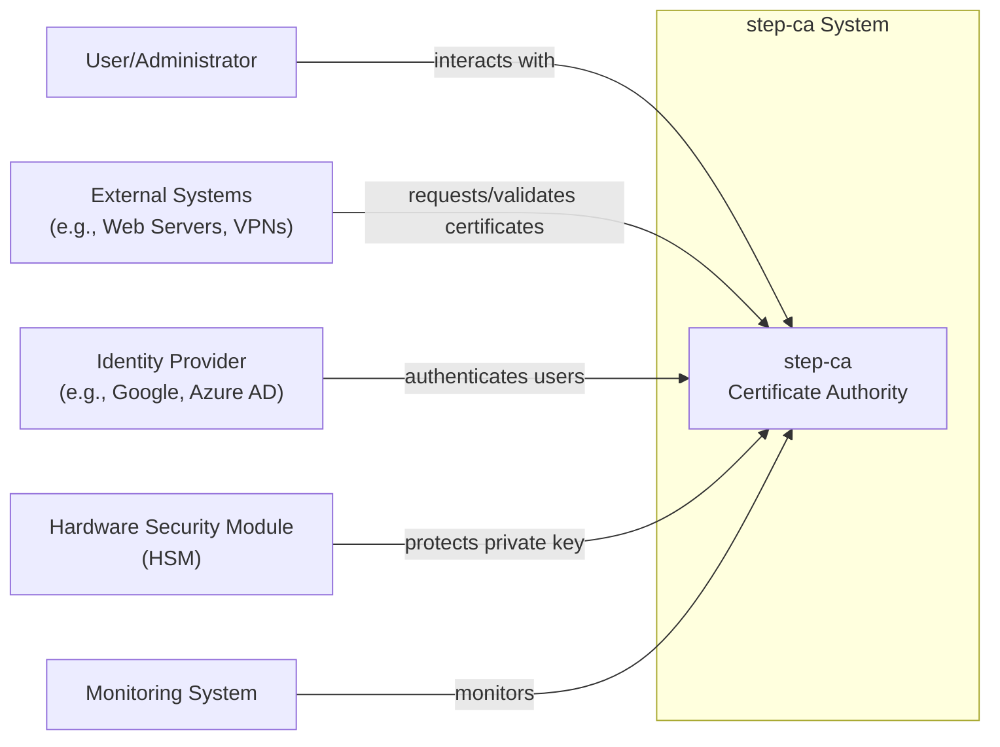
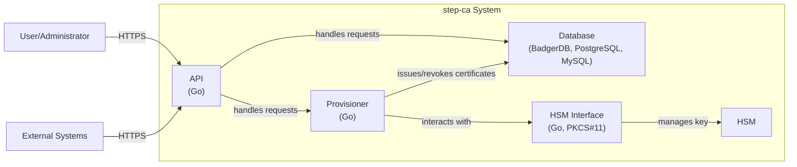
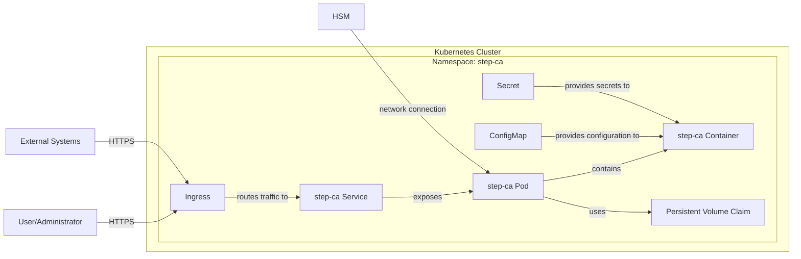
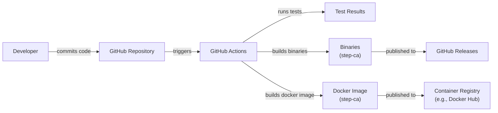

Okay, let's create a design document for the `smallstep/certificates` project.

# BUSINESS POSTURE

Business Priorities and Goals:

*   Provide a robust and easy-to-use online Certificate Authority (CA) service.
*   Enable automated certificate management for various use cases (TLS, SSH, VPN, etc.).
*   Offer a secure and scalable solution for organizations of different sizes.
*   Simplify the process of obtaining and renewing certificates.
*   Support various protocols and standards related to Public Key Infrastructure (PKI).
*   Reduce the operational overhead associated with managing certificates manually.
*   Provide open-source solution.

Most Important Business Risks:

*   Compromise of the CA's private key, leading to widespread trust issues and potential impersonation attacks.
*   Service unavailability, disrupting dependent systems that rely on certificate issuance and validation.
*   Misconfiguration or improper use of the CA, leading to the issuance of invalid or unauthorized certificates.
*   Vulnerabilities in the software that could be exploited to gain unauthorized access or control.
*   Failure to comply with relevant industry standards and regulations related to PKI.
*   Supply chain attacks.
*   Lack of support for evolving security standards and protocols.

# SECURITY POSTURE

Existing Security Controls:

*   security control: Role-Based Access Control (RBAC) for managing access to the CA (implied through configuration and API design).
*   security control: Support for Hardware Security Modules (HSMs) to protect the CA's private key (mentioned in documentation).
*   security control: Integration with external identity providers (IdPs) for authentication (mentioned in documentation).
*   security control: Use of short-lived certificates to minimize the impact of key compromise (core design principle).
*   security control: Auditing of CA operations (implied through logging and API design).
*   security control: Support for various cryptographic algorithms and key sizes (mentioned in documentation).
*   security control: Implementation of secure coding practices (assumed, but should be explicitly verified).
*   security control: Regular security updates and vulnerability patching (assumed, but should be explicitly verified).
*   security control: API accessible only via TLS.
*   security control: Support multiple provisioners, including: ACME, AWS, GCP, Azure, SSH, X5C, K8S, etc.

Accepted Risks:

*   accepted risk: Reliance on third-party dependencies (inherent in any software project, but should be carefully managed).
*   accepted risk: Potential for misconfiguration by users (mitigated through documentation and best practices).
*   accepted risk: Limited resources for security audits and penetration testing (common for open-source projects).

Recommended Security Controls:

*   Implement mandatory code reviews and static analysis to enforce secure coding practices.
*   Conduct regular penetration testing and vulnerability assessments.
*   Establish a clear vulnerability disclosure program.
*   Implement a Software Bill of Materials (SBOM) to track and manage dependencies.
*   Implement automated security testing in the CI/CD pipeline (SAST, DAST, SCA).
*   Provide detailed security documentation and hardening guides.
*   Implement rate limiting and other measures to prevent denial-of-service attacks.
*   Implement robust monitoring and alerting for security-related events.

Security Requirements:

*   Authentication:
    *   Support for strong authentication mechanisms for all users and administrators.
    *   Integration with existing identity providers (e.g., OAuth 2.0, OIDC, SAML).
    *   Enforce multi-factor authentication (MFA) for administrative access.
*   Authorization:
    *   Implement fine-grained access control based on roles and responsibilities.
    *   Follow the principle of least privilege.
    *   Regularly review and update access permissions.
*   Input Validation:
    *   Validate all inputs from clients and external systems.
    *   Use allow-lists rather than block-lists.
    *   Sanitize inputs to prevent injection attacks (e.g., command injection, SQL injection).
*   Cryptography:
    *   Use strong, industry-standard cryptographic algorithms and key sizes.
    *   Protect private keys using HSMs or other secure key management solutions.
    *   Regularly rotate keys and certificates.
    *   Support for modern cryptographic protocols (e.g., TLS 1.3).
    *   Enforce cryptographic best practices (e.g., proper use of nonces, IVs).

# DESIGN

## C4 CONTEXT

C4 Context Element List:

*   Element:
    *   Name: step-ca
    *   Type: System
    *   Description: The core Certificate Authority system, responsible for issuing and managing certificates.
    *   Responsibilities:
        *   Issuing certificates.
        *   Revoking certificates.
        *   Managing certificate lifecycle.
        *   Providing an API for certificate operations.
        *   Storing and managing CA configuration.
    *   Security controls: RBAC, HSM support, IdP integration, short-lived certificates, auditing, cryptographic algorithm support, API accessible only via TLS.

*   Element:
    *   Name: User/Administrator
    *   Type: Person
    *   Description: A person interacting with the step-ca system to manage certificates or configure the CA.
    *   Responsibilities:
        *   Configuring the CA.
        *   Managing users and permissions.
        *   Requesting and renewing certificates.
        *   Monitoring CA operations.
    *   Security controls: Strong authentication, MFA, RBAC.

*   Element:
    *   Name: External Systems
    *   Type: System
    *   Description: Systems that rely on step-ca for certificate issuance and validation.
    *   Responsibilities:
        *   Requesting certificates.
        *   Validating certificates.
        *   Using certificates for secure communication.
    *   Security controls: TLS, certificate pinning (optional).

*   Element:
    *   Name: Identity Provider
    *   Type: System
    *   Description: An external system used for authenticating users.
    *   Responsibilities:
        *   Authenticating users.
        *   Providing user identity information.
    *   Security controls: Standard IdP security controls (e.g., OAuth 2.0, OIDC, SAML).

*   Element:
    *   Name: Hardware Security Module (HSM)
    *   Type: System
    *   Description: A physical device used to protect the CA's private key.
    *   Responsibilities:
        *   Securely storing the private key.
        *   Performing cryptographic operations.
    *   Security controls: Physical security, tamper resistance, access controls.

*   Element:
    *   Name: Monitoring System
    *   Type: System
    *   Description: System used for monitoring step-ca.
    *   Responsibilities:
        *   Collecting logs.
        *   Collecting metrics.
        *   Generating alerts.
    *   Security controls: Access control, secure communication channels.

## C4 CONTAINER

C4 Container Element List:

*   Element:
    *   Name: API
    *   Type: Container (Go)
    *   Description: The main entry point for interacting with the CA.
    *   Responsibilities:
        *   Handling API requests.
        *   Authenticating users.
        *   Authorizing requests.
        *   Validating inputs.
        *   Interacting with the Provisioner and Database.
    *   Security controls: TLS, RBAC, input validation, authentication, authorization.

*   Element:
    *   Name: Database
    *   Type: Container (BadgerDB, PostgreSQL, MySQL)
    *   Description: Stores CA configuration, certificate information, and other data.
    *   Responsibilities:
        *   Storing data persistently.
        *   Providing data access to the API and Provisioner.
    *   Security controls: Access controls, encryption at rest (optional, depending on the database), regular backups.

*   Element:
    *   Name: Provisioner
    *   Type: Container (Go)
    *   Description: Handles the core logic for issuing and revoking certificates.
    *   Responsibilities:
        *   Generating certificate signing requests (CSRs).
        *   Signing certificates.
        *   Revoking certificates.
        *   Interacting with the HSM Interface.
    *   Security controls: Secure coding practices, cryptographic best practices.

*   Element:
    *   Name: HSM Interface
    *   Type: Container (Go, PKCS#11)
    *   Description: Provides an interface for interacting with the HSM.
    *   Responsibilities:
        *   Communicating with the HSM.
        *   Managing keys stored in the HSM.
    *   Security controls: Secure communication with the HSM, access controls.

*   Element:
    *   Name: HSM
    *   Type: System
    *   Description: A physical device used to protect the CA's private key.
    *   Responsibilities:
        *   Securely storing the private key.
        *   Performing cryptographic operations.
    *   Security controls: Physical security, tamper resistance, access controls.

*   Element:
    *   Name: User/Administrator
    *   Type: Person
    *   Description: A person interacting with the step-ca system to manage certificates or configure the CA.
    *   Responsibilities:
        *   Configuring the CA.
        *   Managing users and permissions.
        *   Requesting and renewing certificates.
        *   Monitoring CA operations.
    *   Security controls: Strong authentication, MFA, RBAC.

*   Element:
    *   Name: External Systems
    *   Type: System
    *   Description: Systems that rely on step-ca for certificate issuance and validation.
    *   Responsibilities:
        *   Requesting certificates.
        *   Validating certificates.
        *   Using certificates for secure communication.
    *   Security controls: TLS, certificate pinning (optional).

## DEPLOYMENT

Possible Deployment Solutions:

1.  Standalone Binary: Deploy the `step-ca` binary directly on a server (physical or virtual).
2.  Docker Container: Deploy `step-ca` as a Docker container.
3.  Kubernetes: Deploy `step-ca` as a Kubernetes deployment.
4.  Cloud-Specific Deployments (e.g., AWS, GCP, Azure): Utilize cloud-specific services and infrastructure for deployment.

Chosen Solution (for detailed description): Kubernetes Deployment

Deployment Element List:

*   Element:
    *   Name: Kubernetes Cluster
    *   Type: Infrastructure
    *   Description: The Kubernetes cluster where step-ca is deployed.
    *   Responsibilities:
        *   Orchestrating containers.
        *   Managing resources.
        *   Providing networking and storage.
    *   Security controls: Kubernetes RBAC, network policies, pod security policies.

*   Element:
    *   Name: Namespace: step-ca
    *   Type: Logical Isolation
    *   Description: A Kubernetes namespace dedicated to the step-ca deployment.
    *   Responsibilities:
        *   Isolating step-ca resources from other applications.
    *   Security controls: Kubernetes RBAC, network policies.

*   Element:
    *   Name: step-ca Pod
    *   Type: Pod
    *   Description: A Kubernetes pod running the step-ca container.
    *   Responsibilities:
        *   Running the step-ca application.
    *   Security controls: Pod security policies, resource limits.

*   Element:
    *   Name: step-ca Container
    *   Type: Container
    *   Description: The Docker container containing the step-ca binary and its dependencies.
    *   Responsibilities:
        *   Running the step-ca application.
    *   Security controls: Container image security scanning, minimal base image.

*   Element:
    *   Name: Persistent Volume Claim
    *   Type: Storage
    *   Description: A Kubernetes persistent volume claim used to store persistent data (e.g., database files).
    *   Responsibilities:
        *   Providing persistent storage for the step-ca container.
    *   Security controls: Storage encryption (optional).

*   Element:
    *   Name: step-ca Service
    *   Type: Service
    *   Description: A Kubernetes service that exposes the step-ca pod.
    *   Responsibilities:
        *   Providing a stable endpoint for accessing the step-ca API.
    *   Security controls: Network policies.

*   Element:
    *   Name: Ingress
    *   Type: Ingress
    *   Description: A Kubernetes ingress that routes external traffic to the step-ca service.
    *   Responsibilities:
        *   Routing external traffic to the step-ca API.
        *   TLS termination (optional).
    *   Security controls: TLS, WAF (optional).

*   Element:
    *   Name: ConfigMap
    *   Type: Configuration
    *   Description: A Kubernetes ConfigMap that provides configuration data to the step-ca container.
    *   Responsibilities:
        *   Storing configuration settings.
    *   Security controls: None (configuration data should be carefully managed).

*   Element:
    *   Name: Secret
    *   Type: Secret
    *   Description: A Kubernetes Secret that provides sensitive data (e.g., passwords, API keys) to the step-ca container.
    *   Responsibilities:
        *   Storing sensitive data securely.
    *   Security controls: Kubernetes Secrets encryption.

*   Element:
    *   Name: User/Administrator
    *   Type: Person
    *   Description: A person interacting with the step-ca system to manage certificates or configure the CA.
    *   Responsibilities:
        *   Configuring the CA.
        *   Managing users and permissions.
        *   Requesting and renewing certificates.
        *   Monitoring CA operations.
    *   Security controls: Strong authentication, MFA, RBAC.

*   Element:
    *   Name: External Systems
    *   Type: System
    *   Description: Systems that rely on step-ca for certificate issuance and validation.
    *   Responsibilities:
        *   Requesting certificates.
        *   Validating certificates.
        *   Using certificates for secure communication.
    *   Security controls: TLS, certificate pinning (optional).

*   Element:
    *   Name: HSM
    *   Type: System
    *   Description: A physical device used to protect the CA's private key.
    *   Responsibilities:
        *   Securely storing the private key.
        *   Performing cryptographic operations.
    *   Security controls: Physical security, tamper resistance, access controls.

## BUILD

The `smallstep/certificates` project uses Go modules for dependency management and GitHub Actions for CI/CD.

Build Process Description:

1.  Developer commits code to the GitHub repository.
2.  GitHub Actions workflow is triggered.
3.  The workflow checks out the code.
4.  The workflow sets up the Go environment.
5.  The workflow runs linters (e.g., `golangci-lint`).
6.  The workflow runs unit tests and integration tests.
7.  The workflow builds the `step-ca` binary for various platforms.
8.  The workflow builds a Docker image containing the `step-ca` binary.
9.  The workflow publishes the binaries to GitHub Releases.
10. The workflow pushes the Docker image to a container registry (e.g., Docker Hub).
11. Security Scanners (SAST - `gosec`, SCA - `snyk` or similar) are run as part of the workflow.

Security Controls:

*   security control: Use of GitHub Actions for automated builds and testing.
*   security control: Use of Go modules for dependency management.
*   security control: Use of linters to enforce code style and identify potential issues.
*   security control: Use of unit tests and integration tests to verify code correctness.
*   security control: Use of SAST tools (e.g., `gosec`) to identify security vulnerabilities in the code.
*   security control: Use of SCA tools (e.g., `snyk`, `dependabot`) to identify vulnerabilities in dependencies.
*   security control: Building minimal Docker images to reduce the attack surface.
*   security control: Signing of binaries and Docker images (optional, but recommended).

# RISK ASSESSMENT

Critical Business Processes:

*   Certificate issuance and renewal.
*   Certificate revocation.
*   CA configuration management.
*   User and administrator authentication and authorization.

Data Sensitivity:

*   CA Private Key: Extremely sensitive. Compromise leads to complete loss of trust.
*   Issued Certificates: Sensitive. Contain identifying information and public keys.
*   Certificate Revocation Lists (CRLs): Moderately sensitive. Disclosure can reveal information about revoked certificates.
*   CA Configuration: Sensitive. Contains settings that affect the security of the CA.
*   User Credentials: Sensitive. Used to authenticate users and administrators.
*   Audit Logs: Moderately sensitive. Contain information about CA operations.

# QUESTIONS & ASSUMPTIONS

Questions:

*   What are the specific compliance requirements (e.g., PCI DSS, HIPAA, GDPR) that apply to the deployment environment?
*   What is the expected load (number of certificate requests per second) on the CA?
*   What are the specific requirements for high availability and disaster recovery?
*   What is the existing infrastructure and tooling used for monitoring and logging?
*   Are there any existing security policies or guidelines that need to be followed?
*   What level of support is required for different provisioners?
*   What are the plans for future development and feature additions?

Assumptions:

*   BUSINESS POSTURE: The organization has a moderate risk appetite, balancing the need for security with the desire for agility and ease of use.
*   SECURITY POSTURE: The organization has a basic understanding of PKI concepts and best practices.
*   DESIGN: The deployment environment will be a Kubernetes cluster. The HSM will be accessible via network.