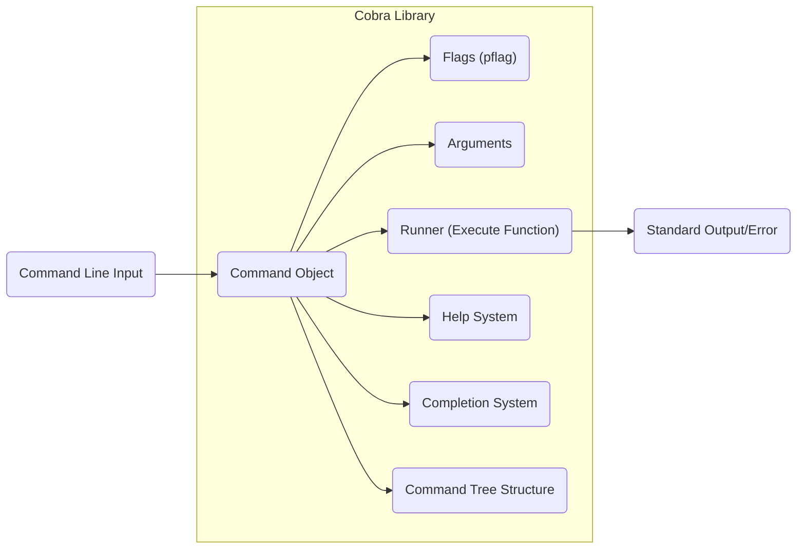
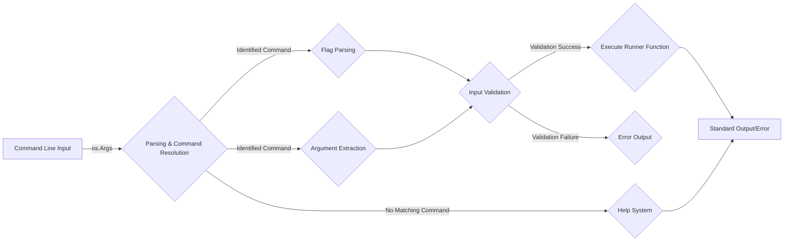

## Project Design Document: Cobra CLI Library (Improved)

**1. Introduction**

This document provides an enhanced design overview of the Cobra CLI library (https://github.com/spf13/cobra), specifically tailored for threat modeling. It details the library's architecture, data flow, and key functionalities, highlighting aspects relevant to security considerations. This document serves as a foundational resource for identifying potential vulnerabilities and attack vectors.

**2. Project Overview**

Cobra is a widely adopted Go library that simplifies the creation of modern, robust CLI applications. It offers a structured approach to organizing commands, subcommands, flags (options), and arguments, promoting the development of user-friendly and feature-rich command-line tools. Its popularity within the Go ecosystem makes understanding its design crucial for assessing the security of applications built upon it.

**3. Architectural Design**

Cobra's architecture is centered around the `Command` object, which represents an individual command or subcommand within the CLI application. The library provides mechanisms for defining, registering, and executing these commands in a hierarchical structure.

*   **Core Architectural Elements:**
    *   **`Command` Object:** The fundamental building block. It encapsulates:
        *   `Use`: The command's invocation name.
        *   `Short` & `Long`:  Brief and detailed descriptions for help messages.
        *   `Example`: Usage examples for help messages.
        *   `Run` & `RunE`: Functions containing the command's core logic (with error handling).
        *   `PersistentFlags`: Flags inherited by all subcommands.
        *   `Flags`: Flags specific to this command.
        *   `Args`:  Argument validation logic.
        *   `Commands`: A slice of child `Command` objects (subcommands), forming the command tree.
    *   **Flag Management:** Cobra leverages the `pflag` library for defining and parsing command-line flags. It supports various data types (e.g., boolean, string, integer, slices).
    *   **Argument Handling:**  Mechanisms for defining and validating positional arguments passed to commands.
    *   **Command Execution Logic (`Runner`):** The `Run` or `RunE` function associated with a `Command` that executes the command's intended action.
    *   **Command Tree Structure:**  A hierarchical organization of `Command` objects, enabling the creation of nested command structures.
    *   **Automated Help System:**  Generates help messages dynamically based on command and flag definitions.
    *   **Shell Completion Generation:**  Produces scripts for shell environments (Bash, Zsh, Fish) to enable tab completion of commands and flags.
    *   **Integration with Configuration Libraries (Optional):** While not a core component, Cobra often integrates with libraries like Viper for handling application configuration.

**4. Data Flow During Command Execution**

The execution flow within a Cobra application involves the following stages:

*   **Initialization Phase:**
    *   The main application initializes the root `Command` object.
    *   Subcommands and their associated flags and arguments are defined and added to the command tree.
*   **Command Line Input Reception:**
    *   The user invokes the CLI application with a command string, including subcommands, flags, and arguments.
*   **Input Parsing and Command Resolution:**
    *   Cobra parses the command-line input using `os.Args`.
    *   It traverses the command tree to identify the target `Command` based on the provided command and subcommand names.
*   **Flag and Argument Parsing:**
    *   The `pflag` library parses the provided flags according to their definitions.
    *   Positional arguments are extracted.
*   **Input Validation:**
    *   Cobra validates the parsed flags and arguments against their defined types, constraints, and required status.
    *   The `Args` function of the target `Command` is executed for argument validation.
*   **Command Execution:**
    *   If validation is successful, the `Run` or `RunE` function of the identified `Command` is executed.
    *   This function receives the parsed flag values and argument values as input.
    *   The core logic of the command is executed within this function.
*   **Output Generation:**
    *   The `Run` or `RunE` function typically produces output to standard output (stdout) or standard error (stderr).
    *   The help system generates formatted help messages when requested (e.g., via `--help` flag or `help` subcommand).
    *   The completion system generates shell completion scripts when invoked.

**5. Detailed Breakdown of Key Components**

*   **`Command` Object Attributes:**
    *   `Use`:  The string used to invoke the command (e.g., "create", "delete"). This is a primary input point.
    *   `Short` & `Long` Descriptions: Textual descriptions used in help output. Potential for injection if dynamically generated from untrusted sources.
    *   `Run` & `RunE` Functions:  The core logic of the command. This is where vulnerabilities like command injection or insecure file operations can occur. The input to these functions (flags and arguments) is critical for security analysis.
    *   `PersistentFlags` & `Flags`: Define the available options. Incorrectly defined or validated flags can lead to vulnerabilities.
    *   `Args` Function:  Allows for custom argument validation. Insufficient or incorrect validation here can be a security risk.
    *   `Commands`:  The slice of subcommands. The structure and relationships between commands are important for understanding the application's attack surface.

*   **Flag Handling with `pflag`:**
    *   Methods like `StringVarP`, `BoolVar`, `IntVar`, and their counterparts for other types, define flags. Understanding the types and default values of flags is crucial for threat modeling.
    *   Flag values are typically accessed directly within the `Runner` function. How these values are used is a key area for security review.

*   **Argument Handling and Validation:**
    *   Functions like `cobra.ExactArgs`, `cobra.MinimumNArgs`, `cobra.MaximumNArgs`, and custom validation logic within the `Args` function control the expected arguments. Weak argument validation can lead to unexpected behavior or vulnerabilities.

*   **Command Tree Traversal Mechanism:**
    *   Cobra's traversal logic determines which command's `Runner` function will be executed. Understanding how input maps to command execution is essential for identifying potential misconfigurations or unexpected command invocations.

*   **Automated Help Generation:**
    *   While convenient, if command descriptions or examples are dynamically generated from untrusted sources, they could be vectors for displaying misleading or malicious information.

*   **Shell Completion Generation Process:**
    *   The generated completion scripts can execute code within the user's shell. While generally safe, vulnerabilities in the generation process or the user sourcing a compromised script could pose a risk.

**6. Diagrams**

*   **Component Diagram:**

*   **Data Flow Diagram:**

**7. Security Considerations for Threat Modeling**

This section expands on potential security concerns, providing a more detailed perspective for threat modeling activities.

*   **Command Injection Vulnerabilities:**  A primary concern when user-provided input (from flags or arguments) is used to construct and execute shell commands without proper sanitization. Threat modelers should analyze all instances where external commands are executed within `Runner` functions.
*   **Argument Injection Risks:** Similar to command injection, but focusing on the injection of malicious arguments into external commands. Careful scrutiny of how user input is passed as arguments is necessary.
*   **Path Traversal Exploits:** If user input is used to construct file paths, insufficient validation can allow attackers to access or modify files outside the intended scope. Analyze all file system operations within command handlers.
*   **Configuration-Related Vulnerabilities:** If Cobra is used with a configuration library, vulnerabilities in how configuration files are loaded, parsed, or handled can introduce security risks. Threat modelers should consider the specific configuration library used.
*   **Denial of Service (DoS) Attacks:**  Maliciously crafted input could trigger resource-intensive operations within command handlers, leading to DoS. Analyze the computational complexity and resource usage of command logic.
*   **Information Disclosure through Errors:**  Verbose error messages or stack traces might reveal sensitive information about the application's internal workings or environment. Review error handling mechanisms.
*   **Supply Chain Risks (Dependency Vulnerabilities):** Cobra relies on other Go packages. Vulnerabilities in these dependencies can indirectly affect the security of applications using Cobra. Regularly audit dependencies for known vulnerabilities.
*   **Security of Generated Completion Scripts:** While generally considered safe, if the completion script generation process has flaws or if a user is tricked into using a malicious script, it could lead to arbitrary code execution within the user's shell.
*   **Insecure Defaults and Misconfigurations:**  Default flag values or command configurations might introduce security weaknesses if not carefully considered. Review default settings and configuration options.
*   **Input Validation Bypass:**  Insufficient or flawed input validation logic can be bypassed by attackers, allowing them to provide malicious input. Thoroughly analyze all input validation routines.

**8. Conclusion**

This improved design document provides a more in-depth and security-focused overview of the Cobra CLI library. By detailing its architecture, data flow, and key components, and explicitly highlighting potential security considerations, this document serves as a valuable resource for conducting comprehensive threat modeling activities on applications built using Cobra. The identified areas of concern should be further investigated to ensure the development of secure and resilient command-line tools.