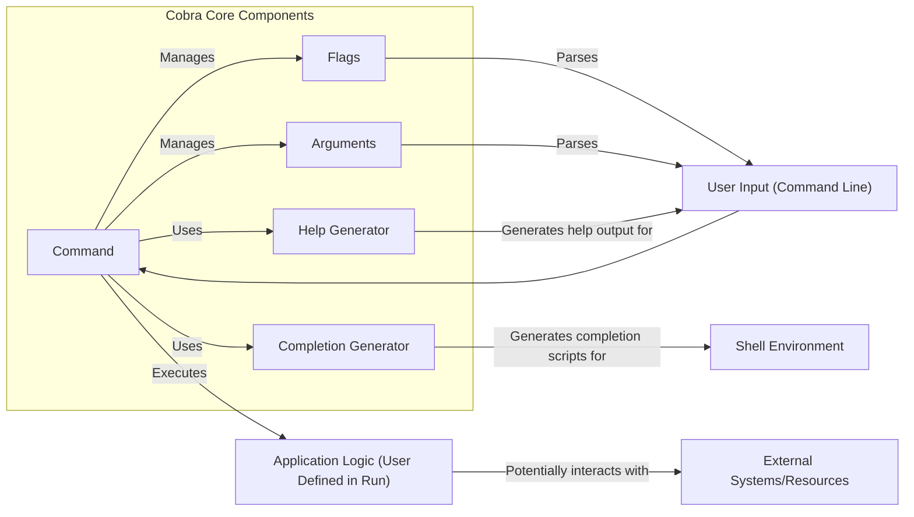
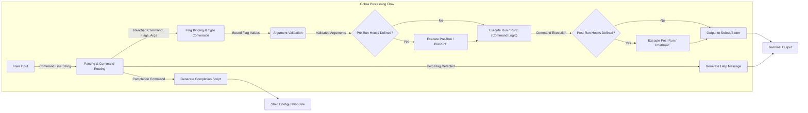

## Project Design Document: Cobra CLI Library - Improved

**Document Version:** 1.1
**Date:** October 26, 2023
**Author:** Gemini (AI Language Model)

### 1. Introduction

This document provides an enhanced design overview of the Cobra CLI library (as of the time of my last training data), as found at [https://github.com/spf13/cobra](https://github.com/spf13/cobra). This document is intended to serve as a robust foundation for future threat modeling activities. It offers a more detailed outline of the key components, architecture, and data flow within the library, aiming for greater clarity and comprehensiveness.

### 2. Project Overview

Cobra is a widely adopted Go library designed to streamline the creation of sophisticated and user-friendly CLI (Command Line Interface) applications. Its modular design and feature-rich API have made it a cornerstone for numerous prominent Go projects, including Kubernetes, Hugo, and Docker. Key functionalities provided by Cobra include:

*   **Hierarchical Command Structure:** Enables the organization of commands into logical groupings using subcommands, enhancing usability and maintainability.
*   **Flexible Flag Handling:**  Supports the definition of various types of options and parameters (flags) for commands, allowing for customization of command behavior.
*   **Positional Argument Management:** Facilitates the definition and validation of positional arguments required by commands.
*   **Automated Help Generation:**  Dynamically generates comprehensive help messages based on the defined command structure, flags, and arguments, improving the user experience.
*   **Shell Completion Integration:**  Provides mechanisms to generate shell auto-completion scripts, significantly enhancing the user's command-line interaction.
*   **Robust Error Management:** Offers structured approaches for handling errors encountered during command execution, contributing to application stability.
*   **Command Lifecycle Hooks:**  Allows developers to inject custom logic at various stages of command execution (pre-run, post-run), providing extensibility.

The primary objective of Cobra is to abstract away the complexities of CLI parsing and structure management, allowing developers to focus on the core logic of their command-line tools.

### 3. System Architecture

Cobra's architecture is centered around the `Command` object, which serves as the fundamental unit for defining commands and their associated behaviors.

*   **`Command` Object:** The core component representing a command or a group of commands. Key attributes and functionalities include:
    *   `Use`: A string defining the command's invocation syntax (e.g., `"mycli server start"`).
    *   `Short Description`: A concise, one-line summary of the command's purpose.
    *   `Long Description`: A more detailed explanation of the command's functionality and usage.
    *   `Run Function`: The primary function (`func(cmd *Command, args []string)`) executed when the command is invoked. This function contains the core application logic for the command.
    *   `Args Specification`: Defines the expected positional arguments, including validation rules.
    *   `Flags Set`: A collection of `Flag` objects specific to this command.
    *   `Subcommands List`: A collection of child `Command` objects, forming the command hierarchy.
    *   `Persistent Flags Set`: Flags that are inherited by all subcommands of this command.
    *   Lifecycle Hooks:
        *   `PreRun(cmd *Command, args []string)`: Function executed before the `Run` function, without error handling.
        *   `PreRunE(cmd *Command, args []string) error`: Function executed before the `Run` function, allowing for error return.
        *   `RunE(cmd *Command, args []string) error`: Function executed when the command is invoked, allowing for error return.
        *   `PostRun(cmd *Command, args []string)`: Function executed after the `Run` function, without error handling.
        *   `PostRunE(cmd *Command, args []string) error`: Function executed after the `Run` function, allowing for error return.
*   **`Flags` (Flag Sets):**  Containers for defining command-line flags. Each flag has:
    *   A name (e.g., `"port"`).
    *   A shorthand (optional, e.g., `"p"`).
    *   A default value.
    *   A data type (string, bool, int, etc.).
    *   Help text.
*   **`Arguments` Specification:** Defines the expected positional arguments for a command, including:
    *   The number of expected arguments.
    *   Custom validation functions.
*   **`Help` Generator:**  A component responsible for dynamically creating help messages based on the `Command` structure, flag definitions, and argument specifications.
*   **`Completion` Generator:**  A component that generates shell-specific completion scripts based on the defined commands and flags. This often involves creating scripts for bash, zsh, fish, etc.
*   **`Command Tree`:** The hierarchical structure formed by linking `Command` objects through the `Commands` attribute. This tree represents the organization of the CLI application.

### 4. Data Flow

The typical sequence of operations within a Cobra-based CLI application follows these steps:

1. **User Input:** The user enters a command-line string into their shell.
2. **Parsing and Routing:** Cobra's core logic parses the input string, identifying the intended command, flags, and arguments. It then traverses the `Command Tree` to locate the matching `Command` object.
3. **Flag Binding:**  Values provided for flags in the command line are bound to the corresponding flag variables defined within the identified `Command` and its ancestors (for persistent flags). Cobra handles type conversion and default value assignment.
4. **Argument Validation:** Positional arguments provided by the user are validated against the `Args` specification of the matched `Command`. This may involve checking the number of arguments or applying custom validation logic.
5. **Pre-Run Hooks Execution:** If defined, `PreRun` or `PreRunE` functions associated with the matched `Command` are executed. These hooks allow for actions to be performed before the main command logic, such as setup or authorization checks.
6. **Command Logic Execution:** The `Run` or `RunE` function of the matched `Command` is invoked. This is where the core functionality of the command is implemented by the application developer.
7. **Post-Run Hooks Execution:** If defined, `PostRun` or `PostRunE` functions associated with the matched `Command` are executed after the `Run` function completes. These hooks can be used for cleanup or logging.
8. **Output Generation:** The application logic within the `Run` function typically generates output, which is then directed to the standard output (stdout) or standard error (stderr) streams.
9. **Help Generation (On Demand):** If the user provides a `--help` flag or an invalid command, Cobra's `Help Generator` creates and displays a help message based on the current command context.
10. **Completion Generation (On Demand):** When requested (often through a specific command like `mycli completion bash`), Cobra's `Completion Generator` produces shell-specific completion scripts that can be sourced by the user's shell.

### 5. Key Interactions and Dependencies

Cobra's operation involves interactions with several external components:

*   **Operating System (OS):** Cobra relies on the OS for fundamental functionalities such as:
    *   Receiving command-line input.
    *   Accessing environment variables (often used for configuration).
    *   Interacting with the file system (potentially for reading configuration files or writing output).
    *   Managing standard input, standard output, and standard error streams.
*   **User Input:**  The primary source of data for Cobra is the command-line input provided by the user. This input dictates the command to be executed and any associated flags or arguments.
*   **Shell Environment:** Cobra integrates with various shell environments (bash, zsh, fish, PowerShell) to provide command completion functionality. This involves generating shell-specific scripts that are interpreted by the shell.
*   **Application Logic:**  The core functionality of a Cobra-based CLI application resides within the `Run` or `RunE` functions defined by the developer. Cobra acts as a framework for structuring and invoking this logic.
*   **External Libraries (Indirect):** While Cobra has minimal direct dependencies, applications built with Cobra often utilize other Go libraries for tasks such as:
    *   **Configuration Management (e.g., Viper, Cobra's PFlags):**  For loading and managing application configuration.
    *   **Logging:** For recording application events and errors.
    *   **Networking:** For applications that interact with network services.
    *   **Data Serialization (e.g., JSON, YAML):** For handling data input and output.

### 6. Security Considerations (More Detailed)

When considering the security of Cobra-based applications, several potential areas of concern arise:

*   **Command Injection Vulnerabilities:** If user-supplied input (arguments or flag values) is directly incorporated into shell commands executed by the application without proper sanitization or escaping, it can lead to command injection. Attackers could inject arbitrary commands into the executed shell.
    *   **Example:**  A flag intended for a filename could be crafted to include shell commands, leading to unintended execution.
*   **Insecure Default Values and Configurations:**  Default flag values or configuration settings that expose sensitive information, allow unintended actions, or weaken security can be exploited.
    *   **Example:** A default port being set to a well-known vulnerable service port.
*   **Information Disclosure through Verbose Output:**  Excessively detailed error messages, help output, or logging can reveal sensitive information about the application's internal workings, file paths, or environment, aiding attackers.
    *   **Example:** Stack traces revealing internal implementation details.
*   **Dependency Chain Vulnerabilities:** While Cobra itself may be secure, vulnerabilities in the external Go libraries used by the application can introduce security risks. Careful dependency management and regular updates are crucial.
    *   **Example:** A vulnerable version of a logging library allowing arbitrary code execution.
*   **Configuration File Vulnerabilities:** If Cobra applications rely on configuration files, vulnerabilities can arise from:
    *   **Insecure file permissions:** Allowing unauthorized modification of configuration.
    *   **Injection vulnerabilities in configuration parsing:** If the parsing library is flawed.
    *   **Storing sensitive information in plaintext:** Within the configuration file.
*   **Denial of Service (DoS) Attacks:**  Maliciously crafted input, particularly large or complex arguments or flag values, could potentially consume excessive resources (CPU, memory), leading to a denial of service.
    *   **Example:** Providing an extremely long string as an argument that causes excessive processing.
*   **Argument and Flag Parsing Exploits:** Although less common due to Cobra's maturity, potential vulnerabilities could exist in the library's parsing logic itself, allowing attackers to bypass security checks or cause unexpected behavior.
*   **Race Conditions in Concurrent Operations:** If the application logic within the `Run` function involves concurrent operations, race conditions could introduce security vulnerabilities if not handled correctly.

### 7. Threat Modeling Scope

The primary focus of threat modeling for Cobra should encompass:

*   **Cobra's Core Parsing and Command Resolution Logic:**  Analyzing how Cobra interprets user input and maps it to commands and actions.
*   **Interaction with User-Provided Input:**  Scrutinizing the mechanisms for handling command-line arguments and flag values, identifying potential injection points.
*   **Flag and Argument Definition and Handling:**  Examining how flags and arguments are defined, validated, and accessed within the application.
*   **Interface Between Cobra and Application Logic:**  Analyzing the interaction between Cobra's framework and the user-defined code within the `Run` functions, looking for opportunities for exploitation.
*   **Help and Completion Script Generation:**  Assessing the security implications of the generated help messages and completion scripts.

**Specifically excluded from this initial threat modeling scope:**

*   Security vulnerabilities residing solely within the application-specific logic implemented within the `Run` functions (unless directly related to Cobra's interaction).
*   Vulnerabilities present in external Go libraries used by the application, unless they directly impact Cobra's functionality or interaction.
*   Operating system-level security concerns that are not directly influenced by Cobra.

### 8. Assumptions and Constraints

*   This design document is based on publicly available information and the understanding of Cobra's functionality as of my last training data. Specific implementation details and newer features might not be fully captured.
*   The security considerations outlined are intended to be comprehensive but may not cover all potential vulnerabilities. A thorough security audit is recommended.
*   The primary focus is on the security of the Cobra library itself and the immediate interactions it manages, not the broader security posture of applications built using it.

This improved design document provides a more detailed and nuanced understanding of the Cobra CLI library, serving as a more robust foundation for subsequent threat modeling activities. The enhanced descriptions and diagrams should facilitate a more thorough and effective security analysis.