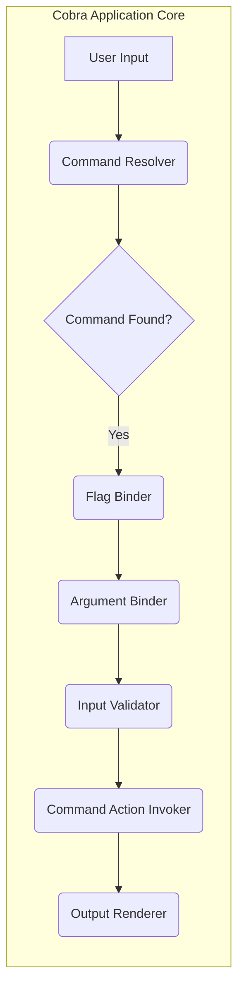
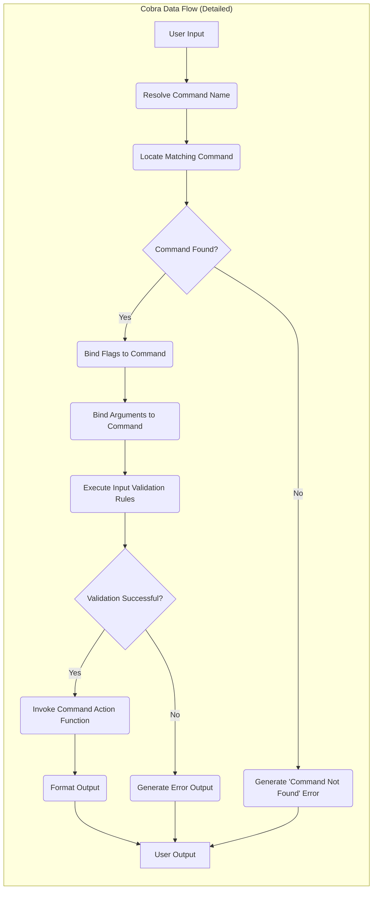
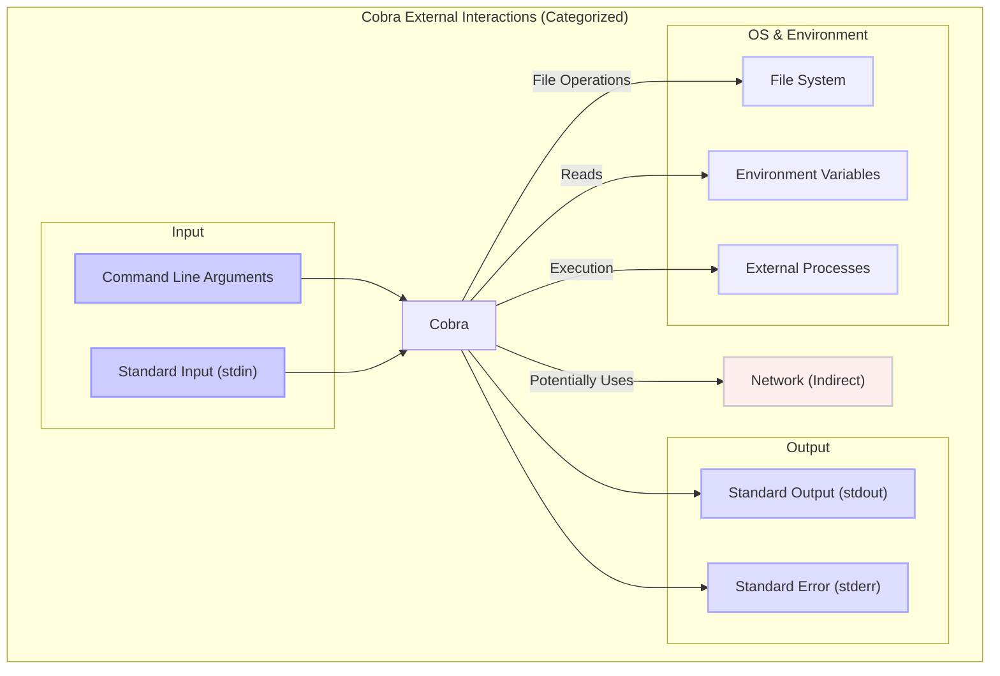

## Project Design Document: Cobra CLI Library (Improved)

**1. Introduction**

This document provides an enhanced design overview of the Cobra library, a widely adopted Go library for building modern command-line interface (CLI) applications. This detailed design aims to clearly articulate the architectural elements, data flow mechanisms, and external interaction points of Cobra, specifically to facilitate a comprehensive threat modeling exercise.

**2. Goals and Objectives**

Cobra's primary objective is to streamline the development of robust and user-friendly CLIs by offering a structured framework for defining commands, flags, and arguments. Key goals include:

*   Providing an expressive and intuitive API for structuring CLI applications.
*   Automating common CLI functionalities such as argument parsing, flag handling, and help text generation.
*   Enabling the creation of hierarchical command structures for complex applications.
*   Supporting diverse output formats and customization options.
*   Promoting testability and maintainability of CLI applications through its structured approach.

**3. Architectural Overview**

The core of Cobra's architecture revolves around the `Command` object. These objects serve as the fundamental building blocks, representing individual commands or logical groupings of commands within the CLI application. Cobra facilitates the creation of command trees, associating flags and arguments with specific commands, and orchestrating the execution of the appropriate logic when a command is invoked.

**4. Data Flow (Detailed)**

The data flow within a Cobra application involves a series of well-defined stages:

*   **User Input:** The user interacts with the CLI application by providing input through the command line interface. This input string contains the command name, flags, and arguments.
*   **Command Resolver:** This component analyzes the user input string to identify the intended command. It traverses the defined command hierarchy, matching the input against registered command names.
*   **Command Found Check:** A decision point to determine if the provided command name matches a registered command within the application's structure. If no match is found, an error is typically generated (e.g., "unknown command").
*   **Flag Binder:** Once a command is identified, the flag binder processes the flags provided in the user input. It matches the provided flags against the flags defined for the specific command and stores their values.
*   **Argument Binder:**  Similarly, the argument binder extracts and associates the positional arguments from the user input with the parameters expected by the invoked command.
*   **Input Validator:** This stage executes any custom validation logic defined by the application developer. This can involve checking the validity of flag values, argument types, or ensuring required parameters are present.
*   **Command Action Invoker:**  The core logic of the invoked command is executed. This involves calling the function or method associated with the command, passing the bound flag and argument values as parameters.
*   **Output Renderer:** The result of the command action is processed and formatted for presentation to the user. This might involve displaying text, tables, or other structured output.

**5. Key Components (Detailed)**

*   **`Command` Struct:** The central data structure in Cobra. Each `Command` instance encapsulates the definition and behavior of a specific command. Key attributes include:
    *   `Use`:  The command's name (used in the command line). *Security Relevance:*  Careless naming or lack of input validation on command names could potentially lead to confusion or unexpected behavior if dynamically generated.
    *   `Short`: A concise description of the command.
    *   `Long`: A more elaborate description of the command.
    *   `Run`, `RunE`, `RunC`: Functions executed when the command is invoked. These contain the core logic. *Security Relevance:* This is where the primary action of the command occurs, making it a critical point for security considerations like input validation and secure coding practices.
    *   `Flags`: A collection of `Flag` objects associated with the command. *Security Relevance:* Improperly defined or parsed flags can be a source of vulnerabilities, allowing users to manipulate application behavior in unintended ways.
    *   `Args`: Defines the expected arguments for the command, including validation rules. *Security Relevance:*  Insufficient argument validation can lead to issues like buffer overflows or incorrect data processing.
    *   `Commands`: A slice of subcommands, enabling hierarchical command structures.
*   **`Flag` Struct:** Represents a command-line flag (option). Attributes include name, shorthand, value type, and default value. *Security Relevance:*  Flags that accept file paths or URLs without proper validation can be exploited for path traversal or server-side request forgery (SSRF) attacks.
*   **`FlagSet`:** A collection of `Flag` objects associated with a specific command. Provides methods for parsing and accessing flag values.
*   **`Argument Validation`:** Cobra provides mechanisms for defining argument validation rules (e.g., requiring a certain number of arguments). Developers can also implement custom validation logic. *Security Relevance:* Robust argument validation is crucial to prevent unexpected input from causing errors or security vulnerabilities.
*   **`HelpFunc`:**  A function responsible for generating help messages for commands and flags. *Security Relevance:* While not directly a security vulnerability, poorly formatted or overly verbose help messages could inadvertently disclose sensitive information.
*   **`Completion`:**  Features for generating shell completion scripts. *Security Relevance:*  While primarily a usability feature, vulnerabilities in the completion generation logic could potentially be exploited in certain scenarios.

**6. External Interactions (Categorized)**

Cobra applications interact with the external environment through various channels:

*   **User Input:**
    *   **Command Line Arguments:** The primary means of interaction, providing command names, flags, and arguments. *Security Relevance:* This is the most direct attack surface, requiring careful parsing and validation of all input.
    *   **Standard Input (stdin):** Commands can optionally read data from stdin. *Security Relevance:*  Similar to command-line arguments, data from stdin should be treated as untrusted and validated.
*   **Output:**
    *   **Standard Output (stdout):** The primary channel for displaying normal command output. *Security Relevance:*  Ensure sensitive information is not inadvertently printed to stdout.
    *   **Standard Error (stderr):** Used for displaying error messages and diagnostics. *Security Relevance:*  Avoid disclosing excessive technical details or internal paths in error messages.
*   **Operating System and Environment:**
    *   **File System:** Commands may interact with the file system to read, write, or manipulate files. *Security Relevance:* File system operations are a common target for attacks like path traversal and unauthorized access.
    *   **Environment Variables:** Commands can access environment variables. *Security Relevance:* Be cautious about relying on environment variables for security-sensitive information, as they can be manipulated.
    *   **External Processes:** Commands can execute other processes. *Security Relevance:*  Executing external processes based on user input without proper sanitization can lead to command injection vulnerabilities.
*   **Network (Indirectly):**
    *   While Cobra itself doesn't handle networking, commands built with Cobra might make network requests. *Security Relevance:* If commands make network requests, standard network security considerations (e.g., TLS, input validation on URLs) apply.

**7. Security Considerations (Detailed for Threat Modeling)**

This section expands on potential security concerns, providing more specific examples and categorizations relevant for threat modeling:

*   **Input Validation Failures:**
    *   **Command Injection:**  Insufficient sanitization of user input used in shell commands. *Example:* A command that allows users to specify a filename that is then passed directly to a shell command like `cat`.
    *   **Path Traversal:**  Lack of validation on file paths provided by users, allowing access to arbitrary files. *Example:* A command that takes a `--file` flag and reads the contents of the specified file without checking if the path is within an allowed directory.
    *   **Argument Injection:**  Manipulating arguments to cause unexpected behavior in the command's logic. *Example:* Providing a negative number for an argument that is expected to be a positive integer, leading to an error or unexpected calculation.
*   **Output Handling Issues:**
    *   **Information Disclosure:**  Including sensitive data (e.g., API keys, internal paths) in error messages or verbose output.
    *   **Cross-Site Scripting (in CLI output, though less common):** If CLI output is rendered in a web context, vulnerabilities could arise if user input is not properly escaped.
*   **Logic and Design Flaws:**
    *   **Insecure Defaults:**  Default configurations that are not secure (e.g., allowing insecure network connections by default).
    *   **Race Conditions:**  If the command's action involves concurrent operations, race conditions could lead to inconsistent state or security vulnerabilities.
    *   **Denial of Service (DoS):**  Maliciously crafted input that causes excessive resource consumption (CPU, memory). *Example:* Providing an extremely large number as an argument that leads to a memory allocation issue.
*   **Dependency Management:**
    *   **Vulnerable Dependencies:**  Using outdated or vulnerable versions of Cobra's dependencies.
*   **Authentication and Authorization (if implemented within the Cobra application):**
    *   **Missing or Weak Authentication:**  Lack of proper mechanisms to verify the identity of the user.
    *   **Insufficient Authorization:**  Users being able to perform actions they are not permitted to.

**8. Diagrams**

The diagrams provided in sections 3 and 4 visually represent the architectural overview and detailed data flow within a Cobra application.

**9. Conclusion**

This improved design document offers a more granular and detailed understanding of the Cobra CLI library's architecture, data flow, and external interactions. By explicitly highlighting potential security concerns within the description of each component and interaction point, this document provides a stronger foundation for conducting a comprehensive and effective threat modeling exercise. The categorized security considerations offer a structured approach to identifying and mitigating potential vulnerabilities in applications built using the Cobra framework.