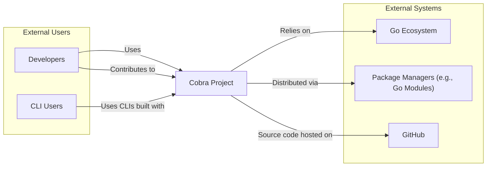
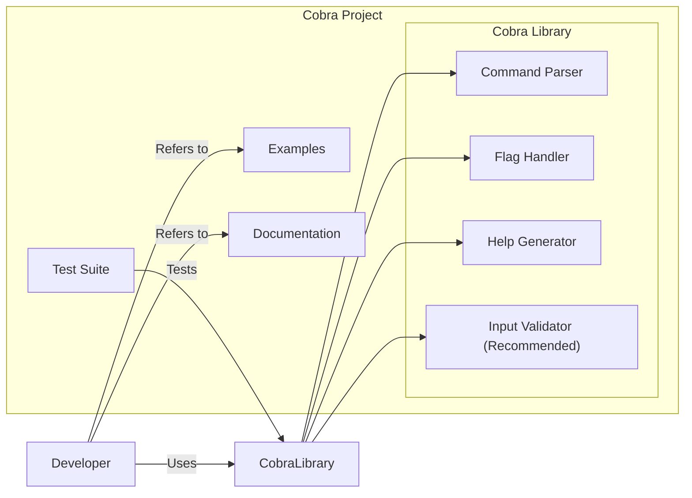

# BUSINESS POSTURE

This project, Cobra, aims to provide a library for creating powerful modern command-line interfaces (CLIs) in Go. The primary business priority is to empower developers to build user-friendly and robust CLIs quickly and efficiently. The goal is to increase developer productivity and promote best practices in CLI development within the Go ecosystem.

Key business risks associated with this project include:
- Risk of vulnerabilities in the Cobra library itself, which could be inherited by all CLIs built using it.
- Risk of developers misusing Cobra features, leading to insecure CLIs.
- Risk of poor documentation or examples that could lead to developers implementing insecure patterns.
- Risk of the library becoming unmaintained or outdated, hindering developers and potentially introducing security issues over time.

# SECURITY POSTURE

Existing security controls:
- security control: Open Source project with public code repository on GitHub. This allows for community review and scrutiny of the codebase. Implemented: GitHub repository.
- security control: Written in Go, a memory-safe language that reduces the risk of certain classes of vulnerabilities like buffer overflows. Implemented: Language choice.
- security control: Includes a test suite to ensure functionality and potentially catch regressions. Implemented: Test directory in the repository.
- security control: Uses GitHub Actions for Continuous Integration (CI), which can be used to automate testing and potentially security checks. Implemented: `.github/workflows` directory.

Accepted risks:
- accepted risk: Reliance on community contributions for security vulnerability identification and patching.
- accepted risk: Potential for vulnerabilities to exist in dependencies used by Cobra.
- accepted risk: Risk of developers building insecure CLIs using Cobra despite the framework itself being secure.

Recommended security controls:
- recommended security control: Implement automated dependency scanning to identify vulnerabilities in Cobra's dependencies.
- recommended security control: Integrate static analysis security testing (SAST) tools into the CI pipeline to automatically detect potential code-level vulnerabilities.
- recommended security control: Conduct periodic security audits or penetration testing of Cobra to proactively identify and address security weaknesses.
- recommended security control: Provide secure coding guidelines and examples specifically for developers using Cobra to build CLIs, focusing on common CLI security pitfalls.

Security requirements:
- Authentication: While Cobra itself doesn't handle authentication, CLIs built with Cobra often need to authenticate users or services. Cobra should provide mechanisms or guidance to facilitate secure authentication implementation in CLIs.
- Authorization: Similarly, CLIs need to implement authorization to control access to commands and resources. Cobra should enable developers to easily integrate authorization logic into their CLIs.
- Input validation: CLIs are inherently exposed to user input, making input validation critical. Cobra must encourage and facilitate robust input validation to prevent injection attacks and other input-related vulnerabilities.
- Cryptography: If CLIs built with Cobra need to handle sensitive data, cryptographic operations are essential. Cobra should not hinder the use of cryptography and ideally provide utilities or best practice guidance for secure cryptographic implementation within CLIs.

# DESIGN

## C4 CONTEXT



Elements of Context Diagram:

- Name: Cobra Project
  - Type: Software System
  - Description: The Cobra library for building command-line interfaces in Go.
  - Responsibilities: Provides a framework for developers to create structured, user-friendly, and powerful CLIs. Handles command parsing, flag handling, and help generation.
  - Security controls: Code review, testing, open source visibility.

- Name: Developers
  - Type: Person
  - Description: Software engineers who use Cobra to build command-line tools.
  - Responsibilities: Utilize Cobra to create CLIs, follow best practices, and potentially contribute to the Cobra project.
  - Security controls: Secure development practices, input validation in CLIs they build.

- Name: CLI Users
  - Type: Person
  - Description: End-users who interact with command-line tools built using Cobra.
  - Responsibilities: Use CLIs for intended purposes, provide feedback, and report issues.
  - Security controls: Principle of least privilege when using CLIs, awareness of potential CLI security risks.

- Name: Go Ecosystem
  - Type: External System
  - Description: The Go programming language environment, including standard libraries and tooling.
  - Responsibilities: Provides the foundation for Cobra to be built and run.
  - Security controls: Go language security features, Go security team's vulnerability management.

- Name: Package Managers (e.g., Go Modules)
  - Type: External System
  - Description: Tools used to manage Go dependencies and distribute Go packages like Cobra.
  - Responsibilities: Facilitate the distribution and installation of Cobra for developers.
  - Security controls: Package integrity checks, vulnerability scanning of package repositories.

- Name: GitHub
  - Type: External System
  - Description: Platform hosting the Cobra source code repository, issue tracking, and CI/CD.
  - Responsibilities: Provides infrastructure for Cobra development, collaboration, and release management.
  - Security controls: GitHub's security features, access controls, audit logs.

## C4 CONTAINER



Elements of Container Diagram:

- Name: Cobra Library
  - Type: Container (Go Library)
  - Description: The core Cobra library providing the functionality for building CLIs.
  - Responsibilities: Command parsing, flag handling, help text generation, and potentially input validation utilities.
  - Security controls: Code review, unit testing, static analysis, dependency scanning.

- Name: Command Parser
  - Type: Component (within Cobra Library)
  - Description: Responsible for parsing user input from the command line and identifying the command and arguments.
  - Responsibilities: Accurately and securely parse command-line input.
  - Security controls: Input validation, error handling, prevention of command injection vulnerabilities.

- Name: Flag Handler
  - Type: Component (within Cobra Library)
  - Description: Manages command-line flags and options, parsing and validating their values.
  - Responsibilities: Securely handle and validate flag inputs.
  - Security controls: Input validation, type checking, preventing flag injection vulnerabilities.

- Name: Help Generator
  - Type: Component (within Cobra Library)
  - Description: Generates help text for commands and flags, improving CLI usability.
  - Responsibilities: Provide accurate and helpful documentation.
  - Security controls: Ensure help text doesn't inadvertently expose sensitive information.

- Name: Input Validator (Recommended)
  - Type: Component (within Cobra Library - potentially to be enhanced)
  - Description:  A component or set of utilities to assist developers in implementing input validation within their Cobra-based CLIs.
  - Responsibilities: Provide reusable input validation functions and guidance.
  - Security controls: Input validation libraries, secure coding examples, documentation on validation best practices.

- Name: Examples
  - Type: Container (Code Examples)
  - Description: Demonstrative code snippets and full examples showcasing how to use Cobra effectively.
  - Responsibilities: Provide practical guidance and best practices for using Cobra.
  - Security controls: Secure coding practices in examples, avoid showcasing insecure patterns.

- Name: Documentation
  - Type: Container (Documentation Files)
  - Description: Comprehensive documentation explaining Cobra's features, usage, and best practices.
  - Responsibilities: Provide clear, accurate, and up-to-date documentation.
  - Security controls: Review documentation for security accuracy, include security considerations and best practices.

- Name: Test Suite
  - Type: Container (Automated Tests)
  - Description: A collection of unit and integration tests to ensure the quality and correctness of the Cobra library.
  - Responsibilities: Verify Cobra functionality and prevent regressions.
  - Security controls: Test cases covering security-relevant scenarios, automated execution in CI.

## DEPLOYMENT

Cobra itself is a library and is not deployed as a standalone application. Deployment in the context of Cobra refers to the deployment of CLIs built using the Cobra library. A common deployment approach for Go CLIs is to distribute them as standalone, statically linked binaries.

Deployment Diagram (Example for a CLI built with Cobra):

```mermaid
flowchart LR
    subgraph User's Machine [User's Machine]
        CLIApplication["CLI Application (Binary)"]
    end
    subgraph Distribution Platform [Distribution Platform (e.g., GitHub Releases, Package Repository)]
        BinaryArtifact["CLI Binary Artifact"]
    end

    DeveloperMachine["Developer Machine"] -->|Builds| BinaryArtifact
    DistributionPlatform -->|Downloads| CLIApplication
    CLIUser["CLI User"] -->|Executes| CLIApplication
```

Elements of Deployment Diagram:

- Name: CLI Application (Binary)
  - Type: Software Instance (Binary Executable)
  - Description: The compiled binary executable of a CLI application built using Cobra, running on a user's machine.
  - Responsibilities: Execute CLI commands, interact with the user, and perform the intended functions of the CLI.
  - Security controls: Operating system security controls, user permissions, input validation within the CLI application.

- Name: Binary Artifact
  - Type: File (Binary File)
  - Description: The compiled binary file of the CLI application, ready for distribution.
  - Responsibilities: Be a distributable package of the CLI application.
  - Security controls: Code signing, checksum verification, secure storage on distribution platform.

- Name: Distribution Platform (e.g., GitHub Releases, Package Repository)
  - Type: Infrastructure (File Hosting/Package Repository)
  - Description: A platform used to host and distribute the CLI binary artifacts to users.
  - Responsibilities: Securely host and distribute CLI binaries, provide download mechanisms.
  - Security controls: Platform security controls, access controls, malware scanning, HTTPS for downloads.

- Name: Developer Machine
  - Type: Infrastructure (Developer's Computer)
  - Description: The development environment where the CLI application is built and compiled.
  - Responsibilities: Used to develop, build, and test the CLI application.
  - Security controls: Developer machine security practices, secure build environment, code signing keys management.

- Name: CLI User
  - Type: Person
  - Description: End-user who downloads and executes the CLI application.
  - Responsibilities: Download and execute the CLI application for its intended purpose.
  - Security controls: User awareness of download sources, antivirus software, operating system security.

## BUILD

Build Process Diagram:

```mermaid
flowchart LR
    subgraph Developer Environment [Developer Environment]
        Developer["Developer"]
        SourceCode["Source Code (Go)"]
    end
    subgraph CI/CD Pipeline [CI/CD Pipeline (GitHub Actions)]
        CodeRepository["Code Repository (GitHub)"]
        BuildServer["Build Server (GitHub Actions Runner)"]
        TestRunner["Test Runner"]
        SASTScanner["SAST Scanner (e.g., GoSec)"]
        DependencyScanner["Dependency Scanner (e.g., GoVulnCheck)"]
        ArtifactStorage["Artifact Storage"]
    end

    Developer -->|Writes Code| SourceCode
    SourceCode --> CodeRepository
    CodeRepository --> BuildServer
    BuildServer -->|Compiles| BinaryArtifacts["Binary Artifacts"]
    BuildServer --> TestRunner
    BuildServer --> SASTScanner
    BuildServer --> DependencyScanner
    TestRunner -->|Runs Tests| BuildServer
    SASTScanner -->|Scans Code| BuildServer
    DependencyScanner -->|Scans Dependencies| BuildServer
    BinaryArtifacts --> ArtifactStorage
    ArtifactStorage --> DistributionPlatform["Distribution Platform"]
```

Build Process Description:

1. Developer writes code in their local development environment.
2. Source code is committed and pushed to the Code Repository (GitHub).
3. CI/CD Pipeline (GitHub Actions) is triggered upon code changes.
4. Build Server (GitHub Actions Runner) retrieves the source code.
5. Build Server compiles the Go code into Binary Artifacts.
6. Test Runner executes automated tests to verify functionality.
7. SAST Scanner performs static analysis security testing on the code.
8. Dependency Scanner checks for vulnerabilities in project dependencies.
9. Binary Artifacts are stored in Artifact Storage.
10. Artifacts are then released to the Distribution Platform for users to download.

Security Controls in Build Process:

- security control: Automated build process using CI/CD (GitHub Actions) to ensure consistent and repeatable builds. Implemented: GitHub Actions workflows.
- security control: Source code hosted on a version control system (GitHub) for traceability and integrity. Implemented: GitHub repository.
- security control: Automated testing (Test Runner) to catch functional and regression issues early in the development cycle. Implemented: Test suite and CI integration.
- security control: Static Analysis Security Testing (SAST Scanner - e.g., GoSec) integrated into the CI pipeline to identify potential code-level vulnerabilities. Recommended: Implement in CI.
- security control: Dependency Scanning (Dependency Scanner - e.g., GoVulnCheck) to detect known vulnerabilities in dependencies. Recommended: Implement in CI.
- security control: Artifact Storage to securely store build artifacts. Implemented: GitHub Actions artifacts or external storage.
- security control: Code signing of binary artifacts before distribution to ensure integrity and authenticity. Recommended: Implement for releases.

# RISK ASSESSMENT

Critical business process we are trying to protect: Secure development and distribution of command-line tools within the Go ecosystem. Ensuring that CLIs built with Cobra are robust, reliable, and do not introduce security vulnerabilities to users.

Data we are trying to protect and their sensitivity:
- Integrity of the Cobra library code: High sensitivity. Compromised code could lead to widespread vulnerabilities in all CLIs built with Cobra.
- Availability of the Cobra library: Medium sensitivity. Downtime or unavailability would hinder developers but not directly cause immediate harm.
- Confidentiality of Cobra's development process (less relevant for open source): Low sensitivity. As an open-source project, confidentiality is not a primary concern.
- Integrity of CLIs built with Cobra: High sensitivity. Vulnerabilities in generated CLIs can directly impact users and systems they interact with.

# QUESTIONS & ASSUMPTIONS

Questions:
- What is the intended audience for CLIs built with Cobra? (Internal tools, public utilities, etc.) - Assumption: Broad audience, including both internal and public facing CLIs.
- What are the typical use cases for CLIs built with Cobra? (System administration, data processing, application control, etc.) - Assumption: Diverse use cases, requiring flexibility and security.
- Are there any specific security compliance requirements for projects using Cobra? (e.g., SOC 2, PCI DSS) - Assumption: No specific compliance mentioned, but general security best practices are expected.
- What is the process for reporting and handling security vulnerabilities in Cobra? - Assumption: Standard open-source vulnerability reporting process via GitHub issues or security channels.

Assumptions:
- BUSINESS POSTURE: Primary goal is developer productivity and wide adoption of Cobra for building CLIs. Security is a secondary but important consideration.
- SECURITY POSTURE: Current security posture relies on open-source community review and Go language security. There is room for improvement in automated security checks and proactive security measures.
- DESIGN: Cobra follows a modular design with components for parsing, handling flags, and generating help. Deployment of Cobra-based CLIs is typically as standalone binaries. Build process involves standard Go tooling and can be enhanced with security checks in CI.