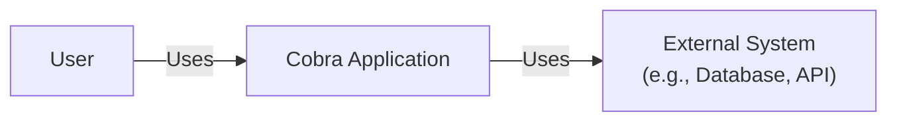
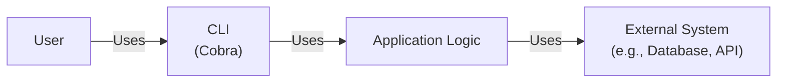
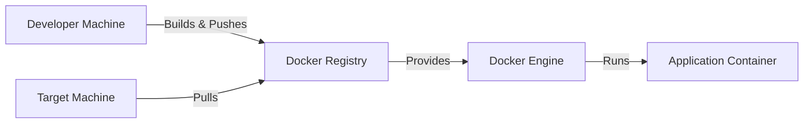
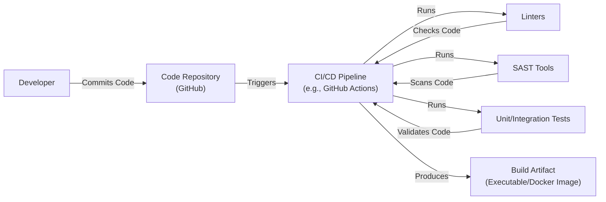

# BUSINESS POSTURE

Business Priorities and Goals:

*   Provide a robust and user-friendly command-line interface (CLI) library for Go applications.
*   Simplify the creation of complex CLI applications with features like command nesting, flag parsing, and help generation.
*   Offer a consistent and well-documented API for developers to build upon.
*   Maintain a high level of code quality and test coverage.
*   Foster a vibrant open-source community around the project.
*   Ensure long-term maintainability and evolution of the library.

Business Risks:

*   Inconsistent CLI behavior across different operating systems or environments could lead to user confusion and frustration.
*   Vulnerabilities in the library could be exploited by malicious actors to compromise applications that use Cobra.
*   Lack of proper documentation or support could hinder adoption and usage.
*   Failure to keep up with evolving Go language features and best practices could lead to obsolescence.
*   Insufficient testing could result in undetected bugs and regressions.

# SECURITY POSTURE

Existing Security Controls:

*   security control: Code Reviews: The project likely uses pull requests and code reviews on GitHub to ensure code quality and identify potential security issues. (Described in GitHub repository's contribution guidelines and pull request process).
*   security control: Testing: The project has a comprehensive test suite to ensure functionality and prevent regressions. (Described in the GitHub repository's test files and CI configuration).
*   security control: Static Analysis: The project may use static analysis tools to identify potential code quality and security issues. (Implicitly expected, but not explicitly mentioned in the repository).
*   security control: Dependency Management: The project uses Go modules to manage dependencies, which helps to track and update dependencies, reducing the risk of using vulnerable libraries. (Described in the `go.mod` and `go.sum` files).
*   security control: Issue Tracking: Security vulnerabilities can be reported and tracked using GitHub Issues. (Described in the GitHub repository's issue tracker).

Accepted Risks:

*   accepted risk: The library itself doesn't handle sensitive data directly, but applications built with it might. The security of those applications is the responsibility of the developers using Cobra.
*   accepted risk: While Cobra provides tools for building secure CLIs, it doesn't guarantee the security of the applications built with it. Developers must follow secure coding practices.

Recommended Security Controls:

*   security control: Fuzzing: Implement fuzz testing to discover unexpected inputs that could cause crashes or vulnerabilities.
*   security control: Security Policy: Create a `SECURITY.md` file in the repository to clearly define the process for reporting security vulnerabilities.
*   security control: SAST (Static Application Security Testing): Integrate SAST tools into the CI/CD pipeline to automatically scan for vulnerabilities during development.
*   security control: SCA (Software Composition Analysis): Integrate SCA tools to identify and manage vulnerabilities in third-party dependencies.

Security Requirements:

*   Authentication: Not directly applicable to the Cobra library itself, as it's a tool for building CLIs, not a service requiring authentication. Authentication is the responsibility of applications built using Cobra.
*   Authorization: Not directly applicable to the Cobra library itself. Authorization is the responsibility of applications built using Cobra.
*   Input Validation: Cobra provides mechanisms for defining and validating command-line flags and arguments. It's crucial for applications using Cobra to properly validate all user inputs to prevent injection attacks and other vulnerabilities.
*   Cryptography: Not directly applicable to the Cobra library itself. Cryptographic operations are the responsibility of applications built using Cobra. Cobra doesn't handle encryption or hashing directly.

# DESIGN

## C4 CONTEXT

Context Diagram Element Description:

*   Element:
    *   Name: User
    *   Type: Person
    *   Description: A person who interacts with the Cobra application through the command line.
    *   Responsibilities: Provides input to the application, receives output from the application.
    *   Security controls: None (external to the system).

*   Element:
    *   Name: Cobra Application
    *   Type: Software System
    *   Description: An application built using the Cobra library.
    *   Responsibilities: Processes user commands, interacts with external systems, provides output to the user.
    *   Security controls: Input validation, proper handling of external system interactions.

*   Element:
    *   Name: External System
    *   Type: Software System
    *   Description: Any external system that the Cobra application interacts with, such as a database, API, or file system.
    *   Responsibilities: Varies depending on the specific system.
    *   Security controls: Depends on the specific external system. The Cobra application should use secure communication protocols and authentication mechanisms when interacting with external systems.

## C4 CONTAINER

Container Diagram Element Description:

*   Element:
    *   Name: User
    *   Type: Person
    *   Description: A person who interacts with the Cobra application through the command line.
    *   Responsibilities: Provides input to the application, receives output from the application.
    *   Security controls: None (external to the system).

*   Element:
    *   Name: CLI (Cobra)
    *   Type: Container: Command-Line Interface
    *   Description: The command-line interface of the application, built using the Cobra library.
    *   Responsibilities: Parses user input, validates flags and arguments, dispatches commands to the application logic.
    *   Security controls: Input validation, command whitelisting (if applicable).

*   Element:
    *   Name: Application Logic
    *   Type: Container: Code (Go)
    *   Description: The core logic of the application.
    *   Responsibilities: Executes commands, interacts with external systems, processes data.
    *   Security controls: Secure coding practices, proper handling of external system interactions, data validation.

*   Element:
    *   Name: External System
    *   Type: Software System
    *   Description: Any external system that the application interacts with.
    *   Responsibilities: Varies depending on the specific system.
    *   Security controls: Depends on the specific external system. The application should use secure communication protocols and authentication mechanisms.

## DEPLOYMENT

Deployment Solutions:

1.  Standalone Executable: The Go application built with Cobra is compiled into a single executable file that can be directly executed on the target system.
2.  Containerized Deployment (e.g., Docker): The application is packaged into a Docker container, which can be deployed to any system that supports Docker.
3.  Cloud Platform Deployment (e.g., AWS, GCP, Azure): The application can be deployed to a cloud platform using various services like virtual machines, container services (e.g., ECS, GKE, AKS), or serverless functions.

Chosen Solution (Detailed Description): Containerized Deployment (Docker)

Deployment Diagram Element Description:

*   Element:
    *   Name: Developer Machine
    *   Type: Infrastructure Node: Computer
    *   Description: The machine where the developer builds the application.
    *   Responsibilities: Compiling the Go code, building the Docker image.
    *   Security controls: Developer machine security best practices.

*   Element:
    *   Name: Docker Registry
    *   Type: Infrastructure Node: Container Registry
    *   Description: A registry for storing Docker images (e.g., Docker Hub, private registry).
    *   Responsibilities: Storing and distributing Docker images.
    *   Security controls: Access control, image scanning for vulnerabilities.

*   Element:
    *   Name: Target Machine
    *   Type: Infrastructure Node: Computer/Server
    *   Description: The machine where the application will be deployed.
    *   Responsibilities: Running the Docker Engine.
    *   Security controls: Operating system security, network security.

*   Element:
    *   Name: Docker Engine
    *   Type: Software: Container Runtime
    *   Description: The Docker Engine that runs on the target machine.
    *   Responsibilities: Pulling Docker images, creating and running containers.
    *   Security controls: Docker Engine security best practices, regular updates.

*   Element:
    *   Name: Application Container
    *   Type: Container: Application
    *   Description: The running instance of the application within a Docker container.
    *   Responsibilities: Executing the application logic.
    *   Security controls: Container security best practices, minimal privileges, regular updates.

## BUILD

Build Process Description:

1.  Developer commits code to the GitHub repository.
2.  A CI/CD pipeline (e.g., GitHub Actions) is triggered.
3.  The pipeline runs linters to check code style and quality.
4.  The pipeline runs SAST tools to scan for potential security vulnerabilities.
5.  The pipeline runs unit and integration tests to ensure functionality.
6.  If all checks and tests pass, the pipeline builds the application, producing a build artifact (e.g., a standalone executable or a Docker image).

Security Controls:

*   security control: Code Repository (GitHub): Provides version control, access control, and audit trails.
*   security control: CI/CD Pipeline (GitHub Actions): Automates the build process, ensuring consistency and repeatability.
*   security control: Linters: Enforce code style and identify potential code quality issues.
*   security control: SAST Tools: Scan for potential security vulnerabilities in the code.
*   security control: Unit/Integration Tests: Ensure functionality and prevent regressions.
*   security control: Dependency Management (Go Modules): Tracks and manages dependencies, reducing the risk of using vulnerable libraries.
*   security control: Build Artifact (Executable/Docker Image): The final product of the build process, which should be treated as a trusted artifact.

# RISK ASSESSMENT

Critical Business Processes:

*   Providing a reliable and user-friendly CLI experience for users of applications built with Cobra.
*   Maintaining the integrity and security of the Cobra library itself.
*   Supporting the community of developers who use Cobra.

Data Sensitivity:

*   The Cobra library itself does not handle sensitive data directly. However, applications built with Cobra may handle sensitive data. The sensitivity of that data depends on the specific application.

# QUESTIONS & ASSUMPTIONS

Questions:

*   Are there any specific compliance requirements (e.g., PCI DSS, HIPAA) that applications built with Cobra need to adhere to?
*   What is the expected threat model for applications built with Cobra? (e.g., What types of attackers are likely to target these applications?)
*   What is the process for handling security vulnerabilities discovered in Cobra?
*   Are there any specific performance requirements for Cobra or applications built with it?

Assumptions:

*   BUSINESS POSTURE: The primary goal is to provide a robust and secure CLI library, with a focus on developer experience and community support.
*   SECURITY POSTURE: Developers using Cobra are responsible for the security of their own applications, including input validation, data handling, and interactions with external systems. Cobra provides tools to help with this, but it's not a silver bullet.
*   DESIGN: The design is based on the typical usage of Cobra for building command-line applications in Go. The deployment model assumes a containerized approach using Docker, but other deployment models are possible. The build process assumes the use of a CI/CD pipeline like GitHub Actions.