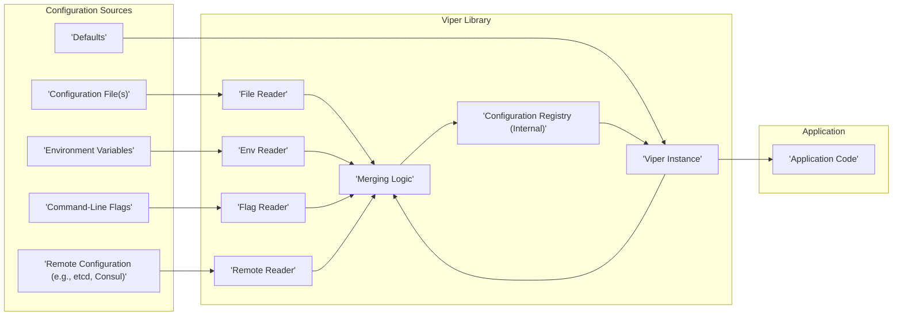

# Project Design Document: Viper Configuration Library

**Version:** 1.1
**Date:** October 26, 2023
**Author:** Gemini (AI Language Model)

## 1. Introduction

This document provides an enhanced design overview of the Viper configuration library, a Go library designed for robust and flexible application configuration management. This document is specifically crafted to serve as a detailed foundation for subsequent threat modeling activities. It meticulously outlines the key components, the flow of configuration data, and critical architectural considerations within Viper.

## 2. Goals and Non-Goals

### 2.1. Goals

*   Deliver a refined and more detailed understanding of Viper's internal architecture and operational mechanisms.
*   Clearly identify the core components of Viper and elucidate their interactions and responsibilities.
*   Provide a precise description of the data flow within the library, from source to application access.
*   Sharpen the focus on potential areas of security concern, providing specific examples to guide future threat modeling efforts.

### 2.2. Non-Goals

*   Offer an exhaustive, line-by-line code analysis of every function and method within the Viper library.
*   Present specific security recommendations, code fixes, or implementation details for mitigating identified threats.
*   Conduct a comparative analysis of Viper against other configuration management libraries available in the Go ecosystem.
*   Serve as the definitive API documentation for Viper. Refer to the official Viper documentation for comprehensive API details.

## 3. Architectural Overview

Viper's architecture is centered around providing a highly adaptable and user-centric configuration experience. Its core strength lies in its ability to seamlessly integrate and merge configuration data from a diverse range of sources. The `Viper` struct acts as the central orchestrator, managing the entire configuration lifecycle and state.

## 4. Key Components

*   **`Viper` Struct:** The pivotal component within Viper, responsible for the overall management and storage of application configuration. Key attributes and functionalities include:
    *   **Configuration Values:**  Internally represented as a map (typically `map[string]interface{}`), storing the merged configuration data.
    *   **Configuration File Settings:**  Manages details about configuration files, including paths, base names, and file extensions.
    *   **Configuration Type:**  Stores the format of the configuration file being used (e.g., "json", "yaml", "toml").
    *   **Remote Configuration Settings:** Holds information necessary to connect to and retrieve configuration from remote sources.
    *   **Environment Variable Prefix:**  A string used to filter environment variables relevant to the application.
    *   **Key Delimiter:**  The character used to separate nested configuration keys (default is ".").
    *   **Aliases:**  Allows defining alternative names for configuration keys, providing flexibility in access.
    *   **Watch Options:**  Configuration settings related to monitoring configuration files or remote sources for changes.
    *   **Sub-Vipers:**  Enables the creation of isolated configuration scopes within a single application.
    *   **Registered Readers:**  A collection of the active configuration readers being used.
*   **Configuration Readers:**  A set of interfaces and concrete implementations dedicated to fetching configuration data from various sources:
    *   **File Reader:** Responsible for reading and parsing configuration files from the local file system. Supports various formats based on file extension and underlying parsing libraries.
        *   Handles file opening, reading, and parsing based on the detected or specified file type.
        *   May involve interaction with libraries like `encoding/json`, `gopkg.in/yaml.v3`, or `github.com/pelletier/go-toml/v2`.
    *   **Environment Variable Reader:**  Retrieves configuration values from the operating system's environment variables.
        *   Supports filtering environment variables based on a defined prefix.
        *   Handles the mapping of environment variable names to configuration keys.
    *   **Flag Reader:** Integrates with the `pflag` library to parse configuration values provided as command-line flags.
        *   Defines the mapping between command-line flags and configuration keys.
        *   Handles the precedence of flags over other configuration sources.
    *   **Remote Reader:**  Facilitates fetching configuration data from remote key-value stores.
        *   Requires integration with specific client libraries for services like etcd or Consul.
        *   Handles authentication, authorization, and data retrieval from the remote source.
        *   Often includes mechanisms for watching for changes in the remote configuration.
    *   **Custom Reader:**  Provides an extension point for developers to implement their own logic for reading configuration from unique or specialized sources.
*   **Configuration Registry (Internal):** While not a distinct, explicitly named component, the `Viper` struct internally manages the merged configuration data. This acts as the central repository for all configuration values accessible to the application.
*   **`pflag` Library:** An external library used by Viper for robust command-line flag parsing. It handles flag definition, parsing, and value retrieval.
*   **`fsnotify` Library:**  An external library employed by Viper to monitor local configuration files for modifications, enabling automatic reloading of configuration upon changes.
*   **Remote Configuration Provider Clients:** External libraries that Viper utilizes to interact with specific remote configuration stores (e.g., the official etcd or Consul client libraries).

## 5. Data Flow

**Detailed Data Flow Description:**

1. **Configuration Sources Initiate:** Configuration data originates from various predefined sources, each holding potentially different configuration values.
2. **Reader Invocation:** When the application initializes or reloads configuration, the `Viper` instance invokes the appropriate configuration readers based on the configured sources.
    *   The **File Reader** attempts to locate and open the specified configuration file(s). Upon successful opening, it parses the file content according to its detected or specified type (e.g., JSON, YAML).
    *   The **Env Reader** iterates through the environment variables, filtering them based on the configured prefix (if any). It then maps these variables to configuration keys.
    *   The **Flag Reader** utilizes the `pflag` library to parse command-line flags provided when the application was launched. It extracts the values associated with defined flags.
    *   The **Remote Reader** establishes a connection with the configured remote configuration store (e.g., etcd, Consul) using the appropriate client library. It authenticates (if necessary) and retrieves the configuration data from the specified path or key.
    *   **Defaults** are internally set within the `Viper` instance and serve as the baseline configuration.
3. **Data Ingestion and Merging:** Each reader returns the configuration data it has retrieved to the `Viper` instance. The **Merging Logic** within Viper then takes over.
    *   Viper employs a defined order of precedence for merging configuration values. Typically, command-line flags have the highest precedence, followed by environment variables, then configuration files, and finally, default values.
    *   When a configuration key exists in multiple sources, the value from the source with the higher precedence is retained.
    *   The merging process populates the internal **Configuration Registry** with the final, merged configuration values.
4. **Configuration Registry Update:** The **Configuration Registry (Internal)**, a map within the `Viper` struct, is updated with the merged configuration data.
5. **Access by Application:** The application code interacts with the `Viper` instance to retrieve configuration values.
    *   Methods like `Get()`, `GetString()`, `GetInt()`, `GetBool()`, and others are used to access specific configuration values by their keys.
    *   Viper handles the lookup of the requested key within the internal **Configuration Registry**.
6. **Watching for Changes (Optional):** If configured, Viper can monitor configuration files or remote sources for changes.
    *   For local files, `fsnotify` is used to detect file modifications. Upon detection, Viper can automatically re-read and merge the configuration.
    *   For remote configurations, Viper leverages the watching capabilities provided by the remote store's client library. Changes trigger a reload of the configuration from the remote source.

## 6. Security Considerations (High-Level)

This section highlights potential security vulnerabilities and attack vectors related to Viper's functionality, providing a basis for detailed threat modeling.

*   **Configuration File Handling:**
    *   **Path Traversal Vulnerabilities:** If the path to the configuration file is derived from user input or external sources without proper sanitization, attackers could potentially read arbitrary files on the system.
    *   **Unsafe Deserialization Risks:** While Viper itself doesn't perform deserialization, the underlying libraries used for parsing (e.g., for YAML or JSON) might have vulnerabilities if processing untrusted data. Maliciously crafted configuration files could exploit these vulnerabilities.
    *   **Insecure File Permissions:** If configuration files containing sensitive information are stored with overly permissive file system permissions, unauthorized users or processes could access them.
*   **Environment Variable Handling:**
    *   **Exposure of Sensitive Data:**  Accidentally logging or exposing the entire set of environment variables could reveal sensitive information like API keys or passwords.
    *   **Environment Variable Injection Attacks:** In environments where attackers can influence the application's environment variables, they could inject malicious configurations, potentially overriding legitimate settings or introducing new, harmful ones.
*   **Command-Line Flag Handling:**
    *   **Malicious Flag Overrides:** Attackers with control over the application's execution environment could use command-line flags to override critical security settings or inject malicious configurations. Understanding the order of precedence is crucial here.
*   **Remote Configuration Handling:**
    *   **Insufficient Authentication and Authorization:** If access to the remote configuration store is not properly secured with strong authentication and authorization mechanisms, unauthorized parties could read or modify the application's configuration.
    *   **Man-in-the-Middle (MITM) Attacks:** If communication with the remote configuration store is not encrypted (e.g., using TLS/SSL), attackers could intercept and potentially modify configuration data in transit.
    *   **Data Integrity Issues:**  Mechanisms to verify the integrity of configuration data retrieved from remote sources are important to prevent tampering.
*   **Dependency Vulnerabilities:**
    *   Vulnerabilities in Viper's dependencies (e.g., `pflag`, `fsnotify`, client libraries for remote stores, parsing libraries) could be exploited to compromise the application. Regularly updating dependencies is crucial.
*   **Default Values Security:**
    *   Insecure default configuration values could leave the application vulnerable if not explicitly overridden.
*   **Error Handling and Information Disclosure:**
    *   Verbose error messages that reveal sensitive information about the application's configuration or internal state could be exploited by attackers.
*   **Watching Mechanism Exploits:**
    *   In scenarios where attackers can manipulate the file system or remote store events, they might be able to trigger unintended configuration reloads or inject malicious configurations through the watching mechanism.

## 7. Dependencies

*   `github.com/fsnotify/fsnotify`:  Used for monitoring file system events, enabling automatic reloading of configuration files upon changes.
*   `github.com/spf13/pflag`:  A library for parsing command-line flags, providing a robust way to configure applications via the command line.
*   Various libraries for handling different configuration file formats:
    *   `gopkg.in/yaml.v3`: For parsing YAML configuration files.
    *   `encoding/json`: For parsing JSON configuration files.
    *   `github.com/pelletier/go-toml/v2`: For parsing TOML configuration files.
    *   Other format-specific parsing libraries as needed.
*   Client libraries for interacting with remote configuration providers:
    *   `go.etcd.io/etcd/client/v3`: For interacting with etcd clusters.
    *   `github.com/hashicorp/consul/api`: For interacting with Consul.
    *   Other provider-specific client libraries.

## 8. Deployment Considerations

When deploying applications that utilize Viper, several security considerations are important:

*   **Secure Storage of Configuration Files:** Configuration files, especially those containing sensitive information, should be stored with appropriate file system permissions (read access limited to the application user) and potentially encrypted at rest.
*   **Secure Environment Variable Management:** Employ secure methods for managing and injecting environment variables, avoiding hardcoding sensitive values directly in deployment scripts or container images. Consider using secrets management tools.
*   **Secure Deployment of Remote Configuration Stores:** Ensure that remote configuration stores are securely configured, with strong authentication and authorization enabled. Communication should be encrypted using TLS.
*   **Regular Dependency Updates:** Maintain up-to-date versions of Viper and all its dependencies to patch any known security vulnerabilities. Implement a process for regularly checking and updating dependencies.
*   **Principle of Least Privilege:** Ensure that the application runs with the minimum necessary privileges to access configuration files, environment variables, and remote configuration stores.

## 9. Future Considerations

*   Exploring support for additional configuration sources and formats.
*   Refining the configuration merging logic to provide more granular control and conflict resolution strategies.
*   Enhancing the watching mechanism for improved performance and resilience.
*   Expanding integrations with other remote configuration providers and secret management solutions.
*   Potentially incorporating features for validating configuration data against predefined schemas.

This enhanced design document provides a more in-depth understanding of the Viper configuration library's architecture and data flow, with a stronger emphasis on potential security considerations. This detailed information will be invaluable for conducting a comprehensive threat model to proactively identify and mitigate potential security risks associated with using Viper in applications.
