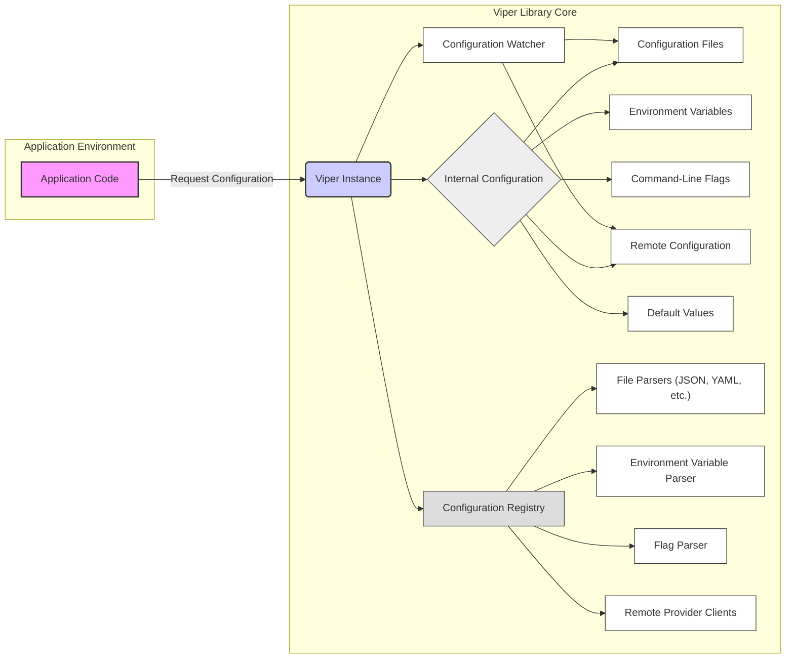
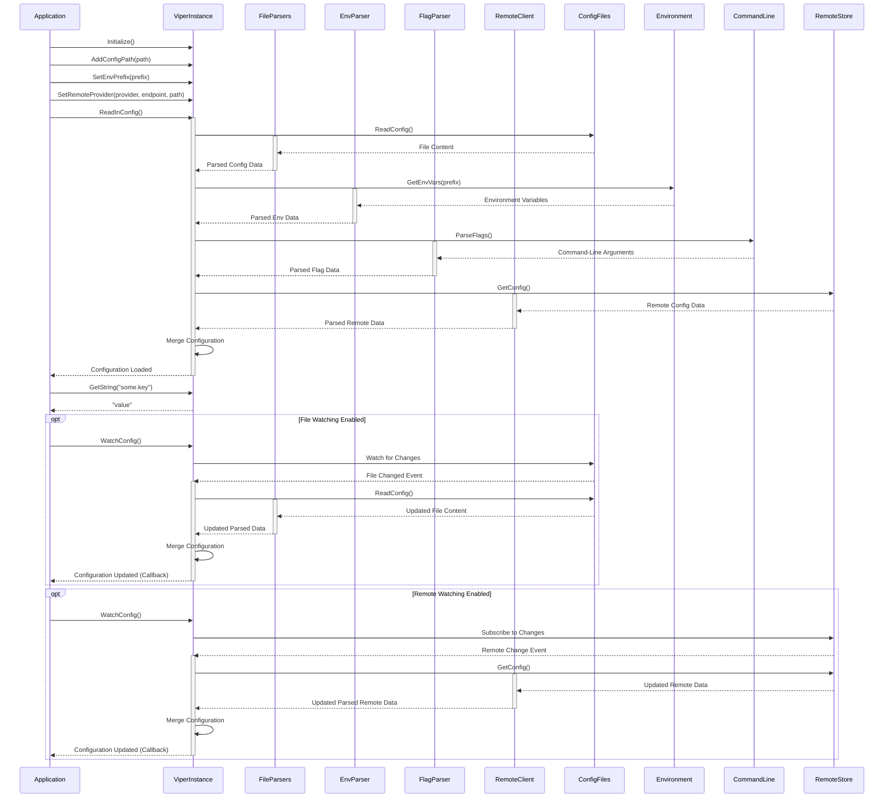

# Project Design Document: Viper Configuration Library

**Version:** 1.1
**Date:** October 26, 2023
**Author:** Gemini (AI Expert)

## 1. Introduction

This document provides an enhanced architectural design overview of the Viper configuration library, a widely adopted Go library for managing application configuration. The purpose of this document is to offer a comprehensive and detailed understanding of Viper's internal structure, data flow mechanisms, and core functionalities. This in-depth knowledge is essential for conducting thorough threat modeling activities.

Viper's core design principle is to provide a smart and flexible configuration solution for Go applications. It achieves this by seamlessly integrating configuration data from a diverse range of sources, including:

*   Configuration files in various formats (JSON, YAML, TOML, INI, etc.).
*   Operating system environment variables.
*   Command-line flags passed during application execution.
*   Remote configuration management systems (e.g., etcd, Consul, AWS Secrets Manager).
*   Explicitly defined in-memory default values.

A key feature of Viper is its well-defined precedence order (override order) for configuration sources. This allows for a layered approach to configuration management, offering flexibility and simplifying configuration management in complex environments.

## 2. Goals and Objectives

The primary design goals of the Viper library are:

*   **Extensive Format Support:** To provide native support for a wide array of configuration file formats without requiring external dependencies for common formats.
*   **Developer Ergonomics:** To offer a straightforward and intuitive API for accessing and manipulating configuration values within Go applications.
*   **Configuration Source Prioritization:** To establish a clear and configurable precedence order for different configuration sources, enabling predictable configuration resolution.
*   **Dynamic Configuration Management:** To support real-time monitoring of configuration file changes and trigger automatic updates within the application.
*   **Type-Safe Access:** To provide methods for retrieving configuration values with enforced data types, reducing runtime errors.

The central objective of this design document is to furnish a detailed and precise articulation of Viper's internal workings, thereby facilitating a robust and effective threat modeling process.

## 3. Target Audience

This document is primarily intended for:

*   Security engineers and security architects responsible for performing threat modeling and security assessments of applications that utilize the Viper library for configuration management.
*   Software developers requiring an in-depth understanding of Viper's architecture for debugging, extending its capabilities, or integrating it with other systems.
*   System architects involved in designing and deploying systems where Viper plays a crucial role in managing application configuration.

## 4. Scope

This document encompasses the essential architectural components and the flow of configuration data within the Viper library. Specifically, it details:

*   The fundamental internal components that constitute the Viper library.
*   The processes involved in loading, parsing, and merging configuration data from various supported sources.
*   The mechanisms employed for accessing and retrieving configuration values programmatically.
*   The functionality and architecture of the file watching mechanism for dynamic configuration updates.
*   A high-level overview of the interaction with external remote configuration providers.

This document explicitly excludes:

*   Detailed implementation specifics of individual file parsing logic for each supported format.
*   The low-level API interactions and intricacies of specific remote configuration providers' SDKs.
*   The internal implementation details of the `fsnotify` library, which Viper utilizes for file system event monitoring.

## 5. High-Level Architecture

The subsequent diagram illustrates the high-level architectural design of the Viper library and its interaction with the application:

**Architectural Components:**

*   **Application Code:** The Go application that integrates and utilizes the Viper library to manage its configuration settings.
*   **Viper Instance:** The central object and primary interface of the Viper library. It orchestrates configuration loading, merging, and access.
*   **Internal Configuration:**  The in-memory representation of the merged configuration data, typically a map or a nested data structure.
*   **Configuration Files:** Persistent files stored on the file system, containing configuration parameters in various formats.
*   **Environment Variables:**  System-level environment variables used to inject configuration data.
*   **Command-Line Flags:**  Arguments passed to the application upon execution, used to override default or file-based configurations.
*   **Remote Configuration:** Configuration data fetched from external systems like etcd, Consul, or cloud-based secret managers.
*   **Default Values:**  Configuration values explicitly set within the application code as fallback options.
*   **Configuration Registry:**  Manages the collection of registered configuration sources and their associated parsing mechanisms.
*   **File Parsers:**  Specialized components responsible for interpreting the syntax and structure of different configuration file formats.
*   **Environment Variable Parser:**  Handles the retrieval and processing of environment variables, including prefix matching and key mapping.
*   **Flag Parser:**  Utilizes the `flag` package to parse command-line arguments and map them to configuration keys.
*   **Remote Provider Clients:**  Specific client implementations for interacting with different remote configuration storage systems.
*   **Configuration Watcher:**  Monitors changes in configuration files and remote sources, triggering configuration reloads when updates are detected.

## 6. Component Breakdown

This section provides a more granular description of the key components within the Viper library:

*   **Viper Instance:**
    *   Serves as the main point of interaction for the application to manage its configuration.
    *   Encapsulates the `Internal Configuration` state.
    *   Provides methods for registering configuration sources (files, environment variables, remote providers), setting defaults, and retrieving configuration values.
    *   Implements the logic for merging configuration data from different sources based on the defined override precedence.
    *   Manages the lifecycle of the `Configuration Watcher`.

*   **Internal Configuration:**
    *   Typically implemented as a thread-safe map or a similar concurrent data structure to allow for safe access and updates from different goroutines.
    *   Stores the final, resolved configuration values after merging data from all configured sources.
    *   Undergoes updates whenever configuration sources are modified or reloaded.

*   **Configuration Registry:**
    *   Maintains a registry of all active configuration sources, including file paths, environment variable prefixes, and remote provider details.
    *   Associates each configuration source with the appropriate parser or client responsible for handling that source.
    *   Allows for the registration of custom configuration sources and corresponding parsing logic.

*   **File Parsers:**
    *   Responsible for reading the contents of configuration files and converting them into a structured data format (e.g., a map of key-value pairs).
    *   Supports a variety of formats through dedicated implementations, often leveraging external libraries for specific formats.
    *   Handles error conditions during file reading and parsing.

*   **Environment Variable Parser:**
    *   Retrieves environment variables from the operating system's environment.
    *   Provides mechanisms for filtering environment variables based on prefixes or naming conventions.
    *   Offers options for mapping environment variable names to configuration keys, including handling case sensitivity.

*   **Flag Parser:**
    *   Utilizes the standard Go `flag` package or similar command-line parsing libraries.
    *   Defines the expected command-line flags and their corresponding configuration keys.
    *   Handles the parsing of flags provided during application startup.

*   **Remote Provider Clients:**
    *   Implement the necessary logic to connect to and authenticate with remote configuration stores.
    *   Use the specific APIs and protocols of the remote providers (e.g., etcd's gRPC API, Consul's HTTP API).
    *   Retrieve configuration data from the remote store, often supporting mechanisms for watching for changes.

*   **Configuration Watcher:**
    *   Leverages the `fsnotify` library to monitor specified configuration files for file system events (create, write, remove, rename).
    *   For remote providers, it uses the provider's specific watch mechanisms (if available) to detect configuration updates.
    *   Triggers a reload of the configuration when changes are detected, causing the `Viper Instance` to re-read and merge configuration data.

## 7. Data Flow

The typical flow of configuration data within the Viper library involves the following stages:

*   **Initialization Phase:**
    *   The application instantiates a new `Viper Instance`.
    *   The application registers the desired configuration sources with the `Viper Instance`, specifying file paths, environment variable prefixes, remote provider details, and default values.

*   **Configuration Loading and Merging:**
    *   When the application requests to load the configuration (or upon initialization), the `Viper Instance` iterates through the registered configuration sources based on the defined override order.
    *   For each source:
        *   **Configuration Files:** The appropriate `File Parser` reads the file from disk and parses its contents into a structured format.
        *   **Environment Variables:** The `Environment Variable Parser` retrieves and filters relevant environment variables.
        *   **Command-Line Flags:** The `Flag Parser` processes the command-line arguments provided to the application.
        *   **Remote Configuration:** The corresponding `Remote Provider Client` connects to the remote store and fetches the configuration data.
        *   **Default Values:**  Default values are loaded from the `Viper Instance`.
    *   The data retrieved from each source is merged into the `Internal Configuration`. Sources with higher precedence in the override order overwrite values from lower-precedence sources.

*   **Configuration Access:**
    *   The application calls methods on the `Viper Instance` (e.g., `GetString`, `GetInt`, `GetBool`, `GetObject`) to retrieve specific configuration values.
    *   The `Viper Instance` retrieves the requested value from the `Internal Configuration`.

*   **Dynamic Configuration Updates (Watching):**
    *   If configuration watching is enabled for a source:
        *   **File Watching:** The `Configuration Watcher` monitors the specified configuration files using `fsnotify`. When changes are detected, it signals the `Viper Instance`.
        *   **Remote Watching:** The `Configuration Watcher` utilizes the remote provider's watch capabilities to detect updates.
    *   Upon receiving a change notification, the `Viper Instance` reloads the configuration from the affected source(s) and merges the updated data into the `Internal Configuration`.
    *   The application may optionally be notified of configuration changes through registered callbacks or other mechanisms.

## 8. Security Considerations

This section details potential security considerations and vulnerabilities associated with the Viper library:

**Configuration Data Exposure:**

*   **Sensitive Data in Configuration Files:** Configuration files may inadvertently contain sensitive information such as API keys, database credentials, and private keys. If these files are not properly secured with appropriate file system permissions, unauthorized users or processes could gain access.
*   **Environment Variable Exposure:**  Similar to configuration files, environment variables can also hold sensitive data. Care must be taken to ensure that environment variables containing secrets are not logged or exposed through other means.
*   **Remote Configuration Vulnerabilities:** If the connection to the remote configuration store is not secured (e.g., using HTTPS/TLS), attackers could perform man-in-the-middle attacks to intercept or modify configuration data in transit. Weak authentication or authorization mechanisms on the remote store itself can also lead to unauthorized access.

**Configuration Injection and Manipulation:**

*   **Malicious Configuration Files:** If the application allows users to specify arbitrary configuration file paths, a malicious user could provide a path to a crafted configuration file containing malicious settings that could compromise the application.
*   **Environment Variable Injection:** In environments where attackers can control environment variables, they could inject malicious configuration values to alter the application's behavior.
*   **Command-Line Argument Injection:** While less common in typical deployments, vulnerabilities in how command-line arguments are handled could potentially allow for the injection of malicious configuration via flags.
*   **Remote Configuration Tampering:** If the remote configuration store is compromised, attackers could modify configuration data to inject malicious settings.

**Denial of Service (DoS):**

*   **Large Configuration Files:** Processing excessively large or deeply nested configuration files could consume significant resources (CPU, memory), potentially leading to a denial of service.
*   **Rapid Configuration Changes:**  Repeatedly triggering configuration reloads (either through file system events or remote updates) could also lead to resource exhaustion and DoS.

**Other Security Considerations:**

*   **Dependency Vulnerabilities:** Viper relies on several third-party libraries for parsing and other functionalities. Vulnerabilities in these dependencies could indirectly affect the security of applications using Viper.
*   **Insufficient Input Validation:** If Viper does not properly validate the format and content of configuration data from various sources, it could be susceptible to various injection attacks.
*   **Error Handling and Logging:**  Insufficient or overly verbose error handling and logging could expose sensitive information or provide attackers with valuable insights into the application's internal workings.
*   **Default Credentials/Configurations:**  If default configuration values include sensitive information or insecure settings, these should be changed immediately upon deployment.

## 9. Dependencies

Viper has dependencies on several external Go packages, including:

*   `github.com/spf13/afero`:  Provides an abstraction for working with various file systems, facilitating testing and flexibility.
*   `github.com/fsnotify/fsnotify`: Used for monitoring file system events to detect changes in configuration files.
*   Various format-specific parsing libraries (examples):
    *   `github.com/BurntSushi/toml`: For parsing TOML files.
    *   `gopkg.in/yaml.v3`: For parsing YAML files.
    *   `encoding/json`: For parsing JSON files.
*   Client libraries for interacting with remote configuration providers (examples):
    *   `go.etcd.io/etcd/client/v3`: For etcd.
    *   `github.com/hashicorp/consul/api`: For Consul.
    *   `github.com/aws/aws-sdk-go-v2/service/secretsmanager`: For AWS Secrets Manager.

It is crucial to keep these dependencies updated to address any known security vulnerabilities.

## 10. Deployment Considerations

When deploying applications that utilize Viper, consider the following security aspects:

*   **Secure Storage of Configuration Files:** Ensure that configuration files are stored with appropriate file system permissions, restricting access to authorized users and processes only. Consider encrypting sensitive configuration files at rest.
*   **Secure Handling of Environment Variables:** Avoid storing highly sensitive information directly in environment variables if possible. Consider using secure secret management solutions instead. If environment variables are used for secrets, ensure they are managed securely within the deployment environment.
*   **Secure Communication with Remote Configuration Stores:** Always use secure protocols (HTTPS/TLS) when communicating with remote configuration stores. Implement proper authentication and authorization mechanisms to restrict access to the configuration data.
*   **Input Validation and Sanitization:**  While Viper handles parsing, the application should implement additional validation and sanitization of configuration values retrieved from Viper to prevent unexpected behavior or security vulnerabilities.
*   **Principle of Least Privilege:** Ensure that the application and the user accounts it runs under have only the necessary permissions to access configuration files and remote stores.
*   **Regular Security Audits:**  Periodically review the application's configuration and the security of the configuration sources to identify and address potential vulnerabilities.

## 11. Future Considerations

Potential future enhancements and considerations for the Viper library include:

*   **Built-in Support for Configuration Schema Validation:** Integrating schema validation capabilities to ensure that configuration data conforms to expected structures and types.
*   **Enhanced Secret Management Integration:** Providing more seamless integration with secure secret management solutions for retrieving and managing sensitive configuration values.
*   **Improved Error Handling and Reporting:**  Offering more detailed and context-aware error messages during configuration loading and parsing.
*   **More Granular Control over Configuration Merging:**  Allowing for more fine-grained control over how configuration values from different sources are merged.

## 12. Glossary

*   **Configuration:** The set of parameters and settings that govern the behavior and functionality of an application.
*   **Override Order (Precedence):** The defined sequence in which Viper prioritizes different configuration sources, where values from later sources in the order take precedence over earlier ones.
*   **Key-Value Store:** A type of data storage that organizes data as a collection of key-value pairs. In the context of Viper, this often refers to remote configuration stores.
*   **Parser:** A software component responsible for analyzing and converting data from one format or structure to another. In Viper, parsers handle the interpretation of configuration file formats.
*   **Watcher:** A component that monitors for changes or events in a specific resource. In Viper, the watcher monitors configuration files and remote stores for updates.
*   **Schema Validation:** The process of verifying that data conforms to a predefined structure and set of rules.
*   **Secret Management:** The practice of securely storing, accessing, and managing sensitive information such as passwords, API keys, and certificates.