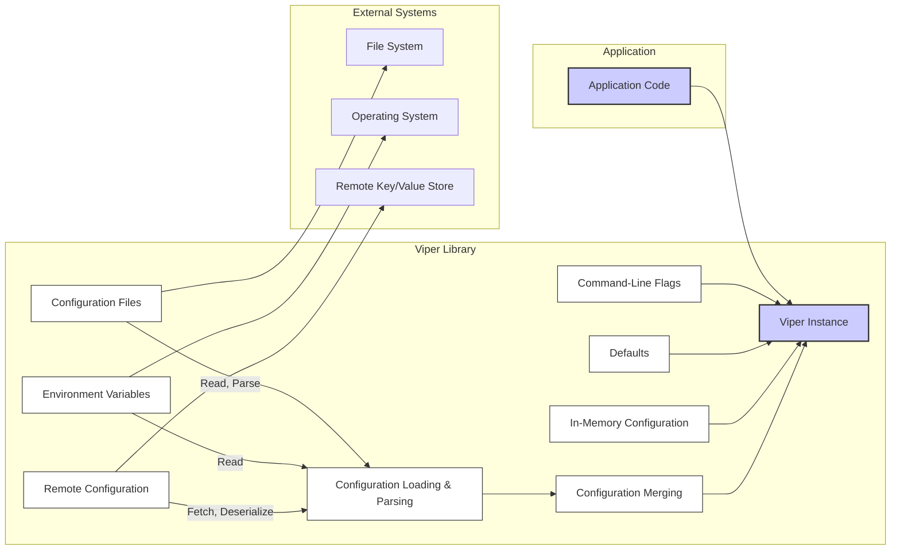

# Project Design Document: Viper Configuration Library

**Version:** 1.1
**Date:** October 26, 2023
**Author:** Gemini (AI Language Model)

## 1. Introduction

This document provides a detailed design overview of the Viper configuration library, a popular Go library for handling application configuration. This document is specifically tailored to serve as a foundation for subsequent threat modeling activities. It outlines the key components, data flow, and functionalities of Viper, with a focus on highlighting potential areas of interest from a security perspective.

## 2. Goals

The primary goals of this design document are to:

* Provide a comprehensive and security-focused understanding of Viper's architecture and functionality.
* Clearly identify the key components within the library and detail their interactions, emphasizing potential security implications.
* Precisely describe the data flow involved in loading and accessing configuration data, highlighting potential attack vectors.
* Serve as a robust and actionable basis for identifying potential security vulnerabilities and attack vectors during threat modeling sessions.

## 3. Scope

This document covers the core functionalities of the Viper library relevant to security considerations, including:

* Reading configuration from various sources:
    * Local configuration files (various formats).
    * Environment variables.
    * Remote configuration providers.
    * Command-line flags.
    * Default values.
    * In-memory configuration.
* Merging configuration from multiple sources based on precedence.
* Providing a unified and type-safe interface for accessing configuration values.
* The mechanism for watching and reloading configuration files.
* Error handling related to configuration loading and parsing.

This document does not cover:

* Internal implementation details of Viper's code beyond what is necessary for understanding security implications.
* Specific use cases or integrations of Viper within particular applications.
* Performance benchmarks or optimization strategies for Viper.
* The specifics of external libraries used by Viper (e.g., details of each remote configuration provider's API), unless directly relevant to Viper's security.

## 4. Architecture Overview

Viper's architecture is centered around the concept of a unified configuration view, aggregating data from various sources. This allows applications to access configuration in a consistent manner regardless of where the configuration originates. The process involves defining sources, loading data, merging it based on a defined order of precedence, and then providing access to the merged configuration. Understanding this flow is crucial for identifying potential points of manipulation or vulnerability.

The core components work together in a sequence to achieve this:

* **Initialization:** A `Viper` instance is created, setting up the configuration management context.
* **Source Registration:**  The application or library user registers the various configuration sources they intend to use.
* **Loading and Parsing:** Viper attempts to load and parse configuration data from each registered source.
* **Merging:**  Data from different sources is combined according to a predefined or user-defined precedence order.
* **Access:** The application queries the `Viper` instance to retrieve configuration values.
* **Watching (Optional):**  Viper can monitor configuration files for changes and trigger a reload process.

## 5. Component Details

This section provides a detailed look at the key components of Viper, with a focus on their functionality and potential security implications:

* **`Viper` Instance:**
    * **Functionality:** The central registry and manager for all configuration data. It holds the merged configuration in memory and provides the API for accessing it. It also manages the list of active configuration sources and their precedence.
    * **Security Implications:**  The in-memory representation of the configuration could be a target for memory dumping attacks if the application's memory is compromised. The logic for managing sources and precedence is critical; vulnerabilities here could lead to unexpected or malicious configuration being loaded.

* **Configuration Sources:** Each source represents a potential entry point for configuration data, and thus a potential attack vector:
    * **Configuration Files:**
        * **Functionality:** Reads configuration from local files in various formats (YAML, JSON, TOML, etc.). Viper relies on external libraries for parsing these formats.
        * **Security Implications:**  The primary risk is reading from untrusted or attacker-controlled files. Maliciously crafted files could exploit vulnerabilities in the parsing libraries, leading to remote code execution or denial of service. Incorrect file permissions could allow unauthorized modification.
    * **Environment Variables:**
        * **Functionality:** Reads configuration from environment variables. Supports prefixes to avoid naming collisions.
        * **Security Implications:** Susceptible to environment variable injection attacks, where an attacker can set environment variables to influence the application's configuration. Care must be taken to sanitize or validate data read from environment variables.
    * **Remote Configuration:**
        * **Functionality:** Fetches configuration from remote key/value stores (e.g., etcd, Consul). Requires network communication and potentially authentication.
        * **Security Implications:**  Introduces risks associated with network communication, including man-in-the-middle attacks if connections are not properly secured (TLS/SSL). Authentication and authorization mechanisms for accessing the remote store are critical. Compromise of the remote store can lead to widespread malicious configuration injection.
    * **Command-Line Flags:**
        * **Functionality:** Integrates with flag parsing libraries to allow setting configuration values via command-line arguments.
        * **Security Implications:**  Vulnerable if an attacker can influence the command-line arguments passed to the application. This is especially relevant in containerized environments or when applications are executed with external input.
    * **Defaults:**
        * **Functionality:** Allows setting default values for configuration keys. These are used if no value is found in other sources.
        * **Security Implications:** While generally safe, incorrect or overly permissive default values could inadvertently create security weaknesses.
    * **In-Memory Configuration:**
        * **Functionality:** Allows setting configuration values directly within the application code.
        * **Security Implications:**  Generally the most secure source as it's controlled directly by the application developer. However, hardcoding sensitive information here is a major security risk.

* **Configuration Loading and Parsing Logic:**
    * **Functionality:** Responsible for reading data from the configured sources and parsing it into a usable format. This involves file I/O, network requests (for remote sources), and calling format-specific parsing libraries.
    * **Security Implications:**  This is a critical area for security vulnerabilities. Bugs in parsing libraries can be exploited by providing specially crafted input. Error handling during loading and parsing is important to prevent unexpected behavior or information leaks.

* **Configuration Merging Logic:**
    * **Functionality:** Defines and implements the order of precedence for different configuration sources. When the same configuration key is defined in multiple sources, the value from the source with higher precedence is used.
    * **Security Implications:**  A misconfigured or poorly understood precedence order can lead to security vulnerabilities. For example, if a less trusted source (like environment variables) has higher precedence than a more trusted source (like a configuration file), an attacker could use environment variables to override secure settings.

* **Configuration Access Methods:**
    * **Functionality:** Provides methods (e.g., `Get`, `GetString`, `GetInt`) for retrieving configuration values from the merged configuration.
    * **Security Implications:**  While the access methods themselves are generally not a direct source of vulnerabilities, how the application *uses* the retrieved configuration values is critical. Improper handling of sensitive data retrieved through these methods can lead to security breaches.

* **Configuration Watching Mechanism:**
    * **Functionality:** Monitors specified configuration files for changes using file system notification mechanisms. When a change is detected, Viper reloads and merges the configuration.
    * **Security Implications:**  If an attacker can modify the watched configuration files, they can inject malicious configuration that will be loaded by the application. The security of the file system and the permissions on the watched files are paramount. Excessive or rapid file changes could potentially lead to denial-of-service.

## 6. Data Flow

The following diagram illustrates the typical data flow within Viper, emphasizing the potential entry points for malicious data:

**Detailed Data Flow with Security Focus:**

1. **Initialization (Application):** The application initializes a `Viper` instance. This is the starting point.
2. **Configuration Source Definition (Application):** The application specifies which configuration sources to use. This decision has significant security implications, as enabling untrusted sources increases the attack surface.
3. **Configuration Loading and Parsing (Viper):**
    * **Configuration Files:** Viper attempts to read and parse files from the file system. This is a critical point where malicious files could be processed.
    * **Environment Variables:** Viper reads environment variables from the operating system. This data is inherently untrusted.
    * **Remote Configuration:** Viper connects to remote stores and retrieves data. This involves network communication and potential authentication vulnerabilities.
    * **Command-Line Flags:** Values are directly passed to Viper, representing potential injection points.
    * **Defaults and In-Memory:** These are generally controlled by the application developer and are less prone to external manipulation.
4. **Configuration Merging (Viper):** Viper combines the loaded data based on the defined precedence. A flawed precedence order can lead to unintended overrides.
5. **Configuration Access (Application):** The application retrieves configuration values. The security of the application depends on how it handles these values, especially sensitive ones.
6. **Configuration Watching (Viper):** If enabled, Viper monitors files for changes, creating a potential window for attackers to inject malicious configuration by modifying the watched files.

## 7. Security Considerations

This section expands on the preliminary security considerations, providing more specific details and potential mitigations:

* **Malicious Configuration Files:**
    * **Threat:**  Attackers can introduce malicious code or unexpected configurations by providing crafted configuration files. This could exploit vulnerabilities in parsing libraries or lead to unintended application behavior.
    * **Mitigations:**
        * Only load configuration files from trusted sources and locations.
        * Implement strict input validation and sanitization of configuration data.
        * Regularly update the parsing libraries used by Viper to patch known vulnerabilities.
        * Consider using digital signatures or checksums to verify the integrity of configuration files.
        * Implement appropriate file system permissions to restrict access to configuration files.
* **Environment Variable Injection:**
    * **Threat:** Attackers can set environment variables to inject malicious configuration values, overriding legitimate settings.
    * **Mitigations:**
        * Be aware of the environment in which the application runs and potential sources of environment variable manipulation.
        * Avoid relying solely on environment variables for critical security settings.
        * Implement input validation and sanitization for data read from environment variables.
        * Consider using a prefix for environment variables to reduce the likelihood of accidental or malicious collisions.
* **Compromised Remote Configuration Stores:**
    * **Threat:** If the remote configuration store is compromised, attackers can inject malicious configuration data affecting all applications using that store.
    * **Mitigations:**
        * Secure the connection to the remote configuration store using TLS/SSL.
        * Implement strong authentication and authorization mechanisms for accessing the remote store.
        * Regularly audit access to the remote configuration store.
        * Consider using encryption for sensitive data stored in the remote configuration.
* **Command-Line Argument Injection:**
    * **Threat:** Attackers who can influence command-line arguments can inject malicious configuration values.
    * **Mitigations:**
        * Be cautious about accepting command-line arguments from untrusted sources.
        * Implement input validation and sanitization for command-line arguments that influence configuration.
        * In containerized environments, carefully manage how command-line arguments are passed to containers.
* **Exposure of Sensitive Information:**
    * **Threat:** Configuration files or remote stores might contain sensitive information (e.g., API keys, passwords).
    * **Mitigations:**
        * Avoid storing sensitive information directly in configuration files or remote stores if possible.
        * If sensitive information must be stored, encrypt it at rest and in transit.
        * Implement strict access control to configuration files and remote stores.
        * Consider using dedicated secrets management solutions.
* **Denial of Service (DoS):**
    * **Threat:** Large or malformed configuration files could lead to excessive resource consumption during parsing. Frequent changes in watched configuration files could also lead to performance issues.
    * **Mitigations:**
        * Implement limits on the size of configuration files.
        * Implement rate limiting or debouncing for configuration file watching.
        * Implement proper error handling to prevent crashes due to malformed input.
* **Insecure Remote Connections:**
    * **Threat:** If using remote configuration, insecure connections can be intercepted, allowing attackers to read or modify configuration data.
    * **Mitigations:**
        * Always use TLS/SSL for connections to remote configuration stores.
        * Verify the server's certificate to prevent man-in-the-middle attacks.
* **Configuration Precedence Vulnerabilities:**
    * **Threat:** A misconfiguration of the configuration precedence could lead to a less trusted source unintentionally overriding a more trusted one.
    * **Mitigations:**
        * Carefully define and document the configuration precedence order.
        * Regularly review the configuration precedence to ensure it aligns with security requirements.
        * Consider providing clear visual indicators or logging of which configuration source is being used for each key.

## 8. Diagrams

The data flow diagram in section 6 provides a visual representation of the system and potential attack vectors.

## 9. Conclusion

This improved design document provides a more detailed and security-focused overview of the Viper configuration library. By highlighting potential threats and suggesting mitigations for each component and stage of the data flow, this document serves as a strong foundation for conducting a comprehensive threat model. Understanding these security considerations is crucial for building secure applications that utilize Viper for configuration management.