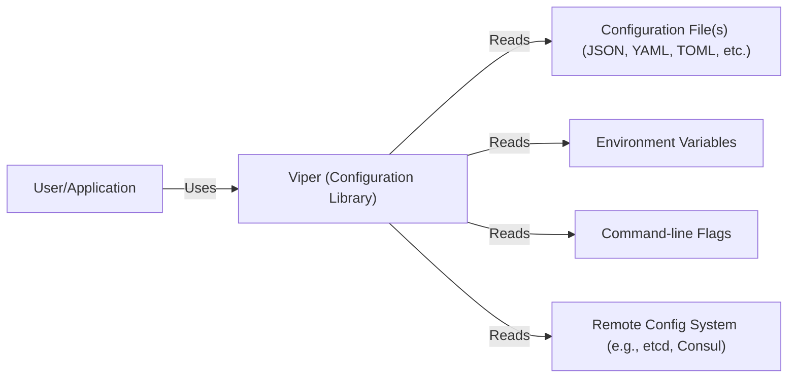
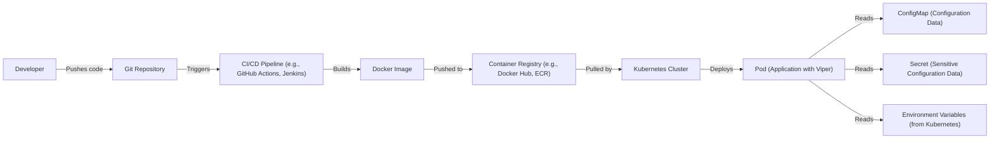
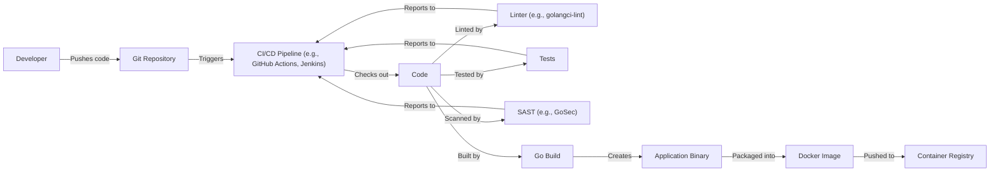

Okay, let's create a design document for the Viper project.

# BUSINESS POSTURE

Viper is a popular configuration solution for Go applications. It's designed to simplify the process of handling configurations from various sources.

Priorities and Goals:

*   Provide a comprehensive solution for application configuration.
*   Support multiple configuration formats (JSON, YAML, TOML, etc.).
*   Allow easy access to configuration values.
*   Enable configuration overriding from different sources (files, environment variables, flags, etc.).
*   Simplify configuration management in different environments (development, staging, production).
*   Maintain a high level of usability and ease of integration.

Business Risks:

*   Incorrect configuration handling leading to application misbehavior or crashes.
*   Exposure of sensitive configuration data (e.g., API keys, passwords) if not handled securely.
*   Inability to adapt to different configuration needs in various deployment environments.
*   Complexity in managing configurations across multiple services or microservices.
*   Dependency on a single point of failure if Viper is not used correctly or if the library itself has critical bugs.
*   Supply chain attacks, if Viper or any of its dependencies are compromised.

# SECURITY POSTURE

Existing Security Controls:

*   security control: Secure coding practices: The project is open-source, allowing for community review and contributions, which can help identify and address security vulnerabilities. Implemented in source code.
*   security control: Dependency management: The project uses Go modules, which helps manage dependencies and their versions, reducing the risk of using vulnerable libraries. Implemented in `go.mod` file.
*   security control: Testing: The project includes a suite of tests to ensure functionality and potentially catch some security-related issues. Implemented in `*_test.go` files.

Accepted Risks:

*   accepted risk: The library itself does not handle encryption of sensitive configuration data. It is the responsibility of the user to ensure sensitive data is encrypted at rest and in transit where necessary.
*   accepted risk: The library loads configuration from various sources, including files. If file permissions are not set correctly, it could lead to unauthorized access to configuration data.
*   accepted risk: The library uses third-party dependencies for parsing different configuration formats. Vulnerabilities in these dependencies could impact the security of Viper.

Recommended Security Controls:

*   security control: Implement or recommend the use of external secret management solutions (e.g., HashiCorp Vault, AWS Secrets Manager, Azure Key Vault) for handling sensitive configuration data.
*   security control: Provide clear documentation and guidelines on securely storing and accessing configuration files, including setting appropriate file permissions.
*   security control: Regularly audit dependencies for known vulnerabilities and update them promptly.
*   security control: Integrate static analysis tools (e.g., GoSec) into the build process to identify potential security issues in the code.
*   security control: Consider implementing a Software Bill of Materials (SBOM) to track all dependencies and their versions.

Security Requirements:

*   Authentication: Not directly applicable to Viper, as it's a configuration library, not an authentication system. Authentication is the responsibility of the application using Viper.
*   Authorization: Not directly applicable to Viper. Authorization is the responsibility of the application using Viper.
*   Input Validation: Viper should validate the configuration data it loads to ensure it conforms to the expected format and types. This is partially implemented through the use of specific parsing libraries for each format (e.g., YAML, JSON). More specific validation (e.g., range checks, allowed values) is the responsibility of the application.
*   Cryptography: Viper should not handle cryptographic operations directly. If encryption/decryption of configuration values is needed, it should be handled by the application or through integration with a dedicated secrets management solution.

# DESIGN

## C4 CONTEXT

Context Diagram Element Description:

*   User/Application
    *   Name: User/Application
    *   Type: User/Application
    *   Description: The Go application that uses Viper for configuration management.
    *   Responsibilities: Utilizing Viper to access and manage configuration settings.
    *   Security controls: Implements authentication, authorization, and input validation based on application logic. Uses secure coding practices.

*   Viper
    *   Name: Viper
    *   Type: Configuration Library
    *   Description: The Viper library itself.
    *   Responsibilities: Reading, parsing, and providing access to configuration data from various sources.
    *   Security controls: Secure coding practices, dependency management.

*   Configuration File(s)
    *   Name: Configuration File(s)
    *   Type: Data Store
    *   Description: Files containing configuration data in various formats (JSON, YAML, TOML, etc.).
    *   Responsibilities: Storing configuration data.
    *   Security controls: File system permissions, encryption at rest (if sensitive data is stored).

*   Environment Variables
    *   Name: Environment Variables
    *   Type: System Configuration
    *   Description: Environment variables set in the operating system.
    *   Responsibilities: Providing configuration values.
    *   Security controls: Operating system security controls, secure configuration management practices.

*   Command-line Flags
    *   Name: Command-line Flags
    *   Type: User Input
    *   Description: Command-line flags passed to the application.
    *   Responsibilities: Providing configuration values, potentially overriding other sources.
    *   Security controls: Input validation within the application.

*   Remote Config System
    *   Name: Remote Config System
    *   Type: External System
    *   Description: A remote configuration system like etcd or Consul.
    *   Responsibilities: Storing and providing configuration data.
    *   Security controls: Authentication, authorization, encryption in transit, access controls within the remote system.

## C4 CONTAINER

Since Viper is a library, the container diagram is essentially the same as the context diagram. The "container" in this case is the Viper library itself, which is embedded within the application.

Container Diagram Element Description:

*   User/Application
    *   Name: User/Application
    *   Type: User/Application
    *   Description: The Go application that uses Viper for configuration management.
    *   Responsibilities: Utilizing Viper to access and manage configuration settings.
    *   Security controls: Implements authentication, authorization, and input validation based on application logic. Uses secure coding practices.

*   Viper
    *   Name: Viper
    *   Type: Configuration Library
    *   Description: The Viper library itself.
    *   Responsibilities: Reading, parsing, and providing access to configuration data from various sources.
    *   Security controls: Secure coding practices, dependency management.

*   Configuration File(s)
    *   Name: Configuration File(s)
    *   Type: Data Store
    *   Description: Files containing configuration data in various formats (JSON, YAML, TOML, etc.).
    *   Responsibilities: Storing configuration data.
    *   Security controls: File system permissions, encryption at rest (if sensitive data is stored).

*   Environment Variables
    *   Name: Environment Variables
    *   Type: System Configuration
    *   Description: Environment variables set in the operating system.
    *   Responsibilities: Providing configuration values.
    *   Security controls: Operating system security controls, secure configuration management practices.

*   Command-line Flags
    *   Name: Command-line Flags
    *   Type: User Input
    *   Description: Command-line flags passed to the application.
    *   Responsibilities: Providing configuration values, potentially overriding other sources.
    *   Security controls: Input validation within the application.

*   Remote Config System
    *   Name: Remote Config System
    *   Type: External System
    *   Description: A remote configuration system like etcd or Consul.
    *   Responsibilities: Storing and providing configuration data.
    *   Security controls: Authentication, authorization, encryption in transit, access controls within the remote system.

## DEPLOYMENT

Viper, as a library, is deployed as part of the Go application that uses it. There isn't a separate deployment process for Viper itself. The deployment of the application will depend on the specific environment (e.g., bare metal, virtual machines, containers, Kubernetes).

Possible Deployment Solutions:

1.  Bare Metal/Virtual Machines: The Go application (with Viper embedded) is compiled into a binary and deployed directly onto a server.
2.  Containers (Docker): The Go application is built into a Docker image and deployed as a container.
3.  Kubernetes: The Docker image is deployed to a Kubernetes cluster, managed by Kubernetes deployments, services, and config maps/secrets.

Chosen Deployment Solution (Kubernetes):

Deployment Diagram Element Description:

*   Developer
    *   Name: Developer
    *   Type: Person
    *   Description: The developer writing and committing code.
    *   Responsibilities: Writing code, committing changes, triggering builds.
    *   Security controls: Code review, secure coding practices.

*   Git Repository
    *   Name: Git Repository
    *   Type: Code Repository
    *   Description: The repository storing the application code (e.g., GitHub, GitLab).
    *   Responsibilities: Version control, code storage.
    *   Security controls: Access controls, branch protection rules.

*   CI/CD Pipeline
    *   Name: CI/CD Pipeline
    *   Type: Automation System
    *   Description: The CI/CD pipeline (e.g., GitHub Actions, Jenkins) that automates the build, test, and deployment process.
    *   Responsibilities: Building, testing, and deploying the application.
    *   Security controls: Secure configuration, access controls, vulnerability scanning.

*   Docker Image
    *   Name: Docker Image
    *   Type: Container Image
    *   Description: The Docker image containing the compiled Go application.
    *   Responsibilities: Packaging the application and its dependencies.
    *   Security controls: Image scanning for vulnerabilities.

*   Container Registry
    *   Name: Container Registry
    *   Type: Image Repository
    *   Description: The container registry (e.g., Docker Hub, ECR) storing the Docker image.
    *   Responsibilities: Storing and providing access to Docker images.
    *   Security controls: Access controls, image signing.

*   Kubernetes Cluster
    *   Name: Kubernetes Cluster
    *   Type: Container Orchestration Platform
    *   Description: The Kubernetes cluster managing the deployment of the application.
    *   Responsibilities: Orchestrating containers, managing resources, scaling.
    *   Security controls: RBAC, network policies, pod security policies.

*   Pod
    *   Name: Pod
    *   Type: Kubernetes Pod
    *   Description: The pod running the Go application (with Viper).
    *   Responsibilities: Running the application.
    *   Security controls: Security context, resource limits.

*   ConfigMap
    *   Name: ConfigMap
    *   Type: Kubernetes ConfigMap
    *   Description: Kubernetes ConfigMap storing non-sensitive configuration data.
    *   Responsibilities: Providing configuration data to the pod.
    *   Security controls: RBAC, access controls.

*   Secret
    *   Name: Secret
    *   Type: Kubernetes Secret
    *   Description: Kubernetes Secret storing sensitive configuration data.
    *   Responsibilities: Providing sensitive configuration data to the pod.
    *   Security controls: RBAC, encryption at rest (if supported by the Kubernetes cluster).

* EnvVar
    * Name: EnvVar
    * Type: Environment Variables
    * Description: Environment variables set in Kubernetes deployment.
    * Responsibilities: Providing configuration data to the pod.
    * Security controls: RBAC, access controls.

## BUILD

The build process for an application using Viper typically involves compiling the Go code into an executable binary. This process can be automated using a CI/CD pipeline.

Build Process Security Controls:

*   Code Review: All code changes should be reviewed by another developer before merging.
*   Linting: A linter (e.g., golangci-lint) is used to enforce code style and identify potential issues.
*   Testing: Unit and integration tests are run to ensure code quality and functionality.
*   Static Analysis (SAST): A static analysis tool (e.g., GoSec) is used to scan the code for potential security vulnerabilities.
*   Dependency Management: Go modules are used to manage dependencies and their versions.
*   Build Automation: The build process is automated using a CI/CD pipeline (e.g., GitHub Actions, Jenkins).
*   Artifact Signing: The resulting binary or Docker image can be signed to ensure its integrity.
*   SBOM Generation: A Software Bill of Materials (SBOM) can be generated to track all dependencies.

# RISK ASSESSMENT

Critical Business Processes:

*   Application functionality: The primary business process is the correct and reliable operation of the application using Viper. Any disruption to configuration management can impact the application's functionality.
*   Configuration management: The ability to manage and update configurations across different environments is critical.

Data Sensitivity:

*   Configuration data: The sensitivity of configuration data varies greatly. It can range from non-sensitive settings (e.g., log levels) to highly sensitive secrets (e.g., API keys, database passwords).
*   Non-sensitive data: Loss of availability might be a concern.
*   Sensitive data: Confidentiality, integrity, and availability are all critical.

# QUESTIONS & ASSUMPTIONS

Questions:

*   Are there any specific compliance requirements (e.g., PCI DSS, HIPAA) that need to be considered?
*   What is the expected frequency of configuration changes?
*   What is the process for managing and rotating secrets?
*   What specific remote configuration systems (if any) are planned to be used?
*   What is the existing infrastructure and deployment environment?

Assumptions:

*   BUSINESS POSTURE: The organization has a moderate risk appetite, balancing the need for rapid development with the importance of security.
*   SECURITY POSTURE: The organization has basic security practices in place, but there is room for improvement.
*   DESIGN: The application using Viper will be deployed in a containerized environment (Kubernetes). The application will primarily use configuration files and environment variables, with the potential for using a remote configuration system in the future.