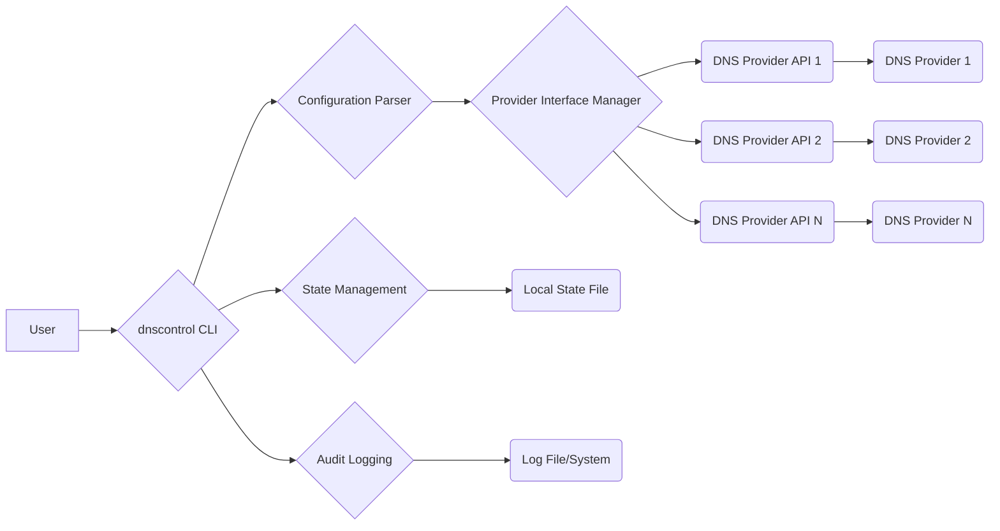
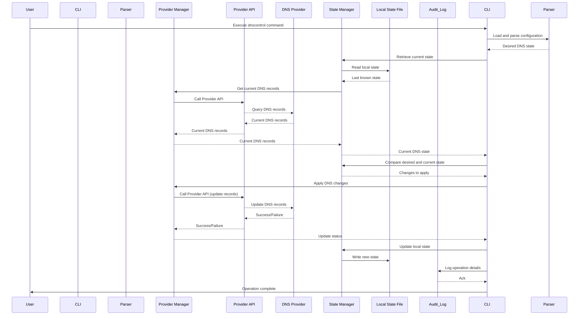

# Project Design Document: dnscontrol

**Version:** 1.1
**Date:** October 26, 2023
**Author:** AI Architecture Expert

## 1. Introduction

This document provides a detailed architectural design for the `dnscontrol` project, a powerful tool enabling declarative management of DNS zones across various providers. This enhanced document aims to provide a more comprehensive understanding of the system's intricacies, serving as a robust foundation for subsequent threat modeling and security analysis.

## 2. Goals and Objectives

The core objectives of `dnscontrol` are:

* **Declarative DNS Management:**  Define the desired state of DNS zones using human-readable configuration files, promoting consistency and reproducibility.
* **Automation of DNS Updates:** Automate the process of synchronizing the declared DNS configuration with the actual state at different DNS providers, reducing manual effort and potential errors.
* **Idempotency in Operations:** Ensure that running `dnscontrol` multiple times with the same configuration results in the same final DNS state, preventing unintended side effects.
* **Provider Agnostic Abstraction:** Offer a unified interface and workflow for managing DNS records across a diverse range of DNS providers, simplifying multi-provider setups.
* **Version Control Integration:** Facilitate tracking and management of DNS configuration changes through standard version control systems (like Git), enabling auditability and rollback capabilities.

## 3. Architectural Overview

`dnscontrol` functions as a command-line application that interprets configuration files and interacts with DNS providers' APIs to manage DNS records. The high-level architecture can be visualized as follows:

Key architectural components are:

* **User:** The individual or system interacting with `dnscontrol` through the command-line interface.
* **`dnscontrol` CLI:** The primary executable responsible for orchestrating the entire DNS management workflow.
* **Configuration Parser:**  The module that reads, validates, and interprets the declarative DNS configuration files.
* **Provider Interface Manager:** An abstraction layer that handles interactions with different DNS providers' APIs in a consistent manner.
* **DNS Provider APIs:** The specific application programming interfaces exposed by each supported DNS provider.
* **DNS Providers:** The external authoritative name servers managed by third-party providers.
* **State Management:** The component responsible for tracking and comparing the desired and actual states of DNS records.
* **Local State File:** A file storing the last successfully applied DNS configuration state.
* **Audit Logging:** The mechanism for recording actions performed by `dnscontrol` for auditing and troubleshooting.
* **Log File/System:** The destination where audit logs are stored.

## 4. Key Components

This section provides a more detailed breakdown of the core components within the `dnscontrol` system:

* **`dnscontrol` CLI (Command-Line Interface):**
    * **Entry Point:** Serves as the primary point of interaction for users, accepting commands and arguments.
    * **Command Parsing:**  Interprets user commands (e.g., `push`, `preview`, `diff`) and their associated parameters.
    * **Orchestration:** Manages the overall execution flow, invoking other components in the correct sequence.
    * **User Feedback:** Provides output to the user, including progress updates, status messages, and error reports.

* **Configuration Parser:**
    * **File Reading:** Reads DNS configuration files, typically written in a Domain-Specific Language (DSL) like JavaScript or Go.
    * **Syntax Validation:** Checks the configuration files for correct syntax and adherence to the DSL rules.
    * **Semantic Validation:**  Performs more advanced validation, ensuring logical consistency and correctness of the DNS configurations.
    * **Internal Representation:** Transforms the parsed configuration into an internal data structure representing the desired DNS state.

* **Provider Interface Manager:**
    * **Provider Registration:**  Maintains a registry of available DNS provider implementations.
    * **Dynamic Loading:** Loads and instantiates the appropriate provider interfaces based on the configuration.
    * **Abstraction Layer:** Provides a consistent, provider-agnostic API for interacting with different DNS providers.
    * **Credential Handling:** Manages the retrieval and secure handling of authentication credentials for each provider.
    * **API Call Translation:** Translates generic DNS record operations (e.g., create, update, delete) into provider-specific API calls.

* **DNS Provider API Clients:**
    * **Provider-Specific Logic:** Implements the specific logic for interacting with the API of a particular DNS provider (e.g., AWS Route 53, Google Cloud DNS, Cloudflare DNS).
    * **Request Construction:**  Builds API requests according to the provider's API specifications.
    * **Authentication Handling:**  Manages the authentication process with the provider's API, including signing requests or using tokens.
    * **Response Parsing:**  Parses API responses and extracts relevant information.
    * **Error Handling:**  Handles API errors and translates them into a consistent format for `dnscontrol`.
    * **Rate Limiting:** Implements strategies to handle API rate limits imposed by providers.

* **State Management:**
    * **State Retrieval:** Retrieves the last known good state of DNS records from the local state file.
    * **Live State Fetching:**  Uses the Provider Interface Manager to query the current DNS records directly from the configured DNS providers.
    * **State Comparison:** Compares the desired DNS state (from the configuration) with the actual state retrieved from the providers.
    * **Change Calculation:**  Determines the necessary DNS record changes (additions, modifications, deletions) required to align the actual state with the desired state.
    * **State Persistence:** Updates the local state file with the new DNS state after successful application of changes.

* **Local State File:**
    * **State Storage:** Stores a serialized representation of the DNS records as they were after the last successful `dnscontrol` run.
    * **Idempotency Support:**  Used as a reference point for comparing the current configuration with the previously applied state, ensuring idempotency.
    * **Potential Sensitivity:** May contain information about DNS records, which could be considered sensitive depending on the context.

* **Audit Logging:**
    * **Action Recording:** Logs significant actions performed by `dnscontrol`, such as configuration parsing, API calls, and state changes.
    * **Timestamping:** Records the time of each logged event.
    * **User/Context Information:**  Includes information about the user or system that initiated the action (if available).
    * **Change Details:**  Logs the specifics of any DNS record changes made.
    * **Configurable Output:**  Supports logging to various destinations, such as files or centralized logging systems.

## 5. Data Flow

The typical sequence of operations during a `dnscontrol` execution follows these steps:

1. **User Initiates Command:** A user executes a `dnscontrol` command (e.g., `push` to apply changes, `preview` to see changes).
2. **CLI Command Parsing:** The `dnscontrol` CLI parses the command and any provided arguments.
3. **Configuration Loading and Parsing:** The Configuration Parser reads and interprets the DNS configuration files, generating an internal representation of the desired DNS state.
4. **Provider Selection:** Based on the configuration, the Provider Interface Manager identifies the relevant DNS providers.
5. **Current State Retrieval:**
    * The State Management component reads the last known good state from the Local State File.
    * The Provider Interface Manager utilizes the appropriate DNS Provider API Clients to fetch the current DNS records from the configured providers.
6. **State Comparison and Change Calculation:** The State Management component compares the desired state (from the configuration) with the actual state retrieved from the providers, calculating the necessary changes.
7. **API Calls to DNS Providers:**
    * The Provider Interface Manager uses the provider-specific API Clients to send requests to the DNS providers to create, modify, or delete DNS records as determined in the previous step.
    * These API calls include the necessary authentication credentials.
8. **DNS Provider Updates:** The DNS providers process the API requests and update their authoritative name servers accordingly.
9. **Local State Update:** Upon successful application of the changes, the State Management component updates the Local State File to reflect the new DNS state.
10. **Audit Logging:**  All significant actions, including API calls and state changes, are recorded by the Audit Logging component.
11. **User Feedback:** The `dnscontrol` CLI provides feedback to the user about the outcome of the operation, including any errors or warnings.

## 6. Security Considerations

Security is paramount in `dnscontrol` due to its management of critical DNS infrastructure. Key considerations include:

* **Authentication and Authorization:**
    * **Provider Authentication:**  `dnscontrol` relies on secure authentication mechanisms (API keys, OAuth tokens, IAM roles) to interact with DNS providers. Secure storage and management of these credentials are crucial. Threat: Compromised credentials could lead to unauthorized DNS modifications. Mitigation: Utilize secure credential storage mechanisms (e.g., environment variables with restricted access, dedicated secrets management tools), follow least privilege principles when granting API permissions.
    * **User Authorization:**  Controlling which users or systems can execute `dnscontrol` commands and manage DNS configurations is important. Threat: Unauthorized users could inadvertently or maliciously alter DNS records. Mitigation: Implement access controls at the operating system or orchestration level, potentially integrate with identity providers for authentication and authorization.

* **Data Handling:**
    * **DNS Record Sensitivity:** DNS records themselves can contain sensitive information (internal hostnames, service locations). Threat: Exposure of DNS records could reveal internal infrastructure details to attackers. Mitigation:  Treat DNS configurations as sensitive data, restrict access to configuration files and the local state file.
    * **API Data Security:**  Data transmitted between `dnscontrol` and DNS provider APIs should be protected. Threat: Man-in-the-middle attacks could intercept and potentially modify API communication. Mitigation: Ensure all communication with DNS provider APIs occurs over HTTPS.
    * **Local State File Protection:** The local state file contains a snapshot of the DNS configuration. Threat: Unauthorized access or modification of the local state file could lead to inconsistencies or the application of unintended changes. Mitigation: Restrict access to the local state file using file system permissions.

* **Configuration Files:**
    * **Configuration Integrity:** The integrity of the configuration files is critical, as they define the desired DNS state. Threat: Unauthorized modification of configuration files could lead to incorrect or malicious DNS settings. Mitigation: Store configuration files in version control systems, implement code review processes, and restrict write access to the repository.
    * **Secrets Management:** Avoid hardcoding sensitive credentials (API keys, tokens) directly in configuration files. Threat: Hardcoded credentials can be easily exposed if the configuration files are compromised. Mitigation: Utilize environment variables, dedicated secrets management tools (e.g., HashiCorp Vault, AWS Secrets Manager), or configuration file encryption to manage sensitive information.

* **Communication Security:**
    * **API Transport Security:** Secure communication with DNS provider APIs is essential. Threat: Unencrypted communication could allow attackers to eavesdrop on or manipulate API requests and responses. Mitigation: Ensure all API communication utilizes HTTPS.
    * **Dependency Security:**  `dnscontrol` relies on third-party libraries. Threat: Vulnerabilities in dependencies could be exploited to compromise `dnscontrol`. Mitigation: Regularly update dependencies, perform vulnerability scanning, and use dependency management tools to track and manage dependencies.

* **Logging and Auditing:**
    * **Log Integrity:** Audit logs provide a record of actions performed by `dnscontrol`. Threat: Tampering with audit logs could conceal malicious activity. Mitigation: Secure log storage and access, consider using centralized logging systems with integrity checks.
    * **Sufficient Logging:** Ensure that logs capture enough information to track actions and identify potential security incidents. Mitigation: Configure logging to record significant events, including API calls, state changes, and user actions.

* **Command Injection:**
    * **Input Sanitization:** If `dnscontrol` processes user-provided input (e.g., in custom provider implementations), proper sanitization is crucial. Threat: Failure to sanitize input could lead to command injection vulnerabilities. Mitigation: Carefully validate and sanitize all user-provided input.

* **State File Security:**
    * **Access Control:** Restrict access to the local state file to authorized users and processes. Threat: Unauthorized access could allow for the manipulation or theft of DNS configuration information. Mitigation: Implement appropriate file system permissions.

## 7. Deployment Considerations

Deploying `dnscontrol` effectively and securely requires careful planning:

* **Execution Environment:**  `dnscontrol` needs to be executed in an environment with network access to the DNS provider APIs. Consider the security of this environment.
* **Credential Management Strategy:**  Choose a secure method for providing DNS provider credentials to `dnscontrol`. Options include:
    * **Environment Variables:** Suitable for simpler setups, ensure proper access control to the environment.
    * **Dedicated Secrets Management Tools:** Recommended for production environments, providing centralized and secure storage and access control for secrets.
    * **Configuration File Encryption:** Encrypt sensitive data within configuration files.
* **Automation Pipelines:** When integrating `dnscontrol` into CI/CD pipelines, ensure the pipeline environment is secure and credentials are managed appropriately.
* **Permissions Management:**  Grant the user or service account running `dnscontrol` only the necessary permissions to interact with the DNS providers (least privilege principle).
* **Rollback Strategy:**  Have a plan for rolling back changes in case of errors or unintended consequences. The local state file can assist with this.
* **Infrastructure as Code (IaC) Integration:** Consider how `dnscontrol` fits into your overall IaC strategy and how it interacts with other tools.

## 8. Future Considerations

Potential future enhancements and architectural changes include:

* **Web-Based User Interface:** Developing a web UI for managing DNS configurations could improve usability and accessibility. This would introduce new security considerations related to web application security.
* **Centralized State Management:** Moving state management to a more robust and centralized system (e.g., a database) could improve scalability and reliability. This would require securing the central state store.
* **Enhanced Role-Based Access Control (RBAC):** Implementing more granular RBAC within `dnscontrol` itself could provide finer-grained control over who can manage specific DNS zones or records.
* **Multi-Factor Authentication (MFA) for Provider Interactions:** Adding MFA to interactions with DNS providers could significantly enhance security.
* **Improved Audit Logging and Monitoring:** Integrating with centralized logging and monitoring systems could provide better visibility and alerting for security events.
* **Integration with Policy Enforcement Tools:** Integrating with tools that enforce DNS policies could help ensure compliance and prevent misconfigurations.

This improved design document provides a more detailed and comprehensive understanding of the `dnscontrol` project's architecture, crucial for effective threat modeling and security analysis. By carefully considering the components, data flow, and security implications outlined here, developers and security professionals can better identify and mitigate potential risks associated with managing DNS infrastructure declaratively.