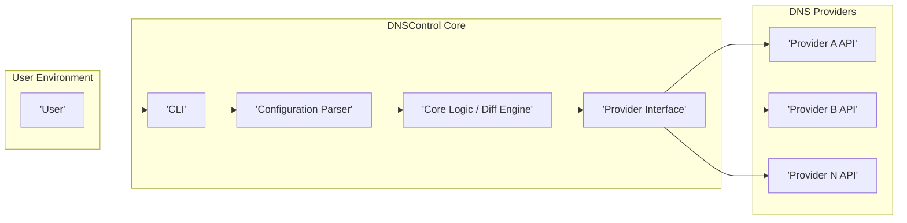
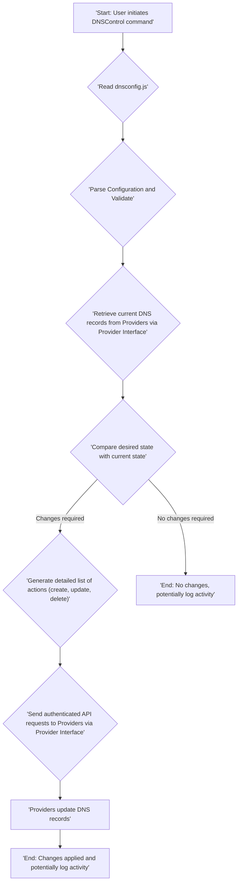

# Project Design Document: DNSControl

**Project Name:** DNSControl

**Project Repository:** https://github.com/stackexchange/dnscontrol

**Document Version:** 1.1

**Date:** October 26, 2023

**Author:** Gemini (AI Language Model)

## 1. Introduction

This document provides an enhanced and more detailed design overview of the DNSControl project. It aims to clearly articulate the system's architecture, components, and data flow with a specific focus on providing the necessary information for effective threat modeling.

### 1.1. Purpose

The primary purpose of this document is to provide a clear, comprehensive, and detailed design description of DNSControl. This description will serve as a crucial input for threat modeling exercises, enabling a thorough analysis of potential security risks and vulnerabilities within the system. The added detail aims to facilitate a more granular and accurate threat assessment.

### 1.2. Scope

This document covers the core architecture and functionality of DNSControl as understood from the project's public repository. It delves deeper into the interactions between components and the nature of the data being processed. The focus remains on the key components involved in managing DNS records across different providers.

### 1.3. Goals

*   Provide a high-level overview of the DNSControl system.
*   Describe the key components and their interactions in detail.
*   Illustrate the data flow within the system, including data transformations.
*   Identify initial areas of potential security concern with more specific examples.
*   Provide a robust foundation for subsequent threat modeling activities.

## 2. System Overview

DNSControl is a sophisticated tool designed for managing DNS records in a declarative and version-controlled manner. It empowers users to define their desired DNS configuration within a configuration file and subsequently apply those changes to one or more DNS providers. This infrastructure-as-code approach for DNS management significantly enhances consistency, minimizes manual errors, and facilitates automation.

### 2.1. Key Features

*   **Declarative Configuration:** DNS records are defined in a human-readable configuration file (typically `dnsconfig.js` or similar), specifying the desired end-state.
*   **Multi-Provider Support:**  Seamlessly supports a diverse range of DNS providers (e.g., AWS Route 53, Cloudflare, Google Cloud DNS, Azure DNS), abstracting away provider-specific complexities.
*   **Synchronization and Reconciliation:**  Intelligently compares the desired state defined in the configuration file with the actual state retrieved from the DNS provider(s). It then generates and applies only the necessary changes to reconcile the states.
*   **Preview and Dry-Run Capabilities:** Offers a "preview" or "dry-run" mode, allowing users to inspect the intended changes before they are applied to the live DNS records, mitigating the risk of unintended consequences.
*   **Extensible Provider Model:**  Designed with an extensible architecture that allows for the addition of new DNS providers and functionalities through plugins or custom implementations.
*   **State Management (Implicit):** While not explicitly a separate component, DNSControl implicitly manages state by comparing the desired configuration with the live state at the providers.

## 3. System Architecture

The DNSControl architecture comprises several interconnected components that work in concert to achieve its intended functionality.

### 3.1. Components

*   **User:** The individual, system, or automated process that interacts with DNSControl to manage DNS records. This interaction is typically through the CLI.
*   **CLI (Command Line Interface):** The primary point of interaction for users. It accepts commands to perform various actions, including reading configuration files, previewing changes, applying updates, and potentially managing provider credentials.
*   **Configuration Parser:** Responsible for securely reading, parsing, and validating the `dnsconfig.js` (or equivalent) file. This component interprets the declarative DNS configuration defined by the user. It needs to handle potential syntax errors and ensure the configuration adheres to the expected schema.
*   **Core Logic / Diff Engine:** The central processing unit of DNSControl. This component performs the crucial task of comparing the desired DNS state (from the parsed configuration) with the current state retrieved from the DNS providers. It then calculates the precise set of changes (additions, modifications, deletions) required to synchronize the states. This involves complex logic to handle different record types and provider-specific nuances.
*   **Provider Interface:** An abstraction layer that provides a consistent and uniform interface for interacting with the diverse APIs of different DNS providers. This component encapsulates the provider-specific API calls, authentication mechanisms, and data transformations required for each provider. It isolates the core logic from the intricacies of individual provider implementations.
*   **Provider APIs:** The application programming interfaces exposed by the various DNS service providers (e.g., AWS Route 53 API, Cloudflare API, Google Cloud DNS API). These APIs allow DNSControl to programmatically query and modify DNS records.

### 3.2. Interactions

1. The **User** interacts with the **CLI** by executing commands, such as `dnscontrol push` to apply changes or `dnscontrol preview` to view proposed modifications.
2. The **CLI** invokes the **Configuration Parser**, providing the path to the `dnsconfig.js` file.
3. The **Configuration Parser** reads and validates the configuration file, passing the parsed desired DNS state to the **Core Logic / Diff Engine**.
4. The **Core Logic / Diff Engine** utilizes the **Provider Interface** to communicate with the configured **Provider APIs**. It queries the current DNS records for the domains specified in the configuration. This involves authenticating with each provider using configured credentials.
5. The **Provider Interface** translates the generic requests from the Core Logic into provider-specific API calls and handles the responses.
6. The **Core Logic / Diff Engine** compares the desired state received from the parser with the current state retrieved from the providers.
7. If discrepancies are found, the **Core Logic / Diff Engine** generates a detailed list of actions (create, update, delete records) required to achieve the desired state.
8. Upon user confirmation (or in automated scenarios), the **Core Logic / Diff Engine** instructs the **Provider Interface** to execute the generated actions.
9. The **Provider Interface** translates these actions into specific API calls to the respective **Provider APIs**.
10. The **Provider APIs** process the requests and update the DNS records accordingly.

## 4. Data Flow

The following diagram illustrates the typical flow of data when applying DNS configuration changes using DNSControl.

### 4.1. Data Elements

*   **`dnsconfig.js` (or similar):**  A text-based configuration file, typically in JavaScript, that declaratively defines the desired DNS records. This includes record types (A, CNAME, TXT, MX, etc.), record names, values, Time-to-Live (TTL) settings, and potentially provider-specific configurations. This file may contain sensitive information, such as API keys or secrets embedded directly or referenced.
*   **Provider Credentials:** Highly sensitive authentication details required to access and modify DNS records at each provider. These can include API keys, secret tokens, OAuth credentials, or IAM role assumptions. The secure storage and handling of these credentials are paramount.
*   **Current DNS Records:** The actual DNS records currently configured and active at the authoritative DNS providers. This data is retrieved via the provider APIs.
*   **Desired DNS Records:** The representation of the DNS records as defined in the `dnsconfig.js` file after it has been parsed and validated.
*   **Change Set (Plan):** A structured representation of the differences between the current and desired DNS states. This includes a detailed list of actions to be performed, such as creating new records, updating existing ones, or deleting obsolete records.
*   **API Requests:**  Structured data sent to the DNS provider APIs, containing instructions to query or modify DNS records. These requests typically include authentication headers and data payloads conforming to the provider's API specification.
*   **API Responses:** Data returned by the DNS provider APIs in response to requests. This includes the requested DNS record data or confirmation of successful modifications, along with potential error messages.
*   **Logs:** Records of DNSControl activity, including commands executed, configuration files processed, API requests made, and the outcome of those requests. These logs can be crucial for auditing and troubleshooting.

## 5. Security Considerations (Detailed)

Based on the architecture and data flow, several potential security considerations warrant careful attention:

*   **Secrets Management Vulnerabilities:**
    *   **Hardcoded Credentials:** Storing provider credentials directly within the `dnsconfig.js` file is a significant risk. If this file is compromised (e.g., through a version control leak or unauthorized access), attackers gain full control over the organization's DNS.
    *   **Credentials in Environment Variables:** While slightly better than hardcoding, storing credentials in environment variables can still be vulnerable if the environment is compromised or if the application is running in a shared environment.
    *   **Insecure Storage of Credentials:** If DNSControl or its dependencies store credentials in a local cache or configuration file without proper encryption, this could lead to exposure.
*   **Configuration File Tampering:**
    *   **Unauthorized Modification:** If an attacker gains write access to the `dnsconfig.js` file, they can arbitrarily modify DNS records, potentially redirecting traffic, causing denial of service, or facilitating phishing attacks.
    *   **Supply Chain Attacks:** If the process of creating or distributing the `dnsconfig.js` file is compromised, malicious configurations could be injected.
*   **Authentication and Authorization Weaknesses:**
    *   **Lack of Authentication:** If DNSControl commands can be executed without proper authentication, unauthorized users could make changes.
    *   **Insufficient Authorization:** Even with authentication, inadequate authorization controls could allow users to modify DNS records they shouldn't have access to.
    *   **Weak Authentication Mechanisms:** Using weak passwords or easily compromised authentication methods for accessing the system running DNSControl.
*   **Provider API Security Issues:**
    *   **Man-in-the-Middle Attacks:** If communication between DNSControl and provider APIs is not properly secured with HTTPS, attackers could intercept and modify API requests and responses.
    *   **API Key Compromise:** If provider API keys are compromised, attackers can directly manipulate DNS records through the provider's API, bypassing DNSControl.
    *   **Rate Limiting and Abuse:**  An attacker could potentially abuse the provider APIs through DNSControl, leading to rate limiting or even account suspension.
*   **Input Validation Failures:**
    *   **Injection Attacks:** If DNSControl doesn't properly validate the data in the `dnsconfig.js` file, attackers could inject malicious data that could be passed directly to the provider APIs, potentially causing unexpected behavior or security vulnerabilities.
    *   **Denial of Service:** Malformed configurations could potentially crash DNSControl or overload the provider APIs.
*   **Logging and Auditing Deficiencies:**
    *   **Insufficient Logging:** If DNSControl doesn't log actions adequately, it can be difficult to track changes, identify security breaches, and perform incident response.
    *   **Insecure Log Storage:** If logs are stored insecurely, attackers could tamper with them to cover their tracks.
*   **Dependency Vulnerabilities:**
    *   **Outdated Dependencies:** Using outdated versions of DNSControl's dependencies could expose the system to known vulnerabilities.
    *   **Compromised Dependencies:**  Malicious actors could inject vulnerabilities into dependencies, which could then be exploited through DNSControl.
*   **State Management Risks (If Applicable):**
    *   **State Tampering:** If DNSControl maintains a local state, and this state is not properly secured, attackers could tamper with it, leading to incorrect synchronization or other issues.

## 6. Future Considerations (Potential Extensions and Security Implications)

*   **Web UI:** Introducing a web-based interface would necessitate robust web application security measures, including protection against common web vulnerabilities like XSS, CSRF, and SQL injection, as well as secure session management and authentication.
*   **Automation and CI/CD Integration:** Integrating DNSControl into CI/CD pipelines requires careful consideration of how credentials and configuration files are managed and secured within the automation environment. Secrets management solutions and secure artifact storage become crucial.
*   **Role-Based Access Control (RBAC):** Implementing RBAC within DNSControl would require a mechanism for defining and enforcing roles and permissions, ensuring that users only have access to manage the DNS records they are authorized for. This adds complexity but enhances security.
*   **Centralized Secrets Management Integration:** Integrating with dedicated secrets management solutions (e.g., HashiCorp Vault, AWS Secrets Manager) would significantly improve the security of provider credentials.

## 7. Conclusion

This enhanced design document provides a more detailed and comprehensive understanding of the DNSControl project's architecture and data flow, specifically tailored for threat modeling purposes. The detailed breakdown of components, interactions, and data elements, along with the expanded security considerations, offers a solid foundation for identifying potential vulnerabilities and developing appropriate mitigation strategies. The future considerations highlight potential areas where security will need to be a primary focus as the project evolves.