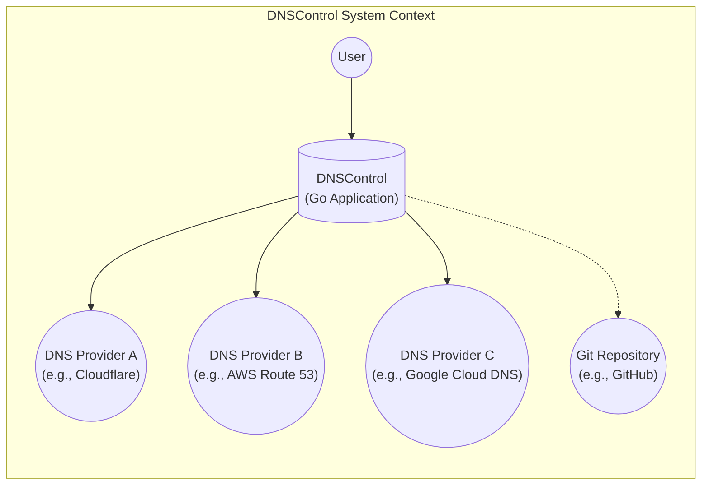
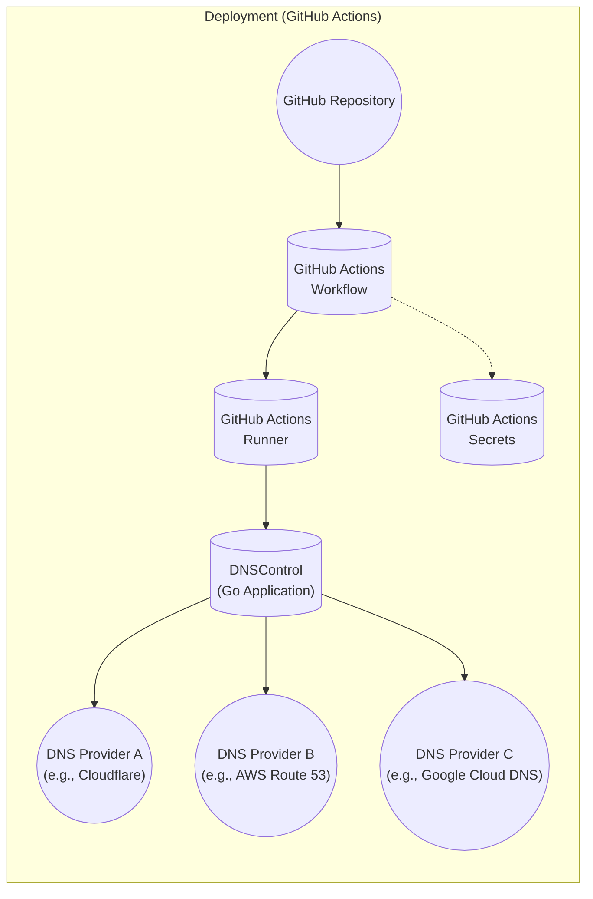
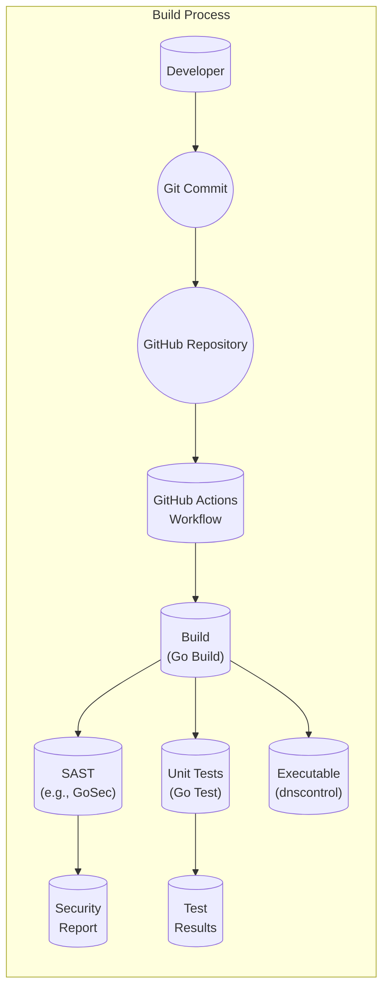

Okay, let's create a design document for DNSControl based on the provided GitHub repository.

# BUSINESS POSTURE

DNSControl is an open-source tool developed and maintained by Stack Exchange. It's designed to manage DNS records across multiple DNS providers. The primary business goals and priorities appear to be:

*   Operational Efficiency: Automate DNS management to reduce manual effort and errors.
*   Infrastructure as Code: Treat DNS configuration as code, enabling version control, testing, and repeatability.
*   Multi-Provider Support: Manage DNS records across various providers (e.g., Cloudflare, AWS Route 53, Google Cloud DNS) from a single source of truth.
*   Risk Mitigation: Reduce the risk of DNS misconfigurations, which can lead to service outages and security vulnerabilities.
*   Consistency and Standardization: Enforce consistent DNS configurations across the organization.
*   Fast Rollback: Ability to quickly revert to a previous DNS configuration in case of errors.

Most important business risks that need to be addressed:

*   Service Disruption: Incorrect DNS configurations can lead to website and service unavailability, directly impacting business operations.
*   Data Breach: Compromised DNS records can be used for phishing attacks or to redirect users to malicious sites, potentially leading to data breaches.
*   Reputation Damage: DNS-related issues can damage the company's reputation and erode customer trust.
*   Compliance Violations: Incorrect DNS configurations can lead to violations of compliance requirements (e.g., GDPR, HIPAA).
*   Supply Chain Attack: Compromised dependencies or build process can lead to malicious code injection.

# SECURITY POSTURE

Existing security controls and accepted risks (based on the repository and common practices):

*   security control: Version Control (Git): DNS configurations are stored in a Git repository, providing an audit trail and enabling rollbacks. Implemented in: GitHub repository.
*   security control: Code Review: Changes to DNS configurations are likely subject to code review before being applied. Implemented in: GitHub pull requests.
*   security control: Testing: DNSControl includes a testing framework to validate configurations before deployment. Implemented in: `dnscontrol test`.
*   security control: Least Privilege: API keys/credentials used by DNSControl should have the minimum necessary permissions. Implemented in: DNS provider configuration.
*   security control: Input Validation: DNSControl likely performs some input validation to prevent invalid DNS records. Implemented in: DNSControl core logic.
*   security control: Authentication: DNSControl uses API keys or other authentication mechanisms to interact with DNS providers. Implemented in: DNS provider configuration.
*   security control: Dependency Management: Dependencies are managed, likely with some form of vulnerability scanning. Implemented in: `go.mod`, `go.sum`.
*   accepted risk: Third-Party Provider Risk: Reliance on external DNS providers introduces a dependency on their security and availability.
*   accepted risk: Credential Management: Secure storage and handling of API keys/credentials are a shared responsibility.
*   accepted risk: Open Source Code: While beneficial for transparency, open-source code can be scrutinized by attackers for vulnerabilities.

Recommended security controls:

*   security control: Implement SAST (Static Application Security Testing) in the build pipeline.
*   security control: Implement DAST (Dynamic Application Security Testing) for API endpoints.
*   security control: Regularly audit API key permissions and rotate keys.
*   security control: Implement a secrets management solution (e.g., HashiCorp Vault) for storing and accessing API keys.
*   security control: Implement MFA (Multi-Factor Authentication) for access to the DNS provider accounts.
*   security control: Implement Software Bill of Materials (SBOM) generation.
*   security control: Implement software composition analysis (SCA) to identify vulnerabilities in third-party dependencies.

Security Requirements:

*   Authentication:
    *   DNSControl must authenticate securely with each DNS provider using API keys, service accounts, or other appropriate credentials.
    *   Credentials must be stored securely and not exposed in the code repository.
    *   Support for multi-factor authentication (MFA) with DNS providers is highly recommended.

*   Authorization:
    *   API keys/credentials used by DNSControl should have the minimum necessary permissions (least privilege) to perform their tasks.
    *   Access to modify DNS configurations should be restricted to authorized personnel.

*   Input Validation:
    *   DNSControl must validate all input data, including DNS record types, names, and values, to prevent invalid configurations.
    *   Validation should be performed against the specific requirements of each DNS provider.
    *   Input validation should prevent injection attacks, such as command injection or cross-site scripting (XSS).

*   Cryptography:
    *   Sensitive data, such as API keys, should be encrypted at rest and in transit.
    *   Use strong, industry-standard cryptographic algorithms and protocols.
    *   DNSSEC (DNS Security Extensions) should be considered for enhanced security.

# DESIGN

## C4 CONTEXT



Element descriptions:

*   Element:
    *   Name: User
    *   Type: Person
    *   Description: A person who interacts with DNSControl to manage DNS records.
    *   Responsibilities:
        *   Defines DNS configurations in `dnsconfig.js`.
        *   Runs DNSControl commands to preview and apply changes.
        *   Reviews and approves changes to DNS configurations.
    *   Security controls:
        *   Code review of changes.
        *   Authentication and authorization to access the Git repository and DNS provider accounts.

*   Element:
    *   Name: DNSControl
    *   Type: Software System (Go Application)
    *   Description: The core application that manages DNS records.
    *   Responsibilities:
        *   Reads DNS configurations from `dnsconfig.js`.
        *   Interacts with DNS providers' APIs to manage DNS records.
        *   Provides a command-line interface for users.
        *   Performs input validation and testing.
    *   Security controls:
        *   Input validation.
        *   Authentication with DNS providers.
        *   Least privilege access to DNS provider APIs.

*   Element:
    *   Name: DNS Provider A (e.g., Cloudflare)
    *   Type: External System
    *   Description: A third-party DNS provider.
    *   Responsibilities:
        *   Hosts DNS records.
        *   Provides an API for managing DNS records.
    *   Security controls:
        *   Provider's own security measures.
        *   Authentication and authorization via API keys.

*   Element:
    *   Name: DNS Provider B (e.g., AWS Route 53)
    *   Type: External System
    *   Description: A third-party DNS provider.
    *   Responsibilities:
        *   Hosts DNS records.
        *   Provides an API for managing DNS records.
    *   Security controls:
        *   Provider's own security measures.
        *   Authentication and authorization via API keys.

*   Element:
    *   Name: DNS Provider C (e.g., Google Cloud DNS)
    *   Type: External System
    *   Description: A third-party DNS provider.
    *   Responsibilities:
        *   Hosts DNS records.
        *   Provides an API for managing DNS records.
    *   Security controls:
        *   Provider's own security measures.
        *   Authentication and authorization via API keys.

*   Element:
    *   Name: Git Repository (e.g., GitHub)
    *   Type: External System
    *   Description: A version control system for storing DNS configurations.
    *   Responsibilities:
        *   Stores `dnsconfig.js` and other related files.
        *   Provides an audit trail of changes.
        *   Enables collaboration and code review.
    *   Security controls:
        *   Access control to the repository.
        *   Code review process.

## C4 CONTAINER

```mermaid
graph LR
    subgraph "DNSControl Containers"
        User(("User")) --> CLI[("CLI\n(dnscontrol)")]
        CLI --> Core[("Core Logic\n(Go)")]
        Core --> ProviderAPI(("Provider API\n(Go)")]
        ProviderAPI --> DNSProviderA(("DNS Provider A\n(e.g., Cloudflare)"))
        ProviderAPI --> DNSProviderB(("DNS Provider B\n(e.g., AWS Route 53)"))
        ProviderAPI --> DNSProviderC(("DNS Provider C\n(e.g., Google Cloud DNS)"))
        Core -.-> ConfigFile[("Configuration\n(dnsconfig.js)")]
        Core -.-> CredentialStore[("Credential\nStore")]
    end
```

Element descriptions:

*   Element:
    *   Name: User
    *   Type: Person
    *   Description: A person who interacts with DNSControl to manage DNS records.
    *   Responsibilities:
        *   Defines DNS configurations in `dnsconfig.js`.
        *   Runs DNSControl commands to preview and apply changes.
        *   Reviews and approves changes to DNS configurations.
    *   Security controls:
        *   Code review of changes.
        *   Authentication and authorization to access the Git repository and DNS provider accounts.

*   Element:
    *   Name: CLI (dnscontrol)
    *   Type: Container (Command-Line Interface)
    *   Description: The command-line interface for interacting with DNSControl.
    *   Responsibilities:
        *   Parses user commands.
        *   Calls the core logic.
        *   Displays output to the user.
    *   Security controls:
        *   Input validation.

*   Element:
    *   Name: Core Logic (Go)
    *   Type: Container (Go Code)
    *   Description: The main application logic.
    *   Responsibilities:
        *   Reads and parses `dnsconfig.js`.
        *   Manages the state of DNS records.
        *   Calls the Provider API to interact with DNS providers.
        *   Performs input validation and testing.
    *   Security controls:
        *   Input validation.
        *   Error handling.

*   Element:
    *   Name: Provider API (Go)
    *   Type: Container (Go Code)
    *   Description: Handles communication with different DNS providers.
    *   Responsibilities:
        *   Authenticates with DNS providers.
        *   Translates DNSControl commands into provider-specific API calls.
        *   Handles API responses and errors.
    *   Security controls:
        *   Authentication with DNS providers.
        *   Secure communication (HTTPS).
        *   Least privilege access.

*   Element:
    *   Name: DNS Provider A (e.g., Cloudflare)
    *   Type: External System
    *   Description: A third-party DNS provider.
    *   Responsibilities:
        *   Hosts DNS records.
        *   Provides an API for managing DNS records.
    *   Security controls:
        *   Provider's own security measures.
        *   Authentication and authorization via API keys.

*   Element:
    *   Name: DNS Provider B (e.g., AWS Route 53)
    *   Type: External System
    *   Description: A third-party DNS provider.
    *   Responsibilities:
        *   Hosts DNS records.
        *   Provides an API for managing DNS records.
    *   Security controls:
        *   Provider's own security measures.
        *   Authentication and authorization via API keys.

*   Element:
    *   Name: DNS Provider C (e.g., Google Cloud DNS)
    *   Type: External System
    *   Description: A third-party DNS provider.
    *   Responsibilities:
        *   Hosts DNS records.
        *   Provides an API for managing DNS records.
    *   Security controls:
        *   Provider's own security measures.
        *   Authentication and authorization via API keys.

*   Element:
    *   Name: Configuration (dnsconfig.js)
    *   Type: Data Store
    *   Description: The file containing the desired DNS configuration.
    *   Responsibilities:
        *   Stores the DNS records and settings.
    *   Security controls:
        *   Version control (Git).
        *   Code review.

*   Element:
    *   Name: Credential Store
    *   Type: Data Store
    *   Description: Secure storage for API keys and other credentials. Could be environment variables, a secrets management system, or a configuration file (less secure).
    *   Responsibilities:
        *   Securely stores credentials.
    *   Security controls:
        *   Encryption at rest.
        *   Access control.

## DEPLOYMENT

DNSControl is a client-side application, typically run on a developer's machine or a CI/CD server. There isn't a traditional "deployment" in the sense of a server-side application. However, we can describe how it's typically used in different environments:

Possible deployment solutions:

1.  Local Development: Run directly on a developer's machine.
2.  CI/CD Pipeline: Integrated into a CI/CD pipeline (e.g., GitHub Actions, Jenkins) to automate DNS updates.
3.  Dedicated Server/VM: Run on a dedicated server or virtual machine for centralized management.

Chosen deployment solution (CI/CD Pipeline - GitHub Actions):



Element descriptions:

*   Element:
    *   Name: GitHub Repository
    *   Type: Source Code Repository
    *   Description: The repository containing the DNSControl code and configuration.
    *   Responsibilities:
        *   Stores the code and configuration.
        *   Triggers the GitHub Actions workflow on changes.
    *   Security controls:
        *   Access control to the repository.
        *   Branch protection rules.

*   Element:
    *   Name: GitHub Actions Workflow
    *   Type: CI/CD Pipeline
    *   Description: The workflow that automates the DNS update process.
    *   Responsibilities:
        *   Runs tests.
        *   Builds the DNSControl executable.
        *   Applies DNS changes.
    *   Security controls:
        *   Workflow permissions.
        *   Secure access to secrets.

*   Element:
    *   Name: GitHub Actions Runner
    *   Type: Virtual Machine
    *   Description: The virtual machine that executes the workflow steps.
    *   Responsibilities:
        *   Provides the execution environment for DNSControl.
    *   Security controls:
        *   GitHub-managed runner security.

*   Element:
    *   Name: DNSControl (Go Application)
    *   Type: Software System
    *   Description: The core application that manages DNS records.
    *   Responsibilities:
        *   Reads DNS configurations.
        *   Interacts with DNS providers' APIs.
    *   Security controls:
        *   Input validation.
        *   Authentication with DNS providers.

*   Element:
    *   Name: DNS Provider A (e.g., Cloudflare)
    *   Type: External System
    *   Description: A third-party DNS provider.
    *   Responsibilities:
        *   Hosts DNS records.
        *   Provides an API for managing DNS records.
    *   Security controls:
        *   Provider's own security measures.
        *   Authentication and authorization via API keys.

*   Element:
    *   Name: DNS Provider B (e.g., AWS Route 53)
    *   Type: External System
    *   Description: A third-party DNS provider.
    *   Responsibilities:
        *   Hosts DNS records.
        *   Provides an API for managing DNS records.
    *   Security controls:
        *   Provider's own security measures.
        *   Authentication and authorization via API keys.

*   Element:
    *   Name: DNS Provider C (e.g., Google Cloud DNS)
    *   Type: External System
    *   Description: A third-party DNS provider.
    *   Responsibilities:
        *   Hosts DNS records.
        *   Provides an API for managing DNS records.
    *   Security controls:
        *   Provider's own security measures.
        *   Authentication and authorization via API keys.

*   Element:
    *   Name: GitHub Actions Secrets
    *   Type: Secret Store
    *   Description: Secure storage for API keys and other credentials within GitHub Actions.
    *   Responsibilities:
        *   Provides secure access to credentials during the workflow execution.
    *   Security controls:
        *   Encryption at rest.
        *   Access control.

## BUILD



Build process description:

1.  Developer commits code changes to the Git repository.
2.  GitHub Actions workflow is triggered.
3.  The workflow checks out the code.
4.  Go build is used to compile the code.
5.  SAST (Static Application Security Testing) tools (e.g., GoSec) are run to analyze the code for vulnerabilities.
6.  Unit tests are executed.
7.  If all checks pass, the build artifact (the `dnscontrol` executable) is created.
8.  The artifact can be stored or deployed.

Security controls in the build process:

*   security control: SAST (Static Application Security Testing): Analyzes the code for vulnerabilities.
*   security control: Unit Tests: Verify the functionality of individual components.
*   security control: Dependency Management: `go.mod` and `go.sum` manage dependencies and their versions.
*   security control: Build Automation (GitHub Actions): Ensures a consistent and repeatable build process.
*   security control: Code Review: All code changes are reviewed before being merged.

# RISK ASSESSMENT

*   Critical business process we are trying to protect:
    *   Maintaining the availability and integrity of DNS records, which are essential for the operation of online services.

*   Data we are trying to protect and their sensitivity:
    *   DNS Configuration Data (`dnsconfig.js`): Contains the DNS records for the organization's domains. Sensitivity: High - Incorrect or malicious modifications can lead to service outages or redirection to malicious sites.
    *   API Keys/Credentials: Used to authenticate with DNS providers. Sensitivity: Critical - Compromise can lead to unauthorized access to and control over DNS records.
    *   Source Code: The DNSControl codebase itself. Sensitivity: Medium - Vulnerabilities in the code could be exploited to compromise the DNS management process.

# QUESTIONS & ASSUMPTIONS

*   Questions:
    *   What specific DNS providers are used, and what are their security requirements?
    *   What is the current process for managing and rotating API keys?
    *   Are there any existing security audits or penetration tests performed on DNSControl or the DNS infrastructure?
    *   What is the process for handling security vulnerabilities discovered in DNSControl or its dependencies?
    *   What is the recovery plan in case of a major DNS-related incident?
    *   Is DNSSEC used, and if so, how is it managed?
    *   How are credentials for DNS providers stored and accessed? (Hoping for a secrets management solution, not hardcoded!)
    *   Are there any specific compliance requirements (e.g., GDPR, HIPAA) that need to be considered?

*   Assumptions:
    *   BUSINESS POSTURE: The organization prioritizes availability and reliability of its online services.
    *   BUSINESS POSTURE: The organization has a moderate risk appetite, balancing innovation with security.
    *   SECURITY POSTURE: Basic security practices, such as code review and version control, are already in place.
    *   SECURITY POSTURE: API keys are used for authentication with DNS providers.
    *   SECURITY POSTURE: There is some level of input validation in DNSControl.
    *   DESIGN: DNSControl is primarily used through its command-line interface.
    *   DESIGN: The `dnsconfig.js` file is the primary source of truth for DNS configurations.
    *   DESIGN: A CI/CD system (like GitHub Actions) is, or could be, used to automate DNS updates.
    *   DESIGN: Go modules are used for dependency management.
    *   DESIGN: GitHub Actions, or similar CI environment, is used for build automation.