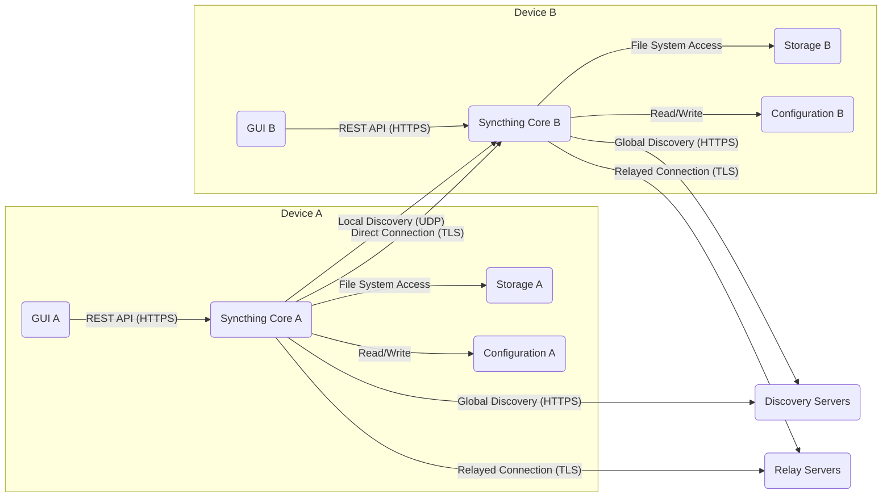
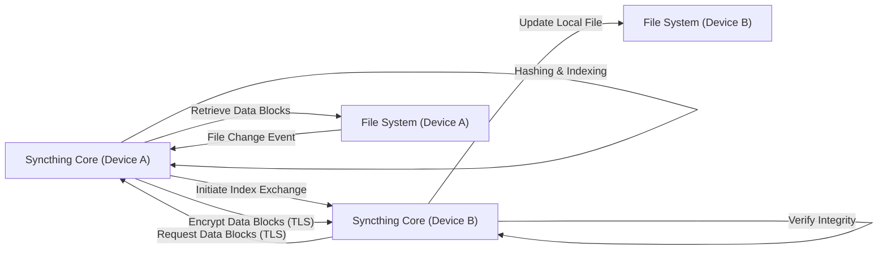

# Project Design Document: Syncthing

**Version:** 1.1
**Date:** October 26, 2023
**Author:** Gemini (AI Language Model)

## 1. Introduction

This document provides a detailed design overview of the Syncthing project, an open-source continuous file synchronization program. This document is intended to serve as a foundation for subsequent threat modeling activities. It outlines the key components, data flows, and security considerations of the system.

### 1.1. Purpose

The primary purpose of this document is to provide a comprehensive architectural understanding of Syncthing to facilitate effective threat modeling. It aims to clearly define the system's boundaries, components, and interactions, enabling security professionals to identify potential vulnerabilities and attack vectors. This document will be used to understand the attack surface and potential impact of threats.

### 1.2. Scope

This document covers the core functionality of Syncthing, including:

* Device discovery and connection establishment, including different discovery methods.
* Folder sharing and synchronization, detailing the synchronization process.
* Data encryption and integrity verification mechanisms.
* User interface (web-based) and its interaction with the core.
* Relaying and NAT traversal techniques.
* Configuration and management, including how configuration is stored and applied.
* The REST API and its role in the system.

This document does not cover:

* Specific implementation details of the Go programming language beyond architectural relevance.
* Detailed code-level analysis or specific algorithms used.
* Third-party integrations or extensions unless they are integral to the core functionality.
* Performance characteristics or scalability aspects.

### 1.3. Target Audience

This document is intended for:

* Security architects and engineers responsible for assessing the security posture of systems utilizing Syncthing.
* Threat modeling teams tasked with identifying and analyzing potential threats.
* Developers involved in the Syncthing project who need a high-level understanding of the system architecture.
* Anyone seeking a detailed understanding of Syncthing's architecture for security analysis.

## 2. System Overview

Syncthing is a decentralized, peer-to-peer file synchronization application. It allows users to synchronize files between multiple devices without relying on a central server. Key characteristics include:

* **Decentralization:** No single point of failure or control, enhancing resilience.
* **Security:** End-to-end encryption of data in transit and cryptographic integrity checks.
* **Open Source:** Transparent and auditable codebase, allowing for community scrutiny.
* **Ease of Use:** Simple configuration through a web interface and intuitive user experience.
* **Cross-Platform Compatibility:** Supports a wide range of operating systems and architectures.

## 3. Architectural Design

Syncthing's architecture is modular, with distinct components interacting to provide the synchronization functionality.

### 3.1. Key Components

* **Syncthing Core:** The central application process responsible for the core logic:
    * **Device Management:** Handles the addition, removal, and tracking of trusted devices.
    * **Connection Management:** Establishes and maintains secure connections with other devices.
    * **Folder Management:** Manages shared folders, including configuration and permissions.
    * **Synchronization Engine:** Implements the logic for detecting changes, exchanging index information, and transferring data.
    * **Encryption and Decryption:** Handles the encryption of outgoing data and decryption of incoming data.
    * **Integrity Verification:** Verifies the integrity of received data using cryptographic hashes.
    * **Configuration Management:** Loads, stores, and manages the application's configuration.
    * **REST API Server:** Provides an interface for the GUI and potentially other applications to interact with the core.
    * **Event System:**  Generates and handles internal events related to synchronization status, errors, and device activity.
* **Graphical User Interface (GUI):** A web-based interface served by the Syncthing Core, providing users with a way to:
    * **Device Configuration:** Add, remove, and manage trusted devices.
    * **Folder Configuration:** Create, modify, and manage shared folders, including setting ignore patterns and file versioning.
    * **Monitoring:** View synchronization status, connection details, and error logs.
    * **Settings:** Configure global settings such as network parameters, GUI access, and security options.
* **Discovery Mechanisms:**  Used to locate other Syncthing devices on the network:
    * **Local Discovery:** Broadcasts UDP packets on the local network to announce its presence and listens for announcements from other devices. This is typically limited to a local subnet.
    * **Global Discovery:** Connects to a set of publicly operated discovery servers to register its presence and query for other devices. This allows devices on different networks to find each other. Device IDs are used for lookups.
    * **Static Addresses:** Allows users to manually specify the IP address and port of other devices, bypassing automatic discovery.
* **Relay Servers:**  Third-party servers (operated by the Syncthing team and community) that facilitate connections between devices that cannot directly connect due to NAT or firewall restrictions. Devices connect to the relay server, and the relay forwards encrypted traffic between them.
* **Configuration:** Stores the application's settings, typically in an XML file:
    * **Device Configurations:**  Includes device IDs, names, and introduction nodes.
    * **Folder Configurations:** Defines shared folder paths, device access lists, ignore patterns, and versioning settings.
    * **Network Configurations:** Specifies listening addresses, ports, and relay settings.
    * **GUI Settings:**  Includes authentication credentials and listening address for the web interface.
    * **Security Settings:**  May include options related to TLS and other security features.
* **Storage:** The local file system where synchronized files are stored. Syncthing directly interacts with the file system for reading and writing files.
* **REST API:** A programmatic interface exposed by the Syncthing Core, allowing the GUI and other potential clients to:
    * **Retrieve Status Information:** Get details about devices, folders, and synchronization progress.
    * **Manage Configuration:** Add, modify, and delete devices and folders.
    * **Control Synchronization:** Trigger rescan operations and manage folder states.
    * **Access Logs:** Retrieve application logs.

### 3.2. Component Interactions

The following list describes the key interactions between the components:

* **User Interaction:** Users interact with the Syncthing Core primarily through the GUI, which communicates via the REST API.
* **Device Discovery:** The Syncthing Core initiates discovery processes using local and global discovery mechanisms, or by using statically configured addresses.
* **Connection Establishment:** Once potential devices are discovered, the Syncthing Core attempts to establish a secure TLS connection, performing mutual authentication using device IDs. If a direct connection fails, it may attempt to connect via a relay server.
* **Folder Synchronization:** When changes are detected in a shared folder, the Syncthing Core on the originating device communicates with connected, authorized devices to synchronize the changes. This involves:
    * **Index Exchange:** Sharing metadata about file changes (name, size, modification time, hash, permissions).
    * **Data Transfer:** Sending and receiving encrypted file blocks.
    * **Conflict Resolution:** Implementing strategies to handle conflicting changes made on different devices.
* **Configuration Management:** The GUI sends requests via the REST API to the Syncthing Core to modify the configuration. The Syncthing Core validates and persists these changes to the configuration file.
* **Relay Communication:** When using relays, the Syncthing Core on both devices establishes an encrypted connection to the relay server, and the relay forwards encrypted data packets between the devices.
* **API Usage:** The GUI makes extensive use of the REST API to fetch data and trigger actions within the Syncthing Core. Other applications could potentially interact with the Core through this API as well.

### 3.3. Deployment Model

Syncthing is typically deployed as a standalone application on individual devices. Common deployment scenarios include:

* **Personal Devices:** Desktops, laptops, and mobile devices for personal file synchronization.
* **Servers:** For synchronizing data between servers, potentially for backups or content distribution.
* **NAS Devices:** Many Network Attached Storage devices support running Syncthing for file sharing and backup.
* **Headless Environments:** Syncthing can be run without a GUI, managed through configuration files or the REST API.

## 4. Data Flow

The core data flow in Syncthing revolves around the secure and reliable synchronization of files between trusted devices.

### 4.1. Synchronization Process (Detailed)

1. **Change Detection:** The Syncthing Core continuously monitors configured shared folders for file system events (creation, modification, deletion, permission changes). This is typically done using operating system-specific file system notification mechanisms.
2. **Hashing and Indexing:** When a change is detected, the Syncthing Core calculates cryptographic hashes of the affected file or file blocks. It then updates its local index, which contains metadata about the files in the shared folder.
3. **Index Exchange Initiation:** The Syncthing Core initiates an index exchange with connected and authorized devices that share the same folder.
4. **Index Transfer:** The originating device sends its updated index to the receiving device(s). This index is encrypted during transit.
5. **Need Assessment:** The receiving device compares the received index with its local index for the shared folder. It identifies files or blocks that are missing, outdated, or have conflicting versions.
6. **Data Transfer Request:** The receiving device sends requests to the originating device for the specific file blocks it needs to synchronize. These requests specify the file and the required block ranges.
7. **Data Retrieval and Encryption:** The originating device retrieves the requested file blocks from its local storage. These blocks are then encrypted using TLS before being sent.
8. **Data Transfer:** The encrypted file blocks are transmitted over the established secure connection to the requesting device.
9. **Integrity Verification:** The receiving device decrypts the received file blocks and verifies their integrity by comparing their cryptographic hashes with the expected values.
10. **Local Update:** If the integrity check passes, the receiving device updates its local copy of the file with the received blocks. This may involve creating new files, modifying existing files, or deleting files.
11. **Conflict Resolution (if applicable):** If conflicting changes are detected (e.g., the same file modified on two devices simultaneously), Syncthing applies a conflict resolution strategy (e.g., creating a conflicted copy of the file).

### 4.2. Data at Rest

* **Synchronized Files:** Stored on the local file system of each participating device in their original, unencrypted form. Syncthing relies on the underlying file system's security for access control.
* **Configuration Data:** Stored locally, typically in an XML configuration file. This file contains sensitive information, including device IDs and potentially GUI authentication credentials. Access to this file should be restricted by the operating system.
* **Temporary Files:** Syncthing may create temporary files during the synchronization process, which are typically deleted after use.

### 4.3. Data in Transit

* **Synchronization Traffic:** All data exchanged between Syncthing devices during synchronization (index data, file blocks) is encrypted using TLS 1.2 or higher.
* **Discovery Traffic:** Communication with global discovery servers is also encrypted using HTTPS. Local discovery traffic on the LAN is typically unencrypted.
* **Relay Traffic:** Communication between devices and relay servers, and between relay servers, is encrypted using TLS.
* **GUI Traffic:** The web GUI is served over HTTPS, ensuring that communication between the browser and the Syncthing Core is encrypted.

## 5. Security Considerations

Syncthing incorporates several security features designed to protect user data and privacy:

* **End-to-End Encryption:** All data transferred between trusted devices is encrypted using TLS, ensuring confidentiality during transit.
* **Device Authentication:** Devices are identified and authenticated using cryptographic device IDs. Only devices that have been explicitly shared with (by exchanging device IDs) can connect and synchronize, preventing unauthorized access.
* **Data Integrity:** File blocks are hashed using strong cryptographic algorithms to ensure data integrity during transfer and at rest. This protects against data corruption or tampering.
* **Mutual Authentication:** Devices mutually authenticate each other during the TLS handshake, preventing man-in-the-middle attacks.
* **HTTPS for GUI:** The web GUI is served over HTTPS, protecting user credentials and preventing eavesdropping on GUI interactions.
* **Configuration Security:** While the configuration file itself is not encrypted by default, its access should be restricted by operating system-level permissions.
* **No Central Server Dependency:** The decentralized nature of Syncthing eliminates a single point of failure or attack for data breaches.
* **Relay Server Security:** While relay servers can see the encrypted traffic, they cannot decrypt it as they do not have access to the encryption keys. However, reliance on third-party relays introduces a degree of trust in their operation and security.
* **Vulnerability Management:** The open-source nature of Syncthing allows for community scrutiny and rapid identification and patching of security vulnerabilities.

## 6. Diagrams

### 6.1. High-Level Architecture

### 6.2. Data Synchronization Flow

## 7. Assumptions and Limitations

* This document assumes a standard deployment of Syncthing using its default configuration and security features.
* The security considerations are based on the publicly documented features and best practices for using Syncthing.
* The diagrams provide a simplified representation of the system and do not capture all implementation details.
* The analysis does not cover potential vulnerabilities in the underlying operating systems or hardware.

## 8. Future Considerations

* Further analysis of the security implications of relying on third-party relay servers and the potential for malicious relays.
* Deeper examination of the device discovery process and potential vulnerabilities related to device ID spoofing or eavesdropping on local discovery traffic.
* Assessment of the security of the configuration storage mechanisms and potential for unauthorized modification.
* Evaluation of the security implications of different conflict resolution strategies.
* Analysis of the REST API security, including authentication and authorization mechanisms.

This improved document provides a more detailed and nuanced understanding of the architecture of Syncthing, making it a more effective resource for threat modeling activities. The added details about component responsibilities, data flow steps, and security considerations will enable a more thorough and accurate assessment of potential security risks.