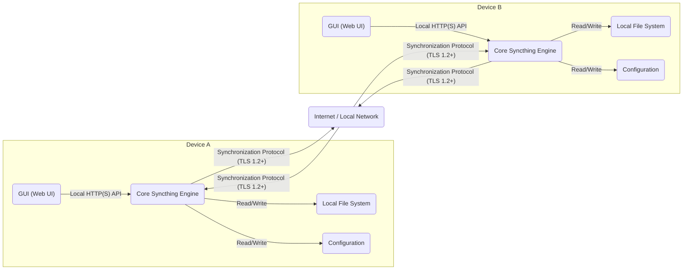
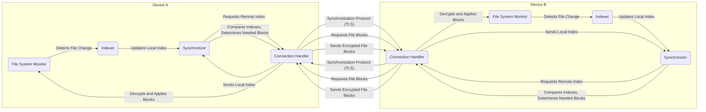

# Project Design Document: Syncthing

**Version:** 1.1
**Date:** October 26, 2023
**Author:** AI Cloud & Security Architect

## 1. Project Overview

This document provides a detailed architectural design of Syncthing, a continuous, open-source file synchronization program. It is designed to be a comprehensive resource for understanding the system's components, interactions, and data flow, specifically to serve as a foundation for subsequent threat modeling activities.

Syncthing enables users to synchronize files between two or more computers in a peer-to-peer fashion. A core principle is user control over their data: where it is stored, whether it is shared, and how it's transmitted.

This document focuses on the core architectural elements and their interactions, providing the necessary context for identifying potential security vulnerabilities and attack vectors. It aims to be both technically accurate and accessible to a security-focused audience.

## 2. Goals

* Provide a clear, concise, and technically accurate description of Syncthing's architecture.
* Identify and describe the responsibilities of each key component within the system.
* Illustrate the data flow during the synchronization process.
* Highlight critical security features, considerations, and potential areas of concern.
* Serve as a foundational document for conducting thorough and effective threat modeling exercises.

## 3. Target Audience

* Security engineers and architects responsible for assessing the security of systems integrating with or utilizing Syncthing.
* Developers involved in the development, maintenance, or extension of Syncthing.
* Individuals and teams performing threat modeling, security assessments, and penetration testing of Syncthing.
* Anyone seeking a detailed understanding of Syncthing's internal workings with a focus on security implications.

## 4. High-Level Architecture

Syncthing operates as a decentralized, peer-to-peer (P2P) system. Each instance of Syncthing running on a device functions as an independent node, communicating directly with other nodes it is configured to connect with. There is no central server controlling the synchronization process.

**Key Components:**

* **Core Syncthing Engine:** The central daemon responsible for all synchronization logic, including device discovery, connection management, data transfer, and security enforcement.
* **GUI (Web UI):** A web-based user interface for configuring, managing, and monitoring the local Syncthing instance.
* **Local File System:** The directory or directories on the local device where synchronized files are stored.
* **Configuration:** Stores the settings for the local Syncthing instance, including device IDs, shared folder definitions, network configurations, and security parameters.
* **Discovery Service (Global and Local):** Mechanisms used by Syncthing nodes to find other available Syncthing devices on the network.
* **Relay Servers (Optional):**  Third-party servers that can be used to relay communication between devices that cannot establish a direct connection.

## 5. Detailed Component Descriptions

* **Core Syncthing Engine:**
    * **Responsibilities:**
        * Establishing and maintaining secure connections with other trusted Syncthing devices.
        * Monitoring the local file system for changes within synchronized folders.
        * Exchanging index information (file metadata and block hashes) with connected devices.
        * Negotiating synchronization actions required to bring devices into a consistent state.
        * Transferring file data and metadata using an efficient block exchange protocol.
        * Handling file conflicts based on configured resolution strategies.
        * Enforcing security measures, including TLS encryption, device authentication, and authorization based on shared folder configurations.
        * Providing a local HTTP(S) API for the GUI and potential external integrations.
    * **Key Features:**
        * Real-time, continuous synchronization of file changes.
        * Block-level transfer mechanism to minimize bandwidth usage and improve efficiency.
        * End-to-end encryption of data in transit using TLS 1.2 or later.
        * Strong device authentication based on cryptographic keys and device IDs.
        * Decentralized operation, eliminating single points of failure.
        * Conflict resolution mechanisms to handle simultaneous changes.
        * Optional file versioning (file history).

* **GUI (Web UI):**
    * **Responsibilities:**
        * Providing a user-friendly interface for configuring Syncthing settings.
        * Displaying the current status of connections, synchronization progress, and any errors.
        * Managing trusted devices and shared folders.
        * Configuring advanced settings, such as ignore patterns, file versioning, and network parameters.
        * Authenticating users to control access to the GUI itself (optional).
    * **Key Features:**
        * Accessible via a web browser, typically on `localhost` or a configured network interface.
        * Communicates with the Core Syncthing Engine via a local HTTP(S) API.
        * Supports optional username/password authentication and HTTPS for secure access.

* **Local File System:**
    * **Responsibilities:**
        * Storing the actual file data that is being synchronized.
        * Providing standard file system operations (read, write, delete, rename, etc.) for Syncthing to interact with the files.
        * Reflecting the changes made by the local Syncthing instance and changes received from remote devices.
    * **Key Features:**
        * Relies on the underlying operating system's file system implementation and permissions.
        * Syncthing operates with the permissions of the user running the Syncthing process.

* **Configuration:**
    * **Responsibilities:**
        * Persistently storing Syncthing's configuration settings, including device IDs, trusted device lists, shared folder definitions, API keys, and network settings.
        * Securely storing sensitive information, such as device private keys.
        * Providing the Core Syncthing Engine with the necessary parameters for operation.
    * **Key Features:**
        * Typically stored in an XML configuration file (`config.xml`).
        * Contains cryptographic keys and other sensitive data that must be protected.
        * Modifications are typically done through the GUI or the local API.

* **Discovery Service:**
    * **Global Discovery:**
        * **Responsibilities:** Enables devices to find each other even if they are on different networks and do not know each other's IP addresses.
        * **Mechanism:** Devices can optionally register their presence (specifically their device ID and listening address) with a set of publicly operated discovery servers. Other devices can query these servers to find potential peers.
        * **Security Considerations:** Communication with discovery servers is encrypted. Device IDs are public. The discovery process itself does not automatically establish trust; pairing is still required.
    * **Local Discovery:**
        * **Responsibilities:** Allows devices on the same local network (typically a LAN) to automatically discover each other without needing to know their specific addresses.
        * **Mechanism:** Uses multicast or broadcast messages on the local network to announce the presence of Syncthing instances.
        * **Security Considerations:** Relies on the security of the local network. Malicious actors on the same network could potentially impersonate devices or intercept discovery messages.

* **Relay Servers:**
    * **Responsibilities:** Act as intermediaries to facilitate communication between devices that cannot establish a direct peer-to-peer connection, often due to Network Address Translation (NAT) or firewall restrictions.
    * **Mechanism:** Devices connect to a relay server, and the relay forwards encrypted traffic between them. The relay server itself does not have access to the decrypted content.
    * **Security Considerations:**  Communication between Syncthing nodes and relay servers is encrypted. While relay servers can see connection metadata (source and destination IP addresses), they cannot decrypt the synchronized data. Users can choose to use specific relay servers or operate their own.

## 6. Data Flow

The following describes the typical data flow during a file synchronization process between two paired devices:

**Steps:**

1. **File Change Detection:** The File System Monitor on either Device A or Device B detects a change (creation, modification, deletion) within a synchronized folder.
2. **Index Update:** The Indexer on the respective device updates its local index database to reflect the file change, including metadata and block hashes.
3. **Synchronization Initiation:** The Synchronizer on the device with the change initiates the synchronization process with the connected peer.
4. **Index Exchange:** The Connection Handlers on both devices establish a secure (TLS) connection and exchange their current index information.
5. **Comparison and Negotiation:** The Syncronizers compare the received remote index with their local index to determine which file blocks or metadata need to be transferred to achieve synchronization.
6. **Block Request:** The Synchronizer requests the necessary file blocks from the remote device.
7. **Data Transfer:** The Connection Handlers facilitate the transfer of the encrypted file blocks over the secure TLS connection.
8. **Applying Changes:** The receiving device's Connection Handler decrypts the received blocks, and the File System Monitor applies the changes to the local file system.

## 7. Security Considerations

* **Data Encryption in Transit:** All communication between Syncthing devices is encrypted using TLS 1.2 or later, protecting data from eavesdropping and tampering during transmission.
* **Device Authentication:** Each Syncthing instance is identified by a unique cryptographic device ID. Only devices that have been mutually paired and trust each other can connect and synchronize data. This prevents unauthorized devices from accessing or modifying synchronized files.
* **Configuration Security:** The `config.xml` file contains sensitive information, including device private keys. Access to this file should be restricted to prevent unauthorized modification or extraction of keys.
* **Web UI Security:** The web UI should be protected with a strong, unique password if authentication is enabled. Using HTTPS for accessing the UI, especially remotely, is crucial to protect login credentials and prevent session hijacking.
* **Relay Server Trust:** While relay servers cannot decrypt the synchronized data, users should be aware that these are third-party services and exercise caution when relying on them. Running a personal relay server provides more control.
* **Discovery Protocol Security:** While the global discovery service uses encryption, the information exchanged is primarily device IDs and addresses. Local discovery relies on the security of the local network. Attackers on the same LAN could potentially interfere with the discovery process.
* **Code Security and Open Source Nature:** As an open-source project, Syncthing benefits from community scrutiny, which can help identify and address potential vulnerabilities. However, users should ensure they are using official releases and keep their installations updated.
* **Dependency Management:** Syncthing relies on various libraries and dependencies. Security vulnerabilities in these dependencies could potentially impact Syncthing's security. Regular updates and security scanning are important.
* **Denial of Service:** While TLS encryption protects data, Syncthing instances could be targets of denial-of-service attacks at the network or application level. Rate limiting and other defensive measures may be necessary in certain environments.
* **Physical Security:** The security of the devices running Syncthing is paramount. If a device is compromised, the synchronized data and the Syncthing configuration on that device could be at risk.

## 8. Assumptions and Constraints

* This document describes the general architecture and typical operation of Syncthing. Specific implementation details and features may vary across different versions.
* The primary focus is on the core file synchronization functionality. Advanced features or external integrations are not covered in detail.
* It is assumed that the underlying operating system and network infrastructure have a baseline level of security.
* The document assumes a typical deployment scenario where users intentionally pair devices for synchronization.

## 9. Future Considerations

* Exploring more fine-grained access control mechanisms for shared folders, potentially beyond device-level authorization.
* Enhancing the security of the discovery protocols to mitigate potential risks on untrusted networks.
* Investigating and potentially implementing end-to-end encryption at the application layer, independent of TLS.
* Formalizing and regularly conducting security audits and penetration testing by independent security experts.
* Improving the handling of compromised device scenarios and key revocation mechanisms.

This document provides a detailed architectural overview of Syncthing, specifically tailored for security analysis and threat modeling. By understanding the components, data flow, and inherent security mechanisms, security professionals can effectively identify potential vulnerabilities and develop appropriate mitigation strategies to ensure the secure and reliable operation of Syncthing.