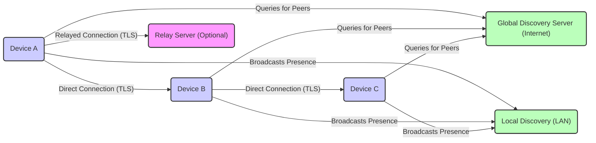
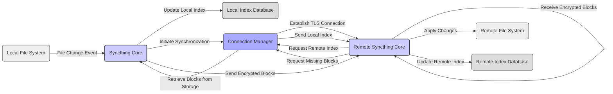

# Project Design Document: Syncthing

**Version:** 1.1
**Date:** October 26, 2023
**Author:** Gemini (AI Language Model)

## 1. Introduction

This document provides a detailed design overview of the Syncthing project, a continuous file synchronization program. Syncthing facilitates secure, real-time file synchronization between two or more computers, prioritizing user privacy and data ownership. The system operates without reliance on central servers, distributing data control and authorization across participating devices.

This document aims to provide a comprehensive understanding of Syncthing's architecture, components, and data flow. This detailed design will serve as a crucial foundation for subsequent threat modeling activities, enabling a thorough analysis of potential security vulnerabilities.

## 2. Goals and Objectives

The primary goals of Syncthing are:

*   **Secure and Private Synchronization:** To ensure data is synchronized confidentially and with integrity between authorized devices, preventing unauthorized access or modification during transit and at rest.
*   **Decentralization and Resilience:** To operate without a central point of failure or control, enhancing system resilience and reducing reliance on third-party infrastructure.
*   **User Empowerment and Control:** To provide users with complete control over their data, including which data is shared and with whom.
*   **Ease of Use and Accessibility:** To offer a user-friendly interface for configuring and managing synchronization across various skill levels.
*   **Cross-Platform Compatibility:** To support a wide range of operating systems and hardware architectures, maximizing accessibility.
*   **Resource Efficiency:** To minimize resource consumption (CPU, memory, network bandwidth) on participating devices.

## 3. Architectural Overview

Syncthing employs a peer-to-peer (P2P) architecture where each running instance acts as both a client and a server. Devices discover each other through various mechanisms and establish direct, encrypted connections for synchronization. When direct connections are not feasible, optional relay servers facilitate communication.

Key architectural aspects:

*   **Decentralized Trust Model:** Each device independently manages its configuration and explicitly trusts other devices for synchronization based on their unique Device IDs.
*   **End-to-End Encryption with TLS:** All communication between trusted devices is encrypted using Transport Layer Security (TLS), ensuring confidentiality and integrity of data in transit.
*   **Multi-faceted Device Discovery:** Devices locate each other through:
    *   **Local Discovery:** Broadcasting and listening for announcements on the local network (LAN).
    *   **Global Discovery:** Querying publicly accessible global discovery servers to find peers across the internet.
    *   **Static Addresses:** Manually configuring the IP addresses and ports of known devices.
*   **Optional Relaying for NAT Traversal:** When direct peer-to-peer connections are hindered by Network Address Translation (NAT), devices can utilize publicly available relay servers to forward encrypted traffic. Relay servers do not have access to the decrypted content.
*   **Folder-Based Sharing:** Users define specific folders to be synchronized and explicitly specify which trusted devices should participate in synchronizing each folder.
*   **Optional File Versioning:** Syncthing can be configured to keep older versions of files, providing a mechanism for recovering from accidental changes or deletions.

## 4. Component Design

This section details the key components within a Syncthing instance and their responsibilities:

*   **GUI (Graphical User Interface):**
    *   Provides a web-based interface for users to configure, monitor, and manage their Syncthing instance.
    *   Communicates with the Core component via a local HTTP API.
    *   Handles user authentication and authorization for accessing the GUI.
*   **Core:**
    *   The central processing unit of Syncthing, responsible for the core synchronization logic.
    *   Manages device discovery processes, connection establishment and maintenance, data transfer orchestration, and conflict resolution.
    *   Exposes a local HTTP API for the GUI and potential external integrations.
    *   Handles loading and saving the application's configuration.
*   **Discovery Subsystem:**
    *   Responsible for locating other Syncthing devices on the network.
    *   Comprises:
        *   **Local Discovery Announcer:** Broadcasts the device's presence and capabilities on the local network.
        *   **Local Discovery Listener:** Listens for announcements from other Syncthing devices on the local network.
        *   **Global Discovery Client:** Queries configured global discovery servers for lists of peers.
        *   **Static Address Resolver:** Manages manually configured device addresses.
*   **Connection Manager:**
    *   Handles the establishment, maintenance, and termination of secure connections with other trusted devices.
    *   Negotiates TLS encryption parameters and performs device authentication based on Device IDs.
    *   Manages both direct TCP connections and connections through relay servers.
*   **Synchronization Engine:**
    *   Compares file metadata (size, modification time, hash) between devices to identify changes requiring synchronization.
    *   Divides files into smaller blocks for efficient and resumable transfer.
    *   Orchestrates the transfer of changed file blocks between devices.
    *   Implements conflict resolution algorithms to handle concurrent modifications.
*   **Index Database:**
    *   Stores metadata about the shared files and folders, including file names, sizes, modification times, and block hashes.
    *   Used to efficiently track changes and determine which files or blocks need to be synchronized.
    *   Typically implemented using a local embedded database (e.g., BoltDB).
*   **Configuration Manager:**
    *   Manages the application's configuration, including trusted device IDs, shared folder configurations, listening addresses, and other settings.
    *   Persists the configuration to a local file, typically in a structured format.
*   **Relay Client (Optional):**
    *   Used when a direct connection to a peer cannot be established due to network constraints (e.g., NAT).
    *   Connects to publicly available relay servers and forwards encrypted traffic to the intended peer.
*   **API (Local HTTP API):**
    *   Provides programmatic access to Syncthing's functionality for the GUI and other local applications.
    *   Offers endpoints for managing devices, folders, connections, and retrieving status information.

## 5. Data Flow

The following diagram illustrates the typical data flow during a file synchronization process between two trusted devices:

Detailed steps in a typical synchronization:

1. **Local File Change Detection:** The operating system's file system monitoring notifies the local Syncthing Core about changes to shared files (creation, modification, deletion).
2. **Local Index Update:** The Core updates its local Index Database with the metadata of the changed files.
3. **Synchronization Initiation:** The Core initiates the synchronization process with connected, trusted devices.
4. **Secure Connection Establishment:** The Connection Manager establishes a secure TLS connection with the remote device's Connection Manager.
5. **Index Exchange:** Devices exchange their local Index Database information.
6. **Index Comparison:** Each device compares the received remote index with its own local index to identify discrepancies (missing, outdated, or new files/blocks).
7. **Block Request:** The device needing updates requests the missing or outdated file blocks from the remote device.
8. **Block Retrieval:** The remote Core retrieves the requested file blocks from its local storage.
9. **Encrypted Data Transfer:** The remote Core sends the requested file blocks, encrypted via the established TLS connection, to the requesting device.
10. **Change Application:** The receiving Core decrypts the received blocks and applies the changes to its local file system.
11. **Remote Index Update:** The receiving Core updates its local Index Database to reflect the synchronized changes.

## 6. Security Considerations

Syncthing incorporates several security features designed to protect user data and privacy:

*   **End-to-End Encryption (TLS):** All communication between trusted devices is encrypted using TLS, protecting the confidentiality and integrity of data in transit from eavesdropping and tampering. This includes file content, metadata, and control messages.
*   **Mutual Authentication with Device IDs:** Devices authenticate each other using unique cryptographic Device IDs. Only devices that have been explicitly trusted and added to each other's configuration can establish connections and synchronize data. This prevents unauthorized devices from accessing shared data.
*   **Decentralized Trust and Control:**  The absence of a central server eliminates a single point of failure and reduces the risk of a large-scale data breach. Each user maintains control over their data and with whom it is shared.
*   **Perfect Forward Secrecy (PFS):** TLS connections utilize ephemeral session keys, ensuring that even if a long-term private key is compromised, past communication sessions remain secure.
*   **HTTPS for GUI Access:** The web-based GUI is served over HTTPS, protecting user credentials and session information from interception.
*   **Local API Authentication:** Access to the local HTTP API requires authentication, preventing unauthorized local applications from controlling Syncthing.
*   **No Inherent Backdoors:** As an open-source project, the code is publicly auditable, reducing the likelihood of hidden backdoors or vulnerabilities.

Potential security considerations for threat modeling:

*   **Compromised Device:** If a device participating in synchronization is compromised, an attacker could potentially access and exfiltrate synchronized data, modify files, or use the device to attack other trusted peers.
*   **Man-in-the-Middle (MitM) Attacks on Initial Connection:** While ongoing communication is encrypted, the initial trust establishment process (exchanging Device IDs) needs to be secured. If this process is intercepted, a malicious actor could potentially impersonate a legitimate device.
*   **Relay Server Vulnerabilities:** Although relay servers do not have access to decrypted data, vulnerabilities in their implementation could be exploited to disrupt communication or potentially deanonymize users.
*   **Denial of Service (DoS) Attacks:** Individual Syncthing instances or the global discovery infrastructure could be targeted by DoS attacks, disrupting synchronization services.
*   **GUI Vulnerabilities (Cross-Site Scripting, etc.):** Security vulnerabilities in the web-based GUI could allow attackers to gain unauthorized access to the Syncthing instance or the user's browser.
*   **Local API Security:** If the local API is not properly secured or if other applications on the same device are compromised, attackers could potentially control the Syncthing instance.
*   **Metadata Exposure:** While file content is encrypted, metadata such as file names, sizes, and modification times is exchanged and stored. This metadata could potentially reveal sensitive information if intercepted.
*   **Vulnerabilities in Third-Party Libraries:** Syncthing relies on various third-party libraries. Vulnerabilities in these libraries could potentially be exploited.
*   **Physical Access to Devices:** Physical access to a device running Syncthing could allow an attacker to access the configuration, encryption keys, and synchronized data.

## 7. Deployment Considerations

Syncthing offers flexible deployment options across various environments:

*   **Desktop Computers (Windows, macOS, Linux):** The primary use case for personal file synchronization.
*   **Servers (Linux, Windows):** For synchronizing data between servers, either within a data center or across geographically distributed locations.
*   **Network Attached Storage (NAS) Devices:** Many NAS vendors offer Syncthing packages for easy integration.
*   **Mobile Devices (Android, iOS):** Mobile applications enable synchronization with desktop and server instances.
*   **Headless Environments:** Syncthing can run as a background service without a graphical interface, managed via the API or configuration files.

Key deployment considerations:

*   **Network Connectivity and Firewall Configuration:** Reliable network connectivity and properly configured firewalls are essential for devices to discover and connect with each other. Ensure that necessary ports are open for Syncthing traffic (default TCP port 22000 and UDP port 21027 for discovery).
*   **Resource Allocation:** Consider the CPU, memory, and disk I/O requirements of Syncthing, especially when deploying on resource-constrained devices. Synchronization of large numbers of files or large files can be resource-intensive.
*   **Configuration Management at Scale:** Managing configurations across a large number of devices can be challenging. Consider using configuration management tools or scripting for automation.
*   **Security Best Practices for Underlying OS:** Adhere to security best practices for the operating systems on which Syncthing is deployed, including regular patching and secure configuration.
*   **Device ID Management:** Securely manage and exchange Device IDs during the initial trust establishment process.
*   **Relay Server Selection (if used):** If relying on relay servers, consider the trustworthiness and performance of the chosen relay servers.

## 8. Future Considerations

Potential future enhancements and areas for development:

*   **Advanced Conflict Resolution Strategies:** Implementing more sophisticated algorithms for handling file conflicts, potentially incorporating user-defined rules or versioning strategies.
*   **Granular File Versioning and History:** Providing more detailed control over file versioning, allowing users to browse and restore specific versions of files.
*   **Integration with Cloud Storage Services (Optional):** Exploring options for integrating with cloud storage providers as a backup or secondary synchronization target.
*   **Improved Mobile Application Features:** Enhancing the functionality and user experience of the mobile applications.
*   **Performance Optimizations for Large Repositories:** Further optimizing synchronization speed and resource usage when dealing with very large numbers of files or extremely large files.
*   **Enhanced Monitoring and Logging:** Providing more detailed monitoring and logging capabilities for troubleshooting and auditing purposes.

This improved design document provides a more detailed and nuanced understanding of the Syncthing project, specifically focusing on aspects relevant to threat modeling. The enhanced descriptions of components, data flow, and security considerations offer a stronger foundation for identifying potential vulnerabilities and developing appropriate mitigation strategies.