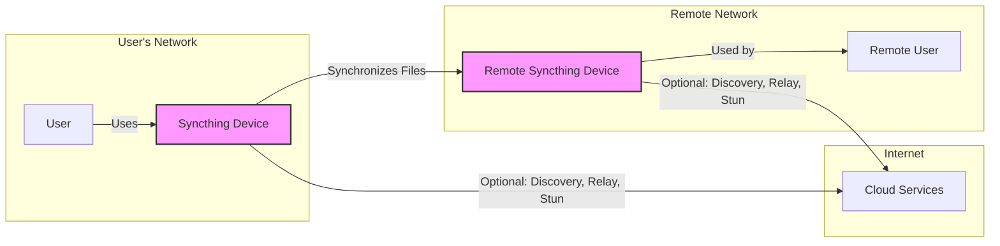
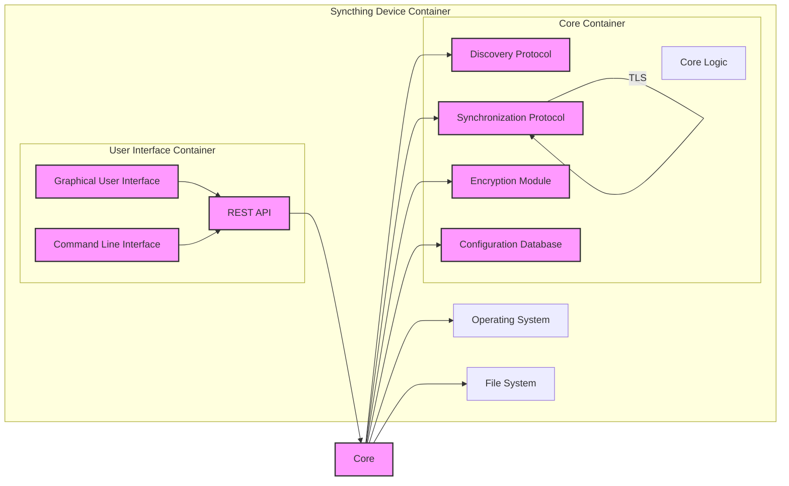

# BUSINESS POSTURE

Syncthing is a continuous file synchronization program. It synchronizes files between two or more computers in real time, safely protected from prying eyes. Data is encrypted and authentication is done via TLS.

- Business priorities and goals:
  - Provide users with a reliable and secure way to synchronize files across multiple devices.
  - Ensure data privacy and confidentiality during synchronization.
  - Offer a decentralized and open-source alternative to cloud-based synchronization services.
  - Support various operating systems and platforms.
  - Maintain ease of use and configuration for end-users.

- Business risks:
  - Data loss or corruption during synchronization.
  - Unauthorized access to synchronized data.
  - Vulnerabilities in the software leading to security breaches.
  - Reputational damage due to security incidents or data breaches.
  - Lack of user trust if security is compromised.

# SECURITY POSTURE

- Existing security controls:
  - security control: TLS encryption for communication between devices. Implemented in the core synchronization protocol.
  - security control: Data-at-rest encryption (optional, depends on OS and user configuration). Implemented by underlying operating system or third-party tools.
  - security control: Authentication between devices using device IDs and keys. Implemented in the core synchronization protocol.
  - security control: Code review process (community-driven, open source). Described in project contribution guidelines.
  - security control: Vulnerability reporting and patching process (community-driven). Described in project documentation and communication channels.
  - accepted risk: Reliance on user configuration for data-at-rest encryption.
  - accepted risk: Security of underlying operating system and hardware.

- Recommended security controls:
  - security control: Automated security scanning (SAST/DAST) integrated into the CI/CD pipeline.
  - security control: Dependency vulnerability scanning to identify and address vulnerable dependencies.
  - security control: Regular penetration testing by security professionals.
  - security control: Implement and enforce secure coding practices guidelines for developers.
  - security control: Security awareness training for developers and contributors.

- Security requirements:
  - Authentication:
    - Devices must authenticate each other before establishing a synchronization connection.
    - Authentication should be mutual and based on cryptographic keys.
    - Device IDs should be unique and securely generated.
  - Authorization:
    - Access control mechanisms to manage shared folders and devices.
    - Users should be able to define which devices can access specific folders.
    - Granular permissions for read/write access to shared folders.
  - Input validation:
    - Validate all inputs from users and remote devices to prevent injection attacks.
    - Sanitize file paths and names to prevent directory traversal vulnerabilities.
    - Validate configuration parameters to prevent unexpected behavior.
  - Cryptography:
    - Use strong cryptographic algorithms for encryption and authentication (e.g., TLS 1.3, AES-256, ChaCha20-Poly1305).
    - Securely manage cryptographic keys and certificates.
    - Implement proper key exchange and key derivation mechanisms.
    - Ensure data integrity using cryptographic hashing.

# DESIGN

## C4 CONTEXT



- Context Diagram Elements:
  - Element:
    - Name: User
    - Type: Person
    - Description: An individual who uses Syncthing to synchronize files across their devices or with other users.
    - Responsibilities: Configures Syncthing, manages shared folders, and interacts with the Syncthing application.
    - Security controls: Operating system user account management, strong passwords, multi-factor authentication for device access.
  - Element:
    - Name: Syncthing Device
    - Type: Software System
    - Description: An instance of the Syncthing application running on a user's computer, server, or mobile device. It is responsible for synchronizing files with other Syncthing devices.
    - Responsibilities: File synchronization, data encryption, device authentication, user interface, configuration management.
    - Security controls: TLS encryption, device authentication, access control lists for shared folders, input validation, secure configuration defaults.
  - Element:
    - Name: Remote Syncthing Device
    - Type: Software System
    - Description: Another instance of the Syncthing application running on a remote user's device, participating in file synchronization.
    - Responsibilities: File synchronization, data encryption, device authentication.
    - Security controls: TLS encryption, device authentication, access control lists for shared folders, input validation, secure configuration defaults.
  - Element:
    - Name: Remote User
    - Type: Person
    - Description: Another individual who uses a remote Syncthing device to synchronize files with the primary user.
    - Responsibilities: Configures Syncthing, manages shared folders, and interacts with the Syncthing application on their device.
    - Security controls: Operating system user account management, strong passwords, multi-factor authentication for device access.
  - Element:
    - Name: Cloud Services
    - Type: External System
    - Description: Optional cloud-based services used by Syncthing for device discovery (discovery servers), relaying connections (relay servers), and NAT traversal (STUN servers). These are operated by the Syncthing project or community.
    - Responsibilities: Device discovery, connection relaying, NAT traversal assistance.
    - Security controls: TLS encryption for communication, access control for administrative functions, monitoring and logging.

## C4 CONTAINER



- Container Diagram Elements:
  - Element:
    - Name: Core Logic
    - Type: Container - Application
    - Description: The main application logic of Syncthing, responsible for coordinating synchronization, managing devices and folders, and interacting with other containers.
    - Responsibilities: Orchestrates synchronization process, manages configuration, handles device and folder management, implements business logic.
    - Security controls: Input validation, access control within the application, secure configuration handling, logging and monitoring.
  - Element:
    - Name: Discovery Protocol
    - Type: Container - Application Module
    - Description: Implements the device discovery protocol, allowing Syncthing devices to find each other on local networks or via global discovery servers.
    - Responsibilities: Device discovery, announcing device presence, querying for other devices.
    - Security controls: Secure discovery protocol, protection against spoofing and man-in-the-middle attacks, rate limiting to prevent abuse.
  - Element:
    - Name: Synchronization Protocol
    - Type: Container - Application Module
    - Description: Implements the core synchronization protocol, handling file transfer, versioning, conflict resolution, and data exchange between devices.
    - Responsibilities: File synchronization, data transfer, versioning, conflict resolution, protocol implementation.
    - Security controls: TLS encryption, secure protocol design, input validation, data integrity checks, resistance to replay attacks.
  - Element:
    - Name: Encryption Module
    - Type: Container - Application Module
    - Description: Provides cryptographic functionalities for data encryption and decryption, key management, and secure communication.
    - Responsibilities: Data encryption/decryption, key generation and management, cryptographic algorithm implementation.
    - Security controls: Use of strong cryptographic algorithms, secure key storage and handling, protection against cryptographic attacks.
  - Element:
    - Name: Configuration Database
    - Type: Container - Data Store
    - Description: Stores Syncthing's configuration data, including device IDs, folder configurations, user preferences, and application state.
    - Responsibilities: Persistent storage of configuration data, data retrieval and update.
    - Security controls: Access control to the database, data-at-rest encryption (if supported by underlying storage), protection against SQL injection (if applicable).
  - Element:
    - Name: Graphical User Interface (GUI)
    - Type: Container - Application
    - Description: Provides a user-friendly graphical interface for managing Syncthing, configuring settings, and monitoring synchronization status.
    - Responsibilities: User interaction, configuration management, status display.
    - Security controls: Input validation, output encoding, protection against cross-site scripting (XSS) and other web-based vulnerabilities, authentication and authorization for administrative functions.
  - Element:
    - Name: Command Line Interface (CLI)
    - Type: Container - Application
    - Description: Provides a command-line interface for managing Syncthing, allowing for scripting and automation.
    - Responsibilities: Command-line user interaction, configuration management, scripting support.
    - Security controls: Input validation, secure command parsing, protection against command injection vulnerabilities, access control for administrative commands.
  - Element:
    - Name: REST API
    - Type: Container - Application
    - Description: Provides a RESTful API for programmatic access to Syncthing's functionalities, enabling integration with other applications and automation tools.
    - Responsibilities: API endpoint management, request handling, data serialization and deserialization.
    - Security controls: Authentication and authorization for API access, input validation, output encoding, protection against API-specific vulnerabilities (e.g., injection, broken authentication).
  - Element:
    - Name: Operating System
    - Type: Infrastructure
    - Description: The underlying operating system on which Syncthing is running (e.g., Windows, Linux, macOS, Android).
    - Responsibilities: Process management, resource allocation, file system access, network communication.
    - Security controls: Operating system security features (firewall, user access control, kernel security), security patching, hardening.
  - Element:
    - Name: File System
    - Type: Infrastructure
    - Description: The file system used by the operating system to store synchronized files and Syncthing's configuration data.
    - Responsibilities: File storage and retrieval, file system operations.
    - Security controls: File system permissions, access control lists, data-at-rest encryption (optional, OS dependent), file system integrity checks.

## DEPLOYMENT

Syncthing can be deployed in various environments, including:

1.  Desktop computers (Windows, macOS, Linux)
2.  Servers (Linux, Windows)
3.  Mobile devices (Android)
4.  NAS devices (depending on OS support)
5.  Cloud VMs (self-hosted)

Let's consider a typical deployment scenario on desktop computers and a server for backup purposes.

```mermaid
flowchart LR
    subgraph User Desktop
        DesktopOS[Operating System (Desktop)]
        DesktopHardware[Desktop Hardware]
        DesktopSyncthing[Syncthing Instance (Desktop)]
    end
    subgraph Server Room
        ServerOS[Operating System (Server)]
        ServerHardware[Server Hardware]
        ServerSyncthing[Syncthing Instance (Server)]
    end
    Internet

    DesktopSyncthing -- TLS Connection --> ServerSyncthing

    DesktopSyncthing -- "File System Access" --> DesktopOS
    DesktopOS -- "Runs On" --> DesktopHardware

    ServerSyncthing -- "File System Access" --> ServerOS
    ServerOS -- "Runs On" --> ServerHardware

    style DesktopSyncthing fill:#f9f,stroke:#333,stroke-width:2px
    style ServerSyncthing fill:#f9f,stroke:#333,stroke-width:2px
```

- Deployment Diagram Elements:
  - Element:
    - Name: Desktop Hardware
    - Type: Infrastructure - Physical Device
    - Description: Physical hardware of a user's desktop computer, including CPU, memory, storage, and network interface.
    - Responsibilities: Provides physical resources for running the desktop operating system and Syncthing.
    - Security controls: Physical security of the device, BIOS/UEFI security, hardware security features (e.g., TPM).
  - Element:
    - Name: Desktop OS
    - Type: Infrastructure - Operating System
    - Description: Operating system installed on the desktop hardware (e.g., Windows, macOS, Linux).
    - Responsibilities: Provides operating system services, manages hardware resources, runs Syncthing application.
    - Security controls: Operating system security features (firewall, user access control, kernel security), security patching, hardening, anti-malware software.
  - Element:
    - Name: Desktop Syncthing Instance
    - Type: Software Instance
    - Description: A running instance of the Syncthing application on the desktop operating system.
    - Responsibilities: File synchronization, data encryption, device authentication, user interface.
    - Security controls: TLS encryption, device authentication, access control lists, input validation, secure configuration.
  - Element:
    - Name: Server Hardware
    - Type: Infrastructure - Physical Device
    - Description: Physical hardware of a server, typically located in a server room or data center, including CPU, memory, storage, and network interface.
    - Responsibilities: Provides physical resources for running the server operating system and Syncthing.
    - Security controls: Physical security of the server room, server hardware security features, BIOS/UEFI security.
  - Element:
    - Name: Server OS
    - Type: Infrastructure - Operating System
    - Description: Operating system installed on the server hardware (e.g., Linux, Windows Server).
    - Responsibilities: Provides operating system services, manages hardware resources, runs Syncthing application.
    - Security controls: Operating system security features (firewall, user access control, kernel security), security patching, hardening, intrusion detection/prevention systems.
  - Element:
    - Name: Server Syncthing Instance
    - Type: Software Instance
    - Description: A running instance of the Syncthing application on the server operating system.
    - Responsibilities: File synchronization, data encryption, device authentication.
    - Security controls: TLS encryption, device authentication, access control lists, input validation, secure configuration.
  - Element:
    - Name: Internet
    - Type: Network
    - Description: Public network used for communication between desktop and server Syncthing instances.
    - Responsibilities: Network connectivity.
    - Security controls: Network firewalls, intrusion detection/prevention systems at network perimeter, TLS encryption for Syncthing communication.

## BUILD

```mermaid
flowchart LR
    Developer[Developer] -->|Code Changes| SourceCode[Source Code Repository (GitHub)]
    SourceCode -->|CI Trigger| CI[CI/CD System (GitHub Actions, etc.)]
    CI -->|Build & Test| BuildEnvironment[Build Environment]
    BuildEnvironment -->|Build Artifacts| ArtifactRepository[Artifact Repository]
    ArtifactRepository -->|Publish| DistributionChannels[Distribution Channels (Website, Package Managers)]

    subgraph Build Environment
        SAST[SAST Scanner]
        DependencyCheck[Dependency Check]
        Compiler[Compiler]
        Linker[Linker]
        UnitTests[Unit Tests]
    end
    BuildEnvironment --> SAST
    BuildEnvironment --> DependencyCheck
    BuildEnvironment --> Compiler
    BuildEnvironment --> Linker
    BuildEnvironment --> UnitTests

    style CI fill:#f9f,stroke:#333,stroke-width:2px
    style BuildEnvironment fill:#f9f,stroke:#333,stroke-width:2px
    style ArtifactRepository fill:#f9f,stroke:#333,stroke-width:2px
```

- Build Process Elements:
  - Element:
    - Name: Developer
    - Type: Person
    - Description: Software developers contributing to the Syncthing project.
    - Responsibilities: Writing code, fixing bugs, implementing new features, code reviews.
    - Security controls: Secure development practices, code review process, access control to source code repository, developer training.
  - Element:
    - Name: Source Code Repository (GitHub)
    - Type: Software System
    - Description: GitHub repository hosting the Syncthing source code.
    - Responsibilities: Version control, source code management, collaboration platform.
    - Security controls: Access control, branch protection, audit logging, vulnerability scanning (GitHub Security Features).
  - Element:
    - Name: CI/CD System (GitHub Actions, etc.)
    - Type: Software System
    - Description: Automated CI/CD system used to build, test, and package Syncthing.
    - Responsibilities: Build automation, testing, packaging, release management.
    - Security controls: Secure CI/CD pipeline configuration, access control, secret management, build environment security, audit logging.
  - Element:
    - Name: Build Environment
    - Type: Software System
    - Description: Environment where the Syncthing software is compiled and built. Includes tools like compilers, linkers, SAST scanners, dependency checkers, and test runners.
    - Responsibilities: Compilation, linking, static analysis, dependency checking, unit testing.
    - Security controls: Secure build environment configuration, hardened build agents, SAST and dependency scanning, secure toolchain, isolated build environment.
  - Element:
    - Name: SAST Scanner
    - Type: Software Tool
    - Description: Static Application Security Testing tool used to identify potential security vulnerabilities in the source code.
    - Responsibilities: Static code analysis, vulnerability detection.
    - Security controls: Regularly updated vulnerability rules, accurate vulnerability detection, integration into CI/CD pipeline.
  - Element:
    - Name: Dependency Check
    - Type: Software Tool
    - Description: Tool to scan project dependencies for known vulnerabilities.
    - Responsibilities: Dependency vulnerability scanning, reporting vulnerable dependencies.
    - Security controls: Regularly updated vulnerability database, accurate dependency identification, integration into CI/CD pipeline.
  - Element:
    - Name: Compiler
    - Type: Software Tool
    - Description: Software compiler used to compile the source code into executable binaries.
    - Responsibilities: Source code compilation.
    - Security controls: Secure compiler toolchain, compiler hardening flags.
  - Element:
    - Name: Linker
    - Type: Software Tool
    - Description: Linker used to combine compiled code into executable binaries.
    - Responsibilities: Linking compiled code.
    - Security controls: Secure linker toolchain, linker hardening flags.
  - Element:
    - Name: Unit Tests
    - Type: Software System
    - Description: Automated unit tests to verify the functionality of individual code components.
    - Responsibilities: Code functionality verification, bug detection.
    - Security controls: Comprehensive test coverage, security-focused test cases.
  - Element:
    - Name: Artifact Repository
    - Type: Software System
    - Description: Repository for storing build artifacts (executables, packages).
    - Responsibilities: Artifact storage, versioning, access control.
    - Security controls: Access control, integrity checks, vulnerability scanning of artifacts, secure storage.
  - Element:
    - Name: Distribution Channels (Website, Package Managers)
    - Type: Software System
    - Description: Channels used to distribute Syncthing software to end-users (e.g., official website, package managers).
    - Responsibilities: Software distribution, user access to downloads.
    - Security controls: Secure distribution channels (HTTPS), integrity checks (signatures), access control to distribution infrastructure.

# RISK ASSESSMENT

- Critical business process:
  - Secure and reliable file synchronization between user devices.
  - Maintaining user data confidentiality and integrity during synchronization.
  - Ensuring availability of the synchronization service.

- Data being protected:
  - User files being synchronized.
  - Sensitivity: Highly sensitive. User files can contain personal documents, photos, financial information, and other confidential data.
  - Configuration data: Device IDs, keys, folder configurations.
  - Sensitivity: Sensitive. Compromise can lead to unauthorized access and synchronization.

# QUESTIONS & ASSUMPTIONS

- BUSINESS POSTURE:
  - Assumption: The primary business goal is to provide a secure and private file synchronization solution.
  - Question: What is the acceptable level of data loss in case of a system failure?
  - Question: What are the key performance indicators (KPIs) for success?

- SECURITY POSTURE:
  - Assumption: Security is a high priority for the Syncthing project and its users.
  - Question: Are there any specific compliance requirements (e.g., GDPR, HIPAA) that Syncthing needs to adhere to?
  - Question: What is the incident response plan in case of a security breach?

- DESIGN:
  - Assumption: Syncthing is designed to be decentralized and peer-to-peer.
  - Question: What are the scalability limits of the current architecture?
  - Question: How are updates and patches deployed to Syncthing instances?
  - Question: What are the logging and monitoring capabilities of Syncthing for security auditing?