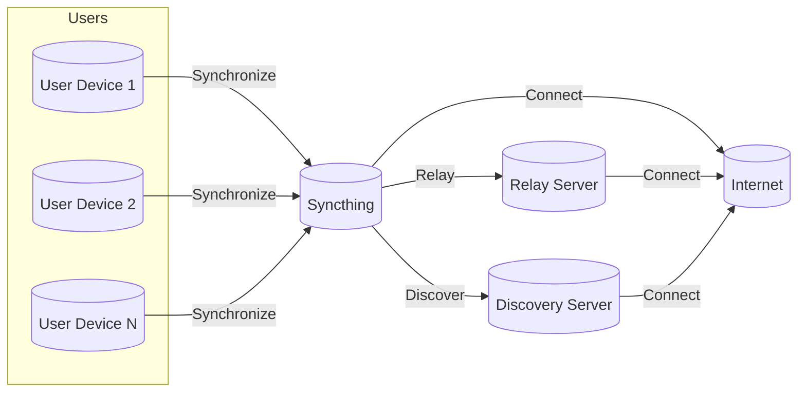
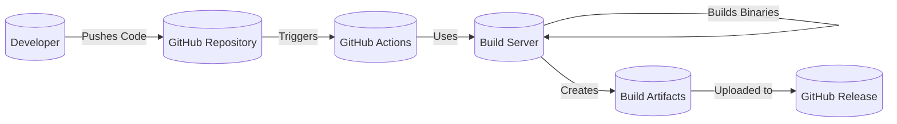

Okay, let's create a design document for the Syncthing project, focusing on aspects relevant for threat modeling.

# BUSINESS POSTURE

Syncthing is an open-source, decentralized file synchronization application.  Its primary goal is to provide a secure, private, and reliable way for users to synchronize files across multiple devices without relying on a central server.  The project prioritizes user privacy and data sovereignty.  It's used by individuals and organizations who want control over their data and prefer not to use cloud-based synchronization services.

Business Priorities:

*   Data Privacy:  Ensure user data remains private and is not exposed to unauthorized parties.
*   Data Integrity:  Maintain the integrity of synchronized files, preventing corruption or tampering.
*   Data Availability:  Ensure files are accessible to authorized devices whenever they are online.
*   Decentralization:  Avoid reliance on central servers, enhancing resilience and user control.
*   Ease of Use:  Provide a user-friendly experience that simplifies file synchronization.
*   Open Source: Maintain transparency and community involvement through an open-source model.
*   Cross-Platform: Support a wide range of operating systems and devices.

Business Risks:

*   Data Breach: Unauthorized access to synchronized files due to vulnerabilities in the software or misconfiguration.
*   Data Loss: Loss of data due to software bugs, hardware failures, or user error.
*   Data Tampering:  Malicious modification of synchronized files.
*   Denial of Service:  Disruption of the synchronization service, preventing users from accessing their files.
*   Reputation Damage:  Negative publicity due to security incidents or privacy violations.
*   Compromised Build: Malicious code injection during build process.

# SECURITY POSTURE

Existing Security Controls:

*   security control: Cryptography: Syncthing uses TLS 1.3 with strong ciphers for all communication between devices.  This protects data in transit. (Implemented in the protocol and transport layers).
*   security control: Authentication: Devices authenticate each other using cryptographic certificates, preventing unauthorized devices from joining the synchronization network. (Implemented in the protocol layer).
*   security control: Data Integrity:  Syncthing uses block-level hashing to detect and prevent data corruption. (Implemented in the protocol and storage layers).
*   security control: Decentralized Architecture:  The lack of a central server reduces the risk of a single point of failure or compromise. (Architectural design).
*   security control: Open Source:  The open-source nature of the project allows for community scrutiny and auditing of the codebase. (Project philosophy).
*   security control: Automatic Updates: Syncthing can automatically update itself, ensuring that users have the latest security patches. (Implemented in the main application logic).
*   security control: Rate Limiting: Syncthing implements rate limiting to mitigate denial-of-service attacks. (Implemented in the protocol layer).
*   security control: Sandboxing (partial): While not fully sandboxed, Syncthing attempts to limit its access to the filesystem to only the configured synchronization folders. (Implemented in the application logic).
*   security control: Relaying: If direct connections are not possible, encrypted relaying is used. Relays cannot see the content of the data. (Implemented in the protocol and relay server software).

Accepted Risks:

*   accepted risk: User Error:  Users may misconfigure Syncthing, potentially exposing their data (e.g., sharing with the wrong device ID).
*   accepted risk: Relay Compromise: While relays cannot decrypt data, a compromised relay could potentially disrupt service or perform traffic analysis.
*   accepted risk: Local Attack: If a user's device is compromised, the attacker could potentially access the synchronized files.
*   accepted risk: Metadata Leakage: While file contents are encrypted, metadata such as filenames and sizes might be visible to relays.

Recommended Security Controls:

*   security control: Enhanced Sandboxing: Explore more robust sandboxing techniques (e.g., using containers or virtualization) to further isolate Syncthing from the rest of the system.
*   security control: Two-Factor Authentication (2FA): Consider adding 2FA for device authorization, adding an extra layer of security.
*   security control: Formal Security Audits: Conduct regular, independent security audits to identify and address potential vulnerabilities.
*   security control: Bug Bounty Program: Implement a bug bounty program to incentivize security researchers to find and report vulnerabilities.
*   security control: Supply Chain Security: Implement robust measures to secure the build and distribution process, preventing the introduction of malicious code.

Security Requirements:

*   Authentication:
    *   All devices must be mutually authenticated using strong cryptographic methods.
    *   Device IDs must be unique and cryptographically secure.
    *   Consider implementing 2FA for device authorization.

*   Authorization:
    *   Access control must be enforced at the device level, ensuring that only authorized devices can access shared folders.
    *   Users should be able to define granular permissions for shared folders (e.g., read-only, read-write).

*   Input Validation:
    *   All input from the network and user interface must be validated to prevent injection attacks and other vulnerabilities.
    *   Filename and path validation should be performed to prevent path traversal attacks.

*   Cryptography:
    *   Use only strong, well-vetted cryptographic algorithms and libraries.
    *   All communication between devices must be encrypted using TLS 1.3 or higher.
    *   Data at rest encryption should be considered as an optional feature.
    *   Key management must be secure and follow best practices.

# DESIGN

## C4 CONTEXT



Context Diagram Element Description:

*   Element:
    *   Name: User Device 1
    *   Type: User Device
    *   Description: A user's device (e.g., computer, phone, server) running Syncthing.
    *   Responsibilities: Initiates file synchronization, manages shared folders, authenticates with other devices.
    *   Security controls: Authentication, TLS encryption, data integrity checks, rate limiting.

*   Element:
    *   Name: User Device 2
    *   Type: User Device
    *   Description: Another user's device running Syncthing.
    *   Responsibilities: Participates in file synchronization, manages shared folders, authenticates with other devices.
    *   Security controls: Authentication, TLS encryption, data integrity checks, rate limiting.

*   Element:
    *   Name: User Device N
    *   Type: User Device
    *   Description: Represents any number of additional user devices.
    *   Responsibilities: Same as other user devices.
    *   Security controls: Authentication, TLS encryption, data integrity checks, rate limiting.

*   Element:
    *   Name: Syncthing
    *   Type: Application
    *   Description: The Syncthing application itself, running on each user device.
    *   Responsibilities: File synchronization, device discovery, communication, data encryption/decryption.
    *   Security controls: Authentication, TLS encryption, data integrity checks, rate limiting, sandboxing (partial).

*   Element:
    *   Name: Relay Server
    *   Type: External System
    *   Description: A server that relays encrypted traffic between Syncthing instances when direct connections are not possible.
    *   Responsibilities: Relaying encrypted data, maintaining connections.
    *   Security controls: TLS encryption, rate limiting.

*   Element:
    *   Name: Discovery Server
    *   Type: External System
    *   Description: A server that helps Syncthing instances discover each other on the network.
    *   Responsibilities: Providing device addresses and connection information.
    *   Security controls: Rate limiting, basic input validation.

*   Element:
    *   Name: Internet
    *   Type: Network
    *   Description: The public internet.
    *   Responsibilities: Transporting network traffic.
    *   Security controls: N/A (assumed to be untrusted).

## C4 CONTAINER

```mermaid
graph LR
    subgraph Syncthing[("Syncthing")]
        GUI[("GUI")]
        Config[("Configuration")]
        Storage[("Storage")]
        Protocol[("Protocol Handler")]
        Transport[("Transport Layer")]
        Discovery[("Discovery Client")]

        GUI -- Uses --> Config
        GUI -- Uses --> Protocol
        Protocol -- Uses --> Config
        Protocol -- Uses --> Storage
        Protocol -- Uses --> Transport
        Transport -- Uses --> Discovery
    end

    User1[("User Device 1")]
    User2[("User Device 2")]
    RelayServer[("Relay Server")]
    DiscoveryServer[("Discovery Server")]
    Internet[("Internet")]

    User1 -- Interacts --> GUI
    Protocol -- Synchronize --> Protocol
    Transport -- Connect --> Internet
    Transport -- Relay --> RelayServer
    Discovery -- Discover --> DiscoveryServer
```

Container Diagram Element Description:

*   Element:
    *   Name: GUI
    *   Type: User Interface
    *   Description: The graphical user interface (optional).
    *   Responsibilities: Provides a user-friendly way to interact with Syncthing, configure settings, and monitor synchronization status.
    *   Security controls: Input validation.

*   Element:
    *   Name: Configuration
    *   Type: Data Store
    *   Description: Stores the Syncthing configuration, including device IDs, shared folder paths, and other settings.
    *   Responsibilities: Persisting configuration data.
    *   Security controls: Access control (limited to the Syncthing process).

*   Element:
    *   Name: Storage
    *   Type: Data Store
    *   Description: Manages the actual synchronized files on disk.
    *   Responsibilities: Reading and writing files, handling file changes.
    *   Security controls: Data integrity checks, sandboxing (partial).

*   Element:
    *   Name: Protocol Handler
    *   Type: Component
    *   Description: Implements the Syncthing synchronization protocol.
    *   Responsibilities: Handling device authentication, data exchange, conflict resolution, and versioning.
    *   Security controls: Authentication, data integrity checks, rate limiting.

*   Element:
    *   Name: Transport Layer
    *   Type: Component
    *   Description: Handles the network communication between Syncthing instances.
    *   Responsibilities: Establishing connections, encrypting/decrypting data, managing relays.
    *   Security controls: TLS encryption.

*   Element:
    *   Name: Discovery Client
    *   Type: Component
    *   Description: Interacts with discovery servers to find other Syncthing instances.
    *   Responsibilities: Querying discovery servers, obtaining device addresses.
    *   Security controls: Basic input validation.

*   Element:
    *   Name: User Device 1
    *   Type: User Device
    *   Description: A user's device (e.g., computer, phone, server) running Syncthing.
    *   Responsibilities: Initiates file synchronization, manages shared folders, authenticates with other devices.
    *   Security controls: Authentication, TLS encryption, data integrity checks, rate limiting.

*   Element:
    *   Name: User Device 2
    *   Type: User Device
    *   Description: Another user's device running Syncthing.
    *   Responsibilities: Participates in file synchronization, manages shared folders, authenticates with other devices.
    *   Security controls: Authentication, TLS encryption, data integrity checks, rate limiting.

*   Element:
    *   Name: Relay Server
    *   Type: External System
    *   Description: A server that relays encrypted traffic between Syncthing instances when direct connections are not possible.
    *   Responsibilities: Relaying encrypted data, maintaining connections.
    *   Security controls: TLS encryption, rate limiting.

*   Element:
    *   Name: Discovery Server
    *   Type: External System
    *   Description: A server that helps Syncthing instances discover each other on the network.
    *   Responsibilities: Providing device addresses and connection information.
    *   Security controls: Rate limiting, basic input validation.

*   Element:
    *   Name: Internet
    *   Type: Network
    *   Description: The public internet.
    *   Responsibilities: Transporting network traffic.
    *   Security controls: N/A (assumed to be untrusted).

## DEPLOYMENT

Syncthing can be deployed in several ways:

1.  **Manual Installation:** Downloading pre-built binaries for the target operating system and running them directly.
2.  **Package Managers:** Installing Syncthing through system package managers (e.g., apt, yum, brew).
3.  **Docker Containers:** Running Syncthing within a Docker container.
4.  **Source Installation:** Building Syncthing from source code.

We will describe the Docker container deployment in detail, as it offers a good balance of isolation and ease of use.

```mermaid
graph LR
    subgraph DockerHost[("Docker Host")]
        SyncthingContainer[("Syncthing Container")]
        DataVolume[("Data Volume")]

        SyncthingContainer -- Mounts --> DataVolume
        SyncthingContainer -- Exposes Ports --> DockerHost
    end

    User[("User")]
    Internet[("Internet")]
    OtherSyncthing[("Other Syncthing Instance")]

    User -- Connects --> DockerHost
    DockerHost -- Connects --> Internet
    OtherSyncthing -- Connects --> Internet
```

Deployment Diagram Element Description:

*   Element:
    *   Name: Docker Host
    *   Type: Server/Workstation
    *   Description: The physical or virtual machine running Docker Engine.
    *   Responsibilities: Hosting and managing Docker containers.
    *   Security controls: Operating system security, firewall, Docker security best practices.

*   Element:
    *   Name: Syncthing Container
    *   Type: Docker Container
    *   Description: The isolated environment running the Syncthing application.
    *   Responsibilities: Running Syncthing, accessing data volume, communicating with the network.
    *   Security controls: Container isolation, limited privileges, resource constraints.

*   Element:
    *   Name: Data Volume
    *   Type: Persistent Storage
    *   Description: A persistent storage volume mounted into the Syncthing container, used to store synchronized files and configuration.
    *   Responsibilities: Persisting data across container restarts.
    *   Security controls: Filesystem permissions, encryption (optional).

*   Element:
    *   Name: User
    *   Type: User
    *   Description: A user interacting with the Syncthing instance.
    *   Responsibilities: Accessing the Syncthing GUI, configuring settings.
    *   Security controls: N/A

*   Element:
    *   Name: Internet
    *   Type: Network
    *   Description: The public internet.
    *   Responsibilities: Transporting network traffic.
    *   Security controls: N/A (assumed to be untrusted).

*   Element:
    *   Name: Other Syncthing Instance
    *   Type: Application
    *   Description: Another Syncthing instance running on a different device.
    *   Responsibilities: Synchronizing files with the local Syncthing instance.
    *   Security controls: Authentication, TLS encryption, data integrity checks.

## BUILD

Syncthing's build process is primarily automated using Go's build tools and GitHub Actions.



Build Process Description:

1.  Developers push code changes to the Syncthing repository on GitHub.
2.  GitHub Actions workflows are triggered by these pushes.
3.  The workflows use build servers (provided by GitHub) to:
    *   Check out the code.
    *   Run linters (e.g., `go vet`, `staticcheck`).
    *   Run unit and integration tests.
    *   Build Syncthing binaries for various operating systems and architectures.
    *   Create release artifacts (e.g., compressed archives).
4.  The build artifacts are uploaded to GitHub Releases.

Security Controls in Build Process:

*   security control: Version Control: All code changes are tracked in the Git repository, providing an audit trail.
*   security control: Automated Build: GitHub Actions ensures consistent and reproducible builds.
*   security control: Code Review: Pull requests are used to review code changes before they are merged.
*   security control: Static Analysis: Linters are used to identify potential code quality and security issues.
*   security control: Testing: Unit and integration tests are run to verify the correctness of the code.
*   security control: Dependency Management: Go modules are used to manage dependencies and their versions.  Vulnerabilities in dependencies are monitored.

# RISK ASSESSMENT

Critical Business Processes:

*   File Synchronization: The core process of synchronizing files between devices.
*   Device Discovery: The process of finding and connecting to other Syncthing devices.
*   Data Management: Handling file changes, versioning, and conflict resolution.

Data Sensitivity:

*   Synchronized Files: The sensitivity of the synchronized files depends on the user's data.  It can range from non-sensitive (e.g., public documents) to highly sensitive (e.g., personal documents, confidential business data).
*   Configuration Data:  The Syncthing configuration contains device IDs and shared folder paths, which could be considered sensitive.
*   Metadata: Filenames, sizes, and modification times are not encrypted in transit to relays, and could reveal information about the synchronized data.

# QUESTIONS & ASSUMPTIONS

Questions:

*   What is the expected threat model? (e.g., casual users, targeted attacks, nation-state actors)
*   What are the specific compliance requirements, if any? (e.g., GDPR, HIPAA)
*   What level of resources are available for security improvements?
*   Are there any specific performance requirements that might impact security choices?
*   What is the process for handling security vulnerabilities reported by external researchers?

Assumptions:

*   BUSINESS POSTURE: Users prioritize data privacy and control over convenience.
*   BUSINESS POSTURE: The project aims to provide a reasonable level of security against common threats, but may not be suitable for extremely high-security environments without additional measures.
*   SECURITY POSTURE: Users are responsible for securing their own devices and networks.
*   SECURITY POSTURE: The default configuration of Syncthing provides a reasonable level of security for most users.
*   DESIGN: The official Syncthing discovery and relay servers are operated with reasonable security measures, but are not inherently trusted.
*   DESIGN: Users have basic technical knowledge to configure and use Syncthing.