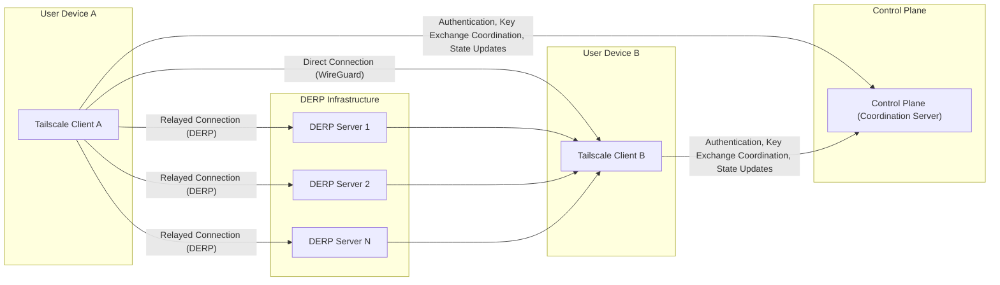
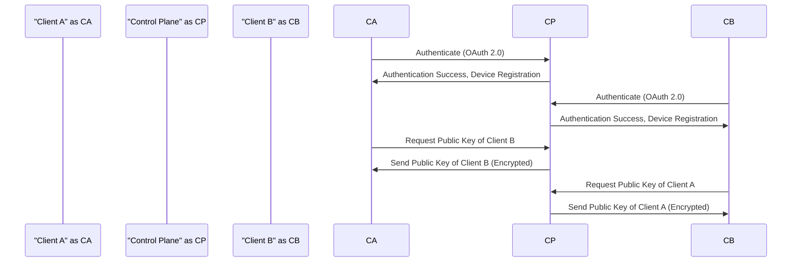
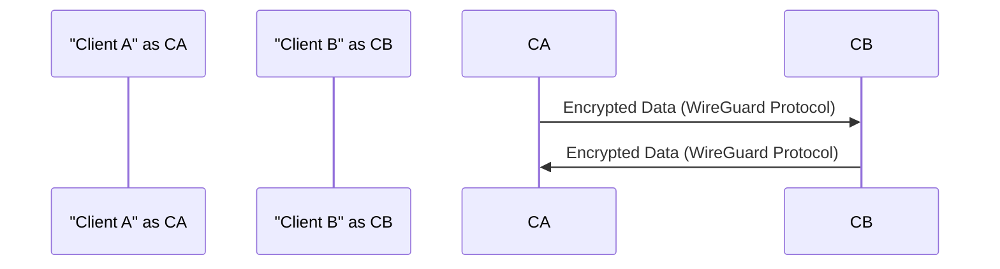
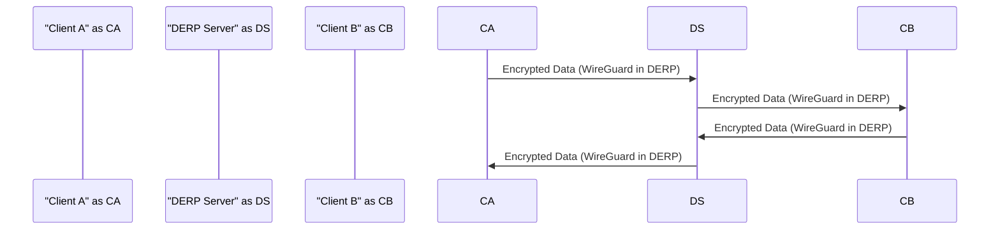

# Project Design Document: Tailscale (Improved)

**1. Introduction**

This document provides an enhanced architectural design of the Tailscale project, an open-source mesh VPN solution designed for secure and simplified private network connectivity. This detailed design outlines the system's components, their interactions, and the flow of data, serving as a robust foundation for subsequent threat modeling exercises. The aim is to provide a clear and comprehensive understanding of Tailscale's internal workings.

**2. Goals and Objectives**

*   Provide a more granular and technically detailed description of the Tailscale system architecture.
*   Clearly define the responsibilities and internal workings of each key component.
*   Illustrate the interactions and data flows between components with greater precision.
*   Establish a solid understanding of the system's security architecture and potential attack vectors.
*   Facilitate a more thorough and effective threat modeling process.

**3. High-Level Architecture**

Tailscale creates a secure, private network by forming encrypted connections between devices, regardless of their physical location or network configuration. The primary components are:

*   **Tailscale Client:** Software application installed on each device participating in the Tailscale network (tailnet).
*   **Control Plane (Coordination Server):** A centralized service responsible for managing the tailnet, including user authentication, authorization, key distribution, and network topology management. Tailscale, Inc. operates the default control plane, with open-source alternatives like Headscale available for self-hosting.
*   **DERP Servers (Detour Encrypted Reliable Packet):** Relay servers strategically positioned to facilitate communication between clients when direct peer-to-peer connections are hindered by network address translation (NAT) or firewalls.

**4. Detailed Design**

**4.1. Tailscale Client**

*   **Responsibilities:**
    *   **User Interface (UI):** Provides a means for users to manage their Tailscale connection, view network status, and configure settings.
    *   **Authentication Module:** Handles user authentication with the Control Plane, typically using an OAuth 2.0 flow initiated through a web browser.
    *   **Key Management:** Generates, stores, and manages cryptographic keys used by WireGuard for secure communication.
    *   **WireGuard Integration:** Implements the WireGuard protocol for establishing and maintaining secure tunnels with other Tailscale clients. This includes managing WireGuard interfaces and peer configurations.
    *   **NAT Traversal:** Employs techniques like UDP hole punching and STUN/TURN to attempt direct peer-to-peer connections, minimizing latency and reliance on DERP servers.
    *   **Routing Engine:** Manages network routing, directing traffic destined for other Tailscale devices through the appropriate WireGuard tunnel.
    *   **DERP Client:**  Implements the DERP protocol for communicating with DERP servers when direct connections are not feasible. This involves encapsulating WireGuard packets within DERP packets.
    *   **Control Plane Communication:** Interacts with the Control Plane via a secure channel (typically HTTPS with TLS) to exchange information, such as authentication credentials, public keys, and network state updates.
    *   **Policy Enforcement:** Enforces access control policies (ACLs) received from the Control Plane, determining which devices the client can communicate with.

*   **Key Processes:**
    *   **Login and Device Registration:** Authenticates the user with the Control Plane and registers the device within the tailnet. This involves generating a unique device identity.
    *   **Key Exchange Coordination:** Communicates with the Control Plane to obtain the WireGuard public keys of other authorized devices on the tailnet.
    *   **Direct Connection Negotiation:** Attempts to establish a direct WireGuard connection with another peer by exchanging connection information and performing NAT traversal techniques.
    *   **DERP Connection Establishment:** If direct connection fails, negotiates the use of a suitable DERP server with the Control Plane and establishes a connection to that server.
    *   **Data Encryption and Decryption:** Encrypts outgoing network packets using the WireGuard protocol before transmission and decrypts incoming packets.
    *   **State Synchronization:** Regularly communicates with the Control Plane to update its network state and receive updates from the Control Plane regarding other devices and policy changes.

**4.2. Control Plane (Coordination Server)**

*   **Responsibilities:**
    *   **User Authentication:** Verifies the identity of users attempting to join the tailnet, typically through integration with third-party identity providers via OAuth 2.0.
    *   **Device Authorization:** Manages which devices are authorized to join a specific tailnet, ensuring only permitted devices can participate.
    *   **Tailnet Management:**  Provides the infrastructure for creating and managing individual Tailscale networks (tailnets).
    *   **Key Distribution Service:** Securely distributes WireGuard public keys between authorized clients within a tailnet, enabling them to establish encrypted connections.
    *   **NAT Traversal Coordination:** Assists clients in establishing direct connections by providing information about potential peers and facilitating connection attempts.
    *   **Access Control List (ACL) Management:** Allows users to define and manage access control policies that govern communication between devices on the tailnet.
    *   **Online Status Tracking:** Monitors the online status of clients within a tailnet, providing information about which devices are currently active.
    *   **Certificate Authority (CA):** Issues and manages certificates used for client authentication and secure communication with the Control Plane.
    *   **Web Interface and API:** Provides a user interface and API for managing tailnets, users, devices, and access control policies.
    *   **Feature Services:** Optionally provides additional features like MagicDNS (automatic hostname resolution within the tailnet) and subnet routing.

*   **Key Processes:**
    *   **Authentication Handling:** Processes user authentication requests, verifying credentials against configured identity providers.
    *   **Authorization Enforcement:** Determines if a user or device is authorized to perform a specific action, such as joining a tailnet or accessing a resource.
    *   **Key Generation and Storage:** Generates and securely stores cryptographic keys used for various internal operations.
    *   **Key Distribution Logic:** Implements the logic for securely distributing WireGuard public keys to authorized clients based on the tailnet's configuration and ACLs.
    *   **State Management and Synchronization:** Maintains a consistent view of the tailnet's state, including the list of connected devices, their public keys, and network configuration.
    *   **ACL Evaluation and Enforcement:** Evaluates access control policies and communicates these policies to clients for enforcement.

**4.3. DERP Servers (Detour Encrypted Reliable Packet)**

*   **Responsibilities:**
    *   **Encrypted Packet Relaying:**  Forward encrypted WireGuard packets between Tailscale clients when a direct peer-to-peer connection is not possible due to NAT or firewall restrictions.
    *   **Stateless Operation:** Designed to be stateless packet forwarders, meaning they do not maintain persistent connections or session information for individual clients.
    *   **Geographic Distribution:** Strategically located in various geographic regions to provide low-latency relay points for clients worldwide.

*   **Key Processes:**
    *   **Packet Reception and Inspection:** Receives encrypted WireGuard packets encapsulated within DERP packets. Inspects the DERP header to determine the destination.
    *   **Packet Forwarding:** Forwards the received DERP packet to the appropriate destination DERP server or directly to the recipient client if a direct DERP connection exists.

**4.4. Key Exchange and Session Establishment (Detailed)**

The process of establishing a secure connection between two Tailscale clients involves a multi-step process orchestrated by the Control Plane:

1. **Mutual Authentication:** Both Client A and Client B independently authenticate with the Control Plane, verifying their identities.
2. **Key Retrieval Request:** Client A requests the WireGuard public key of Client B from the Control Plane. Similarly, Client B requests the public key of Client A.
3. **Secure Key Delivery:** The Control Plane securely transmits the requested public keys to the respective clients. This communication is typically encrypted using TLS.
4. **Direct Connection Attempt (WireGuard Handshake):** Client A and Client B attempt to establish a direct WireGuard connection. This involves the standard WireGuard handshake process, utilizing the exchanged public keys to establish a shared secret key for encrypting traffic. Techniques like UDP hole punching are employed to overcome NAT.
5. **DERP Relay Negotiation (If Direct Fails):** If the direct connection attempt fails (e.g., due to symmetric NAT), the clients communicate with the Control Plane to negotiate the use of a DERP server.
6. **DERP Connection Establishment:** Both clients establish a connection to a mutually agreed-upon DERP server.
7. **Encapsulated Data Transmission:**  When using DERP, clients encapsulate their WireGuard-encrypted packets within DERP packets and send them to the DERP server, which then relays them to the intended recipient.

**4.5. Data Flow Diagrams (Improved)**

**4.5.1. Initial Connection, Authentication, and Key Exchange**

**4.5.2. Direct Data Transmission (WireGuard)**

**4.5.3. Relayed Data Transmission via DERP Server**

**5. Security Considerations (Expanded)**

*   **End-to-End Encryption with WireGuard:** All user data transmitted between Tailscale clients is protected by the strong cryptographic encryption provided by the WireGuard protocol.
*   **Authenticated Key Exchange:** WireGuard's Noise protocol ensures that key exchange is authenticated, preventing man-in-the-middle attacks during connection establishment.
*   **Control Plane Security:** The security of the Control Plane is paramount. Tailscale, Inc. implements robust security measures, including access controls, intrusion detection, and regular security audits. Self-hosted alternatives require careful security considerations by the administrator.
*   **Minimal Attack Surface of DERP Servers:** DERP servers are designed to be simple packet relays, minimizing their attack surface and the potential for exploitation. They do not have access to the decrypted content of the traffic.
*   **Regular Security Audits:** The Tailscale codebase, including the client and Control Plane components, undergoes regular security audits by independent security firms to identify and address potential vulnerabilities.
*   **Open Source Components (WireGuard):** The reliance on the open-source WireGuard protocol provides transparency and allows for community scrutiny of its security.
*   **Secure Bootstrapping and Device Identity:** The process of initially joining a device to a tailnet involves secure bootstrapping mechanisms to ensure only authorized devices can participate.
*   **Access Control Lists (ACLs):**  Administrators can define granular access control policies to restrict communication between devices on the tailnet, limiting the impact of potential compromises.
*   **Potential Vulnerabilities:**
    *   **Compromise of Control Plane Credentials:** If an administrator's Control Plane credentials are compromised, an attacker could potentially gain control over the tailnet.
    *   **Software Vulnerabilities:**  Vulnerabilities in the Tailscale client or Control Plane software could be exploited by attackers.
    *   **Side-Channel Attacks:** While WireGuard is generally considered secure, like any cryptographic system, it might be susceptible to certain side-channel attacks in specific implementations.
    *   **Reliance on Underlying Infrastructure:** The availability and security of the Tailscale service depend on the underlying infrastructure provided by Tailscale, Inc. (for the hosted Control Plane) or the administrator (for self-hosted instances).

**6. Deployment Model**

Tailscale's flexible architecture supports diverse deployment scenarios:

*   **Individual Users:** Securely connecting personal laptops, desktops, and mobile devices.
*   **Small Teams and Businesses:** Creating private networks for remote collaboration, secure access to internal resources, and simplified network management.
*   **Cloud Environments:** Establishing secure and private communication channels between virtual machines, containers, and other cloud resources.
*   **Hybrid Environments:** Seamlessly connecting on-premises infrastructure with cloud-based resources.
*   **IoT Devices:** Securely connecting and managing Internet of Things (IoT) devices.

**7. Assumptions and Constraints**

*   **Reliance on WireGuard's Security:** The fundamental security of Tailscale relies heavily on the cryptographic strength and implementation of the WireGuard protocol.
*   **Trust in the Control Plane Operator:** Users of the hosted Tailscale service inherently trust Tailscale, Inc. to securely operate the Control Plane. Self-hosting provides an alternative for users requiring greater control.
*   **Internet Connectivity Requirement:** All devices participating in the Tailscale network require a stable internet connection to establish and maintain VPN tunnels.
*   **Potential for Blocking by Restrictive Networks:** In highly restrictive network environments, firewalls or network policies might interfere with Tailscale's ability to establish connections, even with DERP.

**8. Future Considerations**

*   Enhanced integration with various identity providers for more flexible authentication options.
*   Advanced monitoring and logging capabilities for improved network visibility and security auditing.
*   More sophisticated network policy management features, including fine-grained access controls and traffic shaping.
*   Further optimization and expansion of the DERP server infrastructure for improved performance and reliability.
*   Exploration of new transport protocols and encryption methods to enhance security and performance.

This improved design document provides a more detailed and technically accurate representation of the Tailscale architecture, offering a stronger foundation for comprehensive threat modeling and security analysis.