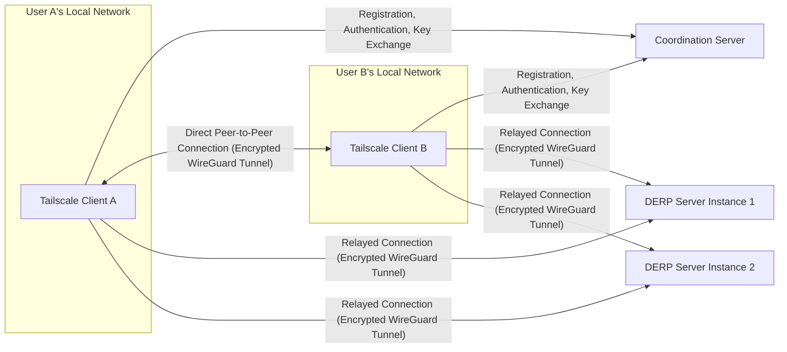
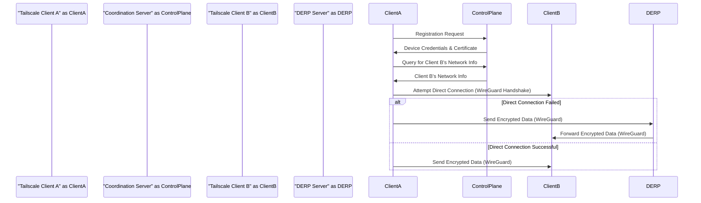

# Project Design Document: Tailscale (Improved)

**Version:** 1.1
**Date:** October 26, 2023
**Author:** Gemini (AI Language Model)

## 1. Introduction

This document provides an enhanced architectural design of the Tailscale project, intended for use in subsequent threat modeling activities. Tailscale is a mesh VPN solution that simplifies the creation and management of secure private networks. It achieves this by establishing virtual network interfaces on user devices, enabling direct communication regardless of physical network boundaries. This document details the core components, data flows, and security considerations of the Tailscale ecosystem, providing a robust foundation for identifying potential threats and vulnerabilities.

## 2. Goals and Objectives

*   Establish secure and transparent connectivity between devices across different networks.
*   Minimize the complexity associated with traditional VPN setup and configuration.
*   Prioritize direct peer-to-peer connections for optimal performance and reduced reliance on intermediary servers.
*   Deliver a consistent and intuitive user experience across diverse operating systems and platforms.
*   Maintain a strong security posture to safeguard user data and network integrity.
*   Reduce dependence on centralized infrastructure for data transit, enhancing resilience.

## 3. High-Level Architecture

The Tailscale architecture comprises the following principal elements:

*   **Tailscale Client:** Software application installed on each endpoint participating in the Tailscale network.
*   **Coordination Server (Control Plane):**  A centralized service responsible for user and device management, authentication, key exchange orchestration, and facilitating initial connection establishment.
*   **DERP Servers (Data Plane Relays):**  Globally distributed relay servers used to forward traffic when direct peer-to-peer connections are hindered by network address translation (NAT) or firewall restrictions.

## 4. Component Details

### 4.1. Tailscale Client

*   **Functionality:**
    *   **Registration and Authentication:** Initiates the device registration process with the Coordination Server and authenticates the user and device identity.
    *   **WireGuard Tunnel Management:** Establishes, maintains, and manages the secure WireGuard tunnel interface. This includes key generation and rotation.
    *   **NAT Traversal:** Employs techniques like STUN, TURN, and hole punching to establish direct connections despite NAT.
    *   **Peer Discovery:** Discovers other online devices within the user's Tailscale network by querying the Coordination Server.
    *   **Connection Negotiation:** Negotiates connection parameters with peers, including the decision to establish a direct or relayed connection.
    *   **Access Control Enforcement:** Enforces network access policies received from the Coordination Server, restricting communication with unauthorized devices.
    *   **Local Network Integration:** Supports features like subnet routing (allowing access to local network resources) and acting as an exit node (routing internet traffic through the Tailscale network).
    *   **User Interface/Command Line Interface:** Provides means for users to manage the client, view status, and configure settings.
*   **Key Technologies:**
    *   **WireGuard:**  The core VPN protocol providing secure, encrypted tunneling. Implemented in userspace or kernel space depending on the platform.
    *   **Go Programming Language:** Primarily used for the client's implementation, offering performance and cross-platform capabilities.
    *   **Platform-Specific Networking APIs:** Interacts with the underlying operating system's networking stack.
    *   **Local Storage (Keyring/Keystore):** Securely stores private keys and configuration data.
*   **Security Considerations:**
    *   **Secure Key Storage:**  Critical to protect the WireGuard private key from unauthorized access.
    *   **Client Application Integrity:**  Protection against tampering or malware injection.
    *   **Secure Communication with Coordination Server:** Uses TLS to protect communication channels.
    *   **Vulnerability Management:**  Requires regular updates to patch security vulnerabilities in the client software and underlying libraries.
    *   **Process Isolation:**  Operating system-level protections to prevent other applications from interfering with the Tailscale client.

### 4.2. Coordination Server (Control Plane)

*   **Functionality:**
    *   **User Authentication and Authorization:** Verifies user identities and manages their access to the Tailscale service, often through federated identity providers (e.g., Google, Microsoft).
    *   **Device Registration and Management:**  Registers new devices joining a user's network and manages their lifecycle.
    *   **Key Exchange Orchestration:** Facilitates the secure exchange of WireGuard public keys between clients, enabling them to establish encrypted tunnels.
    *   **Network State Management:** Maintains a real-time view of the online status and network information (e.g., IP addresses) of devices within a user's network.
    *   **Access Control List (ACL) Management and Enforcement:** Allows users to define and manage network access rules, which are then enforced by the clients.
    *   **Certificate Issuance and Management:** Issues and manages certificates used for device identification and authentication.
    *   **API for Client Interaction:** Provides a secure API for clients to register, discover peers, and retrieve configuration data.
    *   **Telemetry and Usage Data Collection (Optional):** May collect anonymized usage data for monitoring and improvement purposes.
*   **Key Technologies:**
    *   **Go Programming Language:** Used for the server-side implementation.
    *   **Database (e.g., PostgreSQL, CockroachDB):** Stores user accounts, device information, network state, and ACLs.
    *   **TLS/HTTPS:**  Secures communication with clients and external services.
    *   **Authentication Mechanisms (e.g., OAuth 2.0, OpenID Connect, Magic Links):**  Handles user authentication.
    *   **Certificate Authority (Internal or External):**  For issuing and managing device certificates.
*   **Security Considerations:**
    *   **Protection Against Unauthorized Access:**  Robust authentication and authorization mechanisms are crucial.
    *   **Data Security:** Secure storage and handling of sensitive user data, including credentials and network configurations. Encryption at rest and in transit.
    *   **Denial-of-Service (DoS) Protection:**  Measures to prevent service disruption from malicious traffic.
    *   **Regular Security Audits and Penetration Testing:**  Essential for identifying and mitigating vulnerabilities.
    *   **Secure API Design:**  Following secure coding practices to prevent API abuse.

### 4.3. DERP Servers (Data Plane Relays)

*   **Functionality:**
    *   **Relaying Encrypted Network Traffic:**  Forward encrypted WireGuard packets between clients when a direct connection cannot be established.
    *   **STUN/TURN Functionality:**  May incorporate STUN and TURN server capabilities to assist clients in discovering their public IP addresses and ports for NAT traversal.
    *   **High Availability and Scalability:** Designed for reliable and performant traffic relaying.
    *   **Stateless Operation:** Primarily focuses on forwarding packets without maintaining persistent connection state, simplifying design and improving scalability.
*   **Key Technologies:**
    *   **Go Programming Language:**  Commonly used for implementing DERP servers due to its networking capabilities.
    *   **Networking Libraries:**  Efficiently handles packet processing and forwarding.
*   **Security Considerations:**
    *   **Prevention of Abuse:**  Mechanisms to prevent DERP servers from being used as open relays for arbitrary traffic.
    *   **Authentication of Clients:**  Verifying that clients using the DERP server are legitimate Tailscale users.
    *   **Protection Against Denial-of-Service (DoS) Attacks:**  Resilience against attacks aimed at overwhelming the server's resources.
    *   **Secure Communication with Clients:**  Relays only encrypted WireGuard traffic, ensuring the confidentiality of the data.

## 5. Data Flow

The following describes the key data flows within the Tailscale system:

*   **Device Registration and Authentication:**
    1. The "Tailscale Client" initiates a registration request to the "Coordination Server".
    2. The "Coordination Server" authenticates the user (e.g., via OAuth redirect).
    3. Upon successful authentication, the "Coordination Server" creates a device record, generates initial cryptographic keys, and issues a device certificate.
    4. The "Coordination Server" securely transmits the device credentials (including the private key) to the "Tailscale Client".
    5. The "Tailscale Client" securely stores the received credentials.
*   **Peer Discovery and Connection Establishment:**
    1. "Tailscale Client A" wants to connect to "Tailscale Client B".
    2. "Tailscale Client A" queries the "Coordination Server" for "Tailscale Client B's" current network information (IP address, DERP relay candidates).
    3. The "Coordination Server" provides "Tailscale Client A" with the requested information.
    4. "Tailscale Client A" attempts a direct connection to "Tailscale Client B" using the WireGuard protocol. This involves a key exchange handshake.
    5. If the direct connection fails (due to NAT or firewalls), both clients will attempt to establish a relayed connection through a "DERP Server". The "Coordination Server" may provide guidance on selecting the optimal DERP server.
*   **Data Transmission (Direct Peer-to-Peer):**
    1. Once a direct WireGuard tunnel is established, "Tailscale Client A" encrypts data using the established session keys.
    2. The encrypted data is transmitted directly to "Tailscale Client B".
    3. "Tailscale Client B" decrypts the received data.
*   **Data Transmission (Relayed via DERP Server):**
    1. "Tailscale Client A" encrypts data using the established WireGuard session keys.
    2. "Tailscale Client A" sends the encrypted data to the chosen "DERP Server".
    3. The "DERP Server" forwards the encrypted data to "Tailscale Client B". The DERP server does not have access to the decrypted content.
    4. "Tailscale Client B" decrypts the received data.
*   **ACL Enforcement:**
    1. When "Tailscale Client A" attempts to connect to "Tailscale Client B", the client consults the locally cached ACL policies.
    2. The "Tailscale Client" enforces these policies, preventing unauthorized connections.
    3. The "Coordination Server" is the authoritative source for ACLs, and clients periodically synchronize their policies.

## 6. Security Considerations

This section outlines key security considerations relevant to the Tailscale project:

*   **Authentication:**
    *   **User Authentication:** Securely verifying the identity of users accessing the Tailscale service, typically through established identity providers.
    *   **Device Authentication:** Ensuring that only authorized devices can join a user's Tailscale network, often using cryptographic certificates.
    *   **Mutual Authentication:** Clients authenticate each other during the WireGuard handshake to prevent man-in-the-middle attacks.
*   **Authorization:**
    *   **Access Control Lists (ACLs):**  A fundamental security mechanism for defining which devices can communicate with each other. Proper ACL configuration is crucial.
    *   **Principle of Least Privilege:** Users should only grant necessary permissions to devices on their network.
*   **Encryption:**
    *   **End-to-End Encryption:** All traffic between Tailscale clients is encrypted using the robust WireGuard protocol, ensuring confidentiality.
    *   **Encryption in Transit:** Communication between clients and the Coordination Server, and clients and DERP servers, is secured using TLS.
*   **Key Management:**
    *   **Secure Key Generation:** Cryptographically secure methods are used to generate WireGuard private and public keys.
    *   **Secure Key Exchange:** The Coordination Server facilitates the secure exchange of public keys between clients.
    *   **Secure Key Storage:** Clients must securely store their private keys to prevent unauthorized access.
    *   **Key Rotation:**  Regular key rotation enhances security by limiting the impact of potential key compromise.
*   **Coordination Server Security:**
    *   **Infrastructure Security:** Protecting the servers hosting the Coordination Server from unauthorized access and attacks.
    *   **Application Security:**  Implementing secure coding practices to prevent vulnerabilities in the Coordination Server software.
    *   **Database Security:**  Securing the database storing sensitive user and device information.
    *   **API Security:**  Protecting the API endpoints from unauthorized access and abuse.
*   **DERP Server Security:**
    *   **Traffic Filtering:**  Preventing DERP servers from relaying malicious or unauthorized traffic.
    *   **Rate Limiting:**  Protecting DERP servers from being overwhelmed by excessive traffic.
    *   **Monitoring and Logging:**  Detecting and investigating suspicious activity on DERP servers.
*   **Client Security:**
    *   **Software Integrity:** Ensuring the authenticity and integrity of the Tailscale client software.
    *   **Protection Against Malware:**  Users should protect their devices from malware that could compromise the Tailscale client.
    *   **Secure Configuration:**  Users should be guided towards secure configuration options.
*   **NAT Traversal Security:**
    *   While NAT traversal mechanisms aim to establish connectivity, potential vulnerabilities in these protocols should be considered.
*   **Privacy:**
    *   Minimizing the collection and storage of personally identifiable information.
    *   Transparency regarding data collection and usage practices.
*   **Supply Chain Security:**
    *   Ensuring the security and integrity of the software development and distribution pipeline.

## 7. Deployment Model

Tailscale offers several deployment options, each with its own implications for security responsibilities:

*   **Tailscale SaaS (Default):** Tailscale manages the Coordination and DERP servers. Users are responsible for securing their client devices and configuring ACLs.
*   **Self-Hosted Coordination Server (Tailscale Enterprise):** Organizations manage their own Coordination Server infrastructure, requiring them to handle the security of this critical component. DERP servers can be either Tailscale-managed or self-hosted.
*   **Self-Hosted DERP Servers:** Organizations can deploy their own DERP servers, giving them more control over the data plane and potentially reducing latency. They are responsible for the security of these servers.
*   **Hybrid Deployments:** Combinations of the above, allowing for flexible control over different parts of the infrastructure. Security responsibilities are shared based on the components being managed.

## 8. Future Considerations

*   **Enhanced Identity Integration:** Deeper integration with various identity providers and single sign-on (SSO) solutions.
*   **Improved Network Monitoring and Diagnostics:**  More comprehensive tools for monitoring network performance and troubleshooting connectivity issues.
*   **Advanced Access Control Features:**  More granular and dynamic access control policies based on user roles, device posture, or other attributes.
*   **Enhanced Logging and Auditing:**  More detailed logging of network activity for security analysis and compliance.
*   **Integration with Security Information and Event Management (SIEM) Systems:**  Facilitating security monitoring and incident response.

This improved design document provides a more detailed and security-focused overview of the Tailscale architecture, serving as a valuable resource for comprehensive threat modeling efforts.