## Project Design Document: Tailscale (Improved)

**1. Introduction**

This document provides an enhanced and more detailed architectural design of the Tailscale project, an open-source mesh VPN solution designed for simplified private network management. This document is intended to serve as a robust foundation for subsequent threat modeling activities, offering a comprehensive understanding of the system's components, interactions, and overall architecture.

**2. Goals and Objectives**

*   Establish secure and seamless connectivity between diverse devices, irrespective of their physical location or underlying network infrastructure.
*   Significantly simplify the complexities associated with traditional VPN configuration and ongoing management.
*   Deliver an intuitive and user-friendly experience for the creation and administration of private network environments.
*   Leverage established and secure technologies, notably WireGuard, for robust data transport encryption and authentication.
*   Facilitate secure and controlled access to resources residing within the private network.

**3. High-Level Architecture**

Tailscale employs a client-server architecture for control and coordination, while the data plane operates primarily in a peer-to-peer fashion, utilizing the WireGuard protocol. Clients installed on user devices interact with a central control plane for authentication, authorization, and key exchange.

```mermaid
graph LR
    subgraph "User Device A"
        A["Tailscale Client A"]
    end
    subgraph "User Device B"
        B["Tailscale Client B"]
    end
    subgraph "Control Plane"
        CP_Auth["Authentication & Authorization Service"]
        CP_Node["Node Coordination & Discovery Service"]
        CP_Key["Key Exchange & Management Service"]
        CP_DERP["DERP Relay Service"]
    end
    subgraph "Internet"
        INET["Internet"]
    end

    A -- "Initial Authentication & Session Establishment" --> CP_Auth
    A -- "Node Registration & Configuration Retrieval" --> CP_Node
    A -- "Key Negotiation Initiation & Exchange" --> CP_Key
    B -- "Initial Authentication & Session Establishment" --> CP_Auth
    B -- "Node Registration & Configuration Retrieval" --> CP_Node
    B -- "Key Negotiation Initiation & Exchange" --> CP_Key
    A -- "Direct Peer-to-Peer Connection (Encrypted WireGuard)" --> B
    A -- "Relayed Connection Establishment Request" --> CP_DERP
    CP_DERP -- "Relayed Connection Forwarding (Encrypted)" --> B
    A -- "Optional Internet Egress via Exit Node" --> INET
    B -- "Optional Internet Egress via Exit Node" --> INET
```

**4. Component Details**

This section provides a detailed breakdown of the core components within the Tailscale architecture.

*   **Tailscale Client:**
    *   Purpose: Runs on end-user devices (desktops, servers, mobile devices) and is responsible for managing the WireGuard interface, interacting with the control plane, and establishing secure connections.
    *   Responsibilities:
        *   Authenticating the user and device with the control plane using established identity providers.
        *   Registering the device with the control plane, providing device metadata and capabilities.
        *   Negotiating and establishing WireGuard keys with other authorized clients.
        *   Creating and managing the WireGuard network interface and associated tunnels.
        *   Handling network routing and DNS configuration within the Tailscale network.
        *   Optionally acting as an exit node, routing internet traffic for other clients.
        *   Enforcing access control policies received from the control plane.
        *   Maintaining local state about the Tailscale network and its peers.
        *   Providing a local API for interaction with other applications.
    *   Technologies Used: Go, WireGuard (kernel module or userspace implementation), platform-specific networking APIs.
    *   Security Considerations:
        *   Secure storage and management of the client's private key.
        *   Protection against unauthorized access and manipulation of the client application and its configuration.
        *   Secure communication channels with the control plane (typically TLS).
        *   Regular updates to address potential vulnerabilities.

*   **Control Plane:**
    *   Purpose: The central authority responsible for managing the overall state of the Tailscale network, including user authentication, device registration, authorization, and key exchange orchestration.
    *   Responsibilities:
        *   **Authentication & Authorization Service:** Verifies user identities against configured identity providers (e.g., Google, Microsoft, OAuth2) and authorizes device access to the Tailscale network based on user and device attributes.
        *   **Node Coordination & Discovery Service:** Maintains a registry of active devices (nodes) within the Tailscale network, including their network information (IP addresses, public keys). Facilitates peer discovery and assists in establishing direct connections where possible, including NAT traversal techniques.
        *   **Key Exchange & Management Service:** Orchestrates the secure exchange of WireGuard public keys between authorized clients, ensuring that only permitted peers can establish secure tunnels. Manages the lifecycle of these keys.
        *   **DERP Relay Service (Optional but Common):** Provides a network of relay servers strategically located to facilitate connections between clients that cannot establish direct peer-to-peer connections due to network address translation (NAT) or firewall restrictions. Acts as a TURN-like server for Tailscale.
    *   Technologies Used: Go, databases (for persistent storage of network state, user information, and device details), potentially leveraging cloud provider services for scalability and reliability.
    *   Security Considerations:
        *   Secure storage of sensitive data, including user credentials (or references to identity providers), node keys, and access control policies.
        *   Robust authentication and authorization mechanisms to protect the control plane itself.
        *   Implementation of access control policies to restrict administrative access.
        *   High availability and resilience to ensure continuous operation.
        *   Protection against denial-of-service attacks and other forms of malicious activity.
        *   Regular security audits and penetration testing.

*   **WireGuard:**
    *   Purpose: The underlying protocol providing the secure data plane for encrypted communication between Tailscale clients.
    *   Responsibilities:
        *   End-to-end encryption of network traffic using strong cryptographic algorithms.
        *   Authentication of communicating peers based on cryptographic keys.
        *   Establishment of secure and authenticated tunnels between clients.
    *   Technologies Used: C (typically as a kernel module for performance, but userspace implementations exist).
    *   Security Considerations:
        *   Reliance on the inherent security of the WireGuard protocol, which has undergone significant security analysis.
        *   Proper key management practices by the Tailscale client are crucial for maintaining security.

*   **DERP (Detour Encrypted Reliable Packets):**
    *   Purpose: A relay protocol employed when direct peer-to-peer connections are not feasible. It ensures reliable delivery of encrypted packets between clients.
    *   Responsibilities:
        *   Receiving encrypted packets from a client and forwarding them to the intended recipient.
        *   Providing a reliable transport mechanism, handling packet loss and retransmissions.
    *   Technologies Used: Go.
    *   Security Considerations:
        *   Ensuring the integrity and confidentiality of relayed traffic, as the DERP server itself should not be able to decrypt the packets.
        *   Protection against abuse and denial-of-service attacks targeting DERP servers.
        *   Secure communication between clients and DERP servers.

**5. Data Flow Diagrams**

This section visually represents the key data flows within the Tailscale ecosystem.

*   **Client Authentication and Registration:**

*   **Peer-to-Peer Connection Establishment:**

*   **Data Transmission (Peer-to-Peer):**

*   **Data Transmission (Relayed via DERP):**

**6. Security Considerations**

*   **Authentication:** Robust user authentication is enforced through integration with established identity providers, leveraging protocols like OAuth2 or SAML.
*   **Authorization:** Fine-grained access control lists (ACLs) define communication permissions between devices within the Tailscale network, managed centrally by the control plane.
*   **Confidentiality:** All data transmitted between Tailscale clients is end-to-end encrypted using the secure WireGuard protocol, ensuring data privacy.
*   **Integrity:** WireGuard incorporates cryptographic mechanisms to guarantee the integrity of transmitted data, preventing tampering.
*   **Availability:** The control plane is designed for high availability through redundancy and failover mechanisms. The DERP infrastructure provides alternative routing paths for increased resilience.
*   **Key Management:** Secure generation, exchange, and management of WireGuard keys are critical. The control plane facilitates this process without exposing private keys.
*   **Node Identity:** Each device within the Tailscale network possesses a unique cryptographic identity managed by the control plane, preventing impersonation.
*   **Control Plane Security:** The control plane infrastructure is secured with strict access controls, regular security audits, and protection against common web application vulnerabilities.
*   **Client Security:** The security of the Tailscale client relies on secure storage of private keys (often leveraging operating system keychains), protection against malware, and timely security updates.
*   **DERP Security:** While DERP servers relay encrypted traffic, their security is important to prevent abuse and ensure availability. Rate limiting and authentication mechanisms are employed.

**7. Assumptions and Constraints**

*   Users are assumed to have valid accounts with a supported identity provider or a Tailscale account.
*   Clients require internet connectivity to initially connect to the control plane and potentially utilize DERP relays. Direct peer-to-peer connections may not always be possible.
*   The security of the underlying operating system and hardware where the Tailscale client is installed contributes to the overall security posture.
*   The inherent security of the WireGuard protocol is a fundamental assumption upon which Tailscale's data plane security is built.
*   The control plane infrastructure is managed and secured by the Tailscale team, and its security is a critical dependency.

**8. Future Considerations**

*   Detailed specifications of the APIs used for communication between clients and the control plane.
*   In-depth documentation of the ACL management system, including policy definition and enforcement mechanisms.
*   Specific security measures implemented within the control plane infrastructure, such as intrusion detection and prevention systems.
*   A more granular explanation of the cryptographic protocols and algorithms used during key exchange.
*   Consideration of integration with other security tools and platforms.